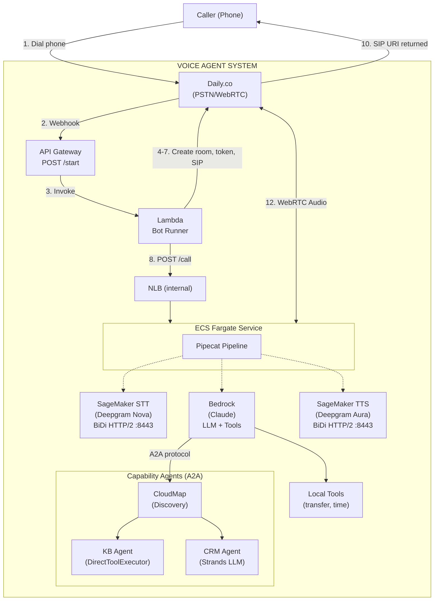
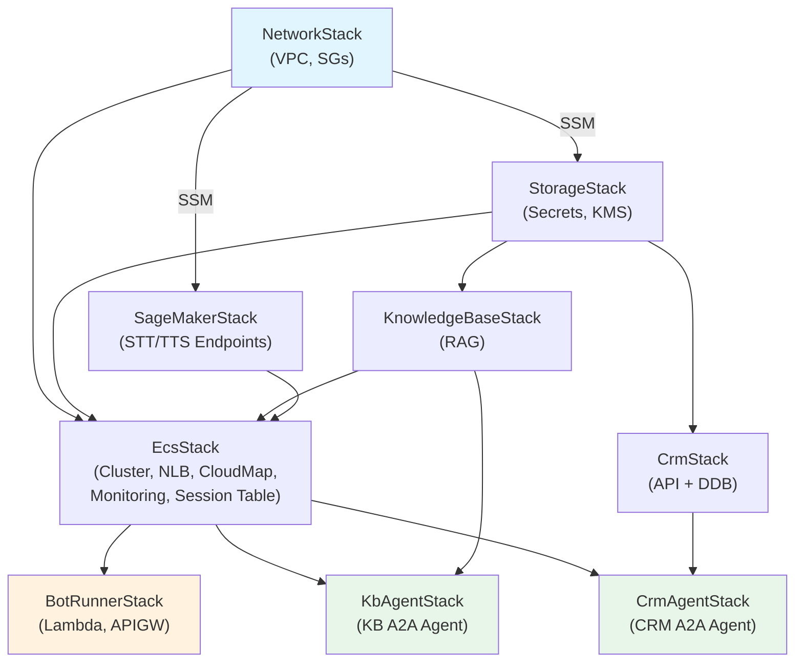
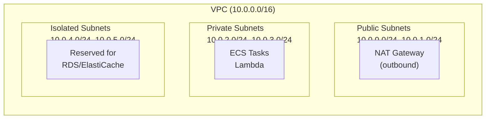
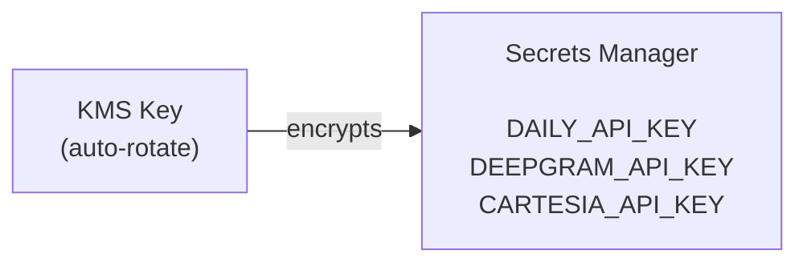
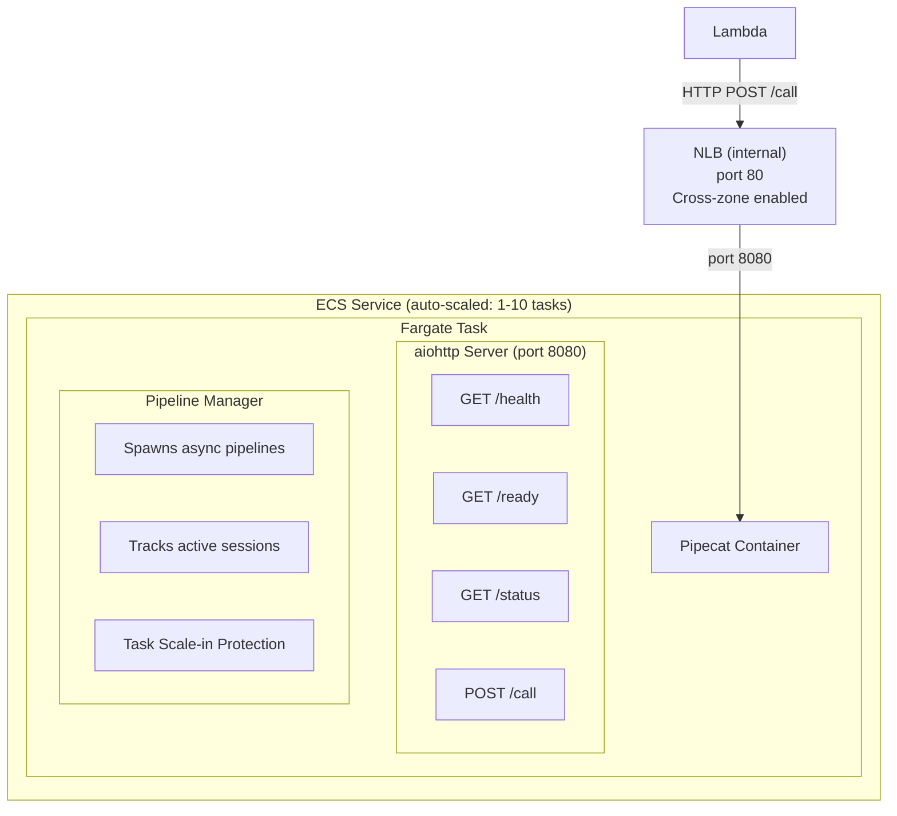
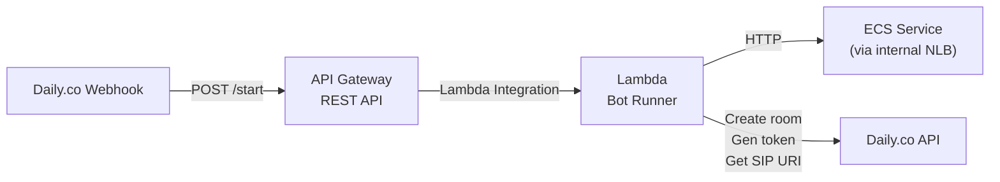
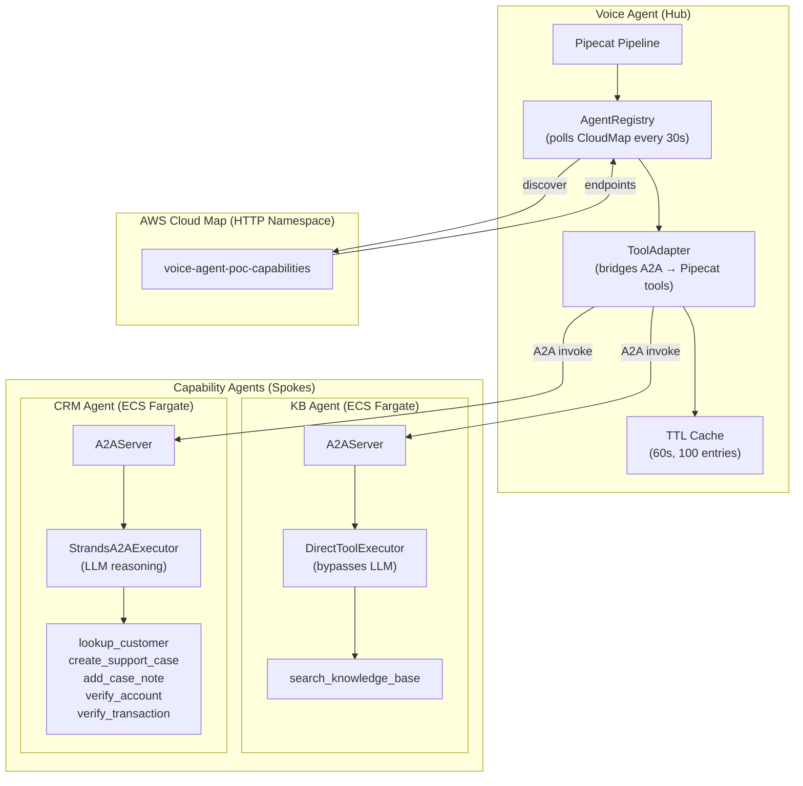
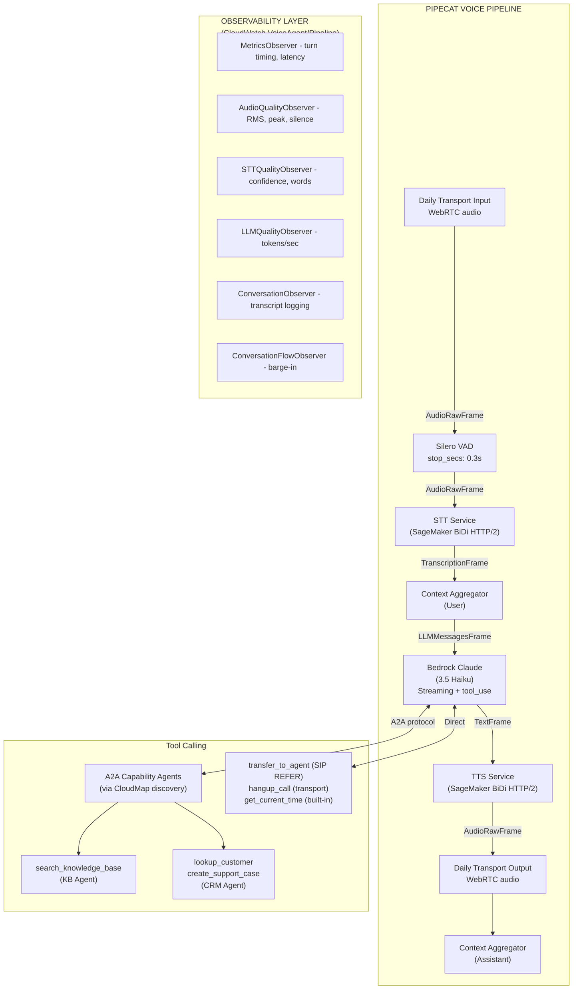
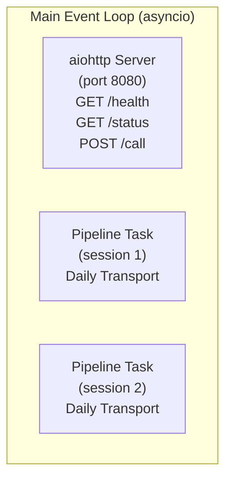
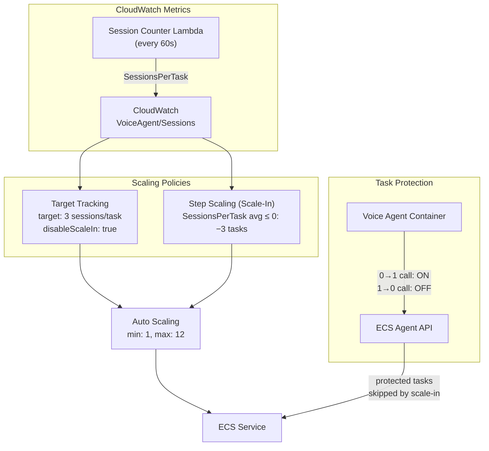

# Voice Agent Architecture Guide

A comprehensive end-to-end guide explaining the complete call flow from phone call to AI response.

## Table of Contents
1. [System Overview](#system-overview)
2. [AWS Infrastructure (CDK Stacks)](#aws-infrastructure-cdk-stacks)
3. [Complete Call Flow](#complete-call-flow-step-by-step)
4. [Voice Pipeline Deep Dive](#voice-pipeline-deep-dive)
5. [HTTP Service Architecture](#http-service-architecture)
6. [Configuration Reference](#configuration-reference)
7. [Deployment Guide](#deployment-guide)
8. [Monitoring & Troubleshooting](#monitoring--troubleshooting)

---

## System Overview

### High-Level Architecture



### Cloud API Fallback

The system also supports cloud APIs for development/testing:

| Mode | STT | TTS | Use Case |
|------|-----|-----|----------|
| **SageMaker (production)** | Deepgram Nova-3 on SageMaker | Deepgram Aura-2 on SageMaker | Data stays in VPC, no API keys |
| **Cloud API (development)** | Deepgram Cloud WebSocket | Cartesia Cloud HTTP | Quick setup, no GPU quota needed |

Set via `STT_PROVIDER` and `TTS_PROVIDER` environment variables (`sagemaker` or `deepgram`/`cartesia`).

### Technology Stack

| Component | Technology | Purpose |
|-----------|------------|---------|
| **Telephony** | Daily.co | WebRTC/PSTN bridging, SIP routing |
| **Pipeline Framework** | Pipecat 0.0.102 | Voice pipeline orchestration |
| **LLM** | AWS Bedrock (Claude 3.5 Haiku) | Conversational AI with tool calling |
| **Speech-to-Text** | Deepgram Nova-3 on SageMaker | Real-time transcription (BiDi HTTP/2) |
| **Text-to-Speech** | Deepgram Aura-2 on SageMaker | Low-latency voice synthesis (BiDi HTTP/2) |
| **Knowledge Base** | Bedrock Knowledge Base | RAG for FAQ/document retrieval |
| **CRM** | Lambda + DynamoDB | Customer lookup, case management |
| **Container Runtime** | AWS ECS Fargate | Serverless container hosting |
| **Orchestration** | AWS Lambda | Webhook handling, call setup |
| **Monitoring** | CloudWatch | Metrics, alarms, dashboards |
| **Infrastructure** | AWS CDK (TypeScript) | Infrastructure as code |

### Design Philosophy

**Always-On Service Architecture**

We intentionally chose an always-on ECS service over a task-per-call model:

| Approach | Cold Start | Latency | Cost |
|----------|-----------|---------|------|
| Task per call | 40-60 sec | Too slow for PSTN | Lower idle cost |
| **Always-on service** | **~0 sec** | **Instant** | ~$30/month |

PSTN calls timeout after ~30 seconds. The task-per-call approach would fail because:
1. Docker image pull: 15-30 seconds
2. Container startup: 10-15 seconds
3. Model loading: 10-20 seconds

**Result**: Call abandoned before bot answers.

**Solution**: Keep one container always running. HTTP endpoint accepts call configurations, spawns pipeline as async task. Container can handle multiple concurrent calls.

---

## AWS Infrastructure (CDK Stacks)

The infrastructure is organized into 10 CDK stacks, deployed in dependency order:



### Stack Summary

| Stack | Key Resources | Purpose |
|-------|---------------|---------|
| **NetworkStack** | VPC, subnets, NAT, SGs, VPC endpoints | Network foundation |
| **StorageStack** | Secrets Manager, KMS | API key storage and encryption |
| **SageMakerStack** | STT + TTS SageMaker endpoints | Self-hosted Deepgram STT/TTS |
| **KnowledgeBaseStack** | Bedrock Knowledge Base, S3 docs bucket | RAG document retrieval |
| **CrmStack** | Lambda API, DynamoDB tables | Customer lookup, case management |
| **EcsStack** | ECS Fargate, NLB, CloudMap namespace, monitoring | Voice agent runtime + agent discovery |
| **BotRunnerStack** | Lambda webhook handler, API Gateway | Call setup orchestration |
| **KbAgentStack** | ECS Fargate service (CapabilityAgentConstruct) | KB A2A capability agent |
| **CrmAgentStack** | ECS Fargate service (CapabilityAgentConstruct) | CRM A2A capability agent |

### 1. NetworkStack

**File**: `infrastructure/src/stacks/network-stack.ts` → `constructs/vpc-construct.ts`

Creates the network foundation:



**Resources Created**:

| Resource | Description |
|----------|-------------|
| VPC | 10.0.0.0/16 CIDR, 2 AZs |
| Public Subnets | For NAT Gateways, load balancers |
| Private Subnets | For Lambda, ECS tasks (has internet via NAT) |
| Isolated Subnets | For databases (no internet) |
| NAT Gateway | Outbound internet for private subnets |

**Security Groups**:

| Security Group | Purpose | Inbound | Outbound |
|----------------|---------|---------|----------|
| `LambdaSG` | Lambda functions | - | All (for API calls) |
| `EcsTaskSG` | ECS Fargate tasks | 8080 from NLB | All (for Daily, SageMaker, Bedrock) |
| `SageMakerSG` | SageMaker endpoints | 443+8443 from Lambda, ECS | - |
| `VpcEndpointSG` | VPC interface endpoints | 443+8443 from Lambda, ECS | - |

**VPC Endpoints** (reduce NAT costs, improve security):

| Endpoint | Type | Purpose |
|----------|------|---------|
| S3 | Gateway | ECR image layers, CloudWatch logs |
| Secrets Manager | Interface | API key retrieval |
| Bedrock Runtime | Interface | LLM inference (Claude) |
| CloudWatch Logs | Interface | Container/Lambda logging |
| SSM | Interface | Parameter Store lookups |
| SageMaker Runtime | Interface | STT/TTS BiDi streaming (port 8443) and standard invoke (port 443) |

**SageMaker BiDi Streaming via VPC Endpoint**

The SageMaker bidirectional streaming API uses HTTP/2 on port 8443. The
`sagemaker.runtime` VPC interface endpoint supports both standard invoke
(port 443) and BiDi streaming (port 8443):

- `privateDnsEnabled: true` on the sagemaker.runtime VPC endpoint
- BiDi traffic routes through the VPC endpoint ENI, staying entirely within the VPC
- Port 8443 ingress rules configured on both SageMaker SG and VPC endpoint SG
- No NAT gateway required for SageMaker traffic

**SSM Parameters Exported**:
```
/voice-agent/network/vpc-id
/voice-agent/network/private-subnet-ids
/voice-agent/network/isolated-subnet-ids
/voice-agent/network/lambda-sg-id
/voice-agent/network/vpc-endpoint-sg-id
```

---

### 2. StorageStack

**File**: `infrastructure/src/stacks/storage-stack.ts` → `constructs/secrets-construct.ts`

Manages secrets and encryption:



**Resources Created**:

| Resource | Description |
|----------|-------------|
| KMS Key | CMK with automatic rotation enabled |
| Secrets Manager Secret | JSON blob with 3 API keys |

**Secret Structure**:
```json
{
  "DAILY_API_KEY": "your-daily-api-key",
  "DEEPGRAM_API_KEY": "your-deepgram-api-key",
  "CARTESIA_API_KEY": "your-cartesia-api-key"
}
```

**SSM Parameters Exported**:
```
/voice-agent/storage/api-key-secret-arn
/voice-agent/storage/encryption-key-arn
```

---

### 3. EcsStack

**File**: `infrastructure/src/stacks/ecs-stack.ts`

The core runtime infrastructure:



**Resources Created**:

| Resource | Configuration |
|----------|--------------|
| ECS Cluster | Fargate capacity provider, Container Insights enabled |
| Task Definition | 1 vCPU, 2 GB RAM, Linux/AMD64 |
| ECS Service | Desired count: 1 (auto-scales 1-10), circuit breaker with rollback |
| NLB | Internal, private subnets, port 80 → 8080 |
| Docker Image | Built from `backend/voice-agent/`, pushed to ECR |

**Task Definition Details**:

```yaml
Family: voice-agent-poc-pipecat
CPU: 1024 (1 vCPU)
Memory: 2048 MB
Platform: Linux/AMD64
Container:
  Name: pipecat
  Port: 8080
  HealthCheck:
    Command: curl -f http://localhost:8080/health || exit 1
    Interval: 30s
    Timeout: 5s
    Retries: 3
    StartPeriod: 60s
```

**Environment Variables** (passed to container):

| Variable | Value | Purpose |
|----------|-------|---------|
| `AWS_REGION` | us-east-1 | Region for AWS services |
| `API_KEY_SECRET_ARN` | (from SSM) | Secrets Manager ARN |
| `SERVICE_MODE` | true | Run HTTP server mode |
| `SERVICE_PORT` | 8080 | HTTP listen port |
| `LOG_LEVEL` | INFO | Logging verbosity |
| `STT_PROVIDER` | sagemaker | Speech-to-text provider |
| `TTS_PROVIDER` | sagemaker | Text-to-speech provider |
| `STT_ENDPOINT_NAME` | (from SSM) | SageMaker STT endpoint name |
| `TTS_ENDPOINT_NAME` | (from SSM) | SageMaker TTS endpoint name |
| `ENABLE_TOOL_CALLING` | true | Enable LLM tool calling |
| `ENVIRONMENT` | poc | CloudWatch metrics dimension |

**IAM Permissions** (Task Role):

```yaml
Bedrock:
  Actions:
    - bedrock:InvokeModel
    - bedrock:InvokeModelWithResponseStream
    - bedrock:Converse
    - bedrock:ConverseStream
    - bedrock:Retrieve          # Knowledge Base
  Resources:
    - arn:aws:bedrock:us-*::foundation-model/anthropic.claude-3-5-haiku-*
    - arn:aws:bedrock:us-*::foundation-model/anthropic.claude-3-haiku-*
    - arn:aws:bedrock:us-*::foundation-model/anthropic.claude-haiku-4-5-*
    - arn:aws:bedrock:${region}:${account}:inference-profile/us.anthropic.claude-*
    - arn:aws:bedrock:${region}:${account}:knowledge-base/*

SageMaker:
  Actions:
    - sagemaker:InvokeEndpoint
    - sagemaker:InvokeEndpointWithResponseStream
    - sagemaker:InvokeEndpointWithBidirectionalStream
  Resources:
    - arn:aws:sagemaker:${region}:${account}:endpoint/voice-agent-*

Secrets Manager:
  Actions:
    - secretsmanager:GetSecretValue
  Resources:
    - ${api_key_secret_arn}

KMS:
  Actions:
    - kms:Decrypt
  Resources:
    - ${encryption_key_arn}
```

**SSM Parameters Exported**:
```
/voice-agent/ecs/cluster-arn
/voice-agent/ecs/task-definition-arn
/voice-agent/ecs/task-sg-id
/voice-agent/ecs/service-endpoint
```

---

### 4. BotRunnerStack

**File**: `infrastructure/src/stacks/bot-runner-stack.ts` → `constructs/webhook-api-construct.ts`

Handles incoming webhooks from Daily.co:



**Resources Created**:

| Resource | Configuration |
|----------|--------------|
| Lambda Function | Python 3.11, 256 MB, 30s timeout |
| API Gateway | REST API, stage: `poc` |

**Lambda Handler Flow** (`handler.py`):

```python
def start_session(event, context):
    # 1. Parse webhook body
    body = parse_body(event)  # callId, callDomain, from, to

    # 2. Create Daily room (SIP enabled)
    room = daily_client.create_room(
        name=f"voice-{call_id}",
        properties={"sip": {"sip_mode": "dial-in"}}
    )

    # 3. Generate bot meeting token
    token = daily_client.create_meeting_token(room_name)

    # 4. Get SIP URI for routing
    sip_uri = daily_client.get_sip_uri(room_name)

    # 5. Call ECS service
    service_client.start_call(
        room_url=room["url"],
        room_token=token,
        session_id=session_id,
        dialin_settings={"call_id", "call_domain", "sip_uri"}
    )

    # 6. Return SIP URI to Daily (bridges PSTN to room)
    return {"sipUri": sip_uri}
```

**Lambda Environment Variables**:

| Variable | Purpose |
|----------|---------|
| `ECS_SERVICE_ENDPOINT` | NLB DNS name for ECS service |
| `DAILY_API_KEY_SECRET_ARN` | Secrets Manager ARN |
| `LOG_LEVEL` | Logging verbosity |

**SSM Parameters Exported**:
```
/voice-agent/botrunner/webhook-url
```

---

### 5. Capability Agent Architecture (A2A)

The voice agent uses a **hub-and-spoke** pattern via the [A2A (Agent-to-Agent) protocol](https://google.github.io/A2A/) to integrate with capability agents. The voice agent (hub) discovers capability agents (spokes) via AWS Cloud Map and invokes their skills as LLM tools.

> **Adding a new agent?** See [Adding a Capability Agent](docs/guides/adding-a-capability-agent.md) for the step-by-step developer guide.



**Two Execution Patterns:**

| Pattern | Used By | Inner LLM? | Latency | When to Use |
|---------|---------|-----------|---------|-------------|
| `DirectToolExecutor` | KB Agent | No | ~323ms | Single-tool agent where query maps directly to tool input |
| `StrandsA2AExecutor` | CRM Agent | Yes (Haiku) | ~2-3s | Multi-tool agent requiring LLM reasoning to select and orchestrate tools |

**Discovery Flow:**
1. `AgentRegistry.start_polling()` creates a background task polling Cloud Map every 30s
2. Each poll calls `discover_agents(namespace)` via the `servicediscovery` API
3. For new endpoints, fetches the Agent Card at `/.well-known/agent-card.json`
4. Extracts skills from the card and registers them as Bedrock-format `toolSpec` definitions
5. `ToolAdapter` creates Pipecat-compatible handler functions with TTL response caching

**Feature Flag:** Enable via SSM parameter `/voice-agent/config/enable-capability-registry` (default: `false`). When disabled, the voice agent uses local tool implementations only.

**SSM Parameters:**
```
/voice-agent/a2a/namespace-id
/voice-agent/a2a/namespace-name
/voice-agent/a2a/poll-interval-seconds    (default: 30)
/voice-agent/a2a/tool-timeout-seconds     (default: 30)
/voice-agent/config/enable-capability-registry  (default: false)
```

---

### 6. KbAgentStack

**File**: `infrastructure/src/stacks/kb-agent-stack.ts`

Uses `CapabilityAgentConstruct` to deploy the Knowledge Base A2A capability agent as an ECS Fargate service. The agent registers itself with Cloud Map for automatic discovery.

**Key Configuration:**
- **CPU/Memory**: 256 CPU / 512 MB (lightweight -- no LLM invocation)
- **Container Port**: 8000
- **Health Check**: `/.well-known/agent-card.json` (A2A standard)
- **IAM**: Bedrock `Retrieve` for Knowledge Base access

**Environment Variables:**
| Variable | Source | Purpose |
|----------|--------|---------|
| `KB_KNOWLEDGE_BASE_ID` | SSM | Bedrock Knowledge Base ID |
| `KB_RETRIEVAL_MAX_RESULTS` | `3` | Max retrieval results |
| `KB_MIN_CONFIDENCE_SCORE` | `0.3` | Min confidence filter |

---

### 7. CrmAgentStack

**File**: `infrastructure/src/stacks/crm-agent-stack.ts`

Uses `CapabilityAgentConstruct` to deploy the CRM A2A capability agent. This agent uses the full Strands LLM reasoning loop to select among its 5 tools.

**Key Configuration:**
- **CPU/Memory**: 256 CPU / 512 MB
- **Container Port**: 8000
- **Health Check**: `/.well-known/agent-card.json`
- **IAM**: Bedrock `InvokeModel`/`Converse`/`ConverseStream` for inner LLM

**Environment Variables:**
| Variable | Source | Purpose |
|----------|--------|---------|
| `CRM_API_URL` | SSM | CRM REST API base URL |

---

## Complete Call Flow (Step-by-Step)

### Sequence Diagram

```mermaid
sequenceDiagram
    participant Caller
    participant Daily as Daily.co
    participant APIGW as API Gateway
    participant Lambda
    participant NLB
    participant ECS

    Caller->>Daily: 1. Dial phone
    Daily->>APIGW: 2. POST /start
    APIGW->>Lambda: 3. Invoke
    Lambda->>Daily: 4. Create room
    Daily-->>Lambda: Room info
    Lambda->>Daily: 5. Create token
    Daily-->>Lambda: Token
    Lambda->>Daily: 6. Get SIP URI
    Daily-->>Lambda: SIP URI
    Lambda->>NLB: 7. POST /call
    NLB->>ECS: Forward
    ECS-->>NLB: Started
    NLB-->>Lambda: Response
    Lambda-->>APIGW: 8. Return
    APIGW-->>Daily: 9. {sipUri}
    Daily->>Caller: 10. Bridge PSTN to SIP
    ECS->>Daily: 11. Join room
    Caller<-->ECS: 12. WebRTC audio bidirectional
```

### Detailed Steps

#### Phase 1: Webhook Reception (Steps 1-3)

**Step 1: Caller Dials Phone Number**
- User dials a phone number configured in Daily.co dashboard
- Daily.co receives the inbound PSTN call
- Daily triggers the configured webhook URL

**Step 2: Daily.co Sends Webhook**
```json
POST /start
Content-Type: application/json

{
  "callId": "abc123-def456",
  "callDomain": "your-domain.daily.co",
  "from": "+15551234567",
  "to": "+15559876543",
  "direction": "inbound"
}
```

**Step 3: API Gateway Invokes Lambda**
- API Gateway receives POST request
- Validates request format
- Invokes Lambda function synchronously

#### Phase 2: Room Setup (Steps 4-6)

**Step 4: Lambda Creates Daily Room**
```python
room = daily_client.create_room(
    name=f"voice-{call_id}",
    properties={
        "enable_chat": False,
        "enable_screenshare": False,
        "sip": {
            "display_name": "Voice Assistant",
            "video": False,
            "sip_mode": "dial-in"
        },
        "exp": int(time.time()) + 3600  # 1 hour
    }
)
# Returns: {"url": "https://domain.daily.co/voice-abc123", "name": "voice-abc123", "id": "..."}
```

**Step 5: Lambda Creates Bot Meeting Token**
```python
token = daily_client.create_meeting_token(
    room_name=room_name,
    properties={
        "is_owner": True,
        "user_name": "Voice Assistant",
        "start_video_off": True,
        "start_audio_off": False,
        "exp": int(time.time()) + 3600
    }
)
# Returns: "eyJ0eXAiOiJKV1QiLCJhbGciOiJIUzI1NiJ9..."
```

**Step 6: Lambda Gets SIP URI**
```python
sip_uri = daily_client.get_sip_uri(room_name)
# Returns: "sip:{room_id}@sip.daily.co"
```

#### Phase 3: ECS Service Activation (Steps 7-8)

**Step 7: Lambda Calls ECS Service**
```python
POST http://{nlb-dns}/call
Content-Type: application/json

{
  "room_url": "https://domain.daily.co/voice-abc123",
  "room_token": "eyJ0eXAiOiJKV1QiLCJhbGciOiJIUzI1NiJ9...",
  "session_id": "voice-abc123-7f8a9b",
  "system_prompt": "You are a helpful voice assistant...",
  "dialin_settings": {
    "call_id": "abc123-def456",
    "call_domain": "your-domain.daily.co",
    "sip_uri": "sip:room123@sip.daily.co"
  }
}
```

**Step 8: ECS Service Response**
```json
{
  "status": "started",
  "session_id": "voice-abc123-7f8a9b"
}
```

#### Phase 4: Call Bridging (Steps 9-11)

**Step 9: Lambda Returns SIP URI to Daily**
```json
{
  "sessionId": "voice-abc123-7f8a9b",
  "roomUrl": "https://domain.daily.co/voice-abc123",
  "sipUri": "sip:room123@sip.daily.co",
  "status": "started"
}
```

**Step 10: Daily Bridges PSTN to SIP**
- Daily receives the SIP URI
- Routes the PSTN audio to the SIP endpoint
- Bridges caller's phone audio into the Daily room

**Step 11: ECS Container Joins Room**
```python
# In pipeline_ecs.py
transport = DailyTransport(
    room_url,
    room_token,
    "Voice Assistant",
    params=DailyParams(
        dialin_settings=DailyDialinSettings(
            call_id=call_id,
            call_domain=call_domain
        ),
        audio_in_enabled=True,
        audio_out_enabled=True,
        audio_in_sample_rate=8000,  # PSTN rate
        audio_out_sample_rate=8000
    )
)
```

#### Phase 5: Real-Time Conversation (Step 12)

**Step 12: Voice Pipeline Processes Audio**
- Bidirectional WebRTC audio stream established
- Pipeline processes audio in real-time (see next section)
- Conversation continues until caller hangs up

---

## Voice Pipeline Deep Dive

### Pipeline Architecture



### Pipeline Code Structure

**File**: `backend/voice-agent/app/pipeline_ecs.py`

```python
pipeline = Pipeline([
    transport.input(),           # Audio from caller
    stt,                         # Deepgram: Speech → Text
    context_aggregator.user(),   # Add user message to context
    llm,                         # Bedrock Claude: Generate response
    tts,                         # Deepgram: Text → Speech
    transport.output(),          # Audio to caller
    context_aggregator.assistant(),  # Add assistant response to context
])
```

### Component Details

#### Daily Transport

Handles WebRTC audio I/O and PSTN bridging.

| Parameter | Value | Purpose |
|-----------|-------|---------|
| `audio_in_sample_rate` | 8000 Hz | PSTN standard sample rate |
| `audio_out_sample_rate` | 8000 Hz | Match PSTN audio |
| `vad_enabled` | true | Use Silero for speech detection |
| `vad_audio_passthrough` | true | Continue processing during speech |

#### Silero VAD (Voice Activity Detection)

Detects when user starts/stops speaking.

| Parameter | Value | Purpose |
|-----------|-------|---------|
| `stop_secs` | 0.3 | Seconds of silence before turn ends |

Why 0.3 seconds? Balances:
- Too short: Cuts off mid-sentence pauses
- Too long: Feels unresponsive

#### Deepgram STT (Speech-to-Text)

Real-time transcription via SageMaker bidirectional streaming.

| Setting | Value |
|---------|-------|
| Provider | `DeepgramSageMakerSTTService` (Pipecat built-in) |
| Protocol | HTTP/2 BiDi streaming, `v1/listen` path |
| Port | 8443 (SageMaker BiDi) |
| Model | Deepgram Nova-3 |
| Sample Rate | 8000 Hz |
| Encoding | linear16 |
| Streaming | Yes (real-time with interim results) |
| Instance | ml.g6.2xlarge (1x L4 GPU) |

**Credential Handling**: Pipecat's `SageMakerBidiClient` hardcodes
`EnvironmentCredentialsResolver`. On ECS Fargate, credentials come from
the task role via `ContainerCredentialsResolver`. A monkey-patch in
`sagemaker_credentials.py` adds a `ChainedIdentityResolver` that tries
both resolvers.

#### Bedrock Claude LLM

AWS-hosted Claude for response generation with tool calling.

| Setting | Value |
|---------|-------|
| Model | `us.anthropic.claude-haiku-4-5-20251001-v1:0` |
| Max Tokens | 256 |
| Temperature | 0.7 |
| Streaming | Yes (ConverseStream) |
| Tool Calling | Enabled (10 tools registered) |

Tools are registered with both `register_function()` (handler callbacks) and
passed to the `OpenAILLMContext` `tools` parameter (Bedrock-format tool specs).
This ensures the `toolConfig` is included in every Bedrock Converse API call.

Note: Uses inference profile ID (not foundation model ID) for on-demand throughput.

#### Deepgram TTS (Text-to-Speech)

Low-latency voice synthesis via SageMaker bidirectional streaming.

| Setting | Value |
|---------|-------|
| Provider | `DeepgramSageMakerTTSService` (custom, ~320 lines) |
| Protocol | HTTP/2 BiDi streaming, `v1/speak` path |
| Port | 8443 (SageMaker BiDi) |
| Model | Deepgram Aura-2 |
| Default Voice | `aura-2-thalia-en` |
| Sample Rate | 8000 Hz |
| Encoding | linear16 |
| Instance | ml.g6.12xlarge (4x L4 GPU) |

**Protocol Messages**:
- `{"type": "Speak", "text": "..."}` — send text for synthesis
- `{"type": "Flush"}` — force generation of buffered text
- `{"type": "Clear"}` — clear buffer (for interruptions/barge-in)
- `{"type": "Close"}` — close connection

**Note**: KeepAlive is NOT supported by the Deepgram TTS SageMaker shim.
Only `Speak`, `Flush`, `Clear`, and `Close` are valid message types.

### Event Handlers

The pipeline responds to Daily room events:

```python
@transport.event_handler("on_first_participant_joined")
async def on_first_participant_joined(transport, participant):
    # Trigger greeting when caller joins
    greeting_messages = [
        {"role": "system", "content": system_prompt},
        {"role": "user", "content": "[User just joined. Greet them warmly.]"}
    ]
    await task.queue_frames([LLMMessagesFrame(greeting_messages)])

@transport.event_handler("on_participant_left")
async def on_participant_left(transport, participant, reason):
    # End session when caller hangs up
    await task.queue_frame(EndFrame())

@transport.event_handler("on_dialin_stopped")
async def on_dialin_stopped(transport, data):
    # End session when PSTN call disconnects
    await task.queue_frame(EndFrame())
```

### Interruption Handling (Barge-In)

Pipeline supports interruptions:
- User can speak while bot is responding
- VAD detects new speech
- Current TTS audio is cancelled
- New response generated for interruption

Enabled via:
```python
task = PipelineTask(
    pipeline,
    params=PipelineParams(
        allow_interruptions=True,  # Enable barge-in
    )
)
```

### Audio Flow Characteristics

| Characteristic | Value |
|----------------|-------|
| Sample Rate | 8000 Hz (PSTN) |
| Bit Depth | 16-bit PCM |
| Channels | Mono |
| Latency (typical) | ~500ms end-to-end |

---

## HTTP Service Architecture

**File**: `backend/voice-agent/app/service_main.py`

### Why Async aiohttp?

Pipecat uses asyncio internally and requires running in the main thread for signal handling. FastAPI with uvicorn workers would conflict with Pipecat's async patterns.

Solution: Single-process aiohttp server running everything in one event loop.



### HTTP Endpoints

| Endpoint | Method | Purpose |
|----------|--------|---------|
| `/health` | GET | Liveness check (always 200, for ECS container health) |
| `/ready` | GET | Readiness check (503 when draining or at capacity, used by NLB) |
| `/status` | GET | Service status + active sessions |
| `/call` | POST | Start new voice pipeline |

#### POST /call Request

```json
{
  "room_url": "https://domain.daily.co/room-name",
  "room_token": "eyJ...",
  "session_id": "voice-abc123-7f8a9b",
  "system_prompt": "You are a helpful assistant...",
  "dialin_settings": {
    "call_id": "abc123",
    "call_domain": "domain.daily.co",
    "sip_uri": "sip:room123@sip.daily.co"
  }
}
```

#### POST /call Response

```json
{
  "status": "started",
  "session_id": "voice-abc123-7f8a9b"
}
```

### Pipeline Manager

Manages concurrent call pipelines:

```python
class PipelineManager:
    def __init__(self):
        self.active_sessions: dict[str, asyncio.Task] = {}
        self._task_protection = TaskProtection()
        self._draining = False
        self._max_concurrent = int(os.environ.get("MAX_CONCURRENT_CALLS", "4"))

    async def start_call(self, room_url, room_token, session_id, ...):
        if self._draining:
            return {"status": "error", "error": "Service is draining"}
        if len(self.active_sessions) >= self._max_concurrent:
            return {"status": "error", "error": "At capacity"}

        # Enable task protection on first call (0 → 1)
        if len(self.active_sessions) == 0:
            await self._task_protection.set_protected(True)

        task = asyncio.create_task(self._run_pipeline(...))
        self.active_sessions[session_id] = task
        return {"status": "started", "session_id": session_id}

    async def _run_pipeline(self, ...):
        try:
            task, transport = await create_voice_pipeline(config)
            runner = PipelineRunner()
            await runner.run(task)
        finally:
            self.active_sessions.pop(session_id, None)
            # Disable protection when last call ends (1 → 0)
            if len(self.active_sessions) == 0:
                await self._task_protection.set_protected(False)
```

### Concurrent Call Handling

The service can handle multiple simultaneous calls:

1. Each `/call` request spawns a new async task
2. Tasks run independently in the same event loop
3. Each task has its own Daily transport and pipeline
4. Memory/CPU limits determine max concurrency

Practical limits with 4 vCPU, 8 GB RAM:
- Up to 10 concurrent calls per task (`sessionCapacityPerTask`)
- Target tracking triggers at 3 sessions/task, headroom to 10 before `/ready` returns 503

---

## Auto-Scaling

The ECS service auto-scales using three complementary mechanisms to handle varying call volumes while guaranteeing zero dropped calls during scale-in.

### Scaling Architecture



### Two Scaling Mechanisms

| Mechanism | Trigger | Action | Cooldown |
|-----------|---------|--------|----------|
| **Target Tracking** | `SessionsPerTask` avg deviates from 3 | Proportional scale-out (scale-in disabled) | 60s |
| **Step Scaling (Scale-In)** | `SessionsPerTask` avg ≤ 0 for 2 periods | Remove up to 3 tasks | 30s |

**Why two mechanisms instead of three?** The original design included burst step scaling (>3.5: +10 tasks, >4.0: +25 tasks). During validation, target tracking proved sufficient for proportional scale-out. With `sessionCapacityPerTask=10` and target=3, each task has 7 sessions of headroom before hitting capacity, giving target tracking ample time to react. The burst policy was removed to simplify the scaling surface and avoid policy conflicts.

**Why step scaling for scale-in?** Target tracking's built-in scale-in was disabled (`disableScaleIn: true`) because it can prematurely scale in while sessions are still active but below the target. The step policy fires only at `SessionsPerTask avg ≤ 0.0` -- truly zero sessions fleet-wide -- providing conservative scale-in that never risks active calls.

### Validated Scaling Behavior

Tested 2026-02-26 with live SIPp calls through the full SIPp → Asterisk → Daily → Voice Agent path:

| Phase | Action | Result | Time |
|-------|--------|--------|------|
| Baseline | 0 sessions, 1 task | Stable, alarms OK | T+0 |
| Scale-out | 6 calls placed | Target tracking → 2 tasks | T+4min |
| Stability | 6 sessions across 2 tasks | Desired holds at 2 (no scale-in fighting) | T+8min |
| Additional load | 6 more calls (11 peak) | Target tracking → 4 tasks | T+12min |
| Scale-in | All calls ended | Step policy → 1 task (minCapacity) | T+7min after end |

### Cold Start Timing (Measured)

New ECS tasks take **~90s** from creation to receiving traffic:

| Phase | Duration | Cumulative |
|-------|----------|-----------|
| ENI attach + scheduling | ~14s | 14s |
| Image pull (824 MB compressed) | ~37s | 51s |
| Container init | ~17s | 68s |
| NLB health check (2 x 10s) | ~20s | ~88s |

### Task Scale-in Protection

When a container has active voice calls, it enables ECS Task Scale-in Protection via the local ECS Agent API (`$ECS_AGENT_URI`). Protected tasks are never selected for termination during scale-in events.

- **0 → 1 call**: Protection enabled (with retry)
- **1 → 0 calls**: Protection disabled
- **Heartbeat**: Protection renewed every 30s to prevent expiry
- **SIGTERM**: Container enters draining mode (`/ready` returns 503), waits up to 110s for active calls, then exits

### Health vs Ready Endpoints

| Endpoint | Purpose | When 503? |
|----------|---------|-----------|
| `GET /health` | ECS container liveness check | Never (always 200) |
| `GET /ready` | NLB routing decision | When draining or at capacity (`MAX_CONCURRENT_CALLS`) |

The NLB health check targets `/ready`, so at-capacity containers stop receiving new calls without being killed by ECS.

---

## Configuration Reference

### Environment Variables

#### ECS Container

| Variable | Required | Default | Description |
|----------|----------|---------|-------------|
| `AWS_REGION` | Yes | - | AWS region for services |
| `API_KEY_SECRET_ARN` | Yes | - | Secrets Manager ARN |
| `SERVICE_MODE` | No | false | Enable HTTP server mode |
| `SERVICE_PORT` | No | 8080 | HTTP server port |
| `LOG_LEVEL` | No | INFO | Logging level |
| `STT_PROVIDER` | No | deepgram | Speech-to-text provider |
| `TTS_PROVIDER` | No | cartesia | Text-to-speech provider |
| `VOICE_ID` | No | (default) | Cartesia voice UUID |

#### Lambda Function

| Variable | Required | Description |
|----------|----------|-------------|
| `ECS_SERVICE_ENDPOINT` | Yes | NLB DNS name |
| `DAILY_API_KEY_SECRET_ARN` | Yes | Secrets Manager ARN |
| `LOG_LEVEL` | No | Logging level |

### SSM Parameters

All cross-stack communication uses SSM Parameters:

```
/voice-agent/
├── network/
│   ├── vpc-id
│   ├── private-subnet-ids
│   ├── isolated-subnet-ids
│   ├── lambda-sg-id
│   └── vpc-endpoint-sg-id
├── storage/
│   ├── api-key-secret-arn
│   └── encryption-key-arn
├── ecs/
│   ├── cluster-arn
│   ├── task-definition-arn
│   ├── task-sg-id
│   └── service-endpoint
├── a2a/
│   ├── namespace-id
│   ├── namespace-name
│   ├── poll-interval-seconds
│   └── tool-timeout-seconds
├── config/
│   ├── enable-capability-registry
│   └── llm-model-id
└── botrunner/
    └── webhook-url
```

### Secrets Manager Structure

**Secret Name**: Auto-generated by CDK

```json
{
  "DAILY_API_KEY": "your-daily-api-key",
  "DEEPGRAM_API_KEY": "your-deepgram-api-key",
  "CARTESIA_API_KEY": "your-cartesia-api-key"
}
```

### Bedrock Model Configuration

| Setting | Value |
|---------|-------|
| Model ID | `us.anthropic.claude-haiku-4-5-20251001-v1:0` |
| Type | Inference Profile |
| Regions | us-east-1, us-east-2, us-west-2 (cross-region) |

Why inference profile?
- Required for on-demand throughput with Claude 3.5 models
- Cross-region inference for better availability
- Foundation model IDs don't support ConverseStream

---

## Deployment Guide

### Prerequisites

1. **AWS Account** with permissions for:
   - VPC, Subnets, NAT Gateway
   - ECS, ECR, Lambda, API Gateway
   - Secrets Manager, KMS, SSM
   - Bedrock (Claude model access enabled)
   - CloudWatch Logs

2. **API Keys**:
   - Daily.co API key (with PSTN enabled)
   - Deepgram API key (if using cloud STT provider)
   - Cartesia API key (if using cloud TTS provider)

3. **Local Tools**:
   - Node.js 18+
   - AWS CDK CLI (`npm install -g aws-cdk`)
   - Docker (for building container image)
   - AWS CLI (configured with credentials)

### Deployment Steps

```bash
# 1. Clone and install dependencies
cd infrastructure
npm install

# 2. Bootstrap CDK (first time only)
npx cdk bootstrap

# 3. Deploy all stacks (in order)
./deploy.sh

# Or deploy individually:
npx cdk deploy VoiceAgentNetwork
npx cdk deploy VoiceAgentStorage
npx cdk deploy VoiceAgentEcs
npx cdk deploy VoiceAgentBotRunner
```

### Post-Deployment Configuration

#### 1. Update Secrets Manager

```bash
# Get the secret ARN from SSM
SECRET_ARN=$(aws ssm get-parameter --name /voice-agent/storage/api-key-secret-arn --query 'Parameter.Value' --output text)

# Update with your actual API keys
aws secretsmanager put-secret-value \
  --secret-id "$SECRET_ARN" \
  --secret-string '{
    "DAILY_API_KEY": "your-actual-daily-key",
    "DEEPGRAM_API_KEY": "your-actual-deepgram-key",
    "CARTESIA_API_KEY": "your-actual-cartesia-key"
  }'

# Force ECS to reload secrets
aws ecs update-service --cluster voice-agent-poc-pipecat --service voice-agent-poc-pipecat --force-new-deployment
```

#### 2. Configure Daily.co Webhook

1. Get the webhook URL:
```bash
aws ssm get-parameter --name /voice-agent/botrunner/webhook-url --query 'Parameter.Value' --output text
```

2. In Daily.co Dashboard:
   - Go to Developers → Webhooks
   - Add webhook for "Pinless dial-in" events
   - Set URL to the webhook URL from above
   - Enable for inbound calls

#### 3. Configure Phone Number

1. In Daily.co Dashboard:
   - Go to Phone → Numbers
   - Purchase or configure a phone number
   - Set "Pinless dial-in" to use your webhook

### Verify Deployment

```bash
# Check ECS service is running
aws ecs describe-services --cluster voice-agent-poc-pipecat --services voice-agent-poc-pipecat

# Check container health
aws logs tail /ecs/voice-agent-poc-poc-pipecat --since 5m

# Test the service endpoint (from within VPC or via bastion)
curl http://{nlb-dns}/health
```

---

## Monitoring & Troubleshooting

### CloudWatch Log Groups

| Log Group | Source | Key Events |
|-----------|--------|------------|
| `/ecs/voice-agent-poc-pipecat` | ECS container | Pipeline events, errors |
| `/aws/lambda/...BotRunner...` | Lambda function | Webhook handling |

### Key Log Events

#### Service Startup
```json
{"event": "service_starting", "port": 8080, "region": "us-east-1"}
{"event": "secrets_loaded_from_aws"}
{"event": "service_ready", "port": 8080, "endpoint": "http://0.0.0.0:8080"}
```

#### Call Handling
```json
{"event": "starting_call", "session_id": "voice-abc123-7f8a9b", "room_url": "..."}
{"event": "creating_pipeline", "session_id": "..."}
{"event": "daily_transport_created"}
{"event": "stt_service_created", "provider": "deepgram"}
{"event": "llm_service_created", "provider": "bedrock", "model": "claude-haiku-4.5"}
{"event": "tts_service_created", "provider": "sagemaker"}
{"event": "pipeline_created", "session_id": "..."}
```

#### Call Events
```json
{"event": "daily_joined", "data": "..."}
{"event": "participant_joined", "session_id": "...", "participant_id": "..."}
{"event": "dialin_ready", "data": "..."}
{"event": "dialin_connected", "data": "..."}
```

#### Call Completion
```json
{"event": "participant_left", "session_id": "...", "reason": "leftCall"}
{"event": "dialin_stopped", "data": "..."}
{"event": "pipeline_completed", "session_id": "..."}
```

### Common Issues

#### 1. Container Won't Start

**Symptom**: ECS task keeps restarting

**Check**:
```bash
aws logs tail /ecs/voice-agent-poc-poc-pipecat --since 30m
```

**Common causes**:
- Missing secrets (check `API_KEY_SECRET_ARN`)
- Invalid secret format (ensure JSON with correct keys)
- Missing IAM permissions

#### 2. Webhook Not Working

**Symptom**: Calls don't trigger bot

**Check**:
```bash
# Check Lambda logs
aws logs tail /aws/lambda/VoiceAgentBotRunner... --since 30m
```

**Common causes**:
- Webhook URL not configured in Daily.co
- Lambda security group can't reach NLB
- Daily API key invalid

#### 3. Bot Doesn't Speak

**Symptom**: Call connects but no audio

**Check**: Pipeline logs for TTS/LLM errors

**Common causes**:
- Bedrock model not enabled in region
- SageMaker TTS endpoint not ready or not found
- Invalid Cartesia API key (if using cloud TTS provider)

#### 4. Transcription Issues

**Symptom**: Bot doesn't respond to speech

**Check**: Look for STT errors in logs

**Common causes**:
- Invalid Deepgram API key
- Audio format mismatch (should be 8kHz)
- VAD threshold too high

### Useful Commands

```bash
# View recent ECS logs
aws logs tail /ecs/voice-agent-poc-poc-pipecat --follow

# Check active pipelines
# (requires network access to NLB)
curl http://{nlb-dns}/status

# Force container restart
aws ecs update-service --cluster voice-agent-poc-pipecat --service voice-agent-poc-pipecat --force-new-deployment

# Check task status
aws ecs list-tasks --cluster voice-agent-poc-pipecat
aws ecs describe-tasks --cluster voice-agent-poc-pipecat --tasks {task-arn}
```

### Cost Monitoring

Set up CloudWatch alarms for:

| Metric | Threshold | Action |
|--------|-----------|--------|
| ECS CPU Utilization | > 80% | Scale up or optimize |
| NLB Active Flow Count | > 10 | Check for issues |
| Lambda Errors | > 0 | Investigate |
| NAT Gateway Bytes | > 10GB/day | Review traffic |

---

## Additional Resources

- [Pipecat Documentation](https://docs.pipecat.ai/)
- [Daily.co API Reference](https://docs.daily.co/reference)
- [AWS Bedrock Documentation](https://docs.aws.amazon.com/bedrock/)
