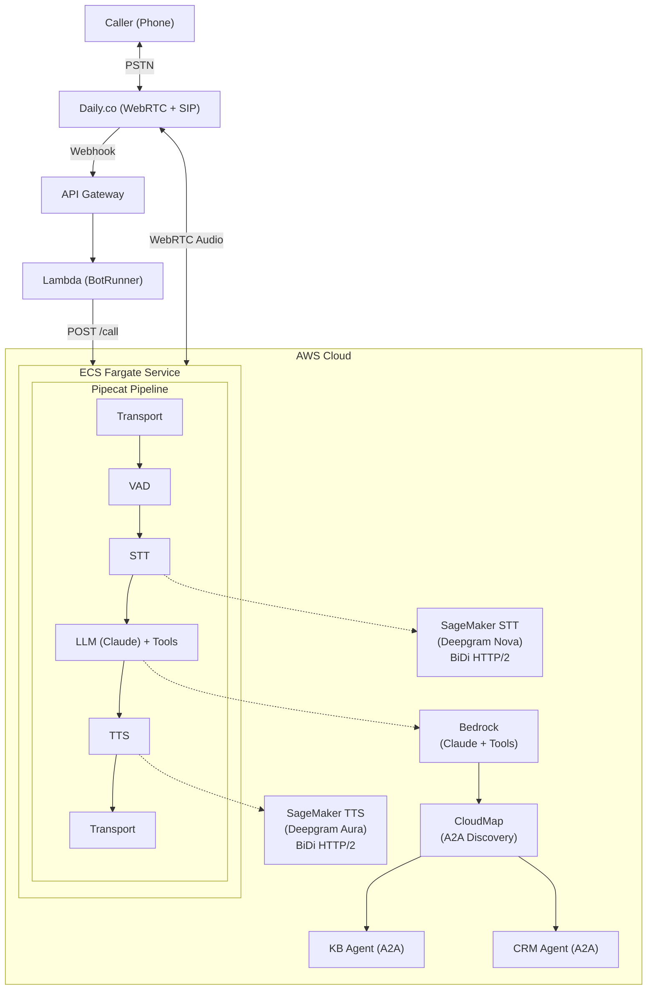

# SIP Voice Agent Sample

Real-time voice AI assistant powered by Pipecat, running on AWS ECS Fargate with Deepgram STT/TTS on SageMaker and Claude on Bedrock.

## Architecture



## Features

- **Real-time voice conversations** with ~1.5-2.5s agent response latency
- **Self-hosted STT/TTS** via SageMaker BiDi streaming (audio stays in VPC)
- **Deepgram Nova-3 STT** on SageMaker (ml.g6.2xlarge)
- **Deepgram Aura-2 TTS** on SageMaker (ml.g6.12xlarge)
- **Claude 3.5 Haiku** for fast responses via Bedrock ConverseStream
- **Tool calling** with local tools (transfer, time) and A2A capability agents
- **Knowledge Base RAG** via Bedrock Knowledge Base (A2A capability agent)
- **CRM integration** via A2A capability agent (customer lookup, case management)
- **A2A protocol** for hub-and-spoke agent architecture with CloudMap discovery
- **PSTN dial-in** via Daily.co SIP integration
- **Comprehensive observability** with CloudWatch metrics, alarms, and dashboards
- **Always-on architecture** with ECS Fargate (no cold start)

## Quick Start

### Prerequisites

- AWS account with Bedrock Claude access enabled
- Node.js 18+
- AWS CLI configured with credentials for your target account
- Docker installed
- API keys for [Daily.co](https://dashboard.daily.co/), [Deepgram](https://console.deepgram.com/), and [Cartesia](https://play.cartesia.ai/)

> **SageMaker mode only:** GPU quota (ml.g6.2xlarge and ml.g6.12xlarge) and [Deepgram Marketplace](docs/reference/deepgram-marketplace-setup.md) subscriptions.

### Option A: AI-Guided Deployment (Recommended)

This project includes [Claude Code skills](https://docs.anthropic.com/en/docs/claude-code/skills) that walk you through every step interactively -- checking prerequisites, configuring environment, deploying infrastructure, setting up your phone number, and verifying the result.

#### Walkthrough

**1. Deploy infrastructure** — Run `/deploy-cloud-api` (or `/deploy-sagemaker` for production). Claude checks prerequisites, gathers your API keys (Daily, Deepgram, Cartesia), and deploys 5 CDK stacks. Takes ~15 minutes.

**2. Set up a phone number** — Run `/configure-daily`. Claude checks for existing Daily.co numbers (reuses one if available), configures the pinless dial-in webhook, and syncs secrets. You now have a callable phone number.

**3. Test the basic agent** — Call your number and try:
- *"What time is it?"* — tests the `get_current_time` tool
- *"Goodbye"* — tests the `hangup_call` tool
- Or just have a conversation — Claude handles natural dialogue out of the box

**4. Add capability agents (optional)** — Run `/deploy-capability-agents` to extend the voice agent with:
- **Knowledge Base** — RAG search over your documents. Test: *"What's your return policy?"*
- **CRM** — Customer lookup and case management. Test: *"Look up the account for 555-0100"*

These deploy as separate containers and are discovered automatically via CloudMap — no pipeline code changes needed.

**5. Verify** — Run `/verify-deployment` at any time to health-check all components.

**6. Clean up** — Run `/destroy-project` to release the phone number and tear down all AWS resources.

#### Available Skills

| Skill | What It Does |
|-------|-------------|
| `/deploy-cloud-api` | Full deployment using Deepgram + Cartesia cloud APIs |
| `/deploy-sagemaker` | Full deployment with self-hosted STT/TTS on SageMaker GPUs |
| `/configure-daily` | Set up a phone number and configure PSTN dial-in |
| `/verify-deployment` | Health check all infrastructure components |
| `/deploy-capability-agents` | Deploy Knowledge Base and/or CRM capability agents |
| `/create-capability-agent` | Scaffold a new A2A capability agent from scratch |
| `/create-local-tool` | Add a new tool to the voice pipeline |

### Option B: Manual Deployment

See the full [Deployment Guide](infrastructure/DEPLOYMENT.md) for step-by-step manual instructions.

```bash
cd infrastructure

# Copy and configure environment
cp .env.example .env
# Edit .env with your AWS region and (for SageMaker mode) model package ARNs

# Install dependencies
npm install

# Deploy with cloud APIs (simpler, no SageMaker needed)
USE_CLOUD_APIS=true ./deploy.sh deploy

# Or deploy with SageMaker (production, audio stays in VPC)
./deploy.sh deploy
```

After deployment:
```bash
# Configure API keys in Secrets Manager
./scripts/init-secrets.sh

# Set up a phone number
./scripts/setup-daily.sh
```

## Project Structure

```
sample-sip-voice-agent/
├── infrastructure/           # CDK infrastructure code
│   ├── src/
│   │   ├── stacks/          # CloudFormation stacks (10 stacks)
│   │   ├── constructs/      # Reusable CDK constructs
│   │   └── functions/       # Lambda function code
│   ├── scripts/             # Deployment & setup scripts
│   └── test/                # Infrastructure tests
├── backend/
│   ├── voice-agent/         # Voice pipeline container (hub)
│   │   ├── app/
│   │   │   ├── services/    # STT/TTS/LLM service factories
│   │   │   ├── tools/       # Tool framework + built-in tools
│   │   │   ├── a2a/         # A2A capability agent integration
│   │   │   ├── pipeline_ecs.py   # Pipecat pipeline configuration
│   │   │   ├── observability.py  # Metrics observers
│   │   │   └── service_main.py   # HTTP service (aiohttp)
│   │   ├── tests/           # Python tests
│   │   └── Dockerfile       # Container definition (Python 3.12)
│   └── agents/              # A2A capability agents (spokes)
│       ├── knowledge-base-agent/  # KB RAG agent
│       └── crm-agent/            # CRM agent (5 tools)
├── docs/
│   ├── guides/              # Developer guides
│   ├── patterns/            # Architecture patterns
│   └── reference/           # Reference documentation
└── resources/               # Sample data (KB documents)
```

## Components

### Infrastructure Stacks

| Stack | Description |
|-------|-------------|
| NetworkStack | VPC, subnets, security groups, VPC endpoints |
| StorageStack | Secrets Manager with KMS encryption |
| SageMakerStack | Deepgram STT + TTS SageMaker endpoints (BiDi streaming) |
| KnowledgeBaseStack | Bedrock Knowledge Base for RAG document retrieval |
| CrmStack | Customer lookup and case management API |
| EcsStack | ECS Fargate cluster, NLB, CloudMap namespace, monitoring |
| BotRunnerStack | Lambda webhook handler, API Gateway |
| KbAgentStack | Knowledge Base A2A capability agent (ECS Fargate) |
| CrmAgentStack | CRM A2A capability agent (ECS Fargate) |

### Services

| Service | Purpose |
|---------|---------|
| Daily.co | WebRTC/SIP transport for voice calls |
| Deepgram Nova-3 (SageMaker) | Speech-to-text via BiDi HTTP/2 streaming |
| Deepgram Aura-2 (SageMaker) | Text-to-speech via BiDi HTTP/2 streaming |
| Claude 3.5 Haiku (Bedrock) | LLM for conversation with tool calling |
| Bedrock Knowledge Base | RAG for FAQ/document queries |
| Pipecat | Voice pipeline orchestration |

## Developer Guides

| Guide | Description |
|-------|-------------|
| [Deployment Guide](infrastructure/DEPLOYMENT.md) | Full infrastructure deployment walkthrough (cloud API + SageMaker) |
| [Daily.co Setup](docs/reference/daily-setup.md) | Daily.co phone number and webhook configuration |
| [Deepgram Marketplace Setup](docs/reference/deepgram-marketplace-setup.md) | Subscribe to Deepgram model packages for SageMaker mode |
| [Call Transfers](docs/reference/call-transfers.md) | Optional SIP REFER transfer to human agents |
| [Adding a Capability Agent](docs/guides/adding-a-capability-agent.md) | Build and deploy a new A2A capability agent |
| [Adding a Local Tool](docs/guides/adding-a-local-tool.md) | Add tools to the voice agent pipeline |
| [Capability Agent Pattern](docs/patterns/capability-agent-pattern.md) | Architecture reference: hub-and-spoke pattern, latency optimization |

## Configuration

### Environment Variables (Voice Agent Container)

| Variable | Description | Default |
|----------|-------------|---------|
| `STT_PROVIDER` | STT provider | `deepgram` |
| `TTS_PROVIDER` | TTS provider | `cartesia` |
| `DEEPGRAM_API_KEY` | Deepgram API key | (from Secrets Manager) |
| `CARTESIA_API_KEY` | Cartesia API key | (from Secrets Manager) |
| `AWS_REGION` | AWS region | `us-east-1` |
| `ENABLE_TOOL_CALLING` | Enable LLM tool calling | `false` |
| `ENABLE_FILLER_PHRASES` | Enable filler phrases during tool delays | `true` |
| `LLM_MODEL_ID` | Bedrock model ID | `us.anthropic.claude-haiku-4-5-20251001-v1:0` |

### Secrets (Secrets Manager)

| Secret Key | Description |
|------------|-------------|
| `DAILY_API_KEY` | Daily.co API key for room management |
| `DEEPGRAM_API_KEY` | Deepgram API key for STT |
| `CARTESIA_API_KEY` | Cartesia API key for TTS |

## Development

### Local Development

```bash
cd backend/voice-agent

# Create .env file with your API keys (see .env.example)
cp .env.example .env
# Edit .env with your API keys

# Install dependencies
pip install -r requirements.txt -r requirements-dev.txt

# Run tests
pytest -v

# Run locally
uvicorn app.main:app --host 0.0.0.0 --port 8080
```

### Run Tests

```bash
# Voice agent Python tests
cd backend/voice-agent
pytest -v

# CDK infrastructure tests
cd infrastructure
npm test

# Lambda function tests
cd infrastructure/src/functions/bot-runner
pytest -v
```

## Deployment Modes

| Mode | STT/TTS | Best For |
|------|---------|----------|
| **Cloud API** (`USE_CLOUD_APIS=true`) | Deepgram + Cartesia cloud APIs | Getting started, development |
| **SageMaker** (default) | Self-hosted Deepgram on GPU instances | Production, data residency |

Cloud API mode requires Deepgram and Cartesia API keys. SageMaker mode requires [Deepgram Marketplace subscriptions](docs/reference/deepgram-marketplace-setup.md) and GPU quota.

## Monitoring

### CloudWatch Logs

- ECS container logs (pipeline events, errors)
- Lambda webhook handler logs
- SageMaker endpoint logs (when using SageMaker mode)
### CloudWatch Namespace: `VoiceAgent/Pipeline`

| Metric | Target |
|--------|--------|
| E2ELatency | < 2000ms |
| AgentResponseLatency | < 2500ms |
| TurnCount | Per call |
| InterruptionCount | Per call |
| AudioRMS / AudioPeak | Audio quality (dBFS) |
| ToolExecutionTime | Per tool invocation |
| ActiveSessions | Concurrent calls |

Dashboard URL is output as `VoiceAgentEcs.DashboardUrl` in CloudFormation outputs.

## Deployed Resources

This project deploys the following AWS and third-party resources:

| Component | Description |
|-----------|-------------|
| VPC + NAT Gateway | Private networking with public/private subnets |
| ECS Fargate (2 vCPU / 4 GB) | Voice agent container |
| Network Load Balancer | Routes call requests to ECS |
| Secrets Manager + KMS | API key storage with encryption |
| Lambda + API Gateway | Webhook handler for Daily.co |
| CloudWatch Dashboard + Alarms | Monitoring and alerting |
| SageMaker STT (ml.g6.2xlarge) | Deepgram Nova-3 endpoint (SageMaker mode only) |
| SageMaker TTS (ml.g6.12xlarge) | Deepgram Aura-2 endpoint (SageMaker mode only) |
| Daily.co | WebRTC/SIP transport (third-party) |
| Bedrock Claude Haiku | LLM for conversation (pay-per-use) |

**Cloud API mode** does not deploy SageMaker endpoints but routes audio through the public internet via Deepgram and Cartesia cloud APIs.

> **You are responsible for all AWS and third-party service charges incurred by deploying and running this project.** Use the **destroy-project** skill (or `cdk destroy --all`) to tear down resources when done.

## Troubleshooting

### No Response from Agent

1. Check Lambda logs for webhook errors
2. Verify API keys are correctly configured in Secrets Manager
3. Check ECS service is running and healthy

### High Latency

1. Check SageMaker endpoint CloudWatch metrics
2. Review CloudWatch metrics for Bedrock latency
3. Verify VPC endpoints are configured correctly

### No Audio Output

1. Verify Daily room configuration (SIP enabled)
2. Check Cartesia/Deepgram TTS API key is valid
3. Review voice agent container logs

## Security

See [CONTRIBUTING](CONTRIBUTING.md#security-issue-notifications) for more information.

## License

This library is licensed under the MIT-0 License. See the [LICENSE](LICENSE) file.
