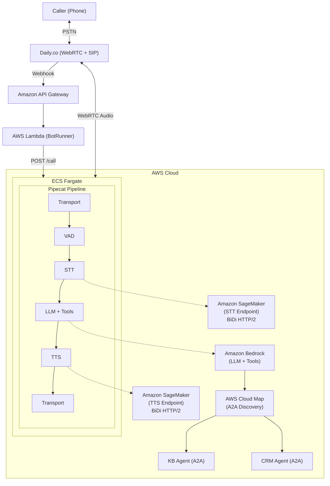

# Guidance for Building Real-Time Voice AI Agents on AWS

## Table of Contents

1. [Overview](#overview)
    - [Architecture](#architecture)
    - [Cost](#cost)
2. [Prerequisites](#prerequisites)
    - [Operating System](#operating-system)
    - [Third-Party Tools](#third-party-tools)
    - [AWS Account Requirements](#aws-account-requirements)
    - [AWS CDK Bootstrap](#aws-cdk-bootstrap)
    - [Service Limits](#service-limits)
    - [Supported Regions](#supported-regions)
3. [Deployment Steps](#deployment-steps)
    - [Option A: AI-Guided Deployment (Recommended)](#option-a-ai-guided-deployment-recommended)
    - [Option B: Manual Deployment](#option-b-manual-deployment)
4. [Deployment Validation](#deployment-validation)
5. [Running the Guidance](#running-the-guidance)
6. [Next Steps](#next-steps)
7. [Cleanup](#cleanup)
8. [FAQ, Known Issues, Additional Considerations, and Limitations](#faq-known-issues-additional-considerations-and-limitations)
9. [Revisions](#revisions)
10. [Notices](#notices)
11. [Authors](#authors)

## Overview

This Guidance provides a sample foundation for building real-time voice AI agents on AWS. It demonstrates how to build a voice assistant that handles phone calls over SIP/PSTN using [Pipecat](https://github.com/pipecat-ai/pipecat), an open-source framework for voice AI pipelines, running on Amazon ECS Fargate.

- **Plug-in models** -- Supports automatic speech recognition (ASR) or speech-to-text (STT), text-to-speech (TTS), and large language model (LLM) providers
- **Phone and web** -- Accepts phone calls via [Daily](https://www.daily.co/) SIP and public switched telephone network (PSTN) dial-in, and web applications through Daily managed WebRTC
- **Extensible agents** -- Extends capabilities through an agent-to-agent (A2A) hub-and-spoke architecture with AWS Cloud Map discovery
- **AWS infrastructure** -- Runs on Amazon ECS Fargate with auto-scaling, Amazon Bedrock for LLM, and optional self-hosted STT/TTS on Amazon SageMaker

### Architecture



The architecture flow:

1. A caller dials the PSTN phone number, which connects to Daily.co via SIP.
2. Daily.co sends a webhook to Amazon API Gateway, which triggers the BotRunner AWS Lambda function.
3. The Lambda function sends a POST /call request to the Amazon ECS Fargate service to spawn a voice pipeline.
4. The Pipecat pipeline processes audio in real-time: Transport receives audio, VAD detects speech, STT converts to text, the LLM (Amazon Bedrock) generates a response with optional tool calls, and TTS converts the response back to audio.
5. STT and TTS can run on Amazon SageMaker endpoints (audio stays in Amazon VPC) or via cloud APIs.
6. When tool calling is enabled, the LLM can invoke local tools (e.g., time, transfer) or discover and call remote A2A capability agents (Knowledge Base, CRM) via AWS Cloud Map.

### Cost

You are responsible for the cost of the AWS services used while running this Guidance. As of March 2026, the cost for running this Guidance with the default settings in the US East (N. Virginia) Region is approximately **$135-200 per month** for Cloud API mode, or **$935-1,200 per month** for Amazon SageMaker mode (due to GPU instance costs).

We recommend creating a [Budget](https://docs.aws.amazon.com/cost-management/latest/userguide/budgets-managing-costs.html) through [AWS Cost Explorer](https://aws.amazon.com/aws-cost-management/aws-cost-explorer/) to help manage costs. Prices are subject to change. For full details, refer to the pricing webpage for each AWS service used in this Guidance.

#### Sample Cost Table

The following table provides a sample cost breakdown for deploying this Guidance with the default parameters in the US East (N. Virginia) Region for one month.

**Cloud API Mode:**

| AWS Service | Dimensions | Cost [USD] |
| ----------- | ---------- | ---------- |
| Amazon ECS Fargate | 1 task, 2 vCPU / 4 GB, always-on | ~$70/month |
| NAT Gateway | 1 gateway + data processing | ~$35/month |
| Network Load Balancer | 1 NLB, minimal LCUs | ~$18/month |
| AWS Lambda | ~10,000 invocations/month | ~$0.01/month |
| Amazon API Gateway | ~10,000 requests/month | ~$0.04/month |
| AWS Secrets Manager | 3 secrets | ~$1.20/month |
| Amazon CloudWatch | Logs, metrics, dashboard, alarms | ~$10-15/month |
| Amazon Bedrock | Pay-per-token LLM usage | ~$5-50/month |

**Amazon SageMaker Mode (additional costs):**

| AWS Service | Dimensions | Cost [USD] |
| ----------- | ---------- | ---------- |
| Amazon SageMaker STT Endpoint | ml.g6.2xlarge, always-on | ~$350/month |
| Amazon SageMaker TTS Endpoint | ml.g6.12xlarge, always-on | ~$450/month |

> Third-party service costs (Daily.co, Deepgram, Cartesia) vary by usage and are not included above. Refer to each provider's pricing page.

## Prerequisites

### Operating System

These deployment instructions are optimized to best work on **macOS** or **Amazon Linux 2023 AMI**. Deployment on Windows may require additional steps (e.g., WSL2).

Required tools:

- **Node.js 18+** -- for CDK infrastructure deployment
- **Python 3.12+** -- for voice agent development and testing
- **AWS CLI v2** -- configured with credentials for your target account
- **Finch** (or Docker) -- for container image builds

```bash
# Verify installations
node --version    # v18.x or higher
python3 --version # 3.12.x or higher
aws --version     # aws-cli/2.x
finch --version   # or docker --version
```

### Third-Party Tools

The following third-party service accounts and API keys are required:

| Service | Purpose | Sign Up |
| ------- | ------- | ------- |
| [Daily.co](https://dashboard.daily.co/) | WebRTC/SIP transport for voice calls | [Dashboard](https://dashboard.daily.co/) |
| STT provider (e.g. [Deepgram](https://console.deepgram.com/)) | Speech-to-text (cloud API mode) | Provider console |
| TTS provider (e.g. [Cartesia](https://play.cartesia.ai/)) | Text-to-speech (cloud API mode) | Provider console |

### AWS Account Requirements

- **Amazon Bedrock** -- Model access must be enabled in your target Region. Go to the [Amazon Bedrock console](https://console.aws.amazon.com/bedrock/) > Model access and enable your preferred LLM.
- **VPC** -- The deployment creates its own Amazon VPC. No existing VPC is required.
- **IAM permissions** -- The deploying principal needs permissions to create Amazon VPC, Amazon ECS, AWS Lambda, Amazon API Gateway, AWS Secrets Manager, AWS KMS, Amazon CloudWatch, and (optionally) Amazon SageMaker resources.

**Amazon SageMaker mode only:**

- GPU quota for `ml.g6.2xlarge` and `ml.g6.12xlarge` in your target Region. Request via [Service Quotas](https://console.aws.amazon.com/servicequotas/).
- [Deepgram Marketplace](docs/reference/deepgram-marketplace-setup.md) subscriptions for STT and TTS model packages.

### AWS CDK Bootstrap

This Guidance uses AWS CDK. If you are using AWS CDK for the first time in your AWS account/Region, run the bootstrap command:

```bash
npx cdk bootstrap aws://ACCOUNT_ID/REGION
```

### Service Limits

| Service | Limit | Default | Notes |
| ------- | ----- | ------- | ----- |
| Amazon SageMaker `ml.g6.2xlarge` | Endpoint instances | 0 | Request increase for Amazon SageMaker mode |
| Amazon SageMaker `ml.g6.12xlarge` | Endpoint instances | 0 | Request increase for Amazon SageMaker mode |
| Amazon ECS Fargate | On-demand vCPU | 256 | Sufficient for default configuration |
| Amazon Bedrock | Tokens per minute | Varies | Monitor throttling in Amazon CloudWatch |

Request service limit increases via the [Service Quotas console](https://console.aws.amazon.com/servicequotas/).

### Supported Regions

This Guidance is best suited for AWS Regions that support Amazon Bedrock. Recommended Regions:

- **US East (N. Virginia)** -- `us-east-1`
- **US West (Oregon)** -- `us-west-2`

Amazon SageMaker mode additionally requires GPU instance availability (`ml.g6` family) in the selected Region.

## Deployment Steps

### Option A: AI-Guided Deployment (Recommended)

This project includes [Claude Code skills](https://docs.anthropic.com/en/docs/claude-code/skills) that walk you through every step interactively -- checking prerequisites, configuring environment, deploying infrastructure, setting up your phone number, and verifying the result.

1. Clone the repository:
    ```bash
    git clone https://github.com/aws-samples/sample-sip-voice-agent.git
    cd sample-sip-voice-agent
    ```

2. Open the project in Claude Code (or your preferred AI-assisted IDE).

3. **Deploy infrastructure** -- Run `/deploy-cloud-api` (or `/deploy-sagemaker` for production). Claude checks prerequisites, gathers your API keys (Daily, STT/TTS providers), and deploys CDK stacks. Takes ~15 minutes.

4. **Set up a phone number** -- Run `/configure-daily`. Claude checks for existing Daily.co numbers (reuses one if available), configures the pinless dial-in webhook, and syncs secrets. You now have a callable phone number.

5. **Verify deployment** -- Run `/verify-deployment` to health-check all infrastructure components.

#### Available Skills

| Skill | What It Does |
| ----- | ------------ |
| `/deploy-cloud-api` | Full deployment using Deepgram + Cartesia cloud APIs |
| `/deploy-sagemaker` | Full deployment with self-hosted STT/TTS on Amazon SageMaker GPUs |
| `/configure-daily` | Set up a phone number and configure PSTN dial-in |
| `/verify-deployment` | Health check all infrastructure components |
| `/deploy-capability-agents` | Deploy Knowledge Base and/or CRM capability agents |
| `/create-capability-agent` | Scaffold a new A2A capability agent from scratch |
| `/create-local-tool` | Add a new tool to the voice pipeline |
| `/destroy-project` | Release phone number and tear down all AWS resources |

### Option B: Manual Deployment

See the full [Deployment Guide](infrastructure/DEPLOYMENT.md) for step-by-step manual instructions.

1. Clone the repository:
    ```bash
    git clone https://github.com/aws-samples/sample-sip-voice-agent.git
    cd sample-sip-voice-agent
    ```

2. Navigate to the infrastructure directory and configure environment:
    ```bash
    cd infrastructure
    cp .env.example .env
    # Edit .env with your AWS region and (for Amazon SageMaker mode) model package ARNs
    ```

3. Install dependencies:
    ```bash
    npm install
    ```

4. Deploy the stacks:
    ```bash
    # Deploy with cloud APIs (simpler, no Amazon SageMaker needed)
    USE_CLOUD_APIS=true ./deploy.sh deploy

    # Or deploy with Amazon SageMaker (production, audio stays in VPC)
    ./deploy.sh deploy
    ```

5. Configure API keys in AWS Secrets Manager:
    ```bash
    ./scripts/init-secrets.sh
    ```

6. Set up a phone number:
    ```bash
    ./scripts/setup-daily.sh
    ```

7. Capture the deployed resource outputs:
    ```bash
    aws cloudformation describe-stacks --stack-name VoiceAgentEcs --query "Stacks[0].Outputs" --output table
    ```

## Deployment Validation

After deployment, validate that all resources are running correctly:

1. **Check CloudFormation stacks** -- Open the [AWS CloudFormation console](https://console.aws.amazon.com/cloudformation/) and verify all stacks show `CREATE_COMPLETE` status.

2. **Verify Amazon ECS service** -- Confirm the voice agent task is running:
    ```bash
    aws ecs describe-services --cluster voice-agent-cluster --services voice-agent-service --query "services[0].{status:status,running:runningCount,desired:desiredCount}"
    ```

3. **Test the webhook endpoint** -- The Amazon API Gateway URL is available in CloudFormation outputs:
    ```bash
    aws cloudformation describe-stacks --stack-name VoiceAgentBotRunner --query "Stacks[0].Outputs[?OutputKey=='WebhookUrl'].OutputValue" --output text
    ```

4. **Run the verification skill** -- If using Claude Code, run `/verify-deployment` for a comprehensive health check of all components including SSM parameters, Amazon ECS service, AWS Secrets Manager, webhook endpoint, and (optionally) Amazon SageMaker endpoints.

## Running the Guidance

Once deployed, call your PSTN phone number to interact with the voice agent.

### Basic Conversation

The agent handles natural dialogue out of the box. Simply call and speak naturally.

### Testing Built-in Tools

If `ENABLE_TOOL_CALLING` is set to `true` (configurable via SSM parameter `/voice-agent/config/enable-tool-calling`):

| Test Phrase | Tool Tested | Expected Behavior |
| ----------- | ----------- | ----------------- |
| *"What time is it?"* | `get_current_time` | Agent responds with the current time |
| *"Goodbye"* | `hangup_call` | Agent says goodbye and ends the call |
| *"Transfer me to an agent"* | `transfer_to_agent` | Call is transferred via SIP REFER (requires `TRANSFER_DESTINATION`) |

### Testing Capability Agents (if deployed)

| Test Phrase | Agent | Expected Behavior |
| ----------- | ----- | ----------------- |
| *"What's your return policy?"* | Knowledge Base | RAG search over uploaded documents |
| *"Look up the account for 555-0100"* | CRM | Customer lookup and account details |

### Monitoring

The Amazon CloudWatch dashboard URL is available in CloudFormation outputs as `VoiceAgentEcs.DashboardUrl`. Key metrics to observe:

| Metric | Namespace | Target |
| ------ | --------- | ------ |
| E2ELatency | `VoiceAgent/Pipeline` | < 2,000ms |
| AgentResponseLatency | `VoiceAgent/Pipeline` | < 2,500ms |
| TurnCount | `VoiceAgent/Pipeline` | Per call |
| InterruptionCount | `VoiceAgent/Pipeline` | Per call |
| AudioRMS / AudioPeak | `VoiceAgent/Pipeline` | Audio quality (dBFS) |
| ToolExecutionTime | `VoiceAgent/Pipeline` | Per tool invocation |
| ActiveSessions | `VoiceAgent/Pipeline` | Concurrent calls |

## Next Steps

After successfully deploying and testing the basic voice agent, consider these enhancements:

- **Add capability agents** -- Run `/deploy-capability-agents` to deploy the Knowledge Base and CRM agents, extending the voice agent with RAG and customer data lookup without modifying the core pipeline.
- **Create custom tools** -- Use `/create-local-tool` to add new tools to the voice pipeline (e.g., appointment scheduling, order lookup). Tools use a capability-based registration system and require no pipeline code changes.
- **Create custom capability agents** -- Use `/create-capability-agent` to scaffold a new A2A agent with its own container, Dockerfile, and CDK stack.
- **Switch to Amazon SageMaker mode** -- For production deployments where audio must stay within the Amazon VPC, deploy with `/deploy-sagemaker` to use self-hosted STT/TTS on GPU instances.
- **Configure call transfers** -- Set the `TRANSFER_DESTINATION` environment variable to enable SIP REFER transfers to human agents. See [Call Transfers](docs/reference/call-transfers.md).
- **Tune auto-scaling** -- Adjust `targetSessionsPerTask`, `sessionCapacityPerTask`, `minCapacity`, and `maxCapacity` via CDK context for your call volume.
- **Upload knowledge base documents** -- Add your own FAQ and policy documents to the S3 bucket backing the Amazon Bedrock Knowledge Base for domain-specific RAG.

## Cleanup

To remove all deployed resources and avoid ongoing charges:

### Option A: AI-Guided Cleanup (Recommended)

Run `/destroy-project` in Claude Code. This will:

1. Release the Daily.co phone number
2. Remove pinless dial-in configuration
3. Destroy all CDK stacks (capability agents first, then core infrastructure)
4. Clean up local output files

### Option B: Manual Cleanup

1. **Release the Daily.co phone number** (if purchased):
    ```bash
    # List phone numbers
    curl -s -H "Authorization: Bearer $DAILY_API_KEY" https://api.daily.co/v1/phone-numbers

    # Release a specific number
    curl -X DELETE -H "Authorization: Bearer $DAILY_API_KEY" https://api.daily.co/v1/phone-numbers/PHONE_NUMBER_ID
    ```

2. **Destroy capability agent stacks** (if deployed):
    ```bash
    cd infrastructure
    npx cdk destroy VoiceAgentCrmAgent VoiceAgentKbAgent --force
    ```

3. **Destroy core infrastructure stacks**:
    ```bash
    npx cdk destroy --all --force
    ```

4. **Verify cleanup** -- Confirm no resources remain:
    ```bash
    aws cloudformation list-stacks --stack-status-filter CREATE_COMPLETE UPDATE_COMPLETE --query "StackSummaries[?starts_with(StackName, 'VoiceAgent')].StackName"
    ```

> **Note:** Amazon SageMaker endpoints (if deployed) are the most expensive resources. Ensure the Amazon SageMaker stack is fully destroyed to avoid GPU instance charges.

## FAQ, Known Issues, Additional Considerations, and Limitations

### Deployment Modes

| Mode | STT/TTS | Best For |
| ---- | ------- | -------- |
| **Cloud API** (`USE_CLOUD_APIS=true`) | Deepgram + Cartesia cloud APIs | Getting started, development |
| **Amazon SageMaker** (default) | Self-hosted on GPU instances | Production, data residency |

Cloud API mode requires Deepgram and Cartesia API keys. Amazon SageMaker mode requires [Deepgram Marketplace subscriptions](docs/reference/deepgram-marketplace-setup.md) and GPU quota.

### Known Issues

**No response from agent:**

1. Check AWS Lambda logs for webhook errors
2. Verify API keys are correctly configured in AWS Secrets Manager
3. Check Amazon ECS service is running and healthy

**High latency:**

1. Check Amazon SageMaker endpoint Amazon CloudWatch metrics
2. Review Amazon CloudWatch metrics for Amazon Bedrock latency
3. Verify VPC endpoints are configured correctly

**No audio output:**

1. Verify Daily room configuration (SIP enabled)
2. Check TTS provider API key is valid
3. Review voice agent container logs

### Additional Considerations

- This Guidance creates a NAT Gateway which incurs hourly charges even when idle.
- Amazon SageMaker endpoints (Amazon SageMaker mode) run on GPU instances that are billed per hour irrespective of usage.
- Third-party services (Daily.co, Deepgram, Cartesia) have their own pricing and usage limits.
- The Amazon ECS Fargate service runs at least one task continuously (always-on architecture) to avoid cold start latency.
- Cloud API mode routes audio through the public internet. Use Amazon SageMaker mode if data residency is required.

### Project Structure

```
sample-sip-voice-agent/
├── infrastructure/           # CDK infrastructure code
│   ├── src/
│   │   ├── stacks/          # CloudFormation stacks
│   │   ├── constructs/      # Reusable CDK constructs
│   │   └── functions/       # AWS Lambda function code
│   ├── scripts/             # Deployment & setup scripts
│   └── test/                # Infrastructure tests
├── backend/
│   ├── voice-agent/         # Voice pipeline container (hub)
│   │   ├── app/
│   │   │   ├── services/    # STT/TTS/LLM service factories
│   │   │   ├── tools/       # Tool framework + built-in tools
│   │   │   ├── a2a/         # A2A capability agent integration
│   │   │   ├── pipeline_ecs.py   # Pipecat pipeline configuration
│   │   │   ├── observability.py  # Metrics observers
│   │   │   └── service_main.py   # HTTP service (aiohttp)
│   │   ├── tests/           # Python tests
│   │   └── Dockerfile       # Container definition (Python 3.12)
│   └── agents/              # A2A capability agents (spokes)
│       ├── knowledge-base-agent/  # KB RAG agent
│       └── crm-agent/            # CRM agent (5 tools)
├── docs/
│   ├── guides/              # Developer guides
│   ├── patterns/            # Architecture patterns
│   └── reference/           # Reference documentation
└── resources/               # Sample data (KB documents)
```

### Developer Guides

| Guide | Description |
| ----- | ----------- |
| [Deployment Guide](infrastructure/DEPLOYMENT.md) | Full infrastructure deployment walkthrough (cloud API + Amazon SageMaker) |
| [Daily.co Setup](docs/reference/daily-setup.md) | Daily.co phone number and webhook configuration |
| [Deepgram Marketplace Setup](docs/reference/deepgram-marketplace-setup.md) | Subscribe to Deepgram model packages for Amazon SageMaker mode |
| [Call Transfers](docs/reference/call-transfers.md) | Optional SIP REFER transfer to human agents |
| [Adding a Capability Agent](docs/guides/adding-a-capability-agent.md) | Build and deploy a new A2A capability agent |
| [Adding a Local Tool](docs/guides/adding-a-local-tool.md) | Add tools to the voice agent pipeline |
| [Capability Agent Pattern](docs/patterns/capability-agent-pattern.md) | Architecture reference: hub-and-spoke pattern, latency optimization |

### Limitations

- Maximum concurrent calls per container is configurable (default: 10) but bounded by CPU/memory.
- Cold start for new Amazon ECS tasks takes ~90 seconds. Total time from overload to new capacity: ~3-5 minutes.
- The A2A capability agent discovery relies on AWS Cloud Map polling (default: every 30 seconds).

For any feedback, questions, or suggestions, please use the [issues tab](https://github.com/aws-samples/sample-sip-voice-agent/issues) under this repo.

## Revisions

| Date | Description |
| ---- | ----------- |
| March 2026 | Initial release -- Cloud API and Amazon SageMaker deployment modes, A2A capability agents, auto-scaling |

## Notices

*Customers are responsible for making their own independent assessment of the information in this Guidance. This Guidance: (a) is for informational purposes only, (b) represents AWS current product offerings and practices, which are subject to change without notice, and (c) does not create any commitments or assurances from AWS and its affiliates, suppliers or licensors. AWS products or services are provided "as is" without warranties, representations, or conditions of any kind, whether express or implied. AWS responsibilities and liabilities to its customers are controlled by AWS agreements, and this Guidance is not part of, nor does it modify, any agreement between AWS and its customers.*

## Authors

- [Daniel Wirjo](https://github.com/wirjo)

## Security

See [CONTRIBUTING](CONTRIBUTING.md#security-issue-notifications) for more information.

## License

This library is licensed under the MIT-0 License. See the [LICENSE](LICENSE) file.
