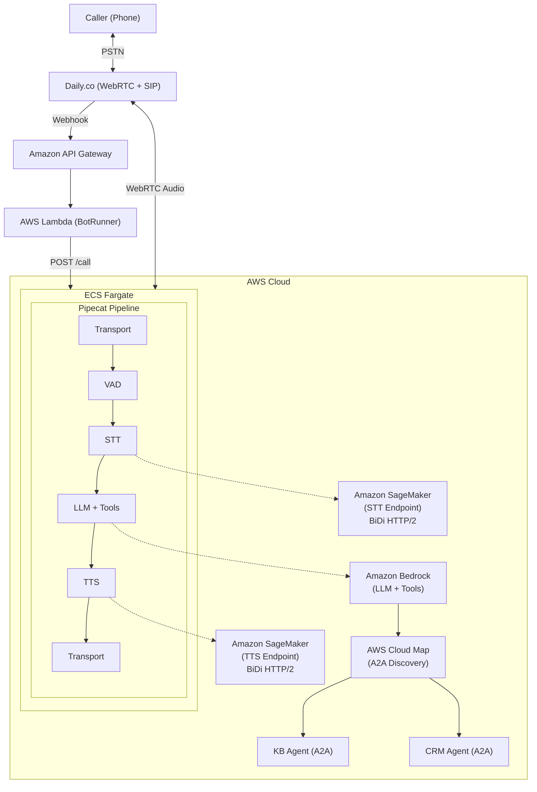

# Voice Agents on AWS

A sample foundation for building real-time voice AI agents on AWS.

- **Pipeline orchestration** -- Uses [Pipecat](https://github.com/pipecat-ai/pipecat), an open-source framework for voice AI pipelines
- **Plug-in models** -- Supports automatic speech recognition (ASR) or speech-to-text (STT), text-to-speech (TTS), and large language model (LLM) providers
- **Phone and web** -- Accepts phone calls via [Daily](https://www.daily.co/) SIP and public switched telephone network (PSTN) dial-in, and web applications through Daily managed WebRTC
- **Extensible agents** -- Extends capabilities through an agent-to-agent (A2A) hub-and-spoke architecture
- **AWS infrastructure** -- Runs on ECS Fargate with auto-scaling

## Architecture



## Features

- **Real-time voice conversations** with ~1.5-2.5s agent response latency
- **Plug-in STT/TTS providers** -- cloud APIs (Deepgram, Cartesia) or self-hosted on Amazon SageMaker
- **Self-hosted STT/TTS option** via Amazon SageMaker BiDi streaming (audio stays in Amazon VPC)
- **LLM on Amazon Bedrock** via ConverseStream with tool calling
- **Tool calling** with local tools (transfer, time) and A2A capability agents
- **Knowledge Base RAG** via Amazon Bedrock Knowledge Bases (A2A capability agent)
- **CRM integration** via A2A capability agent (customer lookup, case management)
- **A2A protocol** for hub-and-spoke agent architecture with AWS Cloud Map discovery
- **PSTN dial-in** via Daily.co SIP integration
- **Comprehensive observability** with Amazon CloudWatch metrics, alarms, and dashboards
- **Always-on architecture** with ECS Fargate (no cold start)

## Quick Start

### Prerequisites

- AWS account with Amazon Bedrock model access enabled
- Node.js 18+
- AWS CLI configured with credentials for your target account
- Docker installed
- API keys for [Daily.co](https://dashboard.daily.co/) and your chosen STT/TTS providers (e.g. [Deepgram](https://console.deepgram.com/), [Cartesia](https://play.cartesia.ai/))

> **Amazon SageMaker mode only:** GPU quota (ml.g6.2xlarge and ml.g6.12xlarge) and [Deepgram Marketplace](docs/reference/deepgram-marketplace-setup.md) subscriptions.

### Option A: AI-Guided Deployment (Recommended)

This project includes [Claude Code skills](https://docs.anthropic.com/en/docs/claude-code/skills) that walk you through every step interactively -- checking prerequisites, configuring environment, deploying infrastructure, setting up your phone number, and verifying the result.

#### Walkthrough

**1. Deploy infrastructure** -- Run `/deploy-cloud-api` (or `/deploy-sagemaker` for production). Claude checks prerequisites, gathers your API keys (Daily, STT/TTS providers), and deploys CDK stacks. Takes ~15 minutes.

**2. Set up a phone number** — Run `/configure-daily`. Claude checks for existing Daily.co numbers (reuses one if available), configures the pinless dial-in webhook, and syncs secrets. You now have a callable phone number.

**3. Test the basic agent** — Call your number and try:
- *"What time is it?"* — tests the `get_current_time` tool
- *"Goodbye"* — tests the `hangup_call` tool
- Or just have a conversation -- the LLM handles natural dialogue out of the box

**4. Add capability agents (optional)** — Run `/deploy-capability-agents` to extend the voice agent with:
- **Knowledge Base** — RAG search over your documents. Test: *"What's your return policy?"*
- **CRM** — Customer lookup and case management. Test: *"Look up the account for 555-0100"*

These deploy as separate containers and are discovered automatically via AWS Cloud Map -- no pipeline code changes needed.

**5. Verify** — Run `/verify-deployment` at any time to health-check all components.

**6. Clean up** — Run `/destroy-project` to release the phone number and tear down all AWS resources.

#### Available Skills

| Skill | What It Does |
|-------|-------------|
| `/deploy-cloud-api` | Full deployment using Deepgram + Cartesia cloud APIs |
| `/deploy-sagemaker` | Full deployment with self-hosted STT/TTS on Amazon SageMaker GPUs |
| `/configure-daily` | Set up a phone number and configure PSTN dial-in |
| `/verify-deployment` | Health check all infrastructure components |
| `/deploy-capability-agents` | Deploy Knowledge Base and/or CRM capability agents |
| `/create-capability-agent` | Scaffold a new A2A capability agent from scratch |
| `/create-local-tool` | Add a new tool to the voice pipeline |

### Option B: Manual Deployment

See the full [Deployment Guide](infrastructure/DEPLOYMENT.md) for step-by-step manual instructions.

```bash
cd infrastructure

# Copy and configure environment
cp .env.example .env
# Edit .env with your AWS region and (for Amazon SageMaker mode) model package ARNs

# Install dependencies
npm install

# Deploy with cloud APIs (simpler, no Amazon SageMaker needed)
USE_CLOUD_APIS=true ./deploy.sh deploy

# Or deploy with Amazon SageMaker (production, audio stays in VPC)
./deploy.sh deploy
```

After deployment:
```bash
# Configure API keys in AWS Secrets Manager
./scripts/init-secrets.sh

# Set up a phone number
./scripts/setup-daily.sh
```

## Project Structure

```
sample-sip-voice-agent/
├── infrastructure/           # CDK infrastructure code
│   ├── src/
│   │   ├── stacks/          # CloudFormation stacks (10 stacks)
│   │   ├── constructs/      # Reusable CDK constructs
│   │   └── functions/       # AWS Lambda function code
│   ├── scripts/             # Deployment & setup scripts
│   └── test/                # Infrastructure tests
├── backend/
│   ├── voice-agent/         # Voice pipeline container (hub)
│   │   ├── app/
│   │   │   ├── services/    # STT/TTS/LLM service factories
│   │   │   ├── tools/       # Tool framework + built-in tools
│   │   │   ├── a2a/         # A2A capability agent integration
│   │   │   ├── pipeline_ecs.py   # Pipecat pipeline configuration
│   │   │   ├── observability.py  # Metrics observers
│   │   │   └── service_main.py   # HTTP service (aiohttp)
│   │   ├── tests/           # Python tests
│   │   └── Dockerfile       # Container definition (Python 3.12)
│   └── agents/              # A2A capability agents (spokes)
│       ├── knowledge-base-agent/  # KB RAG agent
│       └── crm-agent/            # CRM agent (5 tools)
├── docs/
│   ├── guides/              # Developer guides
│   ├── patterns/            # Architecture patterns
│   └── reference/           # Reference documentation
└── resources/               # Sample data (KB documents)
```

## Components

### Infrastructure Stacks

| Stack | Description |
|-------|-------------|
| NetworkStack | Amazon VPC, subnets, security groups, VPC endpoints |
| StorageStack | AWS Secrets Manager with AWS KMS encryption |
| SageMakerStack | STT + TTS Amazon SageMaker endpoints (BiDi streaming) |
| KnowledgeBaseStack | Amazon Bedrock Knowledge Bases for RAG document retrieval |
| CrmStack | Customer lookup and case management API |
| EcsStack | ECS Fargate cluster, NLB, AWS Cloud Map namespace, monitoring |
| BotRunnerStack | AWS Lambda webhook handler, Amazon API Gateway |
| KbAgentStack | Knowledge Base A2A capability agent (ECS Fargate) |
| CrmAgentStack | CRM A2A capability agent (ECS Fargate) |

### Services

| Service | Purpose |
|---------|---------|
| Daily.co | WebRTC/SIP transport for voice calls |
| STT Provider (e.g. Deepgram) | Speech-to-text -- cloud API or self-hosted on Amazon SageMaker |
| TTS Provider (e.g. Cartesia, Deepgram) | Text-to-speech -- cloud API or self-hosted on Amazon SageMaker |
| Amazon Bedrock | LLM for conversation with tool calling |
| Amazon Bedrock Knowledge Bases | RAG for FAQ/document queries |
| Pipecat | Voice pipeline orchestration |

## Developer Guides

| Guide | Description |
|-------|-------------|
| [Deployment Guide](infrastructure/DEPLOYMENT.md) | Full infrastructure deployment walkthrough (cloud API + SageMaker) |
| [Daily.co Setup](docs/reference/daily-setup.md) | Daily.co phone number and webhook configuration |
| [Deepgram Marketplace Setup](docs/reference/deepgram-marketplace-setup.md) | Subscribe to Deepgram model packages for Amazon SageMaker mode |
| [Call Transfers](docs/reference/call-transfers.md) | Optional SIP REFER transfer to human agents |
| [Adding a Capability Agent](docs/guides/adding-a-capability-agent.md) | Build and deploy a new A2A capability agent |
| [Adding a Local Tool](docs/guides/adding-a-local-tool.md) | Add tools to the voice agent pipeline |
| [Capability Agent Pattern](docs/patterns/capability-agent-pattern.md) | Architecture reference: hub-and-spoke pattern, latency optimization |

## Configuration

### Environment Variables (Voice Agent Container)

| Variable | Description | Default |
|----------|-------------|---------|
| `STT_PROVIDER` | STT provider | `deepgram` |
| `TTS_PROVIDER` | TTS provider | `cartesia` |
| `DEEPGRAM_API_KEY` | Deepgram API key | (from Secrets Manager) |
| `CARTESIA_API_KEY` | Cartesia API key | (from Secrets Manager) |
| `AWS_REGION` | AWS region | `us-east-1` |
| `ENABLE_TOOL_CALLING` | Enable LLM tool calling | `false` |
| `ENABLE_FILLER_PHRASES` | Enable filler phrases during tool delays | `true` |
| `LLM_MODEL_ID` | Amazon Bedrock model ID | `us.anthropic.claude-haiku-4-5-20251001-v1:0` |

### Secrets (AWS Secrets Manager)

| Secret Key | Description |
|------------|-------------|
| `DAILY_API_KEY` | Daily.co API key for room management |
| `DEEPGRAM_API_KEY` | Deepgram API key for STT (cloud API mode) |
| `CARTESIA_API_KEY` | Cartesia API key for TTS (cloud API mode) |

## Development

### Local Development

```bash
cd backend/voice-agent

# Create .env file with your API keys (see .env.example)
cp .env.example .env
# Edit .env with your API keys

# Install dependencies
pip install -r requirements.txt -r requirements-dev.txt

# Run tests
pytest -v

# Run locally
uvicorn app.main:app --host 0.0.0.0 --port 8080
```

### Run Tests

```bash
# Voice agent Python tests
cd backend/voice-agent
pytest -v

# CDK infrastructure tests
cd infrastructure
npm test

# Lambda function tests
cd infrastructure/src/functions/bot-runner
pytest -v
```

## Deployment Modes

| Mode | STT/TTS | Best For |
|------|---------|----------|
| **Cloud API** (`USE_CLOUD_APIS=true`) | Deepgram + Cartesia cloud APIs | Getting started, development |
| **Amazon SageMaker** (default) | Self-hosted on GPU instances | Production, data residency |

Cloud API mode requires Deepgram and Cartesia API keys. Amazon SageMaker mode requires [Deepgram Marketplace subscriptions](docs/reference/deepgram-marketplace-setup.md) and GPU quota.

## Monitoring

### Amazon CloudWatch Logs

- Amazon ECS container logs (pipeline events, errors)
- AWS Lambda webhook handler logs
- Amazon SageMaker endpoint logs (when using Amazon SageMaker mode)
### Amazon CloudWatch Namespace: `VoiceAgent/Pipeline`

| Metric | Target |
|--------|--------|
| E2ELatency | < 2000ms |
| AgentResponseLatency | < 2500ms |
| TurnCount | Per call |
| InterruptionCount | Per call |
| AudioRMS / AudioPeak | Audio quality (dBFS) |
| ToolExecutionTime | Per tool invocation |
| ActiveSessions | Concurrent calls |

Dashboard URL is output as `VoiceAgentEcs.DashboardUrl` in CloudFormation outputs.

## Deployed Resources

This project deploys the following AWS and third-party resources:

| Component | Description |
|-----------|-------------|
| Amazon VPC + NAT Gateway | Private networking with public/private subnets |
| ECS Fargate (2 vCPU / 4 GB) | Voice agent container |
| Network Load Balancer | Routes call requests to Amazon ECS |
| AWS Secrets Manager + AWS KMS | API key storage with encryption |
| AWS Lambda + Amazon API Gateway | Webhook handler for Daily.co |
| Amazon CloudWatch Dashboard + Alarms | Monitoring and alerting |
| Amazon SageMaker STT endpoint (ml.g6.2xlarge) | STT endpoint (Amazon SageMaker mode only) |
| Amazon SageMaker TTS endpoint (ml.g6.12xlarge) | TTS endpoint (Amazon SageMaker mode only) |
| Daily.co | WebRTC/SIP transport (third-party) |
| Amazon Bedrock | LLM for conversation (pay-per-use) |

**Cloud API mode** does not deploy Amazon SageMaker endpoints but routes audio through the public internet via cloud STT/TTS APIs.

> **You are responsible for all AWS and third-party service charges incurred by deploying and running this project.** Use the **destroy-project** skill (or `cdk destroy --all`) to tear down resources when done.

## Troubleshooting

### No Response from Agent

1. Check AWS Lambda logs for webhook errors
2. Verify API keys are correctly configured in AWS Secrets Manager
3. Check Amazon ECS service is running and healthy

### High Latency

1. Check Amazon SageMaker endpoint Amazon CloudWatch metrics
2. Review Amazon CloudWatch metrics for Amazon Bedrock latency
3. Verify VPC endpoints are configured correctly

### No Audio Output

1. Verify Daily room configuration (SIP enabled)
2. Check TTS provider API key is valid
3. Review voice agent container logs

## Security

See [CONTRIBUTING](CONTRIBUTING.md#security-issue-notifications) for more information.

## License

This library is licensed under the MIT-0 License. See the [LICENSE](LICENSE) file.
