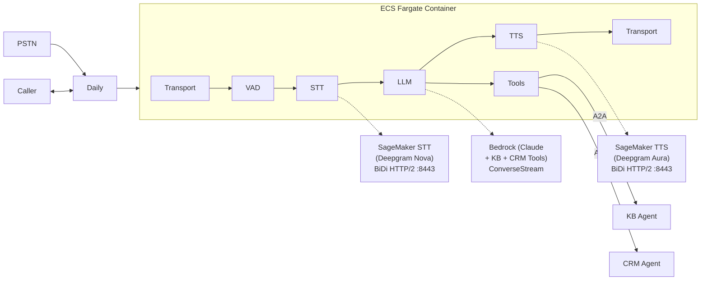

# Voice Agent Pipeline Container

Voice-to-Voice AI assistant powered by Pipecat, running on AWS ECS Fargate.

## Architecture



## STT/TTS Providers

The pipeline supports multiple providers for STT and TTS, configurable via environment variables:

| Provider | STT_PROVIDER | TTS_PROVIDER | Use Case |
|----------|--------------|--------------|----------|
| **Cloud APIs** | `deepgram` | `cartesia` | Local dev, quick setup |
| **SageMaker** | `sagemaker` | `sagemaker` | Production, self-hosted |

### Cloud API Mode (Recommended for Development)
```bash
export STT_PROVIDER=deepgram
export TTS_PROVIDER=cartesia
export DEEPGRAM_API_KEY=your-deepgram-key
export CARTESIA_API_KEY=your-cartesia-key
```

### SageMaker Mode (Production)
```bash
export STT_PROVIDER=sagemaker
export TTS_PROVIDER=sagemaker
export STT_ENDPOINT_NAME=your-stt-endpoint
export TTS_ENDPOINT_NAME=your-tts-endpoint
```

## Features

- **Real-time voice processing** with sub-500ms latency
- **Silero VAD** for accurate voice activity detection
- **Deepgram Nova-3** for high-quality speech-to-text
- **Claude 4.5 Haiku** for fast, intelligent responses
- **Deepgram Aura** for natural text-to-speech
- **WebSocket streaming** throughout the pipeline
- **A2A capability agents** for KB search and CRM operations (via CloudMap discovery). See [Adding a Capability Agent](../../docs/guides/adding-a-capability-agent.md) for how to add new agents.
- **Filler phrases** during tool execution to maintain natural conversation flow

## Quick Start

### Prerequisites

- Docker with ARM64 support
- AWS credentials configured
- Deployed SageMaker endpoints (STT/TTS)
- Bedrock access enabled (Claude Haiku)

### Build Container

```bash
# Build for ARM64 (ECS Fargate)
docker build --platform linux/arm64 -t pipecat-voice .

# Build for local development (native platform)
docker build -t pipecat-voice-local .
```

### Run Locally (Cloud API Mode)

```bash
# Set environment variables for cloud APIs
export STT_PROVIDER=deepgram
export TTS_PROVIDER=cartesia
export DEEPGRAM_API_KEY=your-deepgram-key
export CARTESIA_API_KEY=your-cartesia-key
export AWS_REGION=us-east-1

# Run container
docker run -p 8080:8080 \
  -e STT_PROVIDER \
  -e TTS_PROVIDER \
  -e DEEPGRAM_API_KEY \
  -e CARTESIA_API_KEY \
  -e AWS_REGION \
  -e AWS_ACCESS_KEY_ID \
  -e AWS_SECRET_ACCESS_KEY \
  pipecat-voice-local

# Test health check
curl http://localhost:8080/ping
```

### Run Locally (SageMaker Mode)

```bash
# Set environment variables for SageMaker
export STT_PROVIDER=sagemaker
export TTS_PROVIDER=sagemaker
export STT_ENDPOINT_NAME=your-stt-endpoint
export TTS_ENDPOINT_NAME=your-tts-endpoint
export AWS_REGION=us-east-1

# Run container
docker run -p 8080:8080 \
  -e STT_PROVIDER \
  -e TTS_PROVIDER \
  -e STT_ENDPOINT_NAME \
  -e TTS_ENDPOINT_NAME \
  -e AWS_REGION \
  -e AWS_ACCESS_KEY_ID \
  -e AWS_SECRET_ACCESS_KEY \
  pipecat-voice-local

# Test health check
curl http://localhost:8080/ping
```

### Start a Session

```bash
curl -X POST http://localhost:8080/start \
  -H "Content-Type: application/json" \
  -d '{
    "room_url": "https://your-domain.daily.co/room-name",
    "room_token": "your-daily-token",
    "session_id": "unique-session-id",
    "system_prompt": "You are a helpful assistant.",
    "voice_id": "aura-asteria-en"
  }'
```

## API Endpoints

### `GET /ping`
Health check endpoint for container orchestration.

**Response:**
```json
{
  "status": "healthy",
  "version": "1.0.0",
  "region": "us-east-1"
}
```

### `GET /health`
ECS container liveness check. Always returns 200.

### `GET /ready`
NLB readiness check. Returns 503 when the container is draining (SIGTERM received) or at capacity (`MAX_CONCURRENT_CALLS`). Used by the NLB health check to stop routing new calls to busy/draining containers without ECS killing them.

**Response (ready):**
```json
{
  "status": "ready",
  "active_sessions": 2,
  "capacity_remaining": 2,
  "protected": true
}
```

**Response (at capacity, HTTP 503):**
```json
{
  "status": "at_capacity",
  "active_sessions": 4
}
```

### `POST /start`
Start a new voice session.

**Request:**
```json
{
  "room_url": "string (required)",
  "room_token": "string (required)",
  "session_id": "string (required)",
  "system_prompt": "string (optional, default: helpful assistant)",
  "voice_id": "string (optional, default: aura-asteria-en)"
}
```

**Response:**
```json
{
  "session_id": "string",
  "status": "started",
  "message": "Voice session started successfully"
}
```

### `GET /sessions`
List active sessions (for debugging).

### `DELETE /sessions/{session_id}`
Stop an active session.

## Configuration

### Environment Variables

#### Provider Selection
| Variable | Description | Default |
|----------|-------------|---------|
| `STT_PROVIDER` | STT provider: `deepgram` or `sagemaker` | `sagemaker` |
| `TTS_PROVIDER` | TTS provider: `cartesia` or `sagemaker` | `sagemaker` |

#### Cloud API Keys (when using cloud providers)
| Variable | Description | Required When |
|----------|-------------|---------------|
| `DEEPGRAM_API_KEY` | Deepgram API key | `STT_PROVIDER=deepgram` |
| `CARTESIA_API_KEY` | Cartesia API key | `TTS_PROVIDER=cartesia` |

#### SageMaker Endpoints (when using sagemaker provider)
| Variable | Description | Required When |
|----------|-------------|---------------|
| `STT_ENDPOINT_NAME` | SageMaker STT endpoint name | `STT_PROVIDER=sagemaker` |
| `TTS_ENDPOINT_NAME` | SageMaker TTS endpoint name | `TTS_PROVIDER=sagemaker` |

#### General
| Variable | Description | Default |
|----------|-------------|---------|
| `AWS_REGION` | AWS region for services | `us-east-1` |
| `LOG_LEVEL` | Logging level | `INFO` |
| `MAX_CONCURRENT_CALLS` | Max concurrent calls per container before `/ready` returns 503 | `4` |

### Available Voices

| Voice ID | Description |
|----------|-------------|
| `aura-asteria-en` | Female, American English, Professional |
| `aura-luna-en` | Female, American English, Warm |
| `aura-stella-en` | Female, American English, Friendly |
| `aura-athena-en` | Female, British English, Professional |
| `aura-orion-en` | Male, American English, Professional |
| `aura-arcas-en` | Male, American English, Friendly |
| `aura-perseus-en` | Male, American English, Deep |
| `aura-orpheus-en` | Male, American English, Narrator |

## Development

### Setup

```bash
# Create virtual environment
python -m venv venv
source venv/bin/activate

# Install dependencies
pip install -r requirements-dev.txt

# Run tests
pytest tests/ -v --cov=app

# Format code
black app/ tests/
isort app/ tests/

# Type check
mypy app/
```

### Project Structure

```
backend/voice-agent/
├── Dockerfile              # Python 3.12 container image
├── requirements.txt        # Production dependencies (pipecat-ai[sagemaker]==0.0.102)
├── requirements-dev.txt    # Development dependencies
├── entrypoint.sh           # Container entrypoint
├── app/
│   ├── __init__.py
│   ├── ecs_main.py              # ECS entry point
│   ├── service_main.py          # aiohttp HTTP service (/health, /ready, /status, /call)
│   ├── pipeline_ecs.py          # Pipecat pipeline config + tool registration
│   ├── task_protection.py       # ECS Task Scale-in Protection client
│   ├── observability.py         # MetricsObserver, AudioQuality, STTQuality, etc.
│   ├── session_tracker.py       # DynamoDB session tracking
│   ├── secrets_loader.py        # AWS Secrets Manager loader
│   ├── function_call_filler_processor.py  # Filler phrases during tool calls
│   ├── filler_phrases.py        # Filler phrase definitions
│   ├── services/
│   │   ├── __init__.py
│   │   ├── factory.py                 # STT/TTS service factory (deepgram/sagemaker)
│   │   ├── deepgram_sagemaker_tts.py  # Custom TTS via SageMaker BiDi (v1/speak)
│   │   ├── sagemaker_credentials.py   # ECS Fargate credential monkey-patch
│   │   ├── config_service.py          # Application configuration (SSM/env)
│   │   ├── knowledge_base_service.py  # Bedrock Knowledge Base RAG
│   │   ├── crm_service.py             # CRM API client
│   │   └── bedrock_llm.py             # Bedrock LLM helper
│   ├── a2a/                     # A2A capability agent integration
│   │   ├── __init__.py
│   │   ├── registry.py          # AgentRegistry: CloudMap polling, Agent Card fetch,
│   │   │                        #   skill-to-toolSpec conversion, background refresh
│   │   ├── tool_adapter.py      # Bridges A2A agents into Pipecat tool calling
│   │   │                        #   with TTL response caching
│   │   └── discovery.py         # CloudMap service discovery (aioboto3)
│   └── tools/
│       ├── __init__.py
│       ├── registry.py          # Tool registry
│       ├── executor.py          # Tool executor
│       ├── schema.py            # Tool schema (Bedrock format)
│       ├── result.py            # Tool result types
│       ├── context.py           # Tool execution context
│       └── builtin/             # Built-in tool implementations
│           ├── catalog.py               # Tool catalog (ALL_LOCAL_TOOLS)
│           ├── hangup_tool.py           # hangup_call
│           ├── transfer_tool.py         # transfer_to_agent (SIP REFER)
│           └── time_tool.py             # get_current_time
└── tests/
    ├── __init__.py
    ├── conftest.py                     # Shared test fixtures
    ├── test_bedrock_integration.py
    ├── test_tool_integration.py
    ├── test_task_protection.py         # Task protection unit tests (18 tests)
    ├── test_auto_scaling_integration.py # Auto-scaling integration tests
    └── ...
```

## Auto-Scaling & Task Protection

The container integrates with ECS auto-scaling to handle varying call volumes while guaranteeing zero dropped calls during scale-in events.

### Capacity Gating

The container rejects new calls (HTTP 400) when:
- **Draining**: SIGTERM received, container is shutting down
- **At capacity**: Active sessions >= `MAX_CONCURRENT_CALLS` (default: 4)

The `/ready` endpoint returns 503 in both cases, causing the NLB to stop routing new calls to this container.

### Task Scale-in Protection

When a container has active voice calls, it enables ECS Task Scale-in Protection via the local ECS Agent API (`$ECS_AGENT_URI`). Protected tasks are never selected for termination.

| Event | Action |
|-------|--------|
| First call starts (0 → 1) | Enable protection (with retry) |
| Last call ends (1 → 0) | Disable protection |
| Heartbeat (every 30s) | Renew protection expiry |
| SIGTERM received | Set draining, wait up to 110s, clear protection, exit |

### Key Files

| File | Purpose |
|------|---------|
| `app/task_protection.py` | ECS Agent API client with retry, session reuse, heartbeat renewal |
| `app/service_main.py` | `/ready` endpoint, draining flag, capacity gating, protection lifecycle |

## Pipeline Flow

1. **Audio Input**: Daily transport receives WebRTC audio from caller
2. **VAD**: Silero VAD detects speech segments
3. **STT**: SageMaker Deepgram converts speech to text
4. **LLM**: Bedrock Claude generates response
5. **TTS**: SageMaker Deepgram converts response to speech
6. **Audio Output**: Daily transport sends audio back to caller

## Troubleshooting

### Container Won't Start

1. Check environment variables are set
2. Verify AWS credentials are valid
3. Check SageMaker endpoints exist and are in service

### High Latency

1. Ensure SageMaker endpoints are warm (not cold starting)
2. Check Claude model is using Haiku (fastest)
3. Verify VAD settings aren't too aggressive
4. Monitor CloudWatch for endpoint latency

### No Audio Output

1. Verify Daily room URL and token are valid
2. Check TTS endpoint is responding
3. Review logs for TTS errors

## License

Proprietary - AWS Samples
