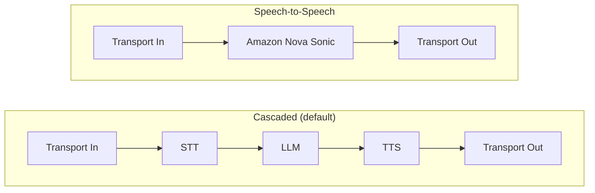

# Feature 001: Speech-to-Speech Pipeline with Amazon Nova Sonic

| Field | Value |
|-------|-------|
| **Type** | Feature |
| **Priority** | P0 |
| **Effort** | Large |
| **Impact** | High |
| **Status** | Implemented |

## Problem Statement

The current voice agent uses a cascaded pipeline architecture: separate STT, LLM, and TTS services wired together sequentially. While flexible, this approach introduces additive latency across each hop -- typically 1.5-2.5s end-to-end. Amazon Nova Sonic is a speech-to-speech foundation model on Amazon Bedrock that processes audio input and produces audio output directly, bypassing the need for separate STT and TTS stages. Supporting both pipeline modes gives users the choice between lowest latency (speech-to-speech) and maximum provider flexibility (cascaded).

## Implementation

The solution adds a configurable `PIPELINE_MODE` that switches between the existing cascaded pipeline and a new speech-to-speech pipeline powered by Amazon Nova Sonic. Both modes share the same transport, tool calling, observability, and session management infrastructure.

Pipecat provides native Nova Sonic support via `AWSNovaSonicLLMService` (a subclass of `LLMService`), so no custom bidirectional streaming code was needed.

### Pipeline Modes

### Configuration

| Variable | SSM Path | Values | Default |
|----------|----------|--------|---------|
| `PIPELINE_MODE` | `/voice-agent/config/pipeline-mode` | `cascaded`, `speech-to-speech` | `cascaded` |

When `PIPELINE_MODE=speech-to-speech`:
- STT and TTS services are not instantiated
- Amazon Nova Sonic replaces the STT + LLM + TTS chain
- Audio sample rates adjust to Nova Sonic requirements (16kHz in, 24kHz out)
- Tool calling registers on the Nova Sonic service via the same `register_function()` interface
- VAD and filler processors are skipped (Nova Sonic handles turn detection internally)
- STT quality and audio quality observers are skipped

### Files Changed

| File | Change |
|------|--------|
| `app/pipeline_ecs.py` | `create_voice_pipeline()` dispatches to `_create_cascaded_pipeline()` or `_create_s2s_pipeline()` based on `pipeline_mode`. Tool registration functions (`_register_tools`, `_register_capabilities`) accept any `LLMService` subclass. |
| `app/services/factory.py` | New `create_s2s_service()` factory resolves AWS credentials from the environment/task role and creates `AWSNovaSonicLLMService`. Voice ID mapping added for Nova Sonic voices. |
| `app/services/config_service.py` | `ProviderConfig` gains `pipeline_mode` field. SSM parameter `/voice-agent/config/pipeline-mode` loaded and refreshed. |
| `app/service_main.py` | `PipelineConfig` construction passes `pipeline_mode` from env var or SSM config. |
| `requirements.txt` | Added `aws-nova-sonic` extra to `pipecat-ai` install. |

### What Stays the Same

- `DailyTransport` -- audio input/output is mode-agnostic
- Tool framework -- `ToolRegistry`, `ToolExecutor`, `ToolContext`, capability detection
- A2A capability agents -- discovered via AWS Cloud Map, registered as tools
- Session management -- `PipelineManager`, `SessionTracker`, task protection
- Call lifecycle -- Lambda bot-runner, `/call` endpoint, room creation
- Infrastructure -- ECS Fargate, NLB, secrets, monitoring stacks

### Audio Sample Rates

| Mode | Input | Output |
|------|-------|--------|
| Cascaded | 8kHz (PSTN native) | 8kHz |
| Speech-to-speech | 16kHz (Nova Sonic requirement) | 24kHz (Nova Sonic output) |

Daily transport handles resampling between PSTN (8kHz) and the configured sample rates automatically.

### Nova Sonic Details

- **Pipecat class**: `pipecat.services.aws.nova_sonic.llm.AWSNovaSonicLLMService`
- **Model ID**: `amazon.nova-sonic-v1:0`
- **API**: Bedrock bidirectional streaming (`invoke-with-bidirectional-stream`)
- **Supported regions**: `us-east-1`, `us-west-2`, `ap-northeast-1`
- **Available voices**: `matthew`, `ruth`, `tiffany`, `amy`
- **Barge-in**: Supported natively -- Nova Sonic handles interruptions without dropping context
- **Tool calling**: Supported via `toolUse` events in the bidirectional stream, compatible with Pipecat's `FunctionCallParams` pattern
