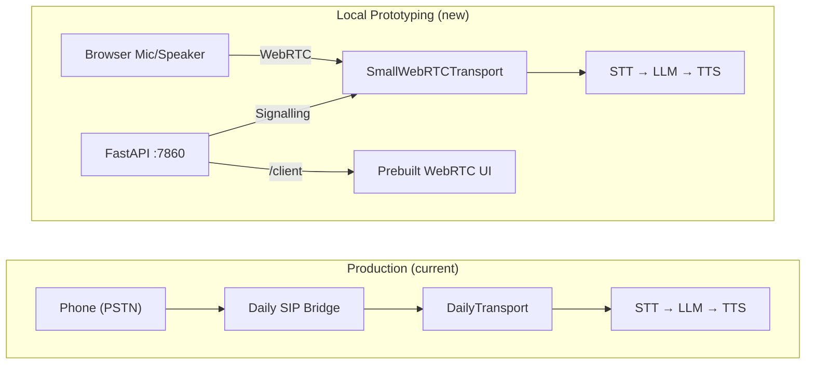
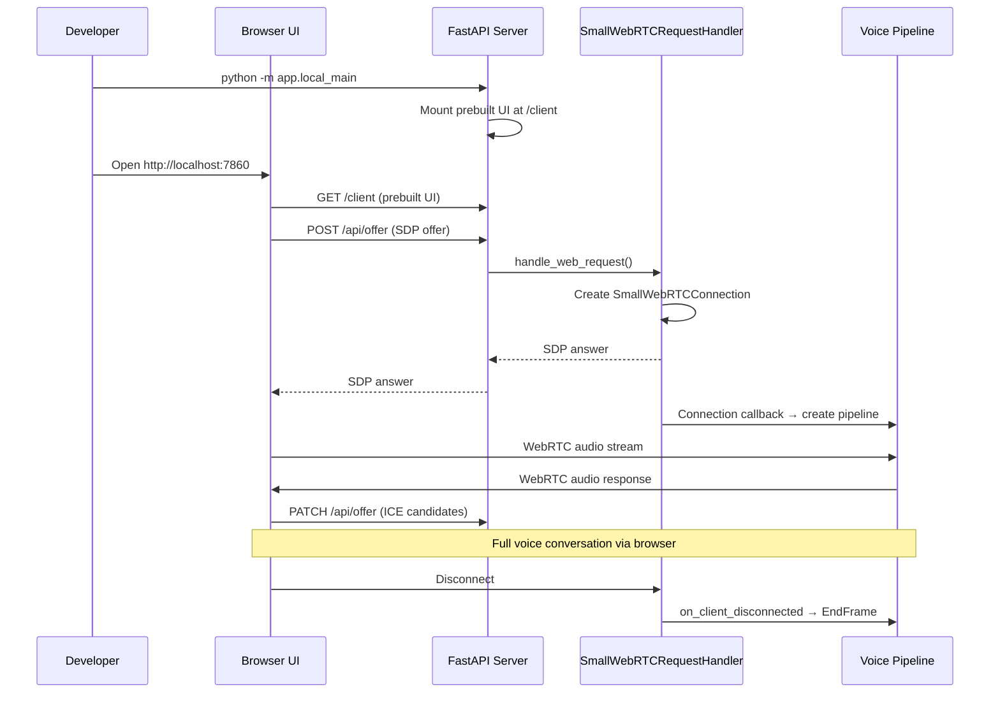

# Feature 002: Local Prototyping with Browser-Based WebRTC

| Field | Value |
|-------|-------|
| **Type** | Enhancement |
| **Priority** | P1 |
| **Effort** | Medium |
| **Impact** | High |
| **Status** | In Progress |

## Problem Statement

Testing the voice agent today requires a complete SIP/PSTN call path: a Daily.co account, a purchased phone number, a configured webhook, and an actual phone call. This creates a high barrier for developers who want to iterate on prompt engineering, tool calling behaviour, or pipeline tuning. There is no way to speak to the agent from a browser on localhost.

Pipecat ships with `SmallWebRTCTransport` and a prebuilt browser client (`pipecat-ai-small-webrtc-prebuilt`) that can run an interactive voice session over WebRTC directly from `http://localhost:7860` -- no Daily account, no phone number, no SIP infrastructure. Adding this as an alternative run mode would let developers prototype and test the full voice pipeline (STT, LLM, TTS, tool calling, A2A capability agents) using only their browser microphone and speakers.

**Prerequisite:** All cloud resources (Bedrock LLM access, Deepgram/Cartesia API keys, and optionally the A2A capability agent stacks) must be fully deployed before local prototyping, since the pipeline still depends on cloud STT, LLM, and TTS services. Only the transport layer (Daily + PSTN) is replaced.

## Proposed Solution

Add a `local` run mode that swaps `DailyTransport` for `SmallWebRTCTransport` and serves a browser UI on localhost. The existing pipeline components (STT, LLM, TTS, tool framework, observers) remain unchanged. A new entrypoint script and a thin FastAPI server handle WebRTC signalling and serve the prebuilt client.

### Architecture



### How It Works



### Key Architecture Changes

1. **New pip extras** -- Add `webrtc` and `runner` extras to `requirements.txt` (development/local only):
   ```
   pipecat-ai[daily,silero,deepgram,cartesia,aws,sagemaker,webrtc,runner]==0.0.102
   ```
   These bring in `aiortc` (WebRTC), `fastapi`, `uvicorn`, and `pipecat-ai-small-webrtc-prebuilt` (browser UI).

2. **New entrypoint** (`app/local_main.py`) -- FastAPI application that:
   - Mounts `SmallWebRTCPrebuiltUI` static files at `/client`
   - Exposes `POST /api/offer` and `PATCH /api/offer` for WebRTC signalling via `SmallWebRTCRequestHandler`
   - On each new WebRTC connection, creates the voice pipeline with `SmallWebRTCTransport` instead of `DailyTransport`
   - Runs via `uvicorn` on port 7860

3. **Pipeline factory generalisation** (`app/pipeline_ecs.py` or new `app/pipeline_local.py`) -- Extract a shared `_build_pipeline_components()` that takes a generic `BaseTransport` and returns the pipeline component list. The existing `create_voice_pipeline()` continues to create `DailyTransport`; a new `create_local_pipeline()` accepts a `SmallWebRTCConnection` and creates `SmallWebRTCTransport`.

4. **Transport-agnostic event handlers** -- Map the SmallWebRTCTransport events to pipeline actions:

   | DailyTransport Event | SmallWebRTCTransport Equivalent | Pipeline Action |
   |---|---|---|
   | `on_first_participant_joined` | `on_client_connected` | Queue greeting prompt |
   | `on_participant_left` | `on_client_disconnected` | Queue `EndFrame` |
   | `on_dialin_ready` | N/A | Skip (no SIP) |
   | `on_dialin_connected` | N/A | Skip (no SIP session) |
   | `on_dialin_stopped` | N/A | Skip |

5. **Sample rate adjustment** -- Browser WebRTC audio is 16 kHz (after pipecat's internal resampling from 48 kHz), not 8 kHz PSTN. The transport params must use `audio_in_sample_rate=16000` and `audio_out_sample_rate=16000`. STT/TTS services already handle multiple sample rates; no service code changes needed.

6. **Tool capability detection** -- The existing `detect_capabilities()` function already handles this correctly:
   - `BASIC` -- available (always)
   - `TRANSPORT` -- available (`SmallWebRTCTransport is not None`)
   - `SIP_SESSION` -- **not available** (no `sip_session_tracker` in local mode)
   - `TRANSFER_DESTINATION` -- not available (no SIP REFER possible)

   This means `get_current_time` and `hangup_call` work; `transfer_to_agent` is automatically excluded. The `detect_capabilities()` type hint should be widened from `Optional["DailyTransport"]` to `Optional["BaseTransport"]`.

7. **ToolContext type widening** -- `ToolContext.transport` type hint changes from `Optional["DailyTransport"]` to `Optional["BaseTransport"]`. Only `transfer_tool.py` actually downcasts to `DailyTransport` for `sip_refer()`, and that tool is excluded in local mode by the capability system.

### Configuration

| Variable | Values | Default | Description |
|----------|--------|---------|-------------|
| `TRANSPORT_MODE` | `daily`, `local` | `daily` | Transport backend selection |
| `LOCAL_PORT` | `1024-65535` | `7860` | Port for local FastAPI server |

No SSM parameter needed -- this is a developer-only local setting via `.env` or environment variable.

### Sample `.env` for Local Prototyping

```env
# Transport
TRANSPORT_MODE=local

# Cloud APIs (required -- must be deployed first)
DEEPGRAM_API_KEY=your-key
CARTESIA_API_KEY=your-key
AWS_REGION=us-east-1
AWS_PROFILE=your-profile

# LLM (uses Bedrock -- requires deployed AWS credentials)
LLM_MODEL_ID=us.anthropic.claude-haiku-4-5-20251001-v1:0

# Optional
ENABLE_TOOL_CALLING=true
ENABLE_FILLER_PHRASES=true
LOCAL_PORT=7860
```

### Developer Workflow

```bash
# 1. Ensure cloud resources are deployed (Bedrock access, API keys configured)
#    See deploy-cloud-api skill for full deployment

# 2. Install local prototyping dependencies
cd backend/voice-agent
pip install -e ".[local]"  # or: pip install pipecat-ai[webrtc,runner]

# 3. Configure environment
cp .env.example .env
# Edit .env: set TRANSPORT_MODE=local and API keys

# 4. Run the local voice agent
python -m app.local_main

# 5. Open browser
open http://localhost:7860
# Click "Connect" in the prebuilt UI to start talking
```

### What Stays the Same

- **Full voice pipeline** -- STT (Deepgram), LLM (Bedrock), TTS (Cartesia) all work identically
- **Tool calling framework** -- `ToolRegistry`, `ToolExecutor`, `ToolContext`, capability-based registration
- **A2A capability agents** -- If deployed and `enable-capability-registry` SSM flag is on, KB/CRM agents are discovered and available
- **Observability** -- `MetricsCollector`, `AudioQualityObserver`, `ConversationObserver` all work (they watch frame types, not transport types)
- **Filler phrases** -- still inject audio during tool execution delays
- **System prompt** -- same prompt engineering, same `ConfigService` loading
- **Production deployment** -- zero changes to ECS, NLB, Lambda, Daily webhook path

### Open Questions

- Should the prebuilt UI dependencies (`fastapi`, `uvicorn`, `aiortc`, `pipecat-ai-small-webrtc-prebuilt`) be split into an optional `[local]` install extra in the project's own `pyproject.toml` / `setup.cfg` to keep the production container image lean?
- Should `local_main.py` support multiple simultaneous browser sessions (useful for testing concurrent calls) or enforce single-session mode via `ConnectionMode.SINGLE`?
- Should we add a `--no-tts` / `--text-only` mode that skips TTS and prints LLM responses to the terminal for faster prompt iteration?
- What is the best way to handle VAD sensitivity differences between browser microphone audio (16 kHz, higher quality) and PSTN audio (8 kHz, compressed)? The `SileroVADAnalyzer` `stop_secs=0.3` tuning may need adjustment.
