# Implementation Plan: A2A Tool Call Latency Optimization

## Overview

Reduce A2A tool call latency from ~5000ms to <2000ms for `search_knowledge_base` and other capability agent calls. The current ~5s round-trip includes: A2A protocol overhead, Strands agent LLM initialization (cold start), Bedrock LLM reasoning within the capability agent, and the actual tool execution (KB retrieval). For a voice pipeline targeting sub-2s E2E latency, this is the dominant bottleneck during tool calls.

**Root Causes (measured):**
1. **Double LLM invocation:** Voice agent LLM decides to call tool -> A2A sends query -> capability agent's Strands LLM (another Bedrock call) reasons about which @tool to invoke -> tool executes -> response returns. The inner LLM call is ~2-3s.
2. **Cold start overhead:** Strands `BedrockModel` and boto3 clients lazy-initialize on first request per container lifecycle.
3. **No connection reuse:** Each `aiohttp.ClientSession` in CRM service is created per-request. A2A connection behavior is opaque (Strands SDK managed).
4. **Sequential tool execution:** When the LLM requests multiple tools simultaneously, they execute one-by-one.
5. **No result caching:** Repeated identical queries trigger full round-trips.

**Target:** <2000ms for KB search via A2A (60% reduction from ~5000ms baseline).

## Architecture

```mermaid
graph TB
    subgraph Current["Current Flow (~5000ms)"]
        VA_LLM1["Voice Agent LLM"] -->|"tool_use(search_knowledge_base)"| A2A1["A2A HTTP POST"]
        A2A1 --> Server1["A2AServer"] --> Strands1["Strands Agent LLM\n(Bedrock invoke ~2-3s)"]
        Strands1 --> Tool1["@tool search_knowledge_base\nBedrock KB retrieve (~500ms)"]
        Tool1 --> Response1["Response back through A2A"]
    end

    subgraph Optimized["Optimized Flow (target <2000ms)"]
        VA_LLM2["Voice Agent LLM"] -->|"tool_use(search_knowledge_base)"| A2A2["A2A HTTP POST"]
        A2A2 --> Server2["A2AServer"] --> Direct["DirectToolExecutor\n(bypass LLM)"]
        Direct --> Tool2["search_knowledge_base\nBedrock KB retrieve (warm client)"]
        Tool2 --> Response2["Cached/direct response"]
    end
```



Key changes:
- **Warm-up**: Pre-initialize Strands agent + boto3 clients on startup
- **Caching**: TTL cache for repeated KB queries within session
- **Connection pooling**: Reuse HTTP sessions for CRM, warm A2A connections
- **DirectToolExecutor**: Bypass inner LLM for single-tool agents
- **Metrics**: Granular timing breakdown per optimization layer

## Architecture Decisions

| # | Decision | Choice | Rationale |
|---|----------|--------|-----------|
| 1 | **Warm-up strategy** | Startup probe call on container init | Eliminates first-call cold start. Strands Agent + BedrockModel + boto3 clients all initialized before first real request. |
| 2 | **Caching layer** | In-memory TTL cache (per-agent process) | Simple, no infrastructure. KB results for identical queries don't change within a session. TTL prevents stale data. |
| 3 | **Cache scope** | Agent-side (capability agent caches tool results) | Caching at the capability agent level avoids the inner LLM call entirely for cache hits. More effective than caching at the voice agent A2A adapter. |
| 4 | **Connection pooling** | `requests.Session` for CRM agent; explore Strands A2AAgent internals for voice agent side | CRM agent currently creates per-call `requests.get/post`. A `Session` reuses TCP connections. A2A client is Strands-managed -- investigate if connection pooling is configurable. |
| 5 | **Parallel tool execution** | `asyncio.gather` in Pipecat tool dispatch | Pipecat dispatches tool handlers sequentially. Wrap concurrent tool_use blocks in `gather`. Only applies when LLM emits multiple tool calls. |
| 6 | **Streaming** | Evaluate `A2AAgent.stream_async()` vs `invoke_async()` | Streaming lets partial results flow back sooner. Spike showed it works but isn't used in production. Evaluate if Pipecat's `result_callback` can handle partial results. |
| 7 | **Metrics granularity** | Sub-phase timing (A2A overhead, agent LLM, tool execution) | Can't optimize what you can't measure. Add timing breakdown to identify which optimizations have the most impact. |
| 8 | **Cache eviction** | TTL-based (60s default) + max-size (100 entries) | Prevent memory growth while keeping hot queries fast. Short TTL ensures data freshness for KB updates. |

## Research Prerequisites

Before starting Phase 1, validate:

- [ ] **R1:** Profile a full A2A KB search call to break down the ~5000ms into: (a) voice agent A2A HTTP overhead, (b) Strands agent LLM reasoning time, (c) actual `client.retrieve()` call time, (d) response serialization. This determines which optimizations yield the most improvement.
- [ ] **R2:** Inspect Strands `A2AAgent` source code to determine if it uses `httpx` or `aiohttp` internally, and whether connection pooling or session reuse is configurable.
- [ ] **R3:** Test whether `A2AAgent.stream_async()` can reduce time-to-first-result vs `invoke_async()`, and whether Pipecat's `result_callback` can accept partial results.
- [ ] **R4:** Benchmark Strands agent warm-up: measure first-call vs second-call latency to quantify cold-start cost of `BedrockModel` and boto3 client initialization.
- [ ] **R5:** Determine if the inner Strands LLM call (capability agent reasoning) can be bypassed or simplified. Since each A2A tool has a single `query: str` parameter and the capability agent usually just passes it to the `@tool`, the inner LLM call may be unnecessary overhead. Investigate `A2AServer` options or direct tool invocation patterns.

## Implementation Steps

### Phase 1: Instrumentation -- Granular Latency Breakdown

Before optimizing, instrument the full call path to identify the highest-impact optimizations.

**1.1 Add sub-phase timing to capability agents**
- [ ] Modify `backend/agents/knowledge-base-agent/main.py`:
  - Add timing around `_get_bedrock_client()` (first call vs cached)
  - Add timing around `client.retrieve()` call
  - Log total `@tool` execution time vs overhead
- [ ] Modify `backend/agents/crm-agent/main.py`:
  - Add timing around `CRMClient` HTTP calls
  - Add timing around each `@tool` function

**1.2 Add A2A round-trip timing breakdown in voice agent**
- [ ] Modify `backend/voice-agent/app/a2a/tool_adapter.py`:
  - Break `elapsed_ms` into: (a) pre-call overhead, (b) `invoke_async()` duration, (c) result extraction
  - Emit as structured log fields for CloudWatch Logs Insights queries
- [ ] Create CloudWatch Logs Insights query templates for latency analysis

**1.3 Fix A2A metrics recording signature**
- [ ] Fix `tool_adapter.py` lines 92-96: `collector.record_tool_execution()` is called with `success=True` but `MetricsCollector.record_tool_execution()` expects `(tool_name, category, status, execution_time_ms)`. Align signatures so A2A tool metrics actually emit correctly.

**1.4 Establish baseline**
- [ ] Deploy instrumented agents
- [ ] Run 20+ test calls and collect timing data
- [ ] Document baseline breakdown in this plan's Progress Log

### Phase 2: Agent Warm-Up -- Eliminate Cold Start

Pre-initialize Strands agent internals and boto3 clients on container startup.

**2.1 KB agent warm-up**
- [ ] Modify `backend/agents/knowledge-base-agent/main.py`:
  - Call `_get_bedrock_client()` at module level (during import / `main()`)
  - After creating the `Agent`, execute a probe call: `agent("warmup")` in a try/except to force `BedrockModel` initialization (Bedrock `invoke_model` called once)
  - Log warm-up duration
  - Ensure A2AServer only starts serving after warm-up completes

**2.2 CRM agent warm-up**
- [ ] Modify `backend/agents/crm-agent/main.py`:
  - Initialize `CRMClient` eagerly (call `_get_crm_client()` at startup)
  - Probe the Strands `Agent` with a warm-up call
  - Optional: pre-warm `requests.Session` with a health check to the CRM API

**2.3 Voice agent A2A client warm-up**
- [ ] Modify `backend/voice-agent/app/a2a/registry.py`:
  - After discovering agents and fetching Agent Cards in `refresh()`, optionally send a lightweight A2A health check or probe to warm any connection pools inside `A2AAgent`
  - Gate behind config: `A2A_WARMUP_ENABLED` (default: `true`)

**2.4 Tests**
- [ ] Unit test: verify warm-up runs before server starts
- [ ] Unit test: verify warm-up failure doesn't prevent server from starting (graceful degradation)
- [ ] Measure: compare first-call latency with and without warm-up

### Phase 3: Result Caching -- Skip Redundant Round-Trips

Cache KB retrieval results at the capability agent level to avoid both the inner LLM call and the Bedrock KB retrieval for repeated queries.

**3.1 KB agent result cache**
- [ ] Add `cachetools` to `backend/agents/knowledge-base-agent/requirements.txt`
- [ ] Modify `search_knowledge_base` tool in `main.py`:
  - Add `TTLCache(maxsize=100, ttl=60)` keyed by normalized query string
  - On cache hit: return cached result immediately (skip Bedrock KB call)
  - On cache miss: execute normally, store result in cache
  - Log cache hit/miss for observability
  - Cache key normalization: lowercase, strip whitespace, collapse spaces

**3.2 A2A adapter-level cache (voice agent side)**
- [ ] Modify `backend/voice-agent/app/a2a/tool_adapter.py`:
  - Add optional `TTLCache` to `create_a2a_tool_handler()`:
    - On cache hit: return cached response text directly (skip A2A call entirely)
    - On cache miss: call A2A agent, cache response
  - Cache keyed by `(skill_id, normalized_query)`
  - Configurable via `A2A_CACHE_TTL_SECONDS` (default: 60) and `A2A_CACHE_MAX_SIZE` (default: 100)
  - Emit `A2ACacheHit` / `A2ACacheMiss` metrics

**3.3 Tests**
- [ ] Unit test: cache hit returns immediately, cache miss calls agent
- [ ] Unit test: cache key normalization
- [ ] Unit test: TTL expiry forces re-fetch
- [ ] Unit test: metrics emitted for cache hit/miss

### Phase 4: Connection Pooling -- Reduce TCP/TLS Overhead

**4.1 CRM agent connection pooling**
- [ ] Modify `backend/agents/crm-agent/crm_client.py`:
  - Replace per-call `requests.get/post` with a shared `requests.Session`
  - Initialize `Session` once in `CRMClient.__init__()` or at module level
  - Session automatically reuses TCP connections with keep-alive

**4.2 Voice agent CRM service session reuse**
- [ ] Modify `backend/voice-agent/app/services/crm_service.py`:
  - Replace per-method `async with aiohttp.ClientSession() as session:` pattern
  - Create a single `aiohttp.ClientSession` in `__init__()` with `aiohttp.TCPConnector(limit=10, keepalive_timeout=30)`
  - Reuse across all methods
  - Add `async close()` method for graceful shutdown

**4.3 A2A client connection investigation**
- [ ] Based on R2 findings, configure Strands `A2AAgent` connection pooling if possible
- [ ] If not configurable, document as a limitation and file upstream issue

**4.4 Tests**
- [ ] Unit test: CRM client reuses session across calls
- [ ] Unit test: CRM service reuses aiohttp session
- [ ] Unit test: graceful session close on shutdown

### Phase 5: Parallel Tool Execution -- Concurrent A2A Calls

When the LLM emits multiple `tool_use` blocks in a single response, execute them concurrently instead of sequentially.

**5.1 Investigate Pipecat tool dispatch mechanism**
- [ ] Identify where Pipecat dispatches tool handlers (likely in `AWSBedrockLLMService` or `BaseAssistantService`)
- [ ] Determine if parallel execution can be added at the Pipecat level or needs a wrapper

**5.2 Implement parallel dispatch wrapper**
- [ ] If Pipecat handles tools one-at-a-time:
  - Create `backend/voice-agent/app/tools/parallel_executor.py`
  - Intercept multiple tool_use blocks, dispatch via `asyncio.gather()`
  - Collect all results, return to LLM in order
  - Preserve error handling per-tool (one failure doesn't cancel others)
- [ ] If Pipecat already supports parallel dispatch, configure and enable

**5.3 Tests**
- [ ] Unit test: two concurrent tool calls execute in parallel (total time ~= max single call)
- [ ] Unit test: one failure doesn't affect other parallel calls
- [ ] Integration test: LLM receives all results correctly

### Phase 6: Streaming Evaluation (Optional)

Based on R3 findings, evaluate whether A2A streaming reduces perceived latency.

**6.1 Evaluate stream_async() viability**
- [ ] If R3 shows stream_async() reduces time-to-first-token significantly:
  - Modify `tool_adapter.py` to use `agent.stream_async(query)` instead of `invoke_async(query)`
  - Accumulate streaming chunks into final response for `result_callback()`
  - Even if Pipecat can't consume partial results, streaming may reduce total time due to HTTP chunked transfer
- [ ] If R3 shows no significant benefit, skip this phase

### Phase 7: Metrics & Validation

**7.1 Enhanced CloudWatch metrics**
- [ ] Add new metrics to `MetricsCollector`:
  - `A2ACacheHitRate` -- percentage of cache hits per tool
  - `A2AOverheadMs` -- time spent in A2A protocol vs. actual tool execution
  - `WarmupDurationMs` -- time to warm up each capability agent
  - `ParallelToolSavingsMs` -- time saved by parallel vs. sequential execution
- [ ] Add CloudWatch dashboard panel for A2A latency breakdown

**7.2 End-to-end validation**
- [ ] Deploy all optimizations behind feature flags
- [ ] Run A/B comparison: baseline vs. optimized
- [ ] Measure and document improvement per optimization:
  - Warm-up: expected -500ms to -1000ms on first call
  - Caching: expected -4500ms on cache hits (skip entire A2A call)
  - Connection pooling: expected -50ms to -100ms per call
  - Parallel execution: expected Nx improvement when N tools concurrent
- [ ] Verify E2E voice latency meets <2s target for KB tool calls

**7.3 Update CLAUDE.md**
- [ ] Document new environment variables:
  - `A2A_CACHE_TTL_SECONDS` (default: 60)
  - `A2A_CACHE_MAX_SIZE` (default: 100)
  - `A2A_WARMUP_ENABLED` (default: true)
- [ ] Update `ToolExecutionTime` metric documentation with new dimensions

## Open Questions

| Question | Impact | Resolution Needed By |
|----------|--------|---------------------|
| Can the inner Strands LLM call be bypassed for simple single-tool agents? | Largest latency reduction (~2-3s). May require Strands SDK changes or a direct-invocation A2A mode. | R5, before Phase 2 |
| Does Strands A2AAgent use httpx or aiohttp internally? Is connection pooling configurable? | Phase 4 connection pooling approach | R2, before Phase 4 |
| Can Pipecat's tool dispatch be modified for parallel execution without forking? | Phase 5 feasibility | Before Phase 5 |
| What is the optimal cache TTL for KB results? Too short = cache misses, too long = stale data. | Phase 3 cache config | During Phase 7 validation |
| Should caching be per-session or global across sessions? | Cache hit rate vs. memory | Phase 3 design |

## Testing Strategy

1. **Micro-benchmarks:** Time each optimization independently (warm-up, cache hit, connection reuse, parallel dispatch).
2. **A/B Testing:** Deploy with feature flags, compare optimized vs. baseline using `ToolExecutionTime` metric.
3. **Regression Tests:** Ensure all existing 404+ tests pass with optimizations enabled.
4. **Load Testing:** Verify cache doesn't cause memory issues under sustained load (100 entries * N agents).
5. **Correctness:** Cache returns same results as uncached calls. Parallel execution produces same results as sequential.
6. **Voice Quality:** E2E SIP test calls to verify filler phrases and latency perception.

## Risks & Mitigations

| Risk | Impact | Mitigation |
|------|--------|------------|
| Warm-up probe call fails (Bedrock throttled / KB not ready) | Agent starts without warm-up, first real call is slow | Graceful degradation: log warning, proceed without warm-up. Agent still functional. |
| Stale cache returns outdated KB content | User gets wrong answer | Short TTL (60s). KB content changes are infrequent. Can add cache invalidation endpoint later. |
| Cache memory growth in long-running containers | OOM risk | `maxsize=100` cap. TTL eviction. Monitor memory metric. |
| Parallel tool execution introduces race conditions | Data corruption or inconsistent state | Tools are stateless/independent by design. Each gets its own args. No shared mutable state. |
| Strands SDK doesn't expose connection pooling config | Phase 4.3 limited | File upstream issue. A2AAgent instance reuse (already cached in AgentRegistry) provides some benefit. |
| Inner LLM call cannot be bypassed | Biggest optimization blocked | Accept ~2-3s floor for A2A calls. Focus on caching (eliminates repeated calls entirely) and warm-up (eliminates cold start). |

## Dependencies

- `dynamic-capability-registry` (in-progress) -- A2A infrastructure this feature optimizes
- `strands-agents[a2a]>=1.27.0` -- Strands SDK for A2A agents
- `cachetools` -- TTL cache implementation (lightweight, well-maintained)
- CloudWatch Logs Insights -- for latency breakdown analysis
- Existing `MetricsCollector` and EMF logging infrastructure

## File Changes

```
Modified:
  backend/agents/knowledge-base-agent/main.py      # Warm-up, timing, caching
  backend/agents/knowledge-base-agent/requirements.txt  # Add cachetools
  backend/agents/crm-agent/main.py                 # Warm-up, timing
  backend/agents/crm-agent/crm_client.py           # Connection pooling (requests.Session)
  backend/voice-agent/app/a2a/tool_adapter.py      # Caching, timing breakdown, fix metrics
  backend/voice-agent/app/a2a/registry.py           # A2A client warm-up
  backend/voice-agent/app/services/crm_service.py   # aiohttp session reuse
  backend/voice-agent/app/observability.py           # New cache/A2A metrics

New:
  backend/voice-agent/app/tools/parallel_executor.py  # Parallel tool dispatch (Phase 5)
  backend/voice-agent/tests/test_a2a_caching.py       # Cache tests
  backend/voice-agent/tests/test_a2a_warmup.py        # Warm-up tests
  backend/voice-agent/tests/test_parallel_executor.py  # Parallel execution tests
```

## Success Criteria

- [ ] Granular latency breakdown available in CloudWatch Logs Insights
- [ ] A2A metrics fix: `tool_adapter.py` correctly emits `ToolExecutionTime` metrics
- [ ] First-call latency reduced by 500-1000ms (warm-up eliminates cold start)
- [ ] Repeated identical queries return in <100ms (cache hit skips A2A entirely)
- [ ] CRM agent HTTP calls reuse TCP connections (measurable via connection count)
- [ ] KB search via A2A: median latency <2000ms (down from ~5000ms baseline)
- [ ] All existing tests pass (404+ tests, no regressions)
- [ ] Feature flags allow per-optimization enable/disable for A/B testing
- [ ] CloudWatch dashboard shows A2A latency improvement trend

## Estimated Effort

| Phase | Effort |
|-------|--------|
| Research prerequisites (R1-R5) | 0.5 day |
| Phase 1: Instrumentation & baseline | 0.5 day |
| Phase 2: Agent warm-up | 1 day |
| Phase 3: Result caching | 1 day |
| Phase 4: Connection pooling | 0.5 day |
| Phase 5: Parallel tool execution | 1 day |
| Phase 6: Streaming evaluation | 0.5 day |
| Phase 7: Metrics & validation | 1 day |
| **Total** | **~6 days** |

Buffer for Strands SDK investigation, edge cases: +1 day
**Risk-adjusted total:** ~7 days (~1.5 weeks)

## Progress Log

| Date | Update |
|------|--------|
| 2026-02-20 | Initial plan created. Identified 5 optimization layers: warm-up, caching, connection pooling, parallel execution, streaming. Analyzed existing codebase: tool_adapter.py, registry.py, KB agent main.py, CRM agent. Found metrics signature mismatch in tool_adapter.py (bug). Target: reduce KB A2A from ~5000ms to <2000ms. |
| 2026-02-20 | **Phases 1-5 implemented.** All 409 voice-agent tests pass. Changes: (1) Sub-phase timing added to KB agent (`search_knowledge_base`), CRM agent (`lookup_customer`, `create_support_case`), A2A tool adapter (invoke/extract breakdown), and AgentRegistry (discover/card-fetch timing). (2) Fixed metrics bug: `tool_adapter.py` now calls `record_tool_execution(tool_name, category="a2a", status, execution_time_ms)` matching MetricsCollector signature. (3) Agent warm-up: KB + CRM agents pre-initialize boto3 clients and probe Strands agent on container start. (4) Two-layer caching: KB agent TTLCache (query→result, 60s TTL, 100 max) + A2A adapter-level TTLCache (skill+query→response, 60s TTL). Cache hits skip entire A2A round-trip. (5) Connection pooling: CRM agent uses `requests.Session`; voice-agent CRM service uses shared `aiohttp.ClientSession` with `TCPConnector(limit=10, keepalive_timeout=30)`. (6) Phase 5 investigation: Pipecat already supports parallel tool dispatch via `_run_parallel_function_calls()` with `create_task()` -- no changes needed. Found Bedrock streaming parser limitation (single tool_use per message) but this is a framework issue. |
| 2026-02-20 | **DirectToolExecutor shipped (commit `a1b83f2`).** Implemented `DirectToolExecutor` in KB agent that bypasses the inner Strands LLM entirely -- calls `search_knowledge_base` directly via `asyncio.to_thread()`. The Strands `Agent` is still created for Agent Card auto-generation but `server.request_handler.agent_executor` is swapped to `DirectToolExecutor`. **Results:** `ToolExecutionTime` reduced from **2,742ms to 323ms** (88% reduction). `AgentResponseLatency` from 1,598ms to 918ms. Well under the 2,000ms target. This pattern is recommended for single-tool agents where query maps directly to tool input. Multi-tool agents (CRM) should keep `StrandsA2AExecutor` for LLM reasoning. Documentation updated across CLAUDE.md, README.md, ARCHITECTURE.md, DEPLOYMENT.md, and new `docs/patterns/capability-agent-pattern.md` developer guide created. |
