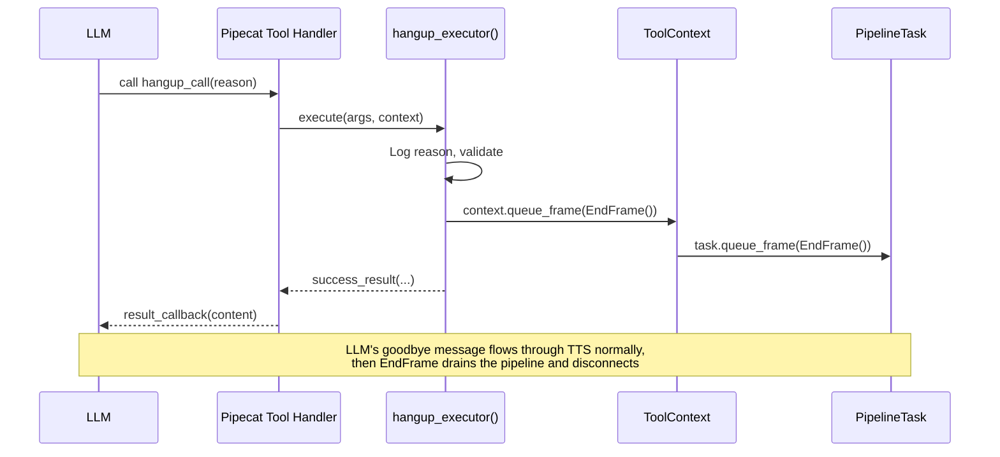

# Implementation Plan: Agent Call Hangup Mechanism

## Overview

Add a `hangup_call` local tool that allows the LLM to programmatically end a call when the conversation reaches a natural conclusion. This follows the established local-tool pattern (see `transfer_tool.py`) and the `create-local-tool` skill workflow.

**Goal:** The LLM can invoke `hangup_call` with a `reason`, and the pipeline gracefully terminates -- the caller hears the LLM's closing message via normal TTS flow, then the call disconnects.

**Key Constraint:** Today, `ToolContext` has no access to `PipelineTask.queue_frame()`, which is required to push an `EndFrame` through the pipeline. The `task` object is created *after* `_register_tools()` runs (line 421 vs line 271 in `pipeline_ecs.py`). We need a deferred-callback mechanism to bridge this gap.

## Architecture



## Architecture Decisions

| # | Decision | Rationale |
|---|----------|-----------|
| 1 | Add `queue_frame` callback to `ToolContext`, not pass `PipelineTask` directly | Minimal surface area -- tools should not have full task control. A single callback is sufficient and testable. |
| 2 | Use `EndFrame` (not `CancelFrame`) | `EndFrame` lets in-flight audio (the goodbye message) drain before disconnect. `CancelFrame` would abort immediately. |
| 3 | Tool requires only `TRANSPORT` capability | Matches the existing catalog comment (`# hangup_tool, # requires={TRANSPORT}`). No SIP-specific requirement -- works for both SIP and WebRTC. |
| 4 | The tool returns success *before* the call actually ends | The LLM generates a goodbye response that flows through TTS. The `EndFrame` queued by the tool drains after that response completes. |
| 5 | Wire `queue_frame` via a deferred setter, not constructor arg | `_register_tools()` runs at line 271 but `task` is created at line 421. We pass a mutable container (or setter) that gets populated once `task` exists. |
| 6 | `queue_frame` is `Optional` on `ToolContext` with `None` default | Backward-compatible -- existing tools and tests don't need to supply it. Only the hangup tool uses it. |

## Implementation Steps

### Phase 1: Extend ToolContext with `queue_frame` callback

- [x] Add `queue_frame: Optional[Callable[[Any], Awaitable[None]]]` field to `ToolContext` dataclass in `app/tools/context.py`
- [x] Add TYPE_CHECKING import for `Frame` from pipecat
- [x] Default to `None` for backward compatibility

### Phase 2: Wire `queue_frame` in the pipeline

- [x] In `pipeline_ecs.py`, create a mutable container `task_ref: Dict[str, Optional[PipelineTask]] = {"task": None}` before `_register_tools()` is called
- [x] Define a `queue_frame` async closure that delegates to `task_ref["task"].queue_frame(frame)` with a guard for `None`
- [x] Pass this closure to `_register_tools()` as a new parameter
- [x] Inside `make_tool_handler()`, pass the closure when constructing `ToolContext`
- [x] After `task = PipelineTask(...)` is created (line 421), assign `task_ref["task"] = task`
- [x] Apply the same wiring in `_register_capabilities()` for the A2A code path

### Phase 3: Create the hangup tool

- [x] Create `backend/voice-agent/app/tools/builtin/hangup_tool.py` following the `create-local-tool` skill template
- [x] Tool name: `hangup_call`
- [x] Category: `ToolCategory.SYSTEM`
- [x] Parameters: `reason` (string, required) -- why the call is ending
- [x] Capability: `requires=frozenset({PipelineCapability.TRANSPORT})`
- [x] Executor logic:
  1. Extract `reason` from arguments
  2. Log the hangup request with `context.call_id` and reason
  3. Guard: if `context.queue_frame` is None, return `error_result`
  4. Queue `EndFrame()` via `await context.queue_frame(EndFrame())`
  5. Return `success_result` with reason and confirmation message
- [x] Set `timeout_seconds=5.0` (hangup is fast)
- [x] Write a clear LLM-facing `description` that tells the model when to use it (after issue resolved, after goodbye, not prematurely)

### Phase 4: Register in catalog

- [x] Import `hangup_tool` in `app/tools/builtin/catalog.py`
- [x] Add to `ALL_LOCAL_TOOLS` list (uncomment the placeholder and replace with real import)
- [x] Export from `app/tools/builtin/__init__.py`

### Phase 5: Tests

- [x] Create `backend/voice-agent/tests/test_hangup_tool.py`
- [x] Test: `ToolDefinition` name is `hangup_call`
- [x] Test: requires `{PipelineCapability.TRANSPORT}`
- [x] Test: tool is in `ALL_LOCAL_TOOLS` catalog
- [x] Test: executor returns success when `queue_frame` is provided (mock the callback, assert it was called with `EndFrame`)
- [x] Test: executor returns error when `queue_frame` is None
- [x] Test: executor logs the reason
- [x] Run existing test suite to verify no regressions: `pytest tests/ -v`

### Phase 6: Update guide documentation

- [x] Update `docs/guides/adding-a-local-tool.md` to document the new `queue_frame` field on `ToolContext` in the capability table
- [x] Update the "existing tools" reference table to include `hangup_call`

## Testing Strategy

| Level | What | How |
|-------|------|-----|
| Unit | `hangup_tool.py` executor logic | Mock `queue_frame` callback, assert `EndFrame` queued, assert success/error results |
| Unit | `ToolContext` backward compat | Existing tests pass without supplying `queue_frame` |
| Unit | Capability gating | Verify tool requires `{TRANSPORT}`, test filtering with/without capability |
| Integration | Pipeline wiring | `_register_tools` passes `queue_frame` to handler, handler passes to `ToolContext` |
| Manual | End-to-end call | Dial in via SIP, have conversation, confirm LLM triggers hangup after goodbye, call disconnects |

## Risks & Mitigations

| Risk | Likelihood | Impact | Mitigation |
|------|-----------|--------|------------|
| LLM hangs up prematurely | Medium | High | Craft a very specific `description` that instructs the LLM to only hang up after confirming the issue is resolved and saying goodbye |
| EndFrame races with TTS | Low | Medium | `EndFrame` drains in-flight frames by design -- the goodbye audio completes before disconnect |
| `task_ref` is None when tool executes | Very Low | High | Guard in executor returns `error_result`; guard in closure logs warning. Task is always created before any participant joins. |
| Breaking existing tests | Low | Low | `queue_frame` defaults to `None` -- fully backward compatible |

## Dependencies

- Pipecat `EndFrame` (already imported in `pipeline_ecs.py`)
- Existing tool framework (`ToolDefinition`, `ToolContext`, `ToolResult`, `ToolRegistry`)
- No CDK/infrastructure changes required
- No new pip dependencies

## File Structure

```
backend/voice-agent/
├── app/tools/
│   ├── context.py                          # MODIFY: add queue_frame field
│   └── builtin/
│       ├── __init__.py                     # MODIFY: export hangup_tool
│       ├── catalog.py                      # MODIFY: add hangup_tool to ALL_LOCAL_TOOLS
│       └── hangup_tool.py                  # NEW: hangup_call tool
├── app/pipeline_ecs.py                     # MODIFY: wire queue_frame callback
└── tests/
    └── test_hangup_tool.py                 # NEW: unit tests
```

## Success Criteria

- [ ] LLM can invoke `hangup_call` tool after conversation concludes
- [ ] Caller hears the goodbye message before the call disconnects
- [ ] Call resources are cleaned up (EndFrame triggers normal teardown)
- [ ] Tool is only registered when `TRANSPORT` capability is present
- [ ] Tool can be disabled via SSM `/voice-agent/config/disabled-tools`
- [ ] All existing tests pass with no regressions
- [ ] New test coverage for hangup tool executor and capability gating

## Progress Log

| Date | Phase | Notes |
|------|-------|-------|
| 2026-02-23 | Plan | Research complete, plan created |
| 2026-02-23 | Phase 1-6 | All phases implemented. 413 tests passing (19 new). |
