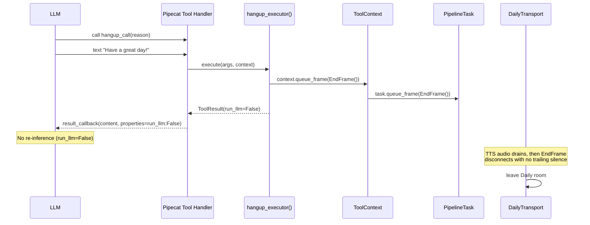

# Agent Call Hangup Mechanism - Shipped

## Summary

Implemented a `hangup_call` local tool that allows the LLM to programmatically end a call when the conversation reaches a natural conclusion. The caller hears the goodbye message, then the call disconnects cleanly. Two post-implementation optimizations eliminated ~4s of dead air after the goodbye message.

## What Was Built

### Core Implementation
- **Hangup Tool** (`hangup_tool.py`): `hangup_call(reason)` queues an `EndFrame` via a deferred `queue_frame` callback on `ToolContext`
- **ToolContext Extension** (`context.py`): Added `queue_frame: Optional[QueueFrameFunc]` field for pipeline frame injection
- **Pipeline Wiring** (`pipeline_ecs.py`): Deferred setter pattern bridges tool registration (before task exists) with runtime execution (after task exists)
- **Catalog Registration** (`catalog.py`): Added to `ALL_LOCAL_TOOLS` with `requires={TRANSPORT}` capability gating

### Disconnect Optimization: Suppress LLM Re-inference
- **ToolResult Extension** (`result.py`): Added `run_llm: Optional[bool]` field to control post-tool LLM behavior
- **FunctionCallResultProperties** (`pipeline_ecs.py`): Handler passes `run_llm=False` to Pipecat's result callback, preventing a redundant ~2s LLM round-trip after hangup
- Eliminated `Unable to send messages before joining` errors from post-disconnect LLM calls

### Disconnect Optimization: Remove Trailing Silence
- **Transport Config** (`pipeline_ecs.py`): Set `audio_out_end_silence_secs=0` on `DailyParams`, removing the default 2s silence padding that Pipecat appends after the final audio frame

## Testing Results

### Unit Tests: 419 passing (20 new for hangup, 6 new for run_llm)

### Live Call Tests (3 iterations)

| Call | Hangup-to-Pipeline-Finish | Issues |
|------|--------------------------|--------|
| 1 (baseline) | 3.75s | Redundant LLM call (~2s), 2s trailing silence, `Unable to send` errors |
| 2 (run_llm fix) | 3.93s | Redundant LLM eliminated, but 2s silence still present |
| 3 (silence fix) | 1.61s | Both optimizations active, clean disconnect |

### Server-Side Disconnect Timeline (Final)

```
+0.000s  hangup_call executes, EndFrame queued
+0.007s  STT BiDi session closed
+0.441s  TTS BiDi session closed
+1.597s  Left Daily room
+1.609s  Pipeline finished
```

Remaining delay after pipeline finishes (~5-6s until phone shows "call ended") is PSTN/SIP signaling teardown -- outside application control.

## Quality Gates

### Security Review: PASS
- 3 LOW advisory findings (not blocking): queue_frame type allowlist, reason length cap, per-session hangup latch
- 5 INFO findings (positive): run_llm safe, silence config safe, task_ref safe, argument validation present, registry locking present

### QA Validation: PASS
- 419/419 tests passing, 0 failures
- Implementation consistency verified across all files
- 4 minor coverage gaps noted (informational only)

## Architecture



## Files Changed

```
backend/voice-agent/
├── app/tools/
│   ├── context.py                          # Added queue_frame field
│   ├── result.py                           # Added run_llm field to ToolResult
│   └── builtin/
│       ├── __init__.py                     # Export hangup_tool
│       ├── catalog.py                      # Added to ALL_LOCAL_TOOLS
│       └── hangup_tool.py                  # NEW: hangup_call tool
├── app/pipeline_ecs.py                     # Wiring, FunctionCallResultProperties, DailyParams
└── tests/
    ├── test_hangup_tool.py                 # NEW: 20 tests
    ├── test_tool_executor.py               # 4 new run_llm tests
    └── test_tool_integration.py            # Updated mock_callback signature
```

## Configuration

- **Capability Gating**: Tool requires `TRANSPORT` capability (auto-detected when DailyTransport present)
- **SSM Disable**: Can be disabled via `/voice-agent/config/disabled-tools` = `hangup_call`
- **No new environment variables** required
- **No infrastructure changes** required

## Success Criteria

- [x] LLM can invoke `hangup_call` tool after conversation concludes
- [x] Caller hears the goodbye message before the call disconnects
- [x] Call resources are cleaned up (EndFrame triggers normal teardown)
- [x] Tool is only registered when `TRANSPORT` capability is present
- [x] Tool can be disabled via SSM `/voice-agent/config/disabled-tools`
- [x] All existing tests pass with no regressions
- [x] New test coverage for hangup tool executor and capability gating

## Known Limitations

- **PSTN teardown latency**: ~5-6s between server-side disconnect and phone showing "call ended" is carrier-dependent, outside application control
- **AWS CRT race condition**: Pre-existing `InvalidStateError: CANCELLED` during BiDi teardown (tracked in fix-aws-crt-bidi-teardown-race)
- **Observer event spam**: Duplicate `bot_started/stopped_speaking` events (tracked in fix-observer-event-spam)
