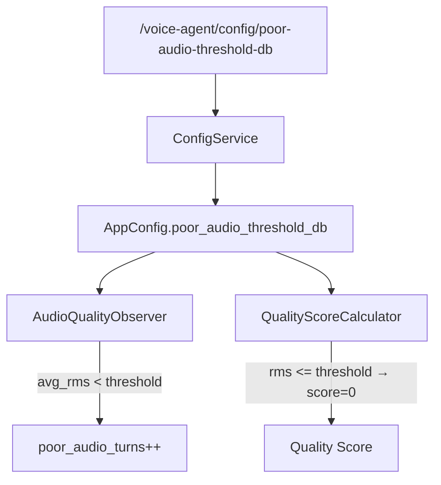
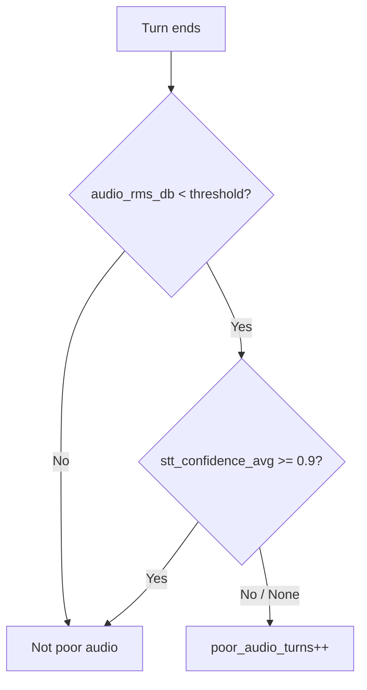

# Implementation Plan: Audio Quality Threshold Tuning

## Overview

The current `POOR_AUDIO_THRESHOLD_DB = -55` was calibrated for WebRTC browser audio. PSTN/SIP dial-in calls naturally have lower signal levels (-62 to -75 dB RMS for normal speech), causing nearly every turn to be flagged as "poor audio." This makes the metric useless for detecting actual quality problems.

This fix lowers the default threshold to a PSTN-appropriate value, makes it configurable via SSM parameter, and ensures all three locations where `-55` is referenced stay in sync through a single source of truth.

## Architecture



## Implementation Steps

### Step 1: Add SSM Parameter and Config Plumbing

- [x] Add `poor_audio_threshold_db` field to `AppConfig` dataclass in `config_service.py`
  - Type: `float`, default: `-70.0`
- [x] Add SSM parameter loading in `ConfigService._build_config()` for path `/voice-agent/config/poor-audio-threshold-db`
  - Parse as float with fallback to `-70.0`
- [x] ~~Add SSM parameter definition in `infrastructure/src/ssm-parameters.ts`~~ Not needed -- that file is for cross-stack output references, not runtime config params
- [x] Add `POOR_AUDIO_THRESHOLD_DB` environment variable support as fallback (for local dev without SSM)

### Step 2: Update AudioQualityObserver to Accept Configurable Threshold

- [x] Change `AudioQualityObserver.__init__()` to accept an optional `poor_audio_threshold_db: float` parameter
  - Default to `-70.0` if not provided
  - Store as `self._poor_audio_threshold_db` instance variable
- [x] Replace `self.POOR_AUDIO_THRESHOLD_DB` class constant usage in `_handle_speech_stop()` with `self._poor_audio_threshold_db`
- [x] Keep the class constant `DEFAULT_POOR_AUDIO_THRESHOLD_DB = -70.0` updated as documentation/fallback but prefer the instance value

### Step 3: Update QualityScoreCalculator to Use Shared Threshold

- [x] Change `QualityScoreCalculator.THRESHOLDS["poor_audio_db"]` from `-55` to `-70`
- [x] Add a class method `configure(poor_audio_db: float)` to allow runtime override from config
- [x] Ensure `_score_audio_quality()` uses the configured threshold

### Step 4: Wire Config Through Pipeline

- [x] In `pipeline_ecs.py`, read the threshold from config when creating `AudioQualityObserver`
  - Pass `poor_audio_threshold_db=config.poor_audio_threshold_db` to the constructor
- [x] Pass the same value to `QualityScoreCalculator.configure()` at pipeline startup

### Step 5: Update CDK Hardcoded References

- [x] Update dashboard annotation in `voice-agent-monitoring-construct.ts`
  - Change `value: -55` to `value: -70` for the "Poor Quality Threshold" annotation
- [x] Update CloudWatch Insights query filter in `voice-agent-monitoring-construct.ts`
  - Change `audio_rms_db < -55` to `audio_rms_db < -70`

### Step 6: Update Tests

- [x] Update `test_observability_metrics.py` tests that assert against the `-55` threshold
  - Update expected threshold values to `-70`
  - Add test: observer uses custom threshold when provided
  - Add test: observer uses default `-70` when no threshold provided
  - Add test: poor audio not flagged for normal PSTN levels (-62 to -75 dB)
- [x] Add config service test for `poor_audio_threshold_db` field parsing
- [x] Add test that `QualityScoreCalculator` respects configured threshold

### Step 7: Update Documentation

- [x] Update `AGENTS.md` environment variable table to include `POOR_AUDIO_THRESHOLD_DB`
- [x] Update the observability section noting the threshold change from -55 to -70

## Technical Decisions

### 1. New Default Threshold: -70 dB

The observed data shows normal PSTN speech at -62 to -75 dB RMS. Setting the threshold at -70 dB means:
- Normal PSTN speech (-62 dB) will **not** be flagged as poor
- Genuinely degraded audio (heavy noise, near-silence below -75 dB) **will** be flagged
- The value sits between "clearly fine" (-62) and "clearly bad" (-80+), giving reasonable sensitivity

### 2. Single Threshold (Not Transport-Dependent)

The idea.md suggests separate WebRTC vs SIP/PSTN thresholds. We choose a single threshold for now because:
- **Simplicity**: One configurable value is easier to reason about and tune
- **The project currently only uses PSTN dial-in**: WebRTC-only sessions are not a primary use case
- **SSM-configurable**: Operators can adjust without code changes if needed
- **Future option**: Transport-aware thresholds can be added later if WebRTC becomes a priority

### 3. SSM Parameter with Environment Variable Fallback

Follow the existing config pattern: SSM is the primary source, with an env var fallback for local development. This keeps the config service as the single entry point.

### 4. Keep CDK Values Static

The CDK dashboard annotation and Insights query use a static `-70` value rather than reading from SSM at synth time. This is acceptable because:
- Dashboard annotations are visual aids, not alarm thresholds
- The Insights query is a convenience, not a critical alert
- Parameterizing CDK values for this adds complexity without meaningful benefit

## Testing Strategy

### Unit Tests

1. **AudioQualityObserver threshold tests** (`test_observability_metrics.py`):
   - Audio at -62 dB (normal PSTN) with default threshold: NOT flagged as poor
   - Audio at -75 dB (degraded) with default threshold: flagged as poor
   - Custom threshold override: `-55` flags -62 dB audio, `-80` does not flag -75 dB audio
   - Backward compatibility: observer works when no threshold parameter is passed

2. **QualityScoreCalculator tests**:
   - Score at -62 dB with new threshold: > 0.0 (was 0.0 before this change)
   - Score at -30 dB: 1.0 (unchanged)
   - Score at -70 dB: 0.0 (boundary)
   - `configure()` method updates threshold correctly

3. **ConfigService tests**:
   - SSM parameter `/voice-agent/config/poor-audio-threshold-db` parsed correctly
   - Missing SSM parameter defaults to -70.0
   - Invalid SSM value falls back to -70.0

### Manual Validation

1. Deploy and place a PSTN test call
2. Verify `poor_audio_turns` is 0 (or very low) for normal speech
3. Verify CloudWatch dashboard annotation shows -70 dB line
4. Verify Insights query only returns genuinely degraded turns

## Risks & Mitigations

| Risk | Probability | Impact | Mitigation |
|------|-------------|--------|------------|
| -70 dB too lenient, misses real problems | Low | Medium | SSM-tunable; monitor first few calls after deploy and adjust |
| Existing alarms/dashboards show stale threshold | Low | Low | CDK values updated in same PR; no runtime drift |
| Config parsing error silently uses wrong threshold | Low | Medium | Unit test for config parsing; log the active threshold at pipeline start |
| QualityScoreCalculator diverges from observer | Medium | Low | Both read from same config source; test covers sync |

## Success Criteria

- [ ] Normal PSTN calls (avg RMS -62 to -68 dB) report 0 poor audio turns
- [ ] Quiet but clear PSTN audio (RMS -75 to -88 dB, STT confidence > 0.9) NOT flagged as poor
- [ ] True silence / dead air (RMS < -70 dB, no STT confidence) IS flagged as poor
- [ ] Genuinely degraded calls (low RMS + low STT confidence) are still detected
- [ ] Threshold is changeable via SSM without redeployment
- [ ] All existing tests pass with updated threshold values
- [ ] Dashboard annotation reflects new threshold
- [ ] Per-turn RMS distribution (min/max/stddev) visible in logs and CloudWatch

## Follow-Up: RMS Distribution Metrics

After deploying the initial threshold change, false positives persisted. Rather than
blindly loosening the threshold further, per-turn RMS distribution metrics were added
to enable data-driven threshold tuning.

### New Per-Turn Metrics

| Metric | CloudWatch Name | Description |
|--------|-----------------|-------------|
| `audio_rms_min_db` | `AudioRMSMin` | Quietest audio frame during speech (dBFS) |
| `audio_rms_max_db` | `AudioRMSMax` | Loudest audio frame during speech (dBFS) |
| `audio_rms_stddev_db` | `AudioRMSStdDev` | Standard deviation of per-frame RMS (dBFS) |

These appear in every `turn_completed` structured log and as CloudWatch EMF metrics.
The dashboard "Audio Quality (dBFS)" widget shows RMS Min and RMS Max alongside the
existing Avg RMS, creating a visible band that reveals per-turn audio level spread.

### Analysis Query

After deploying, run this CloudWatch Insights query to analyze audio levels:

```
fields @timestamp, call_id, turn_number, audio_rms_db, audio_rms_min_db, audio_rms_max_db, audio_rms_stddev_db, stt_confidence_avg
| filter event = "turn_completed" and audio_rms_db is not null
| sort audio_rms_db asc
| limit 100
```

This reveals whether "poor" turns have consistently low audio or high variance with
occasional quiet frames dragging the average down, and whether low RMS correlates with
low STT confidence (actual quality problems) or not (false positives needing threshold
adjustment).

## Follow-Up: Dual-Signal Poor Audio Detection (Phase 3)

Real call data analysis (call `665a8ad0`, 7 turns) revealed that STT confidence is
0.997-0.999 even at -88 dBFS. Deepgram transcribes PSTN audio perfectly regardless of
signal level. Only true silence (-96 dBFS with no STT output) is an actual problem.

This means RMS-only detection produces false positives on PSTN: audio is "quiet" by the
numbers but perfectly intelligible. To fix this, poor audio detection was changed from a
single-signal (RMS only) to a dual-signal approach (RMS + STT confidence).

### Dual-Signal Detection Logic

A turn is flagged as poor audio only when **BOTH** conditions are met:

1. **Audio RMS is below threshold** (default -70 dBFS) — audio is objectively quiet
2. **STT confidence is absent or low** — `stt_confidence_avg` is `None` OR below 0.9

This prevents false positives where audio is quiet but Deepgram still transcribes
perfectly (e.g., PSTN audio at -62 to -88 dBFS with 0.997+ confidence).



### Key Design Decisions

1. **Detection moved from observer to `MetricsCollector.end_turn()`**: Frame timing is
   critical — `UserStoppedSpeakingFrame` fires BEFORE `TranscriptionFrame`, so at
   `_handle_speech_stop()` time, `stt_confidence_avg` is still `None`. The dual-signal
   check must happen in `end_turn()` where all observer data is available.

2. **Threshold wired through factory**: `create_metrics_collector()` now accepts
   `poor_audio_threshold_db` and passes it to `MetricsCollector.__init__()`.
   `service_main.py` reads the threshold from `ConfigService` and passes it at
   collector creation time.

3. **STT confidence threshold of 0.9**: Based on real call data where even quiet PSTN
   audio yields 0.997+ confidence. A threshold of 0.9 is conservative — only truly
   degraded or absent transcriptions trigger poor audio flagging.

### Implementation Details

- `AudioQualityObserver._handle_speech_stop()` no longer calls `record_poor_audio_turn()`.
  It only records RMS averages and distribution stats.
- `MetricsCollector.__init__()` accepts `poor_audio_threshold_db` (default -70.0) and
  `poor_audio_min_confidence` (default 0.9).
- `MetricsCollector.end_turn()` performs the dual-signal check after all observer data
  is populated on the current turn.
- `create_metrics_collector()` factory passes `poor_audio_threshold_db` through.
- `service_main.py` reads the threshold from `ConfigService.config.audio.poor_audio_threshold_db`.

### Test Coverage

New test class `TestDualSignalPoorAudioDetection` covers:
- Low RMS + low STT confidence = poor audio (both signals agree)
- Low RMS + absent STT confidence = poor audio (true silence/dead air)
- Low RMS + high STT confidence = NOT poor audio (false positive avoided)
- Normal RMS + low STT confidence = NOT poor audio (RMS is fine)
- Normal RMS + no STT = NOT poor audio
- No audio data at all = NOT poor audio
- True silence (-96 dBFS) with no STT = poor audio
- STT confidence exactly at 0.9 threshold = not poor (boundary)
- Custom threshold used by MetricsCollector
- Dual-signal across multiple turns (correct counting)

Existing tests updated:
- `test_poor_audio_turn_recorded` — now calls `end_turn()` for dual-signal
- `test_poor_audio_counted_once_per_turn` — now calls `end_turn()`
- `test_custom_threshold_overrides_default` — passes threshold to both collector and observer
- `TestCreateMetricsCollector` — new tests for `poor_audio_threshold_db` passthrough

## File Changes Summary

### Modified Files

- `backend/voice-agent/app/observability.py` - Update threshold default, accept configurable value in AudioQualityObserver and QualityScoreCalculator; add RMS distribution stats (min/max/stddev) to TurnMetrics, MetricsCollector, AudioQualityObserver, and EMF emission; move poor audio detection from observer to `MetricsCollector.end_turn()` with dual-signal logic; update `create_metrics_collector()` factory to pass threshold
- `backend/voice-agent/app/services/config_service.py` - Add `poor_audio_threshold_db` to AppConfig, SSM loading
- `backend/voice-agent/app/pipeline_ecs.py` - Pass threshold from config to observer and score calculator
- `backend/voice-agent/app/service_main.py` - Pass `poor_audio_threshold_db` from config to `create_metrics_collector()`
- `infrastructure/src/constructs/voice-agent-monitoring-construct.ts` - Update -55 to -70 in dashboard annotation and Insights query; add AudioRMSMin/Max to dashboard widget
- `backend/voice-agent/tests/test_observability_metrics.py` - Update threshold assertions, add threshold config tests, add RMS distribution tests, add `TestDualSignalPoorAudioDetection` class, update `TestCreateMetricsCollector` for threshold passthrough
- `backend/voice-agent/tests/test_comprehensive_observability.py` - Update QualityScoreCalculator tests for -70 threshold, add configure() test
- `backend/voice-agent/tests/test_a2a_pipeline_integration.py` - Add audio threshold config service tests
