# Call Flow Visualizer Real-Time Updates

## Problem Statement

The Call Flow Visualizer currently shows a static snapshot of call data
that requires manual page refresh to see new information. On the call
list page, new calls do not appear until the user clicks "Refresh." On
the call timeline page, events for an active call are frozen at
whatever was loaded when the page was opened. This creates two concrete
problems:

1. **Active call monitoring is impossible.** When debugging a live
   call, the operator must repeatedly refresh the timeline page to see
   new events as they happen (conversation turns, tool invocations,
   barge-ins). By the time they refresh, the interesting moment may
   have scrolled by, and there is no indication that new data exists.

2. **The call list goes stale.** During a test session or demo, the
   operator has to remember to refresh the list to see new calls that
   have started or completed. There is no visual cue that the list is
   out of date.

The result is that the Visualizer is useful only for post-hoc review
of completed calls, not for live observation -- which is where the
debugging need is most urgent.

## Why This Matters

- **Live debugging** -- When something goes wrong on a call (long
  silence, unexpected tool failure, bad KB answer), the operator needs
  to see events as they happen, not seconds later after a manual
  refresh.

- **Demo and stakeholder experience** -- Showing a call flow that
  populates in real time as someone speaks is compelling and builds
  confidence in the platform.

- **Parity with telephony tooling** -- Traditional IVR monitoring
  tools show call state in real time. A voice agent debugging tool
  should do the same.

## Architecture

### Event Flow

Events already flow from the voice agent through CloudWatch Logs into
the call events DynamoDB table via the ingester Lambda. The real-time
layer adds a second path out of DynamoDB: a stream-triggered fan-out
Lambda that pushes events to connected browsers via an API Gateway
WebSocket API.

```mermaid
graph LR
    VA[Voice Agent<br/>ECS Tasks] -->|structured logs| CW[CloudWatch Logs]
    CW -->|subscription filter| IL[Ingester Lambda]
    IL -->|BatchWriteItem| DDB[(Call Events<br/>DynamoDB Table)]

    DDB -->|DynamoDB Streams| FL[Fan-out Lambda]
    FL -->|post to connections| WS[API Gateway v2<br/>WebSocket API]
    WS <-->|wss://| Browser

    Browser -->|REST /api/*| CF[CloudFront]
    CF -->|initial load| APIG[REST API Gateway]
    APIG --> QL[Query Lambda]
    QL --> DDB
```



### Why API Gateway WebSocket API

| Criterion | API GW WebSocket | SSE (Fargate) | AppSync Subscriptions |
|-----------|-----------------|---------------|----------------------|
| Latency | Sub-second | Sub-second | Sub-second |
| Infra complexity | Moderate -- managed service, no long-lived compute | High -- requires Fargate task, ALB, health checks | Moderate -- but adds GraphQL dependency |
| Connection management | Built-in -- $connect/$disconnect routes with connectionId | Manual -- must track connections in application code | Managed -- but opaque |
| Fan-out model | Lambda posts to specific connectionIds via `@connections` API | Application iterates over SSE connections in-process | Subscription filters on mutation type |
| CloudFront compatibility | Supported via WebSocket behavior (`wss://`) | Works natively over HTTP | Requires separate AppSync endpoint |
| Cost at low volume | ~$0 (connection-minutes + messages, free tier covers light use) | ~$15/mo minimum for always-on Fargate task | Per-operation pricing, comparable to WebSocket |
| Fits existing stack | Yes -- already using API Gateway v1 for REST; v2 is the same service family | Adds new compute layer (Fargate task) outside current pattern | Adds entirely new service (AppSync) |

API Gateway WebSocket API is the right fit: it is a managed service
with built-in connection tracking, integrates naturally with Lambda for
fan-out, requires no long-lived compute, and supports CloudFront
WebSocket upgrade.

### Component Design

#### 1. WebSocket API (API Gateway v2)

Three routes:

- **$connect** -- Validates request, stores `connectionId` in a
  connections DynamoDB table with a TTL. No subscription yet.

- **$disconnect** -- Removes `connectionId` from connections table.

- **subscribe** -- Client sends `{"action": "subscribe", "channel":
  "calls"}` or `{"action": "subscribe", "channel": "call",
  "call_id": "abc-123"}`. Lambda writes a subscription record:
  `PK=CHANNEL#calls, SK=CONN#{connectionId}` or
  `PK=CALL#{call_id}, SK=CONN#{connectionId}`.

#### 2. Connections Table (DynamoDB)

| PK | SK | Attributes |
|----|----|-----------|
| `CHANNEL#calls` | `CONN#{connectionId}` | `ttl`, `connectedAt` |
| `CALL#{call_id}` | `CONN#{connectionId}` | `ttl`, `connectedAt` |

TTL ensures stale connections are cleaned up even if `$disconnect`
is missed (e.g., browser crash). TTL = 2 hours.

#### 3. Fan-out Lambda (DynamoDB Streams trigger)

Triggered by INSERT events on the call events table. For each new
event:

1. Determine the `call_id` from the event's PK (`CALL#{call_id}`).
2. Query connections table for `PK=CALL#{call_id}` (timeline
   subscribers) and `PK=CHANNEL#calls` (call list subscribers).
3. Post the event payload to each `connectionId` via the API Gateway
   Management API (`@connections` endpoint).
4. If a `410 Gone` response is returned (stale connection), delete
   the connection record.

The fan-out Lambda processes stream records in batches. For the call
list channel, it sends a lightweight summary (call_id, event_type,
timestamp, disposition) rather than the full event payload.

#### 4. Frontend WebSocket Integration

**Connection lifecycle:**

```
Page load
  |-> REST GET /api/calls (or /api/calls/{id}) -- initial data
  |-> Open WebSocket to wss://{ws-api-id}.execute-api.{region}.amazonaws.com/{stage}
  |-> On open: send subscribe message
  |-> On message: merge event into React state
  |-> On close/error: exponential backoff reconnect
  |     |-> On reconnect: REST fetch to backfill any missed events, then re-subscribe
```

**Call list page:**
- Subscribes to `channel: "calls"`
- Receives lightweight event summaries
- New calls animate in (fade + slide)
- Active calls show a pulsing green indicator
- Status/duration updates in place when `session_ended` arrives

**Timeline page:**
- Subscribes to `channel: "call", call_id: "{id}"`
- Receives full event payloads
- New events append with smooth animation
- Auto-scroll follows new events unless user has scrolled up
- "N new events below" indicator when auto-scroll is paused
- Unsubscribes on navigate away (cleanup in `useEffect` return)

**State management:**
- Events are keyed by `PK + SK` to avoid duplicates
- On reconnect, fetch events with `since` parameter (last known SK)
  and merge -- WebSocket messages that arrive during the fetch are
  deduplicated by the same key

**Connection status indicator:**
- Small dot in the header: green = connected, yellow = reconnecting,
  red = disconnected
- Tooltip shows connection details

## Scope

### In Scope

- API Gateway v2 WebSocket API with $connect/$disconnect/subscribe
  routes
- Connections DynamoDB table
- DynamoDB Streams on call events table + fan-out Lambda
- Frontend WebSocket hook with reconnection logic
- Call list real-time updates (new calls, status changes, active
  indicator)
- Timeline real-time updates (new events, auto-scroll, animations)
- Connection status indicator
- `since` parameter on existing REST API for backfill after reconnect
- CDK resources for all new infrastructure
- CDK tests for new resources

### Out of Scope

- Audio playback or waveform visualization
- Multi-user collaboration (cursors, presence)
- Push notifications or alerts
- Historical call comparison (side-by-side)
- Authentication/authorization on WebSocket (future enhancement)

## Open Questions

1. **CloudFront WebSocket routing** -- CloudFront supports WebSocket
   upgrade for specific cache behaviors. Need to verify whether the
   WebSocket API should be served through CloudFront (e.g.,
   `/ws` behavior) or accessed directly via its own API Gateway
   domain. Direct access is simpler; CloudFront routing is cleaner
   for the client (single origin).

2. **Active call detection** -- How does the frontend know a call is
   still active? Recommended: absence of `session_ended` event in the
   timeline, combined with a `status` field on the call list summary
   pushed via WebSocket.

3. **Fan-out scale** -- At high concurrency (many browser tabs
   watching the call list), the fan-out Lambda must post to many
   connections per stream record. API Gateway `@connections` has a
   rate limit of 500 RPS per stage. This is fine for expected usage
   (< 50 concurrent viewers) but worth noting.

4. **DynamoDB Streams batch window** -- Default is immediate
   invocation. Should we set a batch window (e.g., 1 second) to
   reduce Lambda invocations, or leave it at zero for minimum latency?
   Recommendation: zero for this use case -- latency matters more
   than invocation cost.

## Affected Areas

### New Resources

- `infrastructure/src/stacks/call-flow-visualizer-stack.ts` --
  WebSocket API (API Gateway v2), connections DynamoDB table,
  three route handler Lambdas ($connect, $disconnect, subscribe),
  fan-out Lambda with DynamoDB Streams event source mapping,
  IAM policies for `@connections` management API

### Modified

- `infrastructure/src/stacks/call-flow-visualizer-stack.ts` --
  Enable DynamoDB Streams on the call events table
- `infrastructure/src/functions/call-flow-api/handler.py` -- Add
  `since` query parameter for incremental event fetching
- `frontend/call-flow-visualizer/src/api/client.ts` -- Add
  WebSocket connection manager
- `frontend/call-flow-visualizer/src/components/CallList.tsx` --
  Real-time row insertion, active call indicators
- `frontend/call-flow-visualizer/src/components/CallTimeline.tsx` --
  Real-time event appending, auto-scroll logic
- `frontend/call-flow-visualizer/src/styles/timeline.css` --
  Animation keyframes, connection status indicator, active call pulse
- `infrastructure/test/call-flow-visualizer.test.ts` -- Tests for
  new WebSocket API, connections table, fan-out Lambda, streams

### New Files

- `infrastructure/src/functions/ws-connect/handler.py`
- `infrastructure/src/functions/ws-disconnect/handler.py`
- `infrastructure/src/functions/ws-subscribe/handler.py`
- `infrastructure/src/functions/ws-fanout/handler.py`
- `frontend/call-flow-visualizer/src/hooks/useWebSocket.ts`
- `frontend/call-flow-visualizer/src/hooks/useAutoScroll.ts`
- `frontend/call-flow-visualizer/src/components/ConnectionStatus.tsx`
