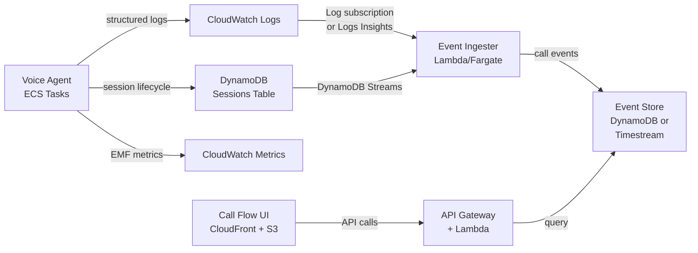

# Call Flow Visualizer

## Problem Statement

IVR/telephony engineers and contact center operators have no way to see
what actually happened during a call through the voice agent pipeline.
Today's observability is metrics-first (CloudWatch dashboards, EMF
aggregates) and log-first (structured JSON in CloudWatch Logs). Neither
format answers the question a telephony person instinctively asks:
**"Show me the life of this call."**

Specifically:

1. **No call journey view** -- There is no timeline that shows a
   caller's path through the system: greeting, speech recognition,
   LLM reasoning, tool invocations (KB lookup, CRM query, transfer),
   and eventual disposition (hangup, transfer, error). Reconstructing
   this requires CloudWatch Logs Insights queries filtered by call_id,
   which is slow and requires developer skills.

2. **No familiar telephony representation** -- IVR teams think in call
   flow diagrams, ladder diagrams, and CDR-style records. The current
   observability speaks in CloudWatch metric namespaces and structlog
   JSON -- a language that assumes a cloud-native developer audience.

3. **Tool and agent interactions are opaque** -- When the LLM decides
   to call a tool (KB search, CRM lookup, transfer), the triggering
   context (what the caller said, why the LLM chose that tool) and the
   result (what came back, how long it took, whether it was a cache
   hit) are scattered across separate log events with no visual
   connection.

4. **No side-by-side view of what was said vs what happened** -- The
   transcript (user/bot turns) and the system events (STT latency, LLM
   token generation, TTS queueing, barge-in) exist in parallel streams
   that are never presented together.

## Why This Matters

- **Faster debugging** -- When a call goes wrong (long silence, bad
  transfer, wrong KB answer), the first question is always "what
  happened on that call?" Today that takes 15-30 minutes of log
  spelunking. A visual timeline should answer it in seconds.

- **Stakeholder communication** -- IVR/telephony teams, QA, and
  business owners can review call flows without developer assistance.

- **Agent tuning** -- Seeing exactly when and why tools are invoked
  (and what the LLM "thought" before invoking them) helps prompt
  engineers tune system instructions and tool descriptions.

- **Regression detection** -- Comparing call flows before and after a
  change reveals behavioral regressions that aggregate metrics miss
  (e.g., "we used to transfer after 2 turns, now it takes 5").

## Vision

A standalone web service, deployed alongside the voice agent stack,
that presents call flows in a format telephony engineers recognize:

```
CALL: +1-555-0123 -> Voice Agent  |  2026-02-25 14:32:07 UTC  |  Duration: 3m 42s  |  Disposition: TRANSFER
====================================================================================================

 00:00.0  CALL START       SIP INVITE received, session abc-123
 00:00.3  GREETING         "Thank you for calling Acme support, how can I help you?"
                           [TTS: 420ms]

 00:04.1  CALLER SPOKE     "Yeah I need to check on my order from last week"
                           [STT: 180ms, confidence: 0.94]

 00:04.5  LLM REASONING    Selected tool: search_knowledge_base
                           Reason: caller asking about order status
                           [LLM TTFB: 340ms, tokens: 42]

 00:05.1  TOOL: KB SEARCH  query="order status check process"
                           -> 2 results, confidence 0.72
                           [A2A: 312ms, cache: MISS]

 00:05.8  AGENT SPOKE      "I can help you check on your order. Could you give me
                           your order number?"
                           [TTS: 380ms, E2E: 1,700ms]

 00:09.2  CALLER SPOKE     "It's 4 5 6 7 8 9"
 00:09.5  LLM REASONING    Selected tool: lookup_customer
 00:10.1  TOOL: CRM        query="order_number=456789"
                           -> customer found, order shipped
                           [A2A: 287ms, cache: MISS]

 00:10.8  AGENT SPOKE      "I found your order. It shipped on February 20th..."

 02:15.0  CALLER SPOKE     "Can you transfer me to someone about the damage?"
 02:15.4  LLM REASONING    Selected tool: transfer_to_agent
 02:15.6  TOOL: TRANSFER   SIP REFER -> sip:support@acme.com
                           [Local: 45ms, status: SUCCESS]

 02:15.9  AGENT SPOKE      "I'm transferring you to our claims department now."
 02:18.0  CALL END         Transfer completed, SIP BYE
```

### Key design principles

- **Ladder-diagram inspired** -- Time flows top-to-bottom, events are
  ordered chronologically, indentation distinguishes system events from
  conversation turns. Telephony engineers should feel at home.

- **Everything on one screen** -- The full call story is visible
  without switching between tabs or dashboards. Latency, content, tool
  usage, and disposition are interwoven.

- **Drill-down, not drill-around** -- Clicking a tool invocation
  expands to show the full A2A request/response, the LLM's tool_use
  block, and the raw result. No need to cross-reference log groups.

- **Search by what matters** -- Find calls by phone number, call_id,
  date range, disposition (completed, transferred, error), tool used,
  or keyword in transcript.

## Deployment Model

This is an **add-on service** deployed alongside the main voice agent
stack, not embedded in it. The voice agent pipeline itself is
latency-sensitive and should not be burdened with UI serving or
additional storage writes on the hot path.



### Option A: Near-real-time ingestion (preferred)

- CloudWatch Logs subscription filter on the voice agent log group
  captures structured log events (`conversation_turn`,
  `turn_completed`, `tool_execution`, `a2a_tool_call_*`,
  `session_started/ended`)
- Lambda function parses events, groups by call_id, writes to a
  purpose-built DynamoDB table (PK=CALL#{call_id},
  SK=EVENT#{timestamp}#{event_type})
- UI queries the API which reads from this event store

### Option B: On-demand reconstruction

- No ingestion pipeline; the API runs CloudWatch Logs Insights queries
  filtered by call_id on demand
- Simpler to build but slower to query (5-30s per call)
- Good for a v0 prototype

## What Already Exists (Can Build On)

The voice agent already emits rich structured data. The gap is not
data capture -- it is **presentation and queryable storage**.

| Data | Source | Storage Today |
|------|--------|---------------|
| Turn-by-turn transcript (user + bot) | `ConversationObserver` | CloudWatch Logs only |
| Per-turn latency breakdown (STT, LLM, TTS, E2E) | `MetricsCollector` / `TurnMetrics` | CloudWatch Logs + EMF metrics |
| Tool executions (name, category, timing, status) | `ToolExecutor` | CloudWatch Logs + EMF metrics |
| A2A agent calls (skill, timing, cache hit/miss) | `a2a/tool_adapter.py` | CloudWatch Logs + EMF metrics |
| Barge-in / interruption events | `ConversationObserver` | CloudWatch Logs only |
| Audio quality (RMS, peak, silence) | `AudioQualityObserver` | CloudWatch Logs + EMF metrics |
| Session lifecycle (start, active, end, disposition) | `SessionTracker` | DynamoDB sessions table |
| Quality scores per turn | `QualityScoreCalculator` | CloudWatch Logs only |

## Open Questions

1. **Real-time vs post-call?** -- Should the UI show a live updating
   view of an active call, or only completed calls? Live is harder
   (WebSocket, streaming ingestion) but more impressive for demos.

2. **Storage backend** -- DynamoDB (familiar, already in stack) vs
   Timestream (purpose-built for time-series, native time-range
   queries) vs OpenSearch (full-text search on transcripts)?

3. **Auth model** -- Is this an internal-only tool (IAM/Cognito) or
   does it need to be accessible to external stakeholders?

4. **Retention** -- How long do we keep detailed call event data? The
   current CloudWatch Logs retain per log group settings. A dedicated
   event store needs its own retention policy.

5. **CDK integration** -- Separate CDK app/stack, or a new construct
   added to the existing `infrastructure/` project?

## Affected Areas

- New service: `backend/call-flow-visualizer/` (API + event ingester)
- New infrastructure: event store table, API Gateway, Lambda/Fargate,
  CloudFront + S3 (static UI), CloudWatch Logs subscription filter
- Modified (minimal): voice agent log format may need minor enrichment
  (e.g., ensuring all events include `call_id` and a monotonic
  sequence number for ordering)
- No changes to the voice agent hot path or pipeline latency

## Rough Component Breakdown

| Component | Tech | Purpose |
|-----------|------|---------|
| Event Ingester | Lambda (Python) | Parse CW Logs subscription, write to event store |
| Event Store | DynamoDB | PK=call_id, SK=timestamp+event_type, queryable by disposition/date/tool |
| Call Flow API | API Gateway + Lambda | REST API: list calls, get call timeline, search |
| Call Flow UI | React/Next.js on S3+CloudFront | Timeline view, search, drill-down |
| CDK Stack | TypeScript | Deploy all of the above |
