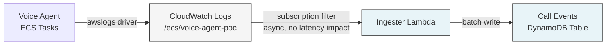
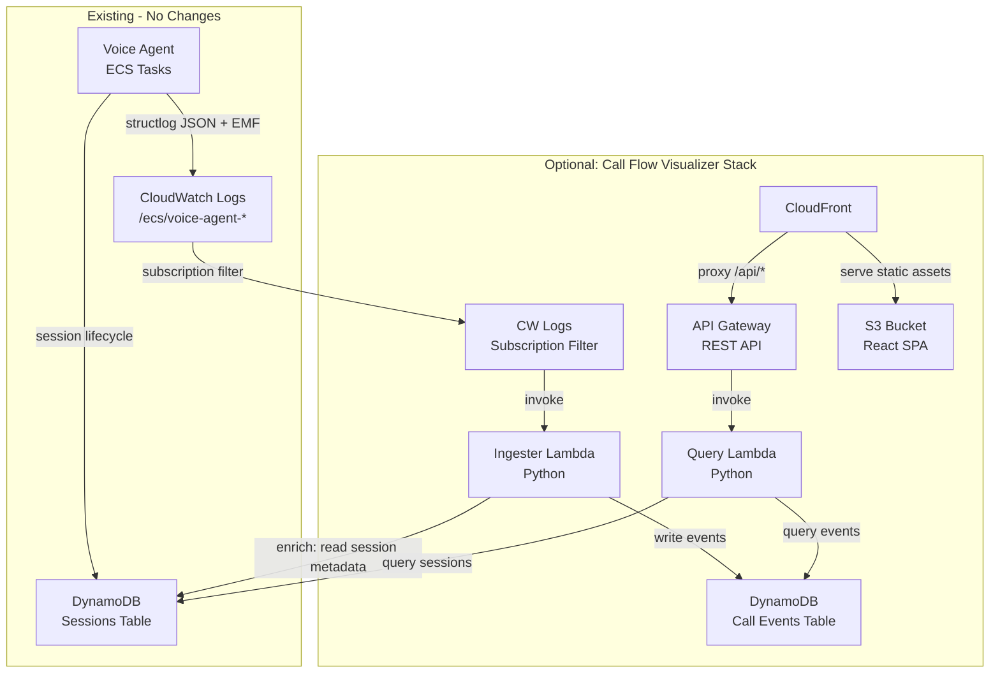

# Implementation Plan: Call Flow Visualizer

## Overview

Build a **fully optional, bolt-on** service that presents the full
story of each call through the voice agent pipeline in a timeline
format familiar to telephony engineers. The voice agent already emits
rich structured data via structlog and EMF (`conversation_turn`,
`turn_completed`, `tool_execution`, `a2a_tool_call_*`,
`session_started/ended`); the gap is **queryable storage** and
**visual presentation**.

**Design constraint: zero changes to the voice agent or existing
stacks.** The visualizer stack is gated behind a CDK context flag
(`voice-agent:enableCallFlowVisualizer`) and can be deployed or
destroyed independently. It reads data that already exists in
CloudWatch Logs; the voice agent is unaware of its presence.

## How Log Egress Works

The voice agent ECS tasks write structured JSON to stdout via
structlog and EMF. The `awslogs` log driver sends this to a CloudWatch
Logs log group created by the `EcsStack` (`ecs-stack.ts:381-384`).

The log group name is published to SSM at
`/voice-agent/ecs/task-log-group-name` (`SSM_PARAMS.TASK_LOG_GROUP_NAME`),
following the same cross-stack SSM pattern used by every other stack in
the project. The visualizer reads it like any other downstream consumer:

```typescript
const logGroupName = ssm.StringParameter.valueFromLookup(
  this, SSM_PARAMS.TASK_LOG_GROUP_NAME
);
const logGroup = logs.LogGroup.fromLogGroupName(this, 'VoiceAgentLogGroup', logGroupName);
```

It then attaches a **CloudWatch Logs subscription filter** to that log
group. Subscription filters are:
- **Asynchronous** -- they do not add latency to the log producer
- **Additive** -- you can have up to 2 per log group; the existing
  metric filter for `task_protection_all_retries_exhausted` is a
  metric filter (not a subscription filter), so the slot is free
- **Removable** -- destroying the visualizer stack removes the filter



No changes to the voice agent application code, no new environment
variables on the ECS task. The visualizer is a pure **read-side
consumer** of logs that already flow to CloudWatch.

## Architecture



## Architecture Decisions

| # | Decision | Choice | Rationale |
|---|----------|--------|-----------|
| 1 | Deployment model | Optional CDK stack gated by `voice-agent:enableCallFlowVisualizer` | Zero impact when disabled. Can be added/removed without redeploying the voice agent. Follows the same pattern as `USE_CLOUD_APIS` for SageMaker. |
| 2 | Voice agent changes | None | The visualizer is a read-side consumer only. No new env vars, no new log events, no code changes to the pipeline. The existing structured logs are sufficient. |
| 3 | Log group reference | Read from SSM (`/voice-agent/ecs/task-log-group-name`) | Consistent with every other cross-stack reference in the project. SSM param added to EcsStack as a generally useful improvement. |
| 4 | Sessions table reference | Read via SSM (`/voice-agent/sessions/table-name`, `/voice-agent/sessions/table-arn`) | Already published by `SessionTableConstruct`. Read-only access for enrichment. |
| 5 | Ingestion model | Near-real-time via CW Logs subscription filter | Sub-second delivery latency. Lambda invocation cost is negligible at expected call volumes. Async -- zero latency impact on voice agent. |
| 6 | Event store backend | DynamoDB | Already in the stack, team has operational experience, single-digit-ms reads, pay-per-request. |
| 7 | Event store schema | PK=`CALL#{call_id}`, SK=`TS#{iso_timestamp}#{event_type}` | Natural sort by time within a call. Event type suffix breaks ties for sub-ms events. |
| 8 | Event ordering | Use ISO timestamp + event_type as SK tiebreaker | A monotonic sequence number would require modifying the voice agent's structlog processor chain, violating the "no changes" constraint. Timestamp + event_type ordering is sufficient -- sub-ms collisions between different event types are the only ambiguity case, and the event_type suffix resolves it. |
| 9 | UI hosting | S3 + CloudFront | Static SPA, no server-side rendering needed. |
| 10 | Auth model | IAM-based (Sigv4) for v1 | Internal-only tool. Cognito deferred to future iteration. |
| 11 | Retention | 30-day TTL on event store | Aligns with CW Logs TWO_WEEKS retention plus buffer. |
| 12 | Transcript availability | Degrade gracefully when `ENABLE_CONVERSATION_LOGGING=false` | The visualizer cannot and should not force this flag on. When transcripts are absent, the timeline shows system events and latency breakdowns with a "Transcripts not available" banner. |

## Implementation Steps

### Phase 1: CDK Opt-in Gate

**1.1 Add config flag**

File: `infrastructure/src/config.ts`

- Add `enableCallFlowVisualizer?: boolean` to `VoiceAgentConfig`
- Parse from CDK context `voice-agent:enableCallFlowVisualizer` or env
  var `ENABLE_CALL_FLOW_VISUALIZER`, default `false`

**1.2 Conditional instantiation in main.ts**

File: `infrastructure/src/main.ts`

```typescript
if (config.enableCallFlowVisualizer) {
  const visualizerStack = new CallFlowVisualizerStack(app, 'VoiceAgentCallFlowVisualizer', {
    env,
    config,
    description: 'Voice Agent - Call Flow Visualizer (optional)',
    tags: {
      Project: config.projectName,
      Environment: config.environment,
      Phase: '11',
    },
  });
  visualizerStack.addDependency(ecsStack);
}
```

Deploy with: `npx cdk deploy VoiceAgentCallFlowVisualizer -c voice-agent:enableCallFlowVisualizer=true`

Destroy independently: `npx cdk destroy VoiceAgentCallFlowVisualizer`

### Phase 2: Event Store & Ingestion Pipeline

**2.1 Create the Call Events DynamoDB table construct**

File: `infrastructure/src/constructs/call-events-table-construct.ts`

- Table: `${resourcePrefix}-call-events`
- PK: `PK` (String) -- `CALL#{call_id}`
- SK: `SK` (String) -- `TS#{iso_timestamp}#{event_type}`
- TTL attribute: `TTL` (30-day expiry)
- Billing: PAY_PER_REQUEST
- RemovalPolicy: DESTROY (non-prod), RETAIN (prod)
- GSI1 (calls by date + disposition):
  - GSI1PK: `DATE#{YYYY-MM-DD}`
  - GSI1SK: `DISP#{disposition}#{call_id}`
- GSI2 (calls by tool usage):
  - GSI2PK: `TOOL#{tool_name}`
  - GSI2SK: `DATE#{YYYY-MM-DD}#{call_id}`

**2.2 Create the Event Ingester Lambda**

File: `backend/call-flow-visualizer/ingester/handler.py`

- Runtime: Python 3.12
- Trigger: CloudWatch Logs subscription filter
- Filter pattern targets these event names:
  ```
  conversation_turn, turn_completed, tool_execution, barge_in,
  session_started, session_ended, a2a_tool_call_start,
  a2a_tool_call_success, a2a_tool_call_cache_hit,
  a2a_tool_call_timeout, a2a_tool_call_error,
  call_metrics_summary, audio_clipping_detected, poor_audio_detected
  ```
- Processing per log event:
  1. Decompress and base64-decode the CW Logs subscription payload
  2. Parse each log line as JSON
  3. Extract `call_id` from the JSON body (injected by structlog
     contextvars on every event -- verified in codebase analysis)
  4. Skip events without `call_id` (e.g., heartbeat, startup logs)
  5. Map to a normalized event record:
     ```python
     {
         "PK": f"CALL#{call_id}",
         "SK": f"TS#{timestamp}#{event_type}",
         "call_id": call_id,
         "session_id": session_id,
         "event_type": event_type,
         "timestamp": timestamp,
         "turn_number": turn_number,  # if present
         "data": { ... },  # event-specific payload
         "TTL": int(time.time()) + 30 * 86400,
     }
     ```
  6. Set GSI attributes on searchable events:
     - `session_ended` / `call_metrics_summary`: `GSI1PK=DATE#{date}`, `GSI1SK=DISP#{disposition}#{call_id}`
     - `tool_execution` / `a2a_tool_call_*`: `GSI2PK=TOOL#{tool_name}`, `GSI2SK=DATE#{date}#{call_id}`
  7. Batch write to DynamoDB (25-item batches with unprocessed-item retry)
- Use structlog with JSON renderer (per AGENTS.md convention)
- Dependencies: `boto3` (Lambda runtime), `structlog`

**2.3 Create the subscription filter**

File: `infrastructure/src/stacks/call-flow-visualizer-stack.ts` (inline, not a separate construct)

The stack reads the log group name from SSM and attaches a
subscription filter:

```typescript
const logGroupName = ssm.StringParameter.valueFromLookup(
  this, SSM_PARAMS.TASK_LOG_GROUP_NAME
);
const voiceAgentLogGroup = logs.LogGroup.fromLogGroupName(
  this, 'VoiceAgentLogGroup', logGroupName
);

new logs.SubscriptionFilter(this, 'EventIngestionFilter', {
  logGroup: voiceAgentLogGroup,
  destination: new destinations.LambdaDestination(ingesterLambda),
  filterPattern: logs.FilterPattern.any(
    logs.FilterPattern.stringValue('$.event', '=', 'conversation_turn'),
    logs.FilterPattern.stringValue('$.event', '=', 'turn_completed'),
    // ... remaining event types
  ),
  filterName: `${resourcePrefix}-call-flow-ingestion`,
});
```

The EcsStack owns the log group; the visualizer stack references it by
SSM lookup. Destroying the visualizer stack cleanly removes the
subscription filter without touching the log group.

**2.4 IAM permissions**

- Ingester Lambda: `dynamodb:BatchWriteItem` on call-events table,
  `dynamodb:GetItem` on sessions table (read from SSM ARN), own log group
- Lambda resource-based policy: allow `logs.amazonaws.com` to invoke

### Phase 3: Query API

**3.1 Create the Query Lambda**

File: `backend/call-flow-visualizer/api/handler.py`

- Runtime: Python 3.12
- Endpoints:

| Method | Path | Description |
|--------|------|-------------|
| GET | `/api/calls` | List calls with pagination. Query GSI1 by date range. Optional filters: `disposition`, `date_from`, `date_to`. Returns call summaries. |
| GET | `/api/calls/{call_id}` | Get full call timeline. Query PK=`CALL#{call_id}` with SK begins_with `TS#`. Returns ordered events. |
| GET | `/api/calls/{call_id}/summary` | Call summary (session metadata + call_metrics_summary event). |
| GET | `/api/search` | Search by tool name (GSI2), disposition (GSI1), or call_id prefix. |

- Enrich call metadata by reading session record from the sessions
  table (PK=`SESSION#{session_id}`, SK=`METADATA`). Sessions table
  name/ARN read from SSM at
  `/voice-agent/sessions/table-name` and `/voice-agent/sessions/table-arn`.
- Use structlog for logging

**3.2 Create API Gateway REST API**

Defined in `call-flow-visualizer-stack.ts`:

- REST API: `${resourcePrefix}-call-flow-api`
- Stage: `config.environment`
- Auth: IAM (Sigv4)
- Routes: proxy to Query Lambda
- CORS: enabled for CloudFront origin

**3.3 IAM permissions**

- Query Lambda: `dynamodb:Query`, `dynamodb:GetItem` on call-events
  table and sessions table

### Phase 4: Static UI

**4.1 Scaffold the React application**

Directory: `frontend/call-flow-visualizer/`

```
frontend/call-flow-visualizer/
├── index.html
├── package.json
├── vite.config.ts
├── tsconfig.json
├── src/
│   ├── main.tsx
│   ├── App.tsx
│   ├── api/
│   │   └── client.ts          # API client with Sigv4 signing
│   ├── components/
│   │   ├── CallList.tsx        # Paginated call list with filters
│   │   ├── CallTimeline.tsx    # Main timeline view
│   │   ├── TimelineEvent.tsx   # Single event row
│   │   ├── EventDetail.tsx     # Expandable detail panel
│   │   ├── LatencyBar.tsx      # Visual latency indicator
│   │   ├── SearchBar.tsx       # Search/filter controls
│   │   └── CallSummaryCard.tsx # Call header with key metrics
│   ├── types/
│   │   └── index.ts            # TypeScript interfaces for API responses
│   └── styles/
│       └── timeline.css        # Timeline-specific styles
```

**4.2 Implement the Call List view**

- Paginated table of calls sorted by date (newest first)
- Columns: Time, Call ID (truncated), Duration, Turns, Disposition, Tools Used
- Filter bar: date range picker, disposition dropdown, tool name
- Click a row to navigate to the timeline view

**4.3 Implement the Call Timeline view**

- Header: call metadata (call_id, session_id, start/end time, duration, disposition)
- Latency summary bar: avg STT, LLM TTFB, TTS TTFB, E2E
- Chronological event list (ladder-diagram inspired):
  - Left column: relative timestamp (`00:04.1`)
  - Center column: event type badge (color-coded)
  - Right column: event content and metadata
- Event types and their visual treatment:

| Event Type | Badge Color | Content Shown |
|------------|-------------|---------------|
| `session_started` | Gray | "Call started" |
| `conversation_turn` (user) | Blue | Transcript text, STT confidence |
| `conversation_turn` (assistant) | Green | Response text |
| `turn_completed` | Light gray | Latency breakdown: STT / LLM / TTS / E2E |
| `tool_execution` | Orange | Tool name, status, execution time, category |
| `a2a_tool_call_*` | Purple | Skill ID, elapsed time, cache hit/miss |
| `barge_in` | Red | "Caller interrupted" with turn number |
| `session_ended` | Gray | Disposition, total turns |
| `call_metrics_summary` | Dark gray | Summary metrics (collapsed by default) |

- Click any event row to expand full detail panel (raw JSON, all fields)
- Banner at top: "Transcript logging was not enabled for this call" when
  no `conversation_turn` events exist for a call

**4.4 Implement the Search view**

- Search by: call_id, tool name, date range, disposition
- Results link to the timeline view

**4.5 Create S3 + CloudFront construct**

File: `infrastructure/src/constructs/visualizer-ui-construct.ts`

- S3 bucket for static assets (block public access, OAC)
- CloudFront distribution:
  - Origin 1: S3 bucket (default behavior, `/*`)
  - Origin 2: API Gateway (behavior for `/api/*`)
  - Default root object: `index.html`
  - SPA routing: custom error response 403/404 -> `/index.html` with 200
- BucketDeployment to upload built assets from `frontend/call-flow-visualizer/dist/`
- Output CloudFront URL as CloudFormation output

### Phase 5: Testing

**5.1 Ingester Lambda unit tests**

File: `backend/call-flow-visualizer/ingester/test_handler.py`

- [ ] Test CW Logs subscription payload decompression
- [ ] Test event parsing for each supported event type
- [ ] Test DynamoDB item construction (PK/SK format, GSI attributes, TTL)
- [ ] Test batch write with retry on partial failures
- [ ] Test graceful handling of malformed log lines
- [ ] Test events without `call_id` are skipped

**5.2 Query Lambda unit tests**

File: `backend/call-flow-visualizer/api/test_handler.py`

- [ ] Test `/api/calls` pagination and date filtering
- [ ] Test `/api/calls/{call_id}` returns events sorted by SK
- [ ] Test `/api/calls/{call_id}/summary` enrichment from sessions table
- [ ] Test `/api/search` across GSI1 and GSI2
- [ ] Test 404 for unknown call_id

**5.3 CDK infrastructure tests**

File: `infrastructure/test/call-flow-visualizer-stack.test.ts`

- [ ] Test stack is NOT created when `enableCallFlowVisualizer` is false/unset
- [ ] Test stack IS created when `enableCallFlowVisualizer` is true
- [ ] Test subscription filter targets correct log group name
- [ ] Test DynamoDB table has correct PK/SK, GSIs, and TTL
- [ ] Test API Gateway routes and IAM auth
- [ ] Test CloudFront distribution has correct origins and behaviors
- [ ] Test S3 bucket has public access blocked

**5.4 Integration test**

- [ ] Deploy with `-c voice-agent:enableCallFlowVisualizer=true`
- [ ] Make a test call with `ENABLE_CONVERSATION_LOGGING=true`
- [ ] Verify events appear in the event store within 60 seconds
- [ ] Verify the timeline API returns correct event sequence
- [ ] Verify the UI renders the call timeline
- [ ] Destroy only the visualizer stack, verify voice agent unaffected

### Phase 6: Documentation & Rollout

**6.1 Update project documentation**

- Add `docs/guides/call-flow-visualizer.md` with usage instructions
- Update `AGENTS.md` with the new CDK context flag and deploy command
- Update `docs/features/call-flow-visualizer/shipped.md` when complete

**6.2 CDK output**

- Output the CloudFront URL as `VoiceAgentCallFlowVisualizer.DashboardUrl`

## File Structure

```
backend/call-flow-visualizer/
├── ingester/
│   ├── handler.py              # CW Logs subscription handler
│   ├── event_parser.py         # Log line -> normalized event
│   ├── requirements.txt        # boto3, structlog
│   └── test_handler.py         # Unit tests
├── api/
│   ├── handler.py              # API Gateway handler
│   ├── queries.py              # DynamoDB query helpers
│   ├── requirements.txt        # boto3, structlog
│   └── test_handler.py         # Unit tests

frontend/call-flow-visualizer/
├── index.html
├── package.json
├── vite.config.ts
├── tsconfig.json
└── src/
    ├── main.tsx
    ├── App.tsx
    ├── api/
    ├── components/
    ├── types/
    └── styles/

infrastructure/src/
├── constructs/
│   └── visualizer-ui-construct.ts   # S3 + CloudFront
├── stacks/
│   ├── call-flow-visualizer-stack.ts  # All-in-one stack
│   └── index.ts                       # (add export)
├── config.ts                          # (add enableCallFlowVisualizer)
└── main.ts                            # (conditional instantiation)
```

## Configuration

**New CDK context / env var:**

| Flag | Context Key | Env Var | Default | Description |
|------|-------------|---------|---------|-------------|
| Enable visualizer | `voice-agent:enableCallFlowVisualizer` | `ENABLE_CALL_FLOW_VISUALIZER` | `false` | When true, deploys the Call Flow Visualizer stack |

**Existing voice agent flags (no changes, just documentation):**

| Variable | Default | Effect on Visualizer |
|----------|---------|---------------------|
| `ENABLE_CONVERSATION_LOGGING` | `false` | When `true`, transcript text appears in timeline. When `false`, timeline shows system events and latency only. |
| `ENABLE_AUDIO_QUALITY_MONITORING` | `true` | Audio quality events appear in timeline. Already enabled by default. |

**Existing SSM parameters consumed (read-only, already published by main stack):**

| Parameter | Published By | Description |
|-----------|-------------|-------------|
| `/voice-agent/ecs/task-log-group-name` | EcsStack | Voice agent CloudWatch Log Group name |
| `/voice-agent/sessions/table-name` | SessionTableConstruct | Sessions DynamoDB table name |
| `/voice-agent/sessions/table-arn` | SessionTableConstruct | Sessions DynamoDB table ARN |

## Testing Strategy

| Layer | Tool | Coverage Target |
|-------|------|-----------------|
| Ingester Lambda | pytest + moto | Event parsing, DDB writes, error handling |
| Query Lambda | pytest + moto | All API routes, pagination, enrichment |
| CDK constructs | Jest + assertions | Conditional creation, resource config, IAM |
| UI components | Vitest + React Testing Library | Timeline rendering, event expansion, search |
| Integration | Manual + scripted | End-to-end + independent deploy/destroy |

## Risks & Mitigations

| Risk | Impact | Mitigation |
|------|--------|------------|
| CW Logs subscription filter slot exhaustion (limit: 2) | Low | Currently 0 subscription filters on the log group. The visualizer uses 1. Documents the limit for future add-ons. |
| Transcript data unavailable (`ENABLE_CONVERSATION_LOGGING=false`) | Medium | UI degrades gracefully. Shows system events and latency without transcript content. Banner warns the user. |
| Sub-millisecond event ordering ambiguity | Low | Event type suffix in SK resolves ties for different event types at the same timestamp. Same-type collisions at the same ms are extremely unlikely and harmless (adjacent rows may swap). |
| Sessions table read adds cross-stack IAM dependency | Low | Read-only access via table ARN from SSM. No writes, no cross-stack CloudFormation exports. |

## Dependencies

| Dependency | Status | Notes |
|------------|--------|-------|
| observability-foundation | Shipped | Provides structlog, MetricsCollector, contextvars binding |
| observability-conversation-logging | Shipped | `conversation_turn` events (when enabled) |
| observability-turn-tracking | Shipped | Turn numbering, `turn_completed` events |
| observability-timing-metrics | Shipped | Latency breakdown (STT, LLM, TTS, E2E) |
| observability-quality-monitoring | Shipped | Audio quality events |
| tool-calling-framework | Shipped | `tool_execution` events |
| dynamic-capability-registry | Shipped | A2A tool call events |
| dynamodb-session-tracking | Shipped | Session lifecycle in DynamoDB, SSM params |

External:
- AWS CDK v2 (existing)
- React 18+ / Vite 5+
- boto3 (Lambda runtime)

## Success Criteria

| Criteria | Target | Measurement |
|----------|--------|-------------|
| Zero changes to existing stacks | No modifications to any file outside `call-flow-visualizer` paths + config.ts/main.ts | Code review |
| Independent deploy/destroy | `cdk deploy/destroy VoiceAgentCallFlowVisualizer` works without touching other stacks | Integration test |
| Event ingestion latency | < 30s from log emission to queryable in event store | Timestamp comparison |
| Timeline load time | < 2s for a 50-event call | Browser network timing |
| Event completeness | All supported event types appear in timeline | Compare CW Logs Insights vs event store |
| Graceful degradation | Timeline renders without transcripts | Test with `ENABLE_CONVERSATION_LOGGING=false` |

## Estimated Effort

| Phase | Effort |
|-------|--------|
| Phase 1: CDK Opt-in Gate | 0.5 days |
| Phase 2: Event Store & Ingestion | 2.5 days |
| Phase 3: Query API | 2 days |
| Phase 4: Static UI | 4 days |
| Phase 5: Testing | 2 days |
| Phase 6: Documentation & Rollout | 0.5 days |
| **Total (with buffer)** | **~14 days** |

## Progress Log

| Date | Update |
|------|--------|
| 2026-03-03 | Plan created. Redesigned as fully optional bolt-on: gated by CDK context flag, zero voice agent code changes, log egress via CW Logs subscription filter. Added `SSM_PARAMS.TASK_LOG_GROUP_NAME` to EcsStack as a generally useful improvement -- replaces convention-based log group name derivation with proper SSM cross-stack reference. |
