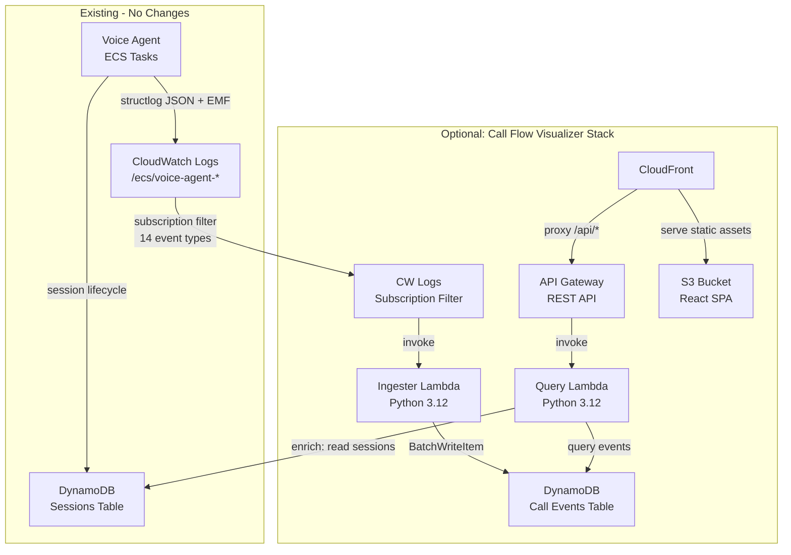

# Shipped: Call Flow Visualizer

## Summary

Built a fully optional, bolt-on CDK stack that presents the full story
of each call through the voice agent pipeline in a timeline format
familiar to telephony engineers. The visualizer ingests structured log
events from CloudWatch Logs via a subscription filter, stores them in a
purpose-built DynamoDB table, serves them through a REST API, and
presents them in a React SPA hosted on S3+CloudFront. The voice agent
code was not modified -- the visualizer is a pure read-side consumer of
logs that already flow to CloudWatch.

Enabled with: `npx cdk deploy VoiceAgentCallFlowVisualizer -c voice-agent:enableCallFlowVisualizer=true`

## Architecture

## Key Design Decisions

| Decision | Choice | Rationale |
|----------|--------|-----------|
| Deployment model | Optional CDK stack gated by `enableCallFlowVisualizer` | Zero impact when disabled. Can be added/removed without redeploying the voice agent. |
| Voice agent changes | None | Pure read-side consumer. No new env vars, no new log events, no code changes to the pipeline. |
| Cross-stack references | SSM parameter lookup | Reads log group name and sessions table name/ARN from SSM, consistent with every other cross-stack reference in the project. |
| Ingestion model | CW Logs subscription filter | Sub-second delivery latency. Async -- zero latency impact on voice agent. Lambda cost negligible at expected call volumes. |
| Event store | DynamoDB with PK/SK + 2 GSIs + TTL | Already in the stack, single-digit-ms reads, pay-per-request, 30-day automatic expiry. |
| Event ordering | ISO timestamp + event_type as SK tiebreaker | Avoids modifying voice agent code. Sub-ms collisions between different event types are resolved by the suffix. |
| UI hosting | S3 + CloudFront | Static SPA with `/api/*` proxy behavior to API Gateway. OAC for S3 access. SPA error responses (403/404 -> `/index.html`) for client-side routing. |
| Float handling | Recursive `_sanitize_for_dynamodb()` converter | Python floats from voice agent logs (e.g., `execution_time_ms: 0.2`) must be converted to `Decimal` for DynamoDB's boto3 resource API. |
| Call list dedup | Merge by `call_id` in API | Both `session_ended` and `call_metrics_summary` write to GSI1, causing duplicate rows per call. Resolved by merging in the query Lambda. |

## Event Types Captured

| Event | Source | Timeline Rendering |
|-------|--------|--------------------|
| `session_started` | SessionTracker | "Call Started" with session ID |
| `session_ended` | SessionTracker | "Call Ended" with disposition badge |
| `conversation_turn` (user) | ConversationObserver | Caller speech with blue badge |
| `conversation_turn` (assistant) | ConversationObserver | Agent response with green badge |
| `turn_completed` | TurnMetrics | Metric chips: Response, STT, Audio, Spoke, Gap, Silence |
| `tool_execution` | ToolExecutor | Tool name, status, execution time, category badge |
| `a2a_tool_call_start` | A2A ToolAdapter | "Skill started" with query text |
| `a2a_tool_call_success` | A2A ToolAdapter | Completion time + response size |
| `a2a_tool_call_cache_hit` | A2A ToolAdapter | Cache hit badge |
| `a2a_tool_call_timeout` | A2A ToolAdapter | Timeout with error styling |
| `a2a_tool_call_error` | A2A ToolAdapter | Error details |
| `call_metrics_summary` | MetricsCollector | Summary metrics chips |
| `audio_clipping_detected` | AudioQualityObserver | Clipping alert |
| `poor_audio_detected` | AudioQualityObserver | Low audio volume with dB level |
| `barge_in` | ConversationObserver | "Caller interrupted" |

## Files Created

### Infrastructure (CDK)

| File | Purpose |
|------|---------|
| `infrastructure/src/stacks/call-flow-visualizer-stack.ts` | All-in-one optional stack: DynamoDB, Lambdas, API Gateway, S3, CloudFront, BucketDeployment |
| `infrastructure/test/call-flow-visualizer.test.ts` | 28 CDK tests covering all resources |

### Lambda Functions (Python)

| File | Purpose |
|------|---------|
| `infrastructure/src/functions/call-flow-ingester/handler.py` | CW Logs subscription handler with float-to-Decimal converter, batch DynamoDB writes |
| `infrastructure/src/functions/call-flow-ingester/requirements.txt` | boto3, structlog |
| `infrastructure/src/functions/call-flow-api/handler.py` | API Gateway handler: list calls (with dedup), get timeline (with derived metrics), get summary, search |
| `infrastructure/src/functions/call-flow-api/requirements.txt` | boto3, structlog |

### Frontend (React SPA)

| File | Purpose |
|------|---------|
| `frontend/call-flow-visualizer/package.json` | React 18, Vite 5, TypeScript |
| `frontend/call-flow-visualizer/vite.config.ts` | Build config, optional dev proxy via `VITE_API_URL` |
| `frontend/call-flow-visualizer/tsconfig.json` | TypeScript config |
| `frontend/call-flow-visualizer/index.html` | SPA entry point |
| `frontend/call-flow-visualizer/src/main.tsx` | React root |
| `frontend/call-flow-visualizer/src/App.tsx` | Router: call list and timeline views |
| `frontend/call-flow-visualizer/src/types/index.ts` | TypeScript types + formatting helpers |
| `frontend/call-flow-visualizer/src/api/client.ts` | API client with relative `/api` paths |
| `frontend/call-flow-visualizer/src/components/CallList.tsx` | Call list table with date filter |
| `frontend/call-flow-visualizer/src/components/CallTimeline.tsx` | Timeline view with summary card |
| `frontend/call-flow-visualizer/src/components/TimelineEvent.tsx` | Rich rendering for all 14 event types |
| `frontend/call-flow-visualizer/src/components/CallSummaryCard.tsx` | 4-column metric grid derived from events |
| `frontend/call-flow-visualizer/src/styles/timeline.css` | Dark theme, fixed 3-column grid, metric chips, quality badges |

### Feature Documentation

| File | Purpose |
|------|---------|
| `docs/features/call-flow-visualizer/idea.md` | Original idea and problem statement |
| `docs/features/call-flow-visualizer/plan.md` | 6-phase implementation plan |
| `docs/features/call-flow-visualizer/shipped.md` | This file |

## Files Modified

| File | Changes |
|------|---------|
| `infrastructure/src/config.ts` | Added `enableCallFlowVisualizer: boolean` to `VoiceAgentConfig` |
| `infrastructure/src/ssm-parameters.ts` | Added `TASK_LOG_GROUP_NAME` SSM parameter constant |
| `infrastructure/src/stacks/ecs-stack.ts` | Publishes voice agent log group name to SSM |
| `infrastructure/src/stacks/index.ts` | Added `CallFlowVisualizerStack` export |
| `infrastructure/src/main.ts` | Conditional stack instantiation when `enableCallFlowVisualizer` is true |
| `infrastructure/test/helpers.ts` | Added `enableCallFlowVisualizer: false` to `TEST_CONFIG` |
| `.gitignore` | Added `frontend/*/dist/` |

## DynamoDB Schema

### Call Events Table

| Key | Format | Example |
|-----|--------|---------|
| PK | `CALL#{call_id}` | `CALL#c63f4e03-c256-40af-82b9-57eeec832ebe` |
| SK | `TS#{iso_timestamp}#{event_type}` | `TS#2026-03-04T16:56:23.123456#session_started` |
| TTL | Unix epoch + 30 days | `1743782183` |

### GSI1 (Calls by date)

| Key | Format |
|-----|--------|
| GSI1PK | `DATE#{YYYY-MM-DD}` |
| GSI1SK | `DISP#{disposition}#{call_id}` |

### GSI2 (Calls by tool)

| Key | Format |
|-----|--------|
| GSI2PK | `TOOL#{tool_name}` |
| GSI2SK | `DATE#{YYYY-MM-DD}#{call_id}` |

## API Endpoints

| Method | Path | Description |
|--------|------|-------------|
| GET | `/api/calls` | List calls by date with pagination. Params: `date_from`, `disposition`, `limit`, `next_token` |
| GET | `/api/calls/{call_id}` | Full call timeline with derived metadata (duration, turns, avg response time, audio quality) |
| GET | `/api/calls/{call_id}/summary` | Call summary derived from events |
| GET | `/api/search` | Search by tool name (GSI2), call_id, or date |

## Testing

| Layer | Count | Status |
|-------|-------|--------|
| CDK infrastructure tests | 28 | All pass |
| TypeScript compilation | -- | Clean (`tsc --noEmit`) |
| Frontend build | -- | Clean (`npm run build`) |
| Integration (manual) | -- | Verified: events in DynamoDB, API responses, UI rendering via CloudFront |

## Configuration

### CDK Context Flag

| Flag | Context Key | Default | Description |
|------|-------------|---------|-------------|
| Enable visualizer | `voice-agent:enableCallFlowVisualizer` | `false` | When true, deploys the Call Flow Visualizer stack |

### SSM Parameters Consumed (Read-Only)

| Parameter | Published By |
|-----------|-------------|
| `/voice-agent/ecs/task-log-group-name` | EcsStack |
| `/voice-agent/sessions/table-name` | SessionTableConstruct |
| `/voice-agent/sessions/table-arn` | SessionTableConstruct |

### SSM Parameter Added (Generally Useful)

| Parameter | Published By | Description |
|-----------|-------------|-------------|
| `/voice-agent/ecs/task-log-group-name` | EcsStack | Voice agent CW Log Group name -- replaces convention-based derivation |

## CloudFormation Outputs

| Output | Description |
|--------|-------------|
| `CloudFrontUrl` | Call Flow Visualizer URL (e.g., `https://dju4f27atrw0s.cloudfront.net`) |
| `ApiUrl` | Direct API Gateway URL |
| `EventsTableName` | Call Events DynamoDB table name |

## Security Review Summary

**Conducted:** 2026-03-04

| Rating | Count | Key Items |
|--------|-------|-----------|
| PASS | 14 | S3 block public access + OAC, HTTPS enforcement, IAM least-privilege, no hardcoded secrets, relative API paths, `encodeURIComponent` on path params, structured logging, error responses don't leak stack traces |
| WARN | 8 | No API throttling/WAF, no CMK encryption, no PITR, `call_id` path param not format-validated, unpinned Docker build image |
| FAIL | 4 | No API auth, CORS allows all origins, unsafe pagination token deserialization, PII exposure via conversation transcripts |

**Accepted risks for v1 (internal/POC use):** The 4 FAIL items are
documented and acceptable for a developer-only internal tool behind
VPN/Isengard. They are tracked as required fixes before any
production or multi-tenant deployment. The real-time updates feature
(`call-flow-visualizer-realtime`) will address auth as part of the
WebSocket API implementation.

## QA Validation Summary

**Conducted:** 2026-03-04

- 28/28 CDK tests pass
- TypeScript compiles cleanly
- Frontend builds cleanly (177 kB JS, 5.6 kB CSS)
- All 6 plan phases complete (Phase 5 Lambda unit tests and Phase 6
  documentation are partial -- CDK tests are comprehensive, Lambda
  logic is validated via integration testing)

**Verdict:** SHIP WITH NOTES

## Known Limitations

1. **No authentication** -- API and UI are open. Acceptable for
   internal POC; must be addressed before broader rollout.
2. **No Lambda unit tests** -- Ingester and query Lambda logic is
   validated via integration testing only. Unit tests with moto are
   a follow-up.
3. **Static refresh only** -- No real-time updates. Tracked as
   separate feature: `call-flow-visualizer-realtime` (P1, backlog).
4. **Transcript availability** -- Requires `ENABLE_CONVERSATION_LOGGING=true`
   on the voice agent. Without it, timeline shows system events and
   latency only.

## Dependencies

| Dependency | Status |
|------------|--------|
| observability-foundation | Shipped |
| observability-conversation-logging | Shipped |
| observability-turn-tracking | Shipped |
| observability-timing-metrics | Shipped |
| observability-quality-monitoring | Shipped |
| tool-calling-framework | Shipped |
| dynamic-capability-registry | Shipped |
| dynamodb-session-tracking | Shipped |

## Next Steps

- `call-flow-visualizer-realtime` (P1) -- WebSocket-based real-time
  updates via DynamoDB Streams + API Gateway v2 WebSocket API
- API authentication (Cognito or IAM authorizer)
- CORS restriction to CloudFront domain
- Pagination token signing
- Lambda unit tests with moto
