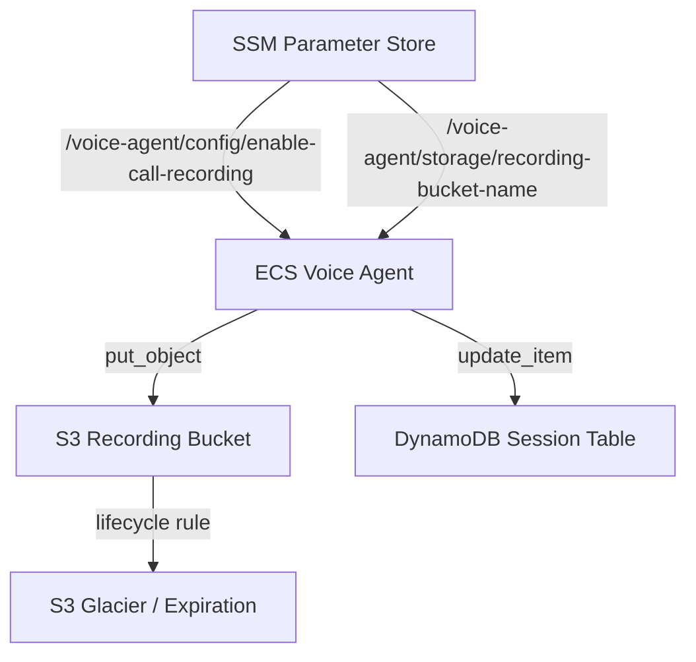

# Call Recording Capability

## Problem Statement

There is currently no way to record voice agent calls. Every call's audio is processed in real-time through the Pipecat pipeline (Daily WebRTC transport -> STT -> LLM -> TTS -> transport out) and discarded once the frames are consumed. This creates gaps in four critical areas:

- **Compliance auditing** -- Regulated industries (financial services, healthcare, insurance) require call recordings for audit trails. Without recordings, the voice agent cannot be deployed in these environments.
- **Quality assurance** -- Supervisors cannot review call audio to evaluate bot performance, detect hallucinations, or verify that the agent handled sensitive scenarios correctly (e.g., identity verification, escalation).
- **Agent training & tuning** -- Without recordings to replay, prompt engineering and conversation flow improvements rely on transcript logs alone, which lose tone, pacing, interruption context, and audio quality signals.
- **Dispute resolution** -- When a customer disputes what was said on a call, there is no audio evidence to reference. Only text transcripts (from `ConversationObserver`) exist, and those may contain STT errors.

## Vision

Add a `CallRecordingObserver` that captures both inbound (caller) and outbound (bot) audio streams during a call, writes them to S3 as a dual-channel WAV file at call end, and links the recording to the existing session tracking in DynamoDB. The feature is controlled by a feature flag and adds no latency to the real-time pipeline.

A future phase could expose recordings via a capability agent (A2A), enabling the LLM or downstream systems to trigger playback, search recordings, or feed them into post-call analytics.

## Scope

### Phase 1: Core Recording (this feature)

| Component | Description |
|---|---|
| `CallRecordingObserver` | New `BaseObserver` that intercepts `InputAudioRawFrame` (caller) and `TTSAudioRawFrame` (bot), accumulates PCM bytes in memory, writes a stereo WAV to S3 on `EndFrame` |
| S3 Recording Bucket | New S3 bucket with lifecycle policies (e.g., 90-day retention, Glacier transition) and server-side encryption |
| Session metadata | Update DynamoDB session record with S3 recording URI on call completion |
| Feature flag | `ENABLE_CALL_RECORDING` env var + SSM parameter `/voice-agent/config/enable-call-recording` |
| CDK infrastructure | S3 bucket, IAM permissions on ECS task role, SSM parameters |

### Phase 2: Post-Call Analytics (future)

- Recording capability agent (A2A) for searching/retrieving recordings
- Post-call transcription validation (compare STT transcripts against re-transcribed recordings)
- Sentiment/quality scoring on recorded audio
- Recording playback API

### What This Does NOT Include

- Real-time streaming of audio to external systems (would require a different architecture)
- Recording consent announcements (handled by the LLM system prompt, not infrastructure)
- DTMF tone capture (not available through the current Daily WebRTC transport)

## Technical Approach

### CallRecordingObserver

Follows the established `BaseObserver` pattern used by `AudioQualityObserver` (observability.py:287-506). The observer is non-blocking and does not intercept frames.

```python
import io
import wave
import boto3
from pipecat.observers.base_observer import BaseObserver
from pipecat.frames.frames import (
    InputAudioRawFrame,
    TTSAudioRawFrame,
    EndFrame,
)

class CallRecordingObserver(BaseObserver):
    """Records both caller and bot audio streams, writes stereo WAV to S3."""

    SAMPLE_RATE = 8000
    SAMPLE_WIDTH = 2  # 16-bit PCM
    CHANNELS = 2      # stereo: left=caller, right=bot

    def __init__(self, session_id: str, bucket_name: str):
        super().__init__()
        self._session_id = session_id
        self._bucket_name = bucket_name
        self._caller_buffer = bytearray()
        self._bot_buffer = bytearray()
        self._s3 = boto3.client("s3")

    async def on_push_frame(self, frame, direction, timestamp):
        if isinstance(frame, InputAudioRawFrame):
            self._caller_buffer.extend(frame.audio)
        elif isinstance(frame, TTSAudioRawFrame):
            self._bot_buffer.extend(frame.audio)
        elif isinstance(frame, EndFrame):
            await self._flush_to_s3()

    async def _flush_to_s3(self):
        stereo_pcm = self._interleave_stereo(
            self._caller_buffer, self._bot_buffer
        )
        wav_bytes = self._encode_wav(stereo_pcm)
        key = f"recordings/{self._session_id}.wav"
        self._s3.put_object(
            Bucket=self._bucket_name,
            Key=key,
            Body=wav_bytes,
            ContentType="audio/wav",
            Metadata={"session-id": self._session_id},
        )

    def _interleave_stereo(self, left: bytearray, right: bytearray) -> bytes:
        """Interleave two mono PCM streams into stereo.
        Pads the shorter stream with silence."""
        max_len = max(len(left), len(right))
        left = left.ljust(max_len, b'\x00')
        right = right.ljust(max_len, b'\x00')
        stereo = bytearray()
        for i in range(0, max_len, self.SAMPLE_WIDTH):
            stereo.extend(left[i:i + self.SAMPLE_WIDTH])
            stereo.extend(right[i:i + self.SAMPLE_WIDTH])
        return bytes(stereo)

    def _encode_wav(self, pcm_data: bytes) -> bytes:
        buf = io.BytesIO()
        with wave.open(buf, "wb") as wf:
            wf.setnchannels(self.CHANNELS)
            wf.setsampwidth(self.SAMPLE_WIDTH)
            wf.setframerate(self.SAMPLE_RATE)
            wf.writeframes(pcm_data)
        return buf.getvalue()
```

### Audio Sizing

At 8 kHz / 16-bit mono (16 KB/s per channel):

| Call Duration | Caller Stream | Bot Stream | Stereo WAV | With Compression |
|---|---|---|---|---|
| 1 minute | 960 KB | ~480 KB | ~2.9 MB | ~1.5 MB (gzip) |
| 5 minutes | 4.7 MB | ~2.4 MB | ~14.3 MB | ~7 MB |
| 30 minutes | 28 MB | ~14 MB | ~86 MB | ~43 MB |

Bot stream is typically shorter than caller stream (bot speaks less). Memory usage during a call is bounded by call duration.

### Memory Considerations

For very long calls (>30 min), in-memory buffering could consume significant memory. Mitigation strategies:

1. **Chunked upload**: Use S3 multipart upload, flushing every N minutes
2. **Temporary file**: Write to a local temp file instead of memory, upload at end
3. **Call duration limit**: Configure a max recording duration (e.g., 60 minutes)

The recommended approach for Phase 1 is in-memory buffering with a configurable max duration. The current ECS task has 2048 MB memory, and a 30-minute call uses ~86 MB -- well within limits.

### S3 Bucket Structure

```
s3://voice-agent-recordings-{env}-{account}/
  recordings/
    {session-id}.wav          # stereo WAV (left=caller, right=bot)
  metadata/
    {session-id}.json         # call metadata (duration, participants, timestamps)
```

### Infrastructure Changes



| Change | File | Description |
|---|---|---|
| New S3 bucket | `infrastructure/src/stacks/storage-stack.ts` | Recording bucket with encryption, lifecycle policies, block public access |
| IAM permissions | `infrastructure/src/stacks/ecs-stack.ts` | Grant `s3:PutObject` on recording bucket to ECS task role |
| SSM parameters | `infrastructure/src/ssm-parameters.ts` | Bucket name + feature flag parameters |
| Feature flag | `backend/voice-agent/app/services/config_service.py` | New `enable_call_recording` flag in `FeatureFlags` |
| Observer | `backend/voice-agent/app/recording.py` | New `CallRecordingObserver` class |
| Pipeline registration | `backend/voice-agent/app/pipeline_ecs.py` | Add observer to pipeline when feature flag enabled |
| S3 Gateway Endpoint | Already exists | `infrastructure/src/constructs/vpc-construct.ts:122` -- no change needed |

### Pipeline Integration

The observer is registered in `pipeline_ecs.py` alongside existing observers (lines 367-412):

```python
if feature_flags.enable_call_recording:
    recording_observer = CallRecordingObserver(
        session_id=config.call_id,
        bucket_name=os.environ["RECORDING_BUCKET_NAME"],
    )
    observers.append(recording_observer)
```

### Encryption & Compliance

- S3 server-side encryption (SSE-S3 or SSE-KMS) at rest
- TLS in transit (S3 Gateway Endpoint within VPC)
- Bucket policy denying unencrypted uploads
- Object Lock can be enabled for WORM compliance (e.g., SEC 17a-4, MiFID II)
- Lifecycle policies for retention management (configurable per regulatory requirement)

## Affected Areas

- New: `backend/voice-agent/app/recording.py`
- New: `backend/voice-agent/tests/test_recording.py`
- Modified: `backend/voice-agent/app/pipeline_ecs.py` -- register `CallRecordingObserver`
- Modified: `backend/voice-agent/app/services/config_service.py` -- add `enable_call_recording` flag
- Modified: `infrastructure/src/stacks/storage-stack.ts` -- add S3 recording bucket
- Modified: `infrastructure/src/stacks/ecs-stack.ts` -- add S3 IAM permissions
- Modified: `infrastructure/src/ssm-parameters.ts` -- add recording parameters

## Validation Criteria

- [ ] Stereo WAV file is written to S3 for each call when feature flag is enabled
- [ ] Left channel contains caller audio, right channel contains bot audio
- [ ] Audio is time-aligned (caller and bot audio correspond to correct points in conversation)
- [ ] WAV file is playable in standard audio tools (Audacity, VLC, browser)
- [ ] Recording does not add measurable latency to the real-time pipeline (<1ms overhead)
- [ ] DynamoDB session record is updated with S3 recording URI
- [ ] Feature flag `ENABLE_CALL_RECORDING=false` results in zero recording overhead
- [ ] S3 bucket has encryption enabled and public access blocked
- [ ] Lifecycle policies correctly transition/expire recordings
- [ ] Memory usage during a 30-minute call stays within ECS task limits
- [ ] Graceful handling of S3 upload failures (logged, does not crash pipeline)
- [ ] Recording works correctly when barge-in/interruption occurs

## Dependencies

- `pipecat` -- Existing pipeline framework (already in use)
- `boto3` -- S3 client (already a dependency)
- S3 Gateway VPC Endpoint -- Already provisioned in `vpc-construct.ts`
- DynamoDB Session Table -- Already provisioned in `session-table-construct.ts`

## Open Questions

1. **Retention policy**: What is the default retention period for recordings? 30 days? 90 days? Regulatory requirements vary by industry.
2. **Consent handling**: Should the bot announce "This call may be recorded" at the start? If so, this is a system prompt change, not an infrastructure change.
3. **Dual-channel vs. mixed**: Stereo (dual-channel) is better for analytics and QA (can isolate speakers). Should we also offer a mono mixdown option?
4. **Max call duration**: Should there be a configurable limit on recording length to bound memory usage?
5. **Access control**: Who should have access to recordings? Should there be a separate IAM policy for playback vs. recording?
