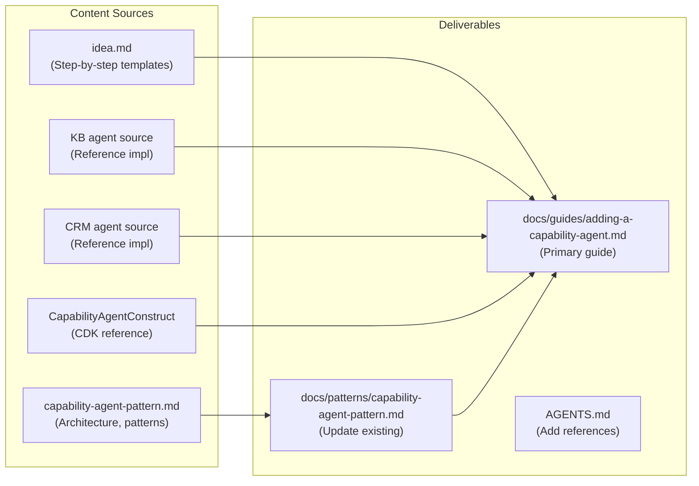

# Implementation Plan: Capability Agent Onboarding Guide

## Overview

Create a comprehensive, self-service developer guide that enables any engineer to build, deploy, and validate a new A2A capability agent without tribal knowledge or reverse-engineering existing implementations. The guide consolidates information currently spread across the `idea.md` (602 lines), `docs/patterns/capability-agent-pattern.md` (382 lines), and scattered references in AGENTS.md into a single authoritative walkthrough.

This is a **documentation-only** feature -- no application or infrastructure code changes. The deliverables are Markdown files with code templates, Mermaid architecture diagrams, a compatibility checklist, and troubleshooting table.

**Why now:** The `dynamic-capability-registry` and both reference agents (KB, CRM) shipped on 2026-02-20. The `a2a-latency-optimization` work (DirectToolExecutor pattern) also shipped. The architecture is stable enough to document authoritatively, and the `capability-registry-docs-rollout` feature in backlog depends on this guide existing.

## Scope



## Architecture Decisions

| # | Decision | Choice | Rationale |
|---|----------|--------|-----------|
| 1 | **Primary guide location** | `docs/guides/adding-a-capability-agent.md` | Separates the step-by-step walkthrough from the pattern reference doc. `docs/guides/` is the natural home for how-to content. |
| 2 | **Keep pattern doc separate** | Update `docs/patterns/capability-agent-pattern.md` in place | Pattern doc focuses on architecture decisions and execution patterns (DirectToolExecutor vs StrandsA2AExecutor). Guide focuses on the step-by-step workflow. Cross-reference rather than merge. |
| 3 | **Diagram format** | Mermaid (per AGENTS.md convention) | Replace ASCII art from `idea.md` with Mermaid. The pattern doc already uses Mermaid. |
| 4 | **Code templates** | Derive from actual KB/CRM agent source | Templates must match the real implementations. Extract from `backend/agents/knowledge-base-agent/main.py` and `backend/agents/crm-agent/main.py`, not from outdated API references. |
| 5 | **API version** | Document `A2AServer` from `strands.multiagent.a2a` | The pattern doc references `A2AStarletteApplication` and `DefaultRequestHandler` which are outdated. Update to match actual imports in shipped agents. |
| 6 | **Deduplication strategy** | Guide = comprehensive walkthrough; Pattern doc = architecture reference; idea.md = archived | Avoid three docs covering the same content. idea.md stays as the feature record but the guide becomes the canonical developer resource. |

## Implementation Steps

### Phase 1: Create the Primary Developer Guide

Create `docs/guides/adding-a-capability-agent.md` -- the end-to-end walkthrough.

**1.1 Prerequisites and overview section**
- [ ] Write prerequisites (ECS stack deployed, SSM flag enabled, Python 3.12+, Docker, CDK)
- [ ] Add Mermaid architecture diagram showing the hub-and-spoke discovery flow (convert ASCII art from `idea.md` lines 35-73)
- [ ] Explain the auto-discovery lifecycle: CDK deploy -> ECS registers in CloudMap -> AgentRegistry polls -> Agent Card fetched -> skills mapped to tools

**1.2 Decision: choose your execution pattern**
- [ ] Document the two patterns with decision matrix:
  - `DirectToolExecutor` -- single-tool agents, ~323ms latency, bypasses inner LLM
  - `StrandsA2AExecutor` (default) -- multi-tool agents, ~2,742ms, uses inner LLM for reasoning
- [ ] Include the decision flowchart (already exists as Mermaid in pattern doc, adapt for guide)
- [ ] Reference `docs/patterns/capability-agent-pattern.md` for deeper architecture details

**1.3 Step-by-step: Python agent application**
- [ ] Step 1: Create agent directory (`backend/agents/my-agent/`)
- [ ] Step 2: Write `main.py` with annotated template
  - `_get_task_private_ip()` boilerplate (note: duplicated across both agents, required for Agent Card)
  - `@tool` function with detailed docstring guidance (the LLM reads these for tool selection)
  - `Agent` + `A2AServer` setup
  - Optional: `DirectToolExecutor` pattern for single-tool agents
- [ ] Step 3: Create `requirements.txt` (base: `strands-agents[a2a]>=1.27.0`, `requests>=2.31.0`)
- [ ] Step 4: Create `Dockerfile` (python:3.12-slim, curl for health check, appuser, port 8000)
- [ ] Highlight critical requirement: `HEALTHCHECK` targets `/.well-known/agent-card.json` (not `/health`)

**1.4 Step-by-step: CDK infrastructure**
- [ ] Step 5: Create CDK stack using `CapabilityAgentConstruct`
  - SSM parameter import pattern (`valueFromLookup` for VPC, `valueForStringParameter` for everything else)
  - `DockerImageAsset` for container image
  - `CapabilityAgentConstruct` props reference
  - ECR pull grant
- [ ] Step 6: Register the stack
  - Export from `infrastructure/src/stacks/index.ts`
  - Instantiate in `infrastructure/src/main.ts` (next Phase number)
  - Add dependency on `ecsStack`
- [ ] Document what `CapabilityAgentConstruct` creates (SG, log group, IAM roles, task def, CloudMap service, Fargate service)

**1.5 Deploy and verify**
- [ ] Step 7: Deploy commands (`aws ssm put-parameter` for feature flag, `npx cdk deploy`)
- [ ] Step 8: Verification checklist
  - Voice agent logs show `agent_registry_agent_discovered`
  - Agent Card accessible at `/.well-known/agent-card.json`
  - Tool appears in LLM tool list

**1.6 Compatibility checklist**
- [ ] Port checklist from `idea.md` (lines 556-568) with all 13 items
- [ ] Format as a copy-paste-friendly checklist developers can use before deploying

**1.7 Troubleshooting table**
- [ ] Port troubleshooting table from `idea.md` (lines 573-581)
- [ ] Add any new issues discovered since the original idea was written

**1.8 Tool description best practices**
- [ ] Write guidance on `@tool` docstring quality (the LLM reads these, not agent descriptions)
- [ ] List existing tool names to avoid conflicts: `search_knowledge_base`, `lookup_customer`, `create_support_case`, `add_case_note`, `verify_account_number`, `verify_recent_transaction`, `transfer_call`, `get_current_time`
- [ ] Include good vs. bad docstring examples

### Phase 2: Update Existing Pattern Document

Update `docs/patterns/capability-agent-pattern.md` to fix outdated API references and cross-reference the new guide.

**2.1 Fix API references**
- [ ] Replace `A2AStarletteApplication` references with `A2AServer` from `strands.multiagent.a2a`
- [ ] Replace `DefaultRequestHandler` references with actual Strands patterns
- [ ] Verify all code snippets match current `backend/agents/` implementations

**2.2 Add cross-references**
- [ ] Add link to the new guide at the top: "For a step-by-step walkthrough, see [Adding a Capability Agent](../guides/adding-a-capability-agent.md)"
- [ ] Add link to `CapabilityAgentConstruct` CDK reference

**2.3 Update SSM parameter documentation**
- [ ] Document all SSM parameters used by agent stacks:
  - `/voice-agent/a2a/namespace-id`
  - `/voice-agent/a2a/namespace-name`
  - `/voice-agent/config/enable-capability-registry`
  - `/voice-agent/a2a/poll-interval-seconds`
  - `/voice-agent/a2a/tool-timeout-seconds`

### Phase 3: Update AGENTS.md

**3.1 Add A2A configuration section**
- [ ] Add env vars to the table: `A2A_NAMESPACE`, `A2A_CACHE_TTL_SECONDS`, `A2A_CACHE_MAX_SIZE`
- [ ] Reference the new guide and pattern doc
- [ ] Ensure capability agent SSM parameters are documented

**3.2 Validate existing content**
- [ ] Confirm all env vars in AGENTS.md are still accurate
- [ ] Confirm all CloudWatch metrics and alarms are current

### Phase 4: Validation

**4.1 Walkthrough test**
- [ ] Follow the guide end-to-end as a reader to verify completeness
- [ ] Confirm all file paths referenced in the guide exist in the codebase
- [ ] Confirm all code templates compile/pass linting

**4.2 Cross-reference audit**
- [ ] Verify links between guide, pattern doc, and AGENTS.md work
- [ ] Verify no content is duplicated across the three docs (each has a distinct purpose)

## Open Questions

| Question | Impact | Resolution Needed By |
|----------|--------|---------------------|
| Should `_get_task_private_ip()` be extracted to a shared utility module? | Reduces boilerplate in guide template, but is a code change | Defer -- note as "future improvement" in guide |
| Should we include a `cookiecutter` or template generator? | Lowers barrier further but adds maintenance | Defer -- manual copy-paste from guide is sufficient for now |
| Should the guide include local development/testing instructions (outside ECS)? | Useful for development iteration speed | Phase 1 -- include a "Local Testing" section |

## Risks & Mitigations

| Risk | Impact | Mitigation |
|------|--------|------------|
| Guide goes stale as Strands SDK evolves | Developers hit API mismatches | Pin `strands-agents[a2a]>=1.27.0` version in guide. Note in guide header that templates are verified against specific SDK version. |
| `docs/patterns/capability-agent-pattern.md` and new guide diverge over time | Conflicting information confuses developers | Clear separation of concerns: pattern doc = architecture decisions, guide = how-to walkthrough. Cross-reference, don't duplicate. |
| ASCII-to-Mermaid conversion loses nuance | Diagrams less readable | Review Mermaid output against original ASCII art for completeness |

## Dependencies

- `dynamic-capability-registry` (shipped 2026-02-20) -- The architecture being documented
- `a2a-latency-optimization` (in-progress) -- DirectToolExecutor pattern to document
- `knowledge-base-capability-agent` (shipped 2026-02-20) -- Reference implementation #1
- `crm-capability-agent` (shipped 2026-02-20) -- Reference implementation #2
- No code dependencies -- this is documentation only

## File Changes

```
New:
  docs/guides/adding-a-capability-agent.md    # Primary developer guide (~400 lines)
  .opencode/skills/create-capability-agent/SKILL.md  # OpenCode skill for scaffolding agents

Modified:
  docs/patterns/capability-agent-pattern.md   # Fix outdated API refs, add cross-references
  AGENTS.md                                   # Add A2A configuration references
  README.md                                   # Add Developer Guides section, update project tree
  ARCHITECTURE.md                             # Add cross-reference in A2A section
  infrastructure/DEPLOYMENT.md                # Add cross-reference in Step 9
  backend/voice-agent/README.md               # Add cross-reference in Features
```

## Success Criteria

- [ ] Developer can add a new capability agent by following the guide alone -- no need to read KB/CRM agent source code
- [ ] Guide covers all three layers: Python application, Docker container, CDK infrastructure
- [ ] Both execution patterns documented (DirectToolExecutor and StrandsA2AExecutor) with decision criteria
- [ ] All code templates use current API (`A2AServer` from `strands.multiagent.a2a`, not `A2AStarletteApplication`)
- [ ] Compatibility checklist covers all 13 deployment requirements
- [ ] Troubleshooting table covers most frequent issues
- [ ] All diagrams use Mermaid format (per AGENTS.md convention)
- [ ] Pattern doc updated with correct API references
- [ ] No content duplication between guide, pattern doc, and AGENTS.md

## Estimated Effort

| Phase | Effort |
|-------|--------|
| Phase 1: Primary developer guide | 3-4 hours |
| Phase 2: Update pattern document | 1 hour |
| Phase 3: Update AGENTS.md | 0.5 hours |
| Phase 4: Validation walkthrough | 1 hour |
| **Total** | **~6 hours** |

## Progress Log

| Date | Update |
|------|--------|
| 2026-02-23 | Plan created. Analyzed idea.md (602 lines), existing pattern doc (382 lines, has outdated API refs), two reference implementations (KB agent, CRM agent), CapabilityAgentConstruct (336 lines), and A2A discovery code (4 files). Identified three deliverables: new guide, pattern doc update, AGENTS.md update. Key finding: pattern doc references `A2AStarletteApplication` which doesn't match actual implementations using `A2AServer`. |
| 2026-02-23 | **All phases complete.** (1) Created `docs/guides/adding-a-capability-agent.md` (~400 lines): 8-step walkthrough with Mermaid sequence diagram and flowchart, code templates derived from actual KB/CRM agents, DirectToolExecutor pattern, CDK stack template, compatibility checklist (14 items), tool description best practices, troubleshooting table (8 rows), existing tool names table. (2) Updated `docs/patterns/capability-agent-pattern.md`: replaced all `A2AStarletteApplication`/`DefaultRequestHandler` references with `A2AServer` from `strands.multiagent.a2a`, fixed `DirectToolExecutor` code snippet to match shipped KB agent (async `updater.update_status()`, `new_agent_message()`, typed `RequestContext`), updated Dockerfile template (added curl, appuser, HEALTHCHECK), updated CDK template (full SSM import pattern), added `_get_task_private_ip()` to step-by-step template, added cross-references to new guide. (3) Updated `AGENTS.md`: added cross-references to both guide and pattern doc. (4) Validation: all 9 file path references verified, all 7 cross-references verified, zero stale API references remaining, all Mermaid diagrams valid. |
| 2026-02-23 | **Additional enhancements.** (1) Added "Why ECS Fargate?" section to the guide explaining the architectural rationale (ECS vs Lambda comparison table covering cold start, CloudMap integration, Strands compatibility, resource control, and cost). (2) Created OpenCode skill at `.opencode/skills/create-capability-agent/SKILL.md` -- enables `skill({ name: "create-capability-agent" })` to scaffold all files for a new agent with step-by-step instructions. (3) Added cross-references to the guide from: `README.md` (new "Developer Guides" section + updated project tree), `ARCHITECTURE.md` (A2A architecture section), `infrastructure/DEPLOYMENT.md` (Step 9), `backend/voice-agent/README.md` (Features list). |
