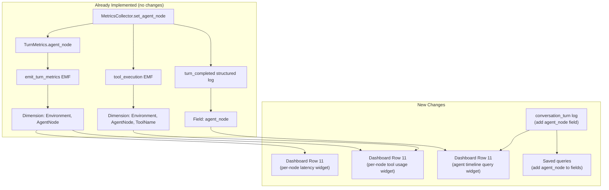

# Implementation Plan: Agent Node Identity in Dashboard

## Overview

The voice agent pipeline already emits `AgentNode` as a CloudWatch metric dimension in `turn_metrics` and `tool_execution` EMF events, and records `agent_node` in structured logs for `turn_completed` and `tool_execution` events. However, the CloudWatch dashboard and saved Log Insights queries do not surface this information. Operators reviewing multi-agent calls cannot tell which specialist agent (KB, CRM, Appointment) handled each conversation turn without manually parsing raw JSON logs.

This feature closes the consumption gap by:

1. Adding `agent_node` to the `conversation_turn` structured log event so Log Insights queries can attribute turns to agents
2. Adding per-agent-node metric widgets to dashboard Row 11 (Multi-Agent Flows)
3. Adding a new agent timeline Log Insights query widget
4. Updating existing saved queries to include the `agent_node` field

No new metrics or dimensions need to be emitted -- the data is already there. This is purely a dashboard and log enrichment change.

## Architecture



## Architecture Decisions

| # | Decision | Rationale |
|---|----------|-----------|
| 1 | Use SEARCH expressions for per-agent-node widgets | Agent node names are dynamically discovered via CloudMap. SEARCH expressions automatically pick up new dimensions without dashboard redeployment. |
| 2 | Add Log Insights query widget for agent timeline, not a custom metric widget | A timeline showing agent progression per call is inherently log-based (shows sequence). A metric widget would only show aggregate counts. |
| 3 | Do not add `AgentNode` dimension to `call_summary` EMF | Call summaries are per-call aggregates. Adding AgentNode would require emitting multiple summary records per call (one per agent visited), adding complexity without clear value. |
| 4 | Add `agent_node` to `conversation_turn` log using existing collector reference | The `ConversationObserver` already holds a reference to `MetricsCollector` (as `self._collector`). Reading `self._collector.agent_node` is zero-cost and requires no new plumbing. |
| 5 | Keep existing Row 11 widgets, add new ones alongside | The current transition-count and transition-latency widgets remain useful for aggregate monitoring. Per-node widgets complement them. |

## Implementation Steps

### Step 1: Add `agent_node` to `conversation_turn` Log Event

**File**: `backend/voice-agent/app/observability.py` (lines 309-320)

The `_log_conversation_turn` method in `ConversationObserver` does not include `agent_node`. Add it.

- [ ] Read `self._collector.agent_node` and include it in the `conversation_turn` log event
- [ ] Only include when not `None` to avoid cluttering single-agent call logs

```python
def _log_conversation_turn(self, speaker: str, content: str) -> None:
    turn_number = self._collector.turn_count or 1
    log_kwargs: dict[str, Any] = dict(
        call_id=self._collector.call_id,
        session_id=self._collector.session_id,
        turn_number=turn_number,
        speaker=speaker,
        content=content,
    )
    agent_node = self._collector.agent_node
    if agent_node is not None:
        log_kwargs["agent_node"] = agent_node
    logger.info("conversation_turn", **log_kwargs)
```

### Step 2: Add Per-Agent-Node Latency Widget to Dashboard Row 11

**File**: `infrastructure/src/constructs/voice-agent-monitoring-construct.ts` (after line ~1631)

Add a new widget using a SEARCH expression to show `AgentResponseLatency` broken down by `AgentNode` dimension.

- [ ] Add a `GraphWidget` with SEARCH expression: `SEARCH('{VoiceAgent/Pipeline,Environment,AgentNode} MetricName="AgentResponseLatency"', 'Average', 60)`
- [ ] Set width to 8, height 6
- [ ] Title: "Response Latency by Agent Node"
- [ ] Use left Y-axis label "ms"

```typescript
new cw.GraphWidget({
  title: 'Response Latency by Agent Node',
  width: 8,
  height: 6,
  left: [
    new cw.MathExpression({
      expression: `SEARCH('{VoiceAgent/Pipeline,Environment,AgentNode} MetricName="AgentResponseLatency"', 'Average', 60)`,
      label: '',
      period: cdk.Duration.minutes(1),
    }),
  ],
  leftYAxis: { label: 'ms', min: 0 },
  period: cdk.Duration.minutes(1),
}),
```

### Step 3: Add Per-Agent-Node Tool Usage Widget to Dashboard Row 11

**File**: `infrastructure/src/constructs/voice-agent-monitoring-construct.ts` (after Step 2 widget)

Add a widget showing `ToolExecutionTime` by `AgentNode` and `ToolName`.

- [ ] Add a `GraphWidget` with SEARCH expression: `SEARCH('{VoiceAgent/Pipeline,Environment,AgentNode,ToolName} MetricName="ToolExecutionTime"', 'Average', 60)`
- [ ] Set width to 8, height 6
- [ ] Title: "Tool Execution by Agent Node"

```typescript
new cw.GraphWidget({
  title: 'Tool Execution by Agent Node',
  width: 8,
  height: 6,
  left: [
    new cw.MathExpression({
      expression: `SEARCH('{VoiceAgent/Pipeline,Environment,AgentNode,ToolName} MetricName="ToolExecutionTime"', 'Average', 60)`,
      label: '',
      period: cdk.Duration.minutes(1),
    }),
  ],
  leftYAxis: { label: 'ms', min: 0 },
  period: cdk.Duration.minutes(1),
}),
```

### Step 4: Add Agent Timeline Log Insights Query Widget

**File**: `infrastructure/src/constructs/voice-agent-monitoring-construct.ts` (after Step 3 widget)

Add a Log Insights query widget that shows agent node progression over time, giving operators a visual timeline of which agent handled which turns.

- [ ] Add a `LogQueryWidget` querying for `turn_completed` and `agent_transition` events
- [ ] Set width to 8, height 6
- [ ] Title: "Agent Node Timeline (Last 1h)"
- [ ] Query groups by `agent_node` and shows turn counts

```typescript
new cw.LogQueryWidget({
  title: 'Agent Node Timeline (Last 1h)',
  width: 8,
  height: 6,
  logGroupNames: [props.logGroupName],
  queryLines: [
    'fields @timestamp, agent_node, event',
    'filter event = "turn_completed" and agent_node != ""',
    'stats count(*) as turns by agent_node, bin(5m)',
  ],
  view: cw.LogQueryVisualizationType.BAR,
}),
```

### Step 5: Update Saved Log Insights Queries

**File**: `infrastructure/src/constructs/voice-agent-monitoring-construct.ts` (lines 1636-1773)

Update existing saved queries to include `agent_node` where relevant.

- [ ] **`flow-conversation-trace`** (line ~1765): Add `agent_node` to the `fields` list
  ```
  fields @timestamp, event, speaker, content, agent_node, from_node, to_node, reason, turn_number
  ```

- [ ] **`conversation-flow`** (line ~1682): Add `agent_node` to the `fields` list
  ```
  fields @timestamp, turn_number, speaker, content, agent_node
  ```

- [ ] **`trace-call`** (line ~1729): Add `agent_node` to the `fields` list

- [ ] Add new saved query **`agent-node-progression`**: Shows the agent node sequence for a specific call
  ```
  fields @timestamp, event, agent_node, from_node, to_node, reason, content
  | filter call_id = "CALL_ID_PLACEHOLDER"
  | filter event in ["turn_completed", "agent_transition", "conversation_turn"]
  | sort @timestamp asc
  ```

### Step 6: Update Unit Tests

- [ ] **`backend/voice-agent/tests/test_observability.py`**: Add test that `conversation_turn` log event includes `agent_node` when set on the collector
- [ ] **`backend/voice-agent/tests/test_observability.py`**: Add test that `conversation_turn` log event omits `agent_node` when collector has no agent_node set

```python
def test_conversation_turn_includes_agent_node(self):
    """conversation_turn log should include agent_node when set."""
    self.collector.set_agent_node("kb_agent")
    observer = ConversationObserver(self.collector)
    observer._log_conversation_turn("assistant", "Here is what I found.")
    # Assert the structured log includes agent_node="kb_agent"

def test_conversation_turn_omits_agent_node_when_none(self):
    """conversation_turn log should omit agent_node in single-agent mode."""
    observer = ConversationObserver(self.collector)
    observer._log_conversation_turn("assistant", "Hello!")
    # Assert the structured log does NOT contain agent_node key
```

### Step 7: Update CDK Snapshot Tests

- [ ] Run `npx jest --updateSnapshot` in `infrastructure/` to update CDK snapshot after dashboard changes
- [ ] Verify snapshot diff only contains the expected new widgets and query changes

## Testing Strategy

| Layer | What | How |
|-------|------|-----|
| Unit | `conversation_turn` includes `agent_node` | Mock collector, verify log output |
| Unit | `conversation_turn` omits `agent_node` when None | Verify log output without agent_node |
| CDK Snapshot | Dashboard widget count increases, new queries appear | `npx jest` in infrastructure/ |
| Integration | Deploy to dev, make multi-agent call, verify dashboard | Visual inspection of Row 11 widgets |
| Integration | Verify saved queries return `agent_node` field | Run each query in CloudWatch console |

## Risks & Mitigations

| Risk | Impact | Likelihood | Mitigation |
|------|--------|------------|------------|
| SEARCH expressions return no data if no multi-agent calls have occurred | Low -- widgets show "No data" | Medium | Add annotation note on widget explaining data appears only during multi-agent calls |
| High cardinality from dynamic agent node names | Medium -- CloudWatch custom metric costs | Low | Agent nodes are bounded by deployed capability agents (typically 3-5). CloudMap discovery keeps this controlled. |
| LogQueryWidget timeout on large log groups | Low -- query returns partial results | Low | Scope queries to 1h default time range; the `bin(5m)` aggregation keeps result sets small |

## Dependencies

| Dependency | Type | Status |
|------------|------|--------|
| `MetricsCollector.agent_node` property | Internal | Already implemented |
| `emit_turn_metrics` with `AgentNode` dimension | Internal | Already implemented |
| `emit_tool_metrics` with `AgentNode` dimension | Internal | Already implemented |
| Multi-agent handoff feature | Internal | Shipped (`multi-agent-handoff`) |

## File Changes Summary

| File | Change Type | Description |
|------|-------------|-------------|
| `backend/voice-agent/app/observability.py` | Modify | Add `agent_node` to `_log_conversation_turn` |
| `infrastructure/src/constructs/voice-agent-monitoring-construct.ts` | Modify | Add 3 new widgets to Row 11, update 3 saved queries, add 1 new saved query |
| `backend/voice-agent/tests/test_observability_metrics.py` | Modify | Add 2 unit tests for `conversation_turn` agent_node inclusion |

## Success Criteria

- [x] `conversation_turn` structured log events include `agent_node` field during multi-agent calls
- [x] Dashboard Row 11 shows per-agent-node response latency breakdown via SEARCH expression
- [x] Dashboard Row 11 shows per-agent-node tool execution breakdown via SEARCH expression
- [x] Dashboard Row 11 shows agent node timeline bar chart from Log Insights
- [x] Saved queries `flow-conversation-trace`, `conversation-flow`, and `trace-call` include `agent_node` in their field lists
- [x] New `agent-node-progression` saved query returns chronological agent sequence for a given call_id
- [x] All existing tests continue to pass (194/194 CDK tests green)
- [x] New unit tests validate `agent_node` presence/absence in `conversation_turn` logs

## Progress Log

| Date | Update |
|------|--------|
| 2026-03-05 | Plan created. Investigation confirmed `AgentNode` dimension is already emitted in EMF metrics but not consumed by dashboard widgets or saved queries. |
| 2026-03-05 | Implementation complete. Added `agent_node` to `conversation_turn` log, 3 new dashboard widgets (Response Latency by Agent Node, Tool Execution by Agent Node, Agent Node Timeline), updated 3 saved queries, added 1 new saved query, added 2 unit tests. All 194 CDK tests pass. |
