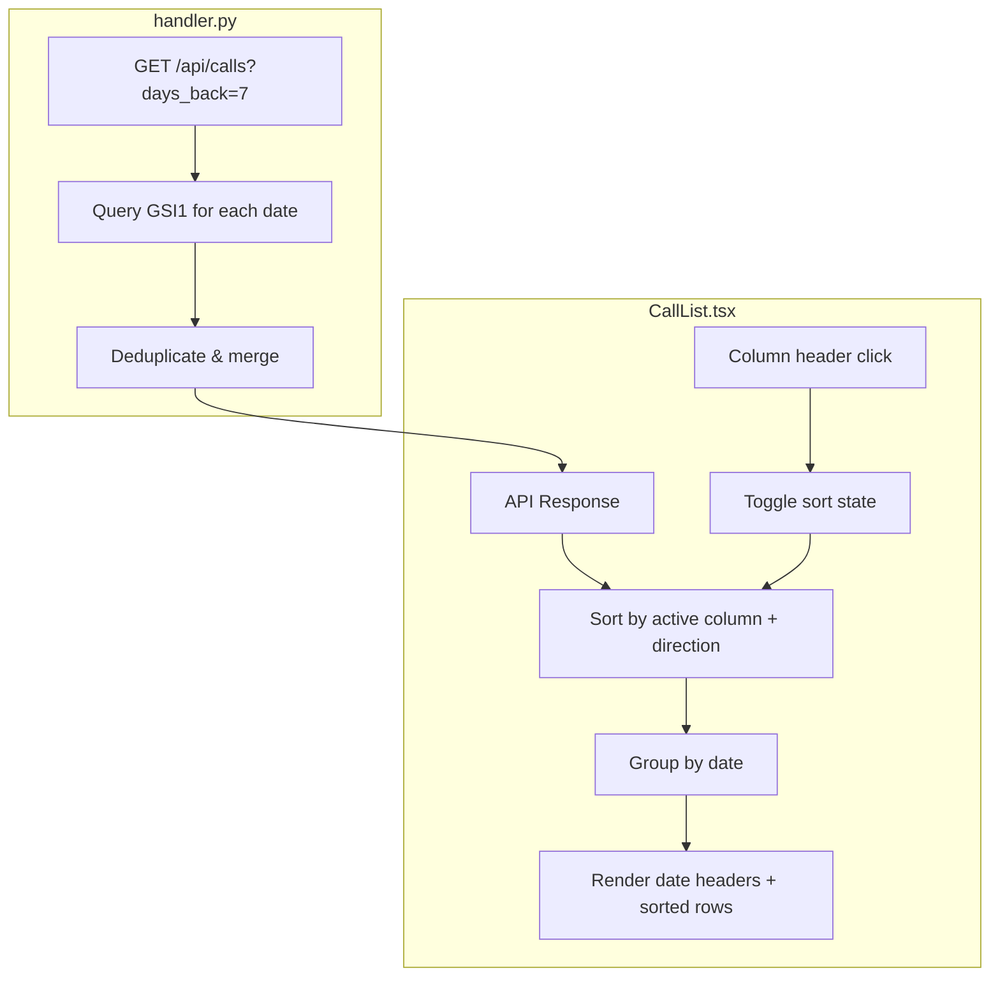

# Implementation Plan: Dashboard Call List Sorting & Date Grouping

## Overview

The Call Flow Visualizer's call list table currently renders rows in whatever order the backend returns them (DynamoDB GSI1 sort key order, which is `DISP#{status}#{call_id}` -- effectively random within a day). There are no sortable column headers and no visual grouping. The date picker limits the view to a single day with no cross-day context.

This plan adds client-side column sorting with a sensible default (latest calls at top), replaces the single-date picker with automatic date-grouped display, and modifies the backend API to support a multi-day date range so users can see recent call history at a glance.

## Architecture



## Architecture Decisions

| # | Decision | Choice | Rationale |
|---|----------|--------|-----------|
| 1 | Sorting location | Client-side only | Expected volumes are tens to low hundreds of calls per day. Client-side sorting avoids backend changes and provides instant UI feedback on column clicks. |
| 2 | Default sort | Time descending (latest at top) | Operators care about the most recent calls first. This matches the convention of log viewers and monitoring dashboards. |
| 3 | Date range approach | Add `days_back` param, remove single-date picker | A `days_back` parameter (default 7) replaces the `date_from` single-date filter. The backend queries multiple date partitions and returns combined results. The frontend groups them under date headers. |
| 4 | Date grouping | Collapsible date headers in the table | Provides visual separation by day without requiring navigation. All groups start expanded; users can collapse older days to focus. |
| 5 | Sort persistence | React state only (no localStorage) | Keeping it simple for v1. The default (time descending) is the most useful view. Users can change it per session. |

## Implementation Steps

### Phase 1: Add sort types and utility functions

**1.1 Add sort types to `types/index.ts`**

- [ ] Add `SortColumn` type union and `SortDirection` type
- [ ] Add `SortState` interface

```typescript
export type SortColumn =
  | 'timestamp'
  | 'duration_seconds'
  | 'turn_count'
  | 'avg_response_ms'
  | 'avg_rms_db'
  | 'status';

export type SortDirection = 'asc' | 'desc';

export interface SortState {
  column: SortColumn;
  direction: SortDirection;
}
```

**1.2 Add `sortCalls` utility function**

- [ ] Create `frontend/call-flow-visualizer/src/utils/sorting.ts`
- [ ] Implement generic comparator that handles nullable fields (nulls sort last)
- [ ] String columns (`status`) sort alphabetically; numeric columns sort numerically; `timestamp` sorts as ISO string comparison

```typescript
import type { CallListItem, SortColumn, SortDirection } from '../types';

export function sortCalls(
  calls: CallListItem[],
  column: SortColumn,
  direction: SortDirection
): CallListItem[] {
  const sorted = [...calls].sort((a, b) => {
    const aVal = a[column];
    const bVal = b[column];
    // Nulls always sort last regardless of direction
    if (aVal == null && bVal == null) return 0;
    if (aVal == null) return 1;
    if (bVal == null) return -1;
    if (typeof aVal === 'string' && typeof bVal === 'string') {
      return aVal.localeCompare(bVal);
    }
    return (aVal as number) - (bVal as number);
  });
  return direction === 'desc' ? sorted.reverse() : sorted;
}
```

**1.3 Add `groupCallsByDate` utility function**

- [ ] Create `frontend/call-flow-visualizer/src/utils/grouping.ts`
- [ ] Group calls by calendar date extracted from `timestamp`
- [ ] Return an ordered array of `{ date: string; label: string; calls: CallListItem[] }` sorted with most recent date first

```typescript
import type { CallListItem } from '../types';

export interface DateGroup {
  date: string;      // YYYY-MM-DD
  label: string;     // "March 5, 2026"
  calls: CallListItem[];
}

export function groupCallsByDate(calls: CallListItem[]): DateGroup[] {
  const groups = new Map<string, CallListItem[]>();
  for (const call of calls) {
    const date = call.timestamp.slice(0, 10); // YYYY-MM-DD
    if (!groups.has(date)) groups.set(date, []);
    groups.get(date)!.push(call);
  }
  return Array.from(groups.entries())
    .sort(([a], [b]) => b.localeCompare(a)) // newest date first
    .map(([date, calls]) => ({
      date,
      label: new Date(date + 'T00:00:00').toLocaleDateString('en-US', {
        month: 'long', day: 'numeric', year: 'numeric',
      }),
      calls,
    }));
}
```

### Phase 2: Update CallList component with sorting and date grouping

**2.1 Add sort state and click handlers**

- [ ] Add `sortState` to component state, defaulting to `{ column: 'timestamp', direction: 'desc' }`
- [ ] Add `handleSort(column)` that toggles direction if same column, or sets new column with default direction
- [ ] Wire `<th>` elements with `onClick` handlers and sort indicators

**2.2 Replace date picker with days-back selector**

- [ ] Remove the `<input type="date">` element
- [ ] Add a `daysBack` state (default: 7) with a simple dropdown: "Today", "Last 3 days", "Last 7 days", "Last 30 days"
- [ ] Update `loadCalls()` to pass `days_back` instead of `date_from`

**2.3 Render date-grouped table with collapsible sections**

- [ ] Apply `sortCalls()` to the full call list
- [ ] Apply `groupCallsByDate()` to the sorted results
- [ ] Render each group with a date header row (`<tr>` with `colSpan={7}`)
- [ ] Add collapsed state tracking per date group
- [ ] Date header row is clickable to toggle collapse
- [ ] Update empty-state message from "No calls found for {dateFrom}" to "No calls found"

**2.4 Updated component structure**

```tsx
const [calls, setCalls] = useState<CallListItem[]>([]);
const [sortState, setSortState] = useState<SortState>({
  column: 'timestamp', direction: 'desc'
});
const [daysBack, setDaysBack] = useState(7);
const [collapsedDates, setCollapsedDates] = useState<Set<string>>(new Set());

const sortedCalls = useMemo(
  () => sortCalls(calls, sortState.column, sortState.direction),
  [calls, sortState]
);
const dateGroups = useMemo(
  () => groupCallsByDate(sortedCalls),
  [sortedCalls]
);
```

### Phase 3: Add CSS for sortable headers and date group rows

**3.1 Sortable header styles**

- [ ] Add `.sortable-header` class with cursor pointer and hover state
- [ ] Add `.sort-indicator` for the arrow icon (up/down triangle)
- [ ] Add `.sort-active` to highlight the currently sorted column header

```css
.call-list-table th.sortable-header {
  cursor: pointer;
  user-select: none;
  position: relative;
  padding-right: 18px;
}
.call-list-table th.sortable-header:hover {
  color: var(--color-text);
}
.sort-indicator {
  position: absolute;
  right: 4px;
  top: 50%;
  transform: translateY(-50%);
  font-size: 10px;
  opacity: 0.3;
}
.sort-active .sort-indicator {
  opacity: 1;
  color: var(--color-accent);
}
```

**3.2 Date group header styles**

- [ ] Add `.date-group-header` class for the date separator row
- [ ] Style as a visually distinct row with background color, bold text, and collapse toggle

```css
.date-group-header td {
  background: var(--color-surface);
  font-weight: 600;
  font-size: 13px;
  padding: 10px 12px;
  cursor: pointer;
  user-select: none;
  border-bottom: 1px solid var(--color-border);
}
.date-group-header td:hover {
  background: var(--color-surface-hover, #2a2a2a);
}
.date-group-header .collapse-icon {
  display: inline-block;
  width: 16px;
  margin-right: 8px;
  transition: transform 0.15s ease;
}
.date-group-header.collapsed .collapse-icon {
  transform: rotate(-90deg);
}
```

**3.3 Days-back selector styles**

- [ ] Style the dropdown to match existing `.search-bar select` patterns (already defined in `timeline.css`)

### Phase 4: Update backend API for multi-day queries

**4.1 Add `days_back` parameter to `_handle_list_calls`**

- [ ] Accept `days_back` query param (default 1, max 30)
- [ ] When `days_back > 1` and no explicit `date_from`, compute date range from today back N days
- [ ] Query each date's GSI1 partition and combine results
- [ ] Maintain backward compatibility: if `date_from` is provided, use single-day behavior

```python
days_back = min(int(params.get("days_back", "1")), 30)

if not date_from:
    from datetime import datetime, timezone, timedelta
    today = datetime.now(tz=timezone.utc).date()
    dates = [(today - timedelta(days=i)).isoformat() for i in range(days_back)]
else:
    dates = [date_from]

all_items = []
for d in dates:
    query_kwargs["KeyConditionExpression"] = Key("GSI1PK").eq(f"DATE#{d}")
    response = events_table.query(**query_kwargs)
    all_items.extend(response.get("Items", []))
```

**4.2 Update API client to pass `days_back`**

- [ ] Add `days_back` to the `listCalls` params interface
- [ ] Pass it as a query parameter when set

### Phase 5: Testing and validation

**5.1 Unit tests for sorting utility**

- [ ] Test ascending and descending sort for each column type (string, number, timestamp)
- [ ] Test null values sort last in both directions
- [ ] Test empty array returns empty array

**5.2 Unit tests for grouping utility**

- [ ] Test calls from multiple days are grouped correctly
- [ ] Test groups are ordered newest-first
- [ ] Test single-day calls produce one group
- [ ] Test empty array returns empty groups

**5.3 Manual validation**

- [ ] Verify default view shows latest calls at top
- [ ] Verify clicking a column header sorts ascending, clicking again sorts descending
- [ ] Verify the sort arrow indicator appears on the active column
- [ ] Verify date groups display with correct date labels
- [ ] Verify collapsing/expanding date groups works
- [ ] Verify "Last 7 days" loads calls from multiple days
- [ ] Verify row click still navigates to call detail view

## Testing Strategy

| Test | Type | Description |
|------|------|-------------|
| `sortCalls` ascending/descending | Unit | Verify each sortable column produces correct order |
| `sortCalls` null handling | Unit | Verify nulls sort to bottom regardless of direction |
| `groupCallsByDate` multi-day | Unit | Verify correct grouping and newest-first ordering |
| `groupCallsByDate` edge cases | Unit | Empty input, single call, calls at midnight boundary |
| Column header interaction | Manual | Click headers, verify sort toggles and indicator updates |
| Date grouping display | Manual | Load multi-day data, verify groups render correctly |
| Collapse/expand groups | Manual | Click date headers, verify rows hide/show |
| Backend `days_back` param | Manual | Verify API returns calls from multiple days |
| Backward compat | Manual | Verify `date_from` param still works for single-day queries |

## Risks & Mitigations

| Risk | Severity | Mitigation |
|------|----------|------------|
| Multi-day query increases DynamoDB read cost | Low | Default to 7 days, cap at 30. Read volumes are trivial at expected call volumes. |
| Large call volumes cause slow client-side sorting | Low | Existing limit of 50 calls per page. `useMemo` ensures sorting only runs when data changes. |
| Multi-date GSI1 queries add backend latency | Low | Queries are sequential per date but each is a single partition lookup. Could parallelize with `asyncio.gather` if needed in future. |
| Removing date picker loses precise date navigation | Medium | The days-back dropdown covers the common case. If users need a specific historical date, we can add a date picker back as an "advanced" option later. |

## Dependencies

- React 18.3 (`useMemo` for memoized sorting/grouping)
- Existing `CallListItem` type and formatting helpers in `types/index.ts`
- DynamoDB GSI1 index structure (no schema changes needed)

## Files Created/Modified

| File | Action | Description |
|------|--------|-------------|
| `frontend/call-flow-visualizer/src/types/index.ts` | Modified | Add `SortColumn`, `SortDirection`, `SortState` types |
| `frontend/call-flow-visualizer/src/utils/sorting.ts` | Created | `sortCalls()` comparator function |
| `frontend/call-flow-visualizer/src/utils/grouping.ts` | Created | `groupCallsByDate()` function and `DateGroup` interface |
| `frontend/call-flow-visualizer/src/components/CallList.tsx` | Modified | Add sort state, column headers, date grouping, days-back selector |
| `frontend/call-flow-visualizer/src/styles/timeline.css` | Modified | Add `.sortable-header`, `.sort-indicator`, `.date-group-header` styles |
| `frontend/call-flow-visualizer/src/api/client.ts` | Modified | Add `days_back` param to `listCalls()` |
| `infrastructure/src/functions/call-flow-api/handler.py` | Modified | Add `days_back` query param, multi-date partition query |

## Success Criteria

- [ ] Column headers are clickable and toggle sort direction
- [ ] Active sort column shows a directional arrow indicator
- [ ] Default view shows calls sorted by time descending (latest at top)
- [ ] Date picker is replaced with days-back dropdown
- [ ] Calls are visually grouped under date headers
- [ ] Date groups are collapsible
- [ ] Backend supports `days_back` parameter for multi-day queries
- [ ] Backward compatibility with `date_from` parameter is preserved

## Estimated Effort

| Phase | Description | Effort |
|-------|-------------|--------|
| Phase 1 | Sort types and utility functions | 1 hour |
| Phase 2 | CallList component updates | 2 hours |
| Phase 3 | CSS for headers and groups | 30 min |
| Phase 4 | Backend API multi-day support | 1 hour |
| Phase 5 | Testing and validation | 1 hour |
| **Total** | | **~5.5 hours** |

## Progress Log

| Date | Update |
|------|--------|
| 2026-03-05 | Plan created. Codebase exploration complete: CallList.tsx (99 lines), handler.py multi-day query approach identified, no existing sort logic anywhere. |
