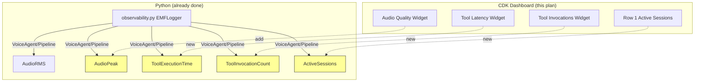

# Implementation Plan: Dashboard Cleanup

## Overview

Fix remaining CloudWatch dashboard accuracy and completeness issues. The original widget-type fixes (replacing SingleValueWidgets with GraphWidgets) are already shipped. This plan covers the three remaining gaps: missing AudioPeak in the Audio Quality widget, missing tool execution metrics visualization, and missing active sessions in the summary row.

**Single file change:** `infrastructure/src/constructs/voice-agent-monitoring-construct.ts`

## Status Summary

| # | Item | Status | Notes |
|---|------|--------|-------|
| 1 | Replace "Calls (Last Hour)" SingleValueWidget | **DONE** | Lines 450-470, now `Call Volume` GraphWidget |
| 2 | Replace "Avg Call Duration (s)" SingleValueWidget | **DONE** | Lines 472-492, now `Avg Call Duration` GraphWidget |
| 3 | Remove fixed-time-period titles | **DONE** | No titles reference hardcoded periods |
| 4 | Add AudioPeak to Audio Quality widget | **REMAINING** | Lines 822-855, only shows AudioRMS |
| 5 | Add Tool Execution metrics widgets | **REMAINING** | No visualization exists |
| 6 | Add Active Sessions to summary row | **REMAINING** | Row 1 has no session count |

## Architecture

All three remaining changes are scoped to a single CDK construct file. No Python changes needed -- all metrics are already emitted.



## Architecture Decisions

| # | Decision | Rationale |
|---|----------|-----------|
| 1 | Use `VoiceAgent/Pipeline` namespace for Active Sessions, not `VoiceAgent/Sessions` | Row 8 already shows `ActiveCount` from `VoiceAgent/Sessions` (Lambda-emitted). Row 1 uses the container-emitted `ActiveSessions` from `VoiceAgent/Pipeline` (`observability.py:1461`). Different sources, both useful. |
| 2 | Use `Maximum` statistic for Active Sessions | `ActiveSessions` is emitted on session state changes, not periodically. Maximum captures peak concurrent load, which is operationally relevant for capacity vs `MAX_CONCURRENT_CALLS=4`. |
| 3 | Shrink Row 1 widgets from width 8 to width 6 | Accommodates the new Active Sessions widget (4x 6 = 24, full row). AlarmStatusWidget at width 6 remains usable for the current alarm count. |
| 4 | Add AudioPeak as both Average and Maximum | Average shows typical peak levels; Maximum catches transient clipping spikes that Average would smooth over. |
| 5 | Widen Audio Quality Y-axis from [-60, -20] to [-60, 0] | Peak values can approach 0 dBFS (clipping). The old max of -20 would clip the graph for loud audio. |
| 6 | Use aggregate `[Environment]` dimension for tool metrics, not per-tool breakdown | Per-`ToolName` series would create visual clutter as the tool catalog grows. Aggregate view is sufficient for the ops dashboard; per-tool drilldown is available in CloudWatch Metrics Explorer. |
| 7 | Tool metrics widgets show "No data" when `ENABLE_TOOL_CALLING=false` | This is correct CloudWatch behavior. No special handling needed -- operators understand feature-gated metrics. |

## Implementation Steps

### Phase 1: Add AudioPeak to Audio Quality Widget

Modify the existing widget at lines 822-855 of `voice-agent-monitoring-construct.ts`:

- [ ] Add `AudioPeak` Average metric (namespace `VoiceAgent/Pipeline`, dimension `Environment`, period 1 min)
- [ ] Add `AudioPeak` Maximum metric to catch clipping spikes
- [ ] Rename title from `Audio Quality (RMS dB)` to `Audio Quality (dBFS)`
- [ ] Widen Y-axis max from -20 to 0 to accommodate peak values
- [ ] Add annotation at -3 dBFS labeled `Clipping Headroom`

### Phase 2: Add Active Sessions to Summary Row

Modify Row 1 (lines 441-493) of `voice-agent-monitoring-construct.ts`:

- [ ] Reduce AlarmStatusWidget width from 8 to 6
- [ ] Reduce Call Volume widget width from 8 to 6
- [ ] Reduce Avg Call Duration widget width from 8 to 6
- [ ] Add new `Active Sessions` GraphWidget (width 6, height 4):
  - Namespace: `VoiceAgent/Pipeline`
  - MetricName: `ActiveSessions`
  - Statistic: `Maximum`
  - Period: 1 minute
  - Y-axis min: 0

### Phase 3: Add Tool Execution Metrics Row

Insert a new `addWidgets()` block between Row 5 (line 856) and Row 6 (line 858) in `voice-agent-monitoring-construct.ts`:

- [ ] Add `Tool Execution Latency` GraphWidget (width 12, height 6):
  - Namespace: `VoiceAgent/Pipeline`
  - MetricName: `ToolExecutionTime`
  - Statistics: Average, p95, Maximum
  - Period: 5 minutes
  - Annotation at 30000ms for A2A timeout threshold
- [ ] Add `Tool Invocations` GraphWidget (width 12, height 6):
  - Namespace: `VoiceAgent/Pipeline`
  - MetricName: `ToolInvocationCount`
  - Statistic: Sum
  - Period: 5 minutes

### Phase 4: Validate

- [ ] Run `npx cdk synth` to verify template compiles
- [ ] Deploy to dev environment
- [ ] Verify Audio Quality widget shows AudioRMS and AudioPeak
- [ ] Verify Active Sessions appears in Row 1
- [ ] Verify Tool metrics widgets appear (with data when `ENABLE_TOOL_CALLING=true`, "No data" when disabled)

## Metric Reference

All metrics use the `VoiceAgent/Pipeline` namespace with `Environment` dimension.

| Metric | Emitted By | Condition | Location in Code |
|--------|-----------|-----------|-----------------|
| `AudioRMS` | `emit_turn_metrics()` | `ENABLE_AUDIO_QUALITY_MONITORING=true` | `observability.py:1262` |
| `AudioPeak` | `emit_turn_metrics()` | `ENABLE_AUDIO_QUALITY_MONITORING=true` | `observability.py:1264` |
| `ToolExecutionTime` | `emit_tool_metrics()` | `ENABLE_TOOL_CALLING=true` | `observability.py:1423` |
| `ToolInvocationCount` | `emit_tool_metrics()` | `ENABLE_TOOL_CALLING=true` | `observability.py:1424` |
| `ActiveSessions` | `emit_session_health()` | Always (on session start/end) | `observability.py:1461` |

## Testing Strategy

| Level | What | How |
|-------|------|-----|
| Synth | CDK template compiles | `npx cdk synth` -- no TypeScript errors |
| Visual | Widgets render correctly | Deploy to dev, open CloudWatch dashboard, check all 3 new additions |
| Data | AudioPeak populates | Make test call with `ENABLE_AUDIO_QUALITY_MONITORING=true`, confirm both RMS and Peak series |
| Data | Tool metrics populate | Make test call with `ENABLE_TOOL_CALLING=true`, confirm latency and invocation widgets |
| Data | Tool metrics graceful empty | Set `ENABLE_TOOL_CALLING=false`, confirm "No data" (not error) |
| Data | Active Sessions populates | Make concurrent test calls, confirm peak count in Row 1 |

## Risks & Mitigations

| Risk | Likelihood | Impact | Mitigation |
|------|-----------|--------|------------|
| Tool metrics widgets show "No data" confuses operators | Low | Low | Expected when `ENABLE_TOOL_CALLING=false`. Widget behavior is self-explanatory. |
| ActiveSessions gaps when no calls in progress | Low | Low | No calls = no session events. Gaps in the graph are correct. |
| Row 1 width reduction (8->6) reduces AlarmStatusWidget readability | Low | Low | Width 6 supports the current 8 alarms. Revisit if alarm count grows significantly. |
| AudioPeak Maximum near 0 dBFS from transient noise | Low | Low | Annotation says "Headroom" not "Clipping" to avoid false alarm interpretation. |

## Dependencies

- No Python changes required -- all metrics already emitted
- No new CDK dependencies
- No infrastructure changes beyond the dashboard definition
- Single file: `infrastructure/src/constructs/voice-agent-monitoring-construct.ts`

## File Structure

```
infrastructure/src/constructs/
└── voice-agent-monitoring-construct.ts  # MODIFY: 3 sections changed
    ├── Lines 441-493: Row 1 width adjustments + Active Sessions widget
    ├── Lines 822-855: Audio Quality widget + AudioPeak metrics
    └── Lines ~857:    New Tool Execution metrics row (insert)
```

## Success Criteria

- [x] Call volume widget reflects the dashboard time range, not a hardcoded period
- [x] Call duration widget reflects the dashboard time range
- [x] No widget titles reference a fixed time period that contradicts the dashboard time picker
- [ ] Audio Quality widget shows both AudioRMS and AudioPeak with clipping headroom annotation
- [ ] Tool Execution Latency widget shows Avg/P95/Max with A2A timeout annotation
- [ ] Tool Invocations widget shows Sum count per period
- [ ] Active Sessions widget in Row 1 shows peak concurrent sessions
- [ ] All new widgets use Environment dimension and respect the dashboard time picker
- [ ] `npx cdk synth` succeeds with no errors

## Progress Log

| Date | Phase | Notes |
|------|-------|-------|
| 2026-02-25 | Plan | Research complete, plan created. 3 of 6 original items already shipped. |
