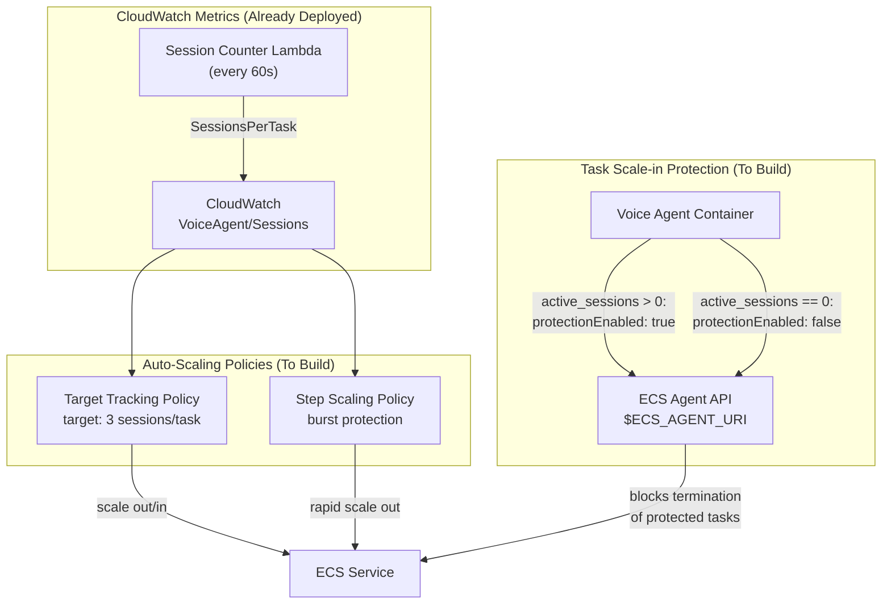

# ECS Auto-Scaling for Voice Agent

## Problem Statement

The voice agent runs as a single ECS Fargate task with `desiredCount: 1`. There is no auto-scaling configured. This means:

- **Cannot handle call volume growth** -- a single container supports 3-4 concurrent calls maximum (1 vCPU, 2 GB RAM)
- **No burst handling** -- a spike in incoming calls will result in resource exhaustion or degraded latency
- **No scale-in intelligence** -- if we manually increase task count, there is no mechanism to scale back down safely without dropping active calls
- **Single point of failure** -- one container crash drops all active calls

The building blocks for auto-scaling are already deployed:
- DynamoDB session table with heartbeats and lifecycle tracking
- Session counter Lambda emitting `SessionsPerTask` to CloudWatch every 60s
- Per-task `ActiveSessions` metric via EMF
- CloudWatch alarms for CPU (>80%) and memory (>85%) with "consider scaling" descriptions
- But none of these are wired to an actual scaling policy

## Vision

Enterprise-grade ECS auto-scaling that:

1. **Scales out automatically** when call volume increases, using `SessionsPerTask` as the primary signal
2. **Scales in safely** without ever terminating a task that has active voice calls, using ECS Task Scale-in Protection
3. **Handles bursts** via step scaling that adds containers aggressively when approaching capacity
4. **Drains gracefully** when tasks are being terminated -- stops accepting new calls, waits for active calls to complete
5. **Self-heals** -- unhealthy tasks are replaced automatically via NLB health checks

## Chosen Approach: Target Tracking + Task Scale-in Protection

### Three Mechanisms Working Together

### Why Task Scale-in Protection (Not Just SIGTERM Draining)

| Approach | Mechanism | Risk | Voice Call Impact |
|----------|-----------|------|-------------------|
| **SIGTERM-only** | Container gets SIGTERM, has 120s to drain | ECS may kill before calls complete | Active calls may be dropped |
| **Health check draining** | Return 503, wait for calls to end | NLB deregistration delay may expire | Potential call drops on long calls |
| **Task Scale-in Protection** | ECS Agent API prevents selection for termination entirely | None -- protected tasks are never selected | Zero impact on active calls |

Task Scale-in Protection is the AWS-recommended approach for stateful workloads like game servers, WebSocket services, and voice calls. The application sets protection from within the container via `$ECS_AGENT_URI/task-protection/v1/state`.

## Affected Areas

### Infrastructure (CDK)
- `infrastructure/src/stacks/ecs-stack.ts` -- Add scalable target, scaling policies, deregistration delay, stop timeout

### Application (Python)
- `backend/voice-agent/app/service_main.py` -- Task protection API calls, health check draining, SIGTERM drain enhancement
- New: `backend/voice-agent/app/task_protection.py` -- ECS Task Scale-in Protection client

### Testing
- New unit tests for task protection client
- New integration tests for health check draining behavior
- Load testing to validate scaling behavior

## Dependencies

- `dynamodb-session-tracking` (shipped) -- DynamoDB session table and heartbeats
- `comprehensive-observability-metrics` (shipped) -- `SessionsPerTask` CloudWatch metric from Lambda
- AWS ECS Task Scale-in Protection API (`$ECS_AGENT_URI/task-protection/v1/state`)
- AWS Application Auto Scaling (`aws-applicationautoscaling`)

## Success Criteria

- [ ] ECS service scales out when `SessionsPerTask` exceeds target (3)
- [ ] ECS service scales in when `SessionsPerTask` drops below target
- [ ] Tasks with active voice calls are NEVER terminated during scale-in
- [ ] New calls are not routed to draining tasks
- [ ] SIGTERM handler waits for active calls to complete (up to 120s)
- [ ] Load test: 10 concurrent calls across multiple containers with zero dropped calls during scale-in
- [ ] CloudWatch dashboard shows container count scaling with call volume

## Risks and Mitigations

| Risk | Impact | Mitigation |
|------|--------|------------|
| Task protection API not available in Fargate | Blocking | Verified: `$ECS_AGENT_URI` is available in Fargate tasks. Confirmed via AWS docs and community reports. |
| `SessionsPerTask` metric lag (60s Lambda interval) | Slow scale-out response | Complement with step scaling on CPU utilization for immediate burst response |
| Scale-in protection never cleared (bug) | Tasks accumulate, costs rise | Protection expires after 120 minutes (configurable). Health monitoring for orphaned tasks. |
| NLB routes to overloaded task | Call quality degradation | Health check returns 503 when at capacity (`active_sessions >= MAX_CONCURRENT`) |
| Cold start of new tasks | 60s delay for new container | Keep min_capacity >= 1; pre-warm during business hours via scheduled scaling |

## Related Features

- `dynamodb-session-tracking` -- Foundation for session counting
- `comprehensive-observability-metrics` -- CloudWatch metrics pipeline
- `cost-analysis-at-scale` -- Cost projections for scaled deployment
