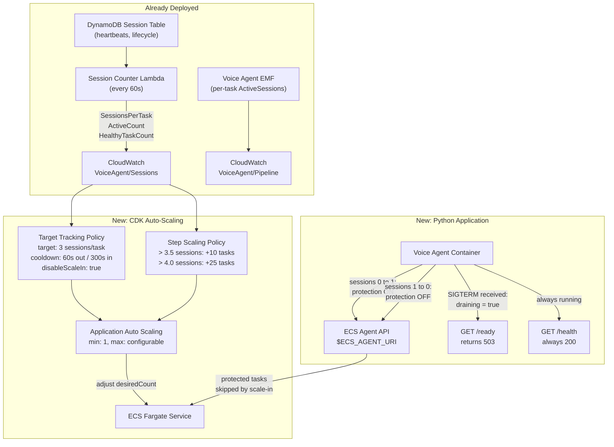

# Implementation Plan: ECS Auto-Scaling for Voice Agent

## Overview

Add enterprise-grade auto-scaling to the voice agent ECS Fargate service using three complementary mechanisms:

1. **Target Tracking Scaling Policy** on the existing `SessionsPerTask` custom CloudWatch metric -- handles steady-state scaling
2. **Step Scaling Policy** for burst protection -- rapid scale-out when approaching per-container capacity
3. **ECS Task Scale-in Protection API** -- prevents termination of tasks with active voice calls during scale-in events

The session tracking infrastructure (DynamoDB table, counter Lambda, CloudWatch metrics) is already deployed and provides the scaling signals. This feature wires those signals to actual scaling actions and adds the application-level protection needed for stateful voice workloads.

## Architecture



## Architecture Decisions

| # | Decision | Choice | Rationale |
|---|----------|--------|-----------|
| 1 | **Scaling metric** | `SessionsPerTask` (custom, from Lambda) | Directly represents per-container load. CPU/Memory are lagging indicators for voice workloads. |
| 2 | **Target value** | 3 sessions per task | 75% of conservative 4-call capacity. Leaves headroom for burst. |
| 3 | **Scale-in protection** | ECS Task Scale-in Protection API | AWS-native, zero risk of dropping active calls. Preferred over SIGTERM-only draining. |
| 4 | **Protection expiry** | 30 minutes (renewed every 30s) | Safety net for orphaned/stuck sessions. Since heartbeat renews protection every 30s, expiry only fires if renewal stops entirely. 30 min recovers orphaned tasks quickly vs 2 hours. |
| 5 | **Burst handling** | Step scaling policy (additive) | Target tracking reacts slowly to bursts. Step scaling adds containers in bulk. |
| 6 | **Min capacity** | 1 (configurable via CDK context) | Always-on for zero cold-start latency. Increase to 2+ for HA. |
| 7 | **Max capacity** | Configurable (default: 10 for initial rollout) | Start conservative. Scale up after load testing validates per-container capacity. |
| 8 | **Stop timeout** | 120 seconds (Fargate maximum) | Maximum time for graceful drain after SIGTERM. |
| 9 | **NLB deregistration delay** | 300 seconds | 5 minutes for in-flight calls to complete during target deregistration. |
| 10 | **Health check draining** | Separate `/health` (ECS liveness) and `/ready` (NLB routing) | Prevents ECS from killing at-capacity containers. NLB only routes to "ready" tasks. |
| 11 | **Target tracking scale-in** | `disableScaleIn: true` | Prevents target tracking from conflicting with step scaling + task protection for scale-in decisions. |
| 12 | **Protection renewal** | Piggyback on heartbeat loop (every 30s) | Ensures protection never lapses during long calls, even if initial set_protected had short expiry. |
| 13 | **Protection lifecycle** | Dict-boundary driven (0→1 enables, 1→0 disables) | Only the `active_sessions` dict crossing the zero boundary triggers protection API calls. Individual calls don't touch protection. Race-safe because `pop()` and `len()` are synchronous -- no `await` between them, so no asyncio interleaving. |

## Implementation Steps

### Phase 1: CDK Infrastructure -- Scaling Policies

**1.1 Add IAM permissions for Task Scale-in Protection**

File: `infrastructure/src/stacks/ecs-stack.ts`

The task role currently does NOT include the permissions needed for the ECS Agent API. Without these, the `$ECS_AGENT_URI/task-protection/v1/state` PUT returns HTTP 400.

```typescript
// Add to the task role policy statements
taskRole.addToPolicy(new iam.PolicyStatement({
  sid: 'ECSTaskProtection',
  effect: iam.Effect.ALLOW,
  actions: ['ecs:GetTaskProtection', 'ecs:UpdateTaskProtection'],
  resources: ['*'],  // Task protection does not support resource-level permissions
}));
```

**1.2 Register ECS service as a scalable target**

File: `infrastructure/src/stacks/ecs-stack.ts`

```typescript
import * as appscaling from 'aws-cdk-lib/aws-applicationautoscaling';

// After creating the ECS service...

const scalableTarget = new appscaling.ScalableTarget(this, 'VoiceAgentScaling', {
  serviceNamespace: appscaling.ServiceNamespace.ECS,
  resourceId: `service/${cluster.clusterName}/${service.serviceName}`,
  scalableDimension: 'ecs:service:DesiredCount',
  minCapacity: props.minCapacity ?? 1,
  maxCapacity: props.maxCapacity ?? 10,
});
```

**1.3 Target tracking scaling policy on SessionsPerTask**

Use `disableScaleIn: true` to prevent target tracking from fighting with step scaling / task protection for scale-in decisions.

```typescript
scalableTarget.scaleToTrackCustomMetric('SessionsPerTaskTracking', {
  customMetric: new cloudwatch.Metric({
    namespace: 'VoiceAgent/Sessions',
    metricName: 'SessionsPerTask',
    dimensionsMap: { Environment: props.environment },
    statistic: 'Average',
    period: cdk.Duration.minutes(1),
  }),
  targetValue: 3,  // 75% of 4-call capacity
  scaleOutCooldown: cdk.Duration.seconds(60),
  scaleInCooldown: cdk.Duration.seconds(300),
  disableScaleIn: true,  // Scale-in managed by step scaling + task protection
});
```

**1.4 Step scaling policy for burst protection**

Uses `scalingSteps: ScalingInterval[]` which is the correct CDK API shape for `BasicStepScalingPolicyProps`.

```typescript
const sessionsPerTaskMetric = new cloudwatch.Metric({
  namespace: 'VoiceAgent/Sessions',
  metricName: 'SessionsPerTask',
  dimensionsMap: { Environment: props.environment },
  statistic: 'Average',
  period: cdk.Duration.minutes(1),
});

scalableTarget.scaleOnMetric('BurstScaleOut', {
  metric: sessionsPerTaskMetric,
  scalingSteps: [
    { upper: 3.5, change: 0 },      // No change below 3.5
    { lower: 3.5, upper: 4.0, change: +10 },  // Add 10 containers
    { lower: 4.0, change: +25 },     // Near capacity: add 25
  ],
  adjustmentType: appscaling.AdjustmentType.CHANGE_IN_CAPACITY,
  cooldown: cdk.Duration.seconds(60),
  evaluationPeriods: 1,  // React in a single period for bursts
});
```

**1.5 NLB target group configuration**

Update the NLB target group health check to use `/ready` instead of `/health`, and set explicit deregistration delay:

```typescript
// On the NLB target group
const targetGroup = new elbv2.NetworkTargetGroup(this, 'TargetGroup', {
  // ... existing config ...
  deregistrationDelay: cdk.Duration.seconds(300),  // 5 min for in-flight calls
  healthCheck: {
    path: '/ready',  // Separate from ECS liveness check at /health
    protocol: elbv2.Protocol.HTTP,
    interval: cdk.Duration.seconds(30),
    healthyThresholdCount: 2,
    unhealthyThresholdCount: 2,
  },
});
```

**1.6 Container stop timeout and service deployment config**

```typescript
// In the container definition -- set explicit stop timeout
const container = taskDefinition.addContainer('PipecatContainer', {
  // ... existing config ...
  stopTimeout: cdk.Duration.seconds(120),  // Fargate max (default is 30s)
});

// On the ECS service -- explicit deployment configuration
const service = new ecs.FargateService(this, 'Service', {
  // ... existing config ...
  minHealthyPercent: 100,   // Never kill old tasks before new ones are healthy
  maxHealthyPercent: 200,   // Allow double capacity during rolling deploys
});
```

**1.7 Make scaling parameters configurable**

Add CDK context or stack props:

```typescript
interface EcsStackProps extends cdk.StackProps {
  // ... existing props ...
  minCapacity?: number;           // default: 1
  maxCapacity?: number;           // default: 10
  targetSessionsPerTask?: number; // default: 3
}
```

### Phase 2: Python Application -- Task Scale-in Protection

**2.1 Create Task Protection client**

New file: `backend/voice-agent/app/task_protection.py`

Key design decisions:
- **Reuse a single `aiohttp.ClientSession`** instead of creating one per call (connection pooling)
- **Retry with backoff** on the critical 0->1 transition to minimize risk of unprotected active calls
- **Coordinate with heartbeat loop** to renew protection every 30s for long calls

```python
"""ECS Task Scale-in Protection client.

Uses the ECS Agent API available at $ECS_AGENT_URI to set/clear
task protection during voice call handling.

Reference: https://docs.aws.amazon.com/AmazonECS/latest/developerguide/task-scale-in-protection-endpoint.html
"""

import os
import logging
import asyncio
import aiohttp

logger = logging.getLogger(__name__)

PROTECTION_EXPIRY_MINUTES = 30  # Safety net for stuck sessions; renewed every 30s via heartbeat
MAX_RETRIES = 3
RETRY_BASE_DELAY = 0.1  # 100ms


class TaskProtection:
    """Manages ECS Task Scale-in Protection for voice call handling."""

    def __init__(self):
        self._agent_uri = os.environ.get("ECS_AGENT_URI")
        self._protected = False
        self._session: aiohttp.ClientSession | None = None

    @property
    def is_available(self) -> bool:
        """Check if ECS Agent API is available (not available in local dev)."""
        return self._agent_uri is not None

    @property
    def is_protected(self) -> bool:
        return self._protected

    async def _get_session(self) -> aiohttp.ClientSession:
        """Get or create a reusable HTTP session."""
        if self._session is None or self._session.closed:
            self._session = aiohttp.ClientSession(
                timeout=aiohttp.ClientTimeout(total=5)
            )
        return self._session

    async def set_protected(self, protected: bool, retry: bool = True) -> bool:
        """Set or clear task scale-in protection.

        Args:
            protected: True to protect, False to allow termination.
            retry: Whether to retry on failure (default True for critical path).

        Returns:
            True if successfully set, False if unavailable or failed.
        """
        if not self.is_available:
            logger.debug("ECS Agent API not available (local dev mode)")
            return False

        if protected == self._protected:
            logger.debug(f"Task protection already {'enabled' if protected else 'disabled'}")
            return True

        endpoint = f"{self._agent_uri}/task-protection/v1/state"
        payload = {"ProtectionEnabled": protected}
        if protected:
            payload["ExpiresInMinutes"] = PROTECTION_EXPIRY_MINUTES

        max_attempts = MAX_RETRIES if retry else 1
        for attempt in range(max_attempts):
            try:
                session = await self._get_session()
                async with session.put(endpoint, json=payload) as resp:
                    if resp.status == 200:
                        self._protected = protected
                        logger.info(
                            "task_protection_updated",
                            extra={"protection_enabled": protected},
                        )
                        return True
                    else:
                        body = await resp.text()
                        logger.error(
                            "task_protection_api_error",
                            extra={"status": resp.status, "body": body, "attempt": attempt + 1},
                        )
            except Exception:
                logger.exception(
                    "task_protection_api_exception",
                    extra={"attempt": attempt + 1},
                )

            if attempt < max_attempts - 1:
                delay = RETRY_BASE_DELAY * (2 ** attempt)
                await asyncio.sleep(delay)

        logger.error(
            "task_protection_all_retries_exhausted",
            extra={"protected": protected, "attempts": max_attempts},
        )
        return False

    async def renew_if_protected(self) -> bool:
        """Renew protection if currently protected. Called from heartbeat loop."""
        if not self.is_available or not self._protected:
            return False

        endpoint = f"{self._agent_uri}/task-protection/v1/state"
        payload = {"ProtectionEnabled": True, "ExpiresInMinutes": PROTECTION_EXPIRY_MINUTES}

        try:
            session = await self._get_session()
            async with session.put(endpoint, json=payload) as resp:
                if resp.status == 200:
                    logger.debug("task_protection_renewed")
                    return True
                else:
                    body = await resp.text()
                    logger.warning(
                        "task_protection_renewal_failed",
                        extra={"status": resp.status, "body": body},
                    )
                    return False
        except Exception:
            logger.exception("task_protection_renewal_exception")
            return False

    async def close(self):
        """Close the HTTP session."""
        if self._session and not self._session.closed:
            await self._session.close()
```

**2.2 Integrate with PipelineManager in service_main.py**

Modify the `PipelineManager` class to manage protection and draining:

```python
# In service_main.py

from app.task_protection import TaskProtection

class PipelineManager:
    def __init__(self, ...):
        self.active_sessions: dict[str, asyncio.Task] = {}
        self._task_protection = TaskProtection()
        self._draining = False
        self._max_concurrent = int(os.environ.get("MAX_CONCURRENT_CALLS", "4"))

    async def start_call(self, ...):
        if self._draining:
            return {"status": "error", "message": "Service is draining"}

        if len(self.active_sessions) >= self._max_concurrent:
            return {"status": "error", "message": "At capacity"}

        # If this is the first call, enable protection (with retry)
        if len(self.active_sessions) == 0:
            success = await self._task_protection.set_protected(True, retry=True)
            if not success:
                logger.warning("task_protection_enable_failed_proceeding",
                    extra={"note": "Accepting call without scale-in protection"})

        task = asyncio.create_task(self._run_pipeline(...))
        self.active_sessions[session_id] = task
        return {"status": "started", "session_id": session_id}

    async def _on_pipeline_complete(self, session_id: str):
        """Called when a pipeline finishes (success or error)."""
        self.active_sessions.pop(session_id, None)

        # If no more active calls, clear protection
        if len(self.active_sessions) == 0:
            await self._task_protection.set_protected(False)
```

**2.3 Separate health and readiness endpoints**

This is critical: ECS container health checks must NOT return 503 when at capacity, or ECS will replace the container, killing active calls. Use separate paths:

- `/health` -- ECS container liveness (always 200 if process is running)
- `/ready` -- NLB routing readiness (503 when draining or at capacity)

```python
async def handle_health(request: web.Request) -> web.Response:
    """ECS container health check -- 200 if process is alive."""
    return web.json_response(
        pipeline_manager.get_status()
        if pipeline_manager
        else {"status": "initializing"}
    )

async def handle_ready(request: web.Request) -> web.Response:
    """NLB readiness check -- 503 when draining or at capacity."""
    manager = request.app.get("pipeline_manager")

    if manager is None:
        return web.json_response({"status": "initializing"}, status=503)

    if manager._draining:
        return web.json_response(
            {"status": "draining", "active_sessions": len(manager.active_sessions)},
            status=503,
        )

    active = len(manager.active_sessions)
    if active >= manager._max_concurrent:
        return web.json_response(
            {"status": "at_capacity", "active_sessions": active},
            status=503,
        )

    return web.json_response({
        "status": "ready",
        "active_sessions": active,
        "capacity_remaining": manager._max_concurrent - active,
        "protected": manager._task_protection.is_protected,
    })

# Route registration
app.router.add_get('/health', handle_health)  # ECS liveness
app.router.add_get('/ready', handle_ready)     # NLB routing
```

**2.4 Enhanced SIGTERM handler -- replace existing, don't layer**

The existing handler at `service_main.py:516-522` brutally cancels all tasks. The new handler must **replace** it entirely:

```python
def _setup_signal_handlers(self, loop):
    """Register signal handlers for graceful shutdown."""
    for sig in (signal.SIGTERM, signal.SIGINT):
        loop.add_signal_handler(sig, lambda s=sig: asyncio.create_task(self._drain(s)))

async def _drain(self, sig):
    """Graceful drain: stop accepting calls, wait for active to complete."""
    logger.info(f"drain_started", extra={"signal": sig.name})
    self._pipeline_manager._draining = True

    # Wait for active sessions to complete (up to Fargate stop timeout)
    drain_start = time.time()
    while self._pipeline_manager.active_sessions:
        elapsed = time.time() - drain_start
        remaining = len(self._pipeline_manager.active_sessions)
        logger.info("drain_waiting", extra={
            "active_sessions": remaining,
            "elapsed_seconds": round(elapsed),
        })
        if elapsed > 110:  # Leave 10s buffer before Fargate kills us at 120s
            logger.warning("drain_timeout_approaching", extra={
                "active_sessions": remaining,
                "elapsed_seconds": round(elapsed),
            })
            break
        await asyncio.sleep(5)

    # Clear protection (may already be cleared if sessions == 0)
    await self._pipeline_manager._task_protection.set_protected(False)
    await self._pipeline_manager._task_protection.close()
    logger.info("drain_complete")
    # Stop the event loop
    asyncio.get_event_loop().stop()
```

**2.5 Coordinate protection renewal with heartbeat loop**

Modify the heartbeat callback to also renew task protection, ensuring protection never lapses during long calls:

```python
# In PipelineManager -- modify the heartbeat callback
async def _heartbeat_callback(self) -> int:
    """Called every 30s by SessionTracker heartbeat loop."""
    count = len(self.active_sessions)

    # Piggyback protection renewal on heartbeat
    if count > 0:
        await self._task_protection.renew_if_protected()

    return count
```

### Phase 3: Unit Tests

**3.1 Task Protection tests**

New file: `backend/voice-agent/tests/test_task_protection.py`

- [ ] Test: `set_protected(True)` calls ECS Agent API with correct payload including `ExpiresInMinutes`
- [ ] Test: `set_protected(False)` calls ECS Agent API with correct payload (no `ExpiresInMinutes`)
- [ ] Test: No-op when `ECS_AGENT_URI` not set (local dev)
- [ ] Test: No-op when protection state hasn't changed (idempotent)
- [ ] Test: Returns `False` on API error (non-200 response)
- [ ] Test: Returns `False` on network error (exception handling)
- [ ] Test: Retries with backoff on failure (verify 3 attempts)
- [ ] Test: `renew_if_protected()` renews when protected, no-ops when not
- [ ] Test: Reuses `aiohttp.ClientSession` across calls (not creating new session each time)
- [ ] Test: `close()` properly closes the HTTP session

**3.2 PipelineManager integration tests**

New file: `backend/voice-agent/tests/test_auto_scaling_integration.py`

- [ ] Test: First call enables task protection
- [ ] Test: Subsequent calls do not re-enable protection (already enabled)
- [ ] Test: Last call completing disables task protection
- [ ] Test: New calls rejected when `draining == True`
- [ ] Test: New calls rejected when at `MAX_CONCURRENT_CALLS` capacity
- [ ] Test: `/health` returns 200 even when at capacity or draining (ECS liveness)
- [ ] Test: `/ready` returns 200 when healthy with capacity remaining
- [ ] Test: `/ready` returns 503 when draining
- [ ] Test: `/ready` returns 503 when at capacity
- [ ] Test: `/ready` includes `capacity_remaining` field
- [ ] Test: SIGTERM sets draining flag immediately
- [ ] Test: SIGTERM waits for active sessions before exiting (up to 110s)
- [ ] Test: SIGTERM replaces existing handler (no brutal cancel of pipeline tasks)
- [ ] Test: Race condition -- 0->1 transition with protection API failure still accepts call
- [ ] Test: Race condition -- very short call ending before protection is fully set

### Phase 4: CDK Tests

**4.1 Scaling policy tests**

In existing CDK test file:

- [ ] Test: Scalable target created with correct min/max capacity
- [ ] Test: Target tracking policy references `VoiceAgent/Sessions :: SessionsPerTask`
- [ ] Test: Target tracking policy has correct target value (3)
- [ ] Test: Target tracking policy has `disableScaleIn: true`
- [ ] Test: Step scaling policy has correct thresholds (3.5, 4.0) via `scalingSteps`
- [ ] Test: Step scaling policy uses `AdjustmentType.CHANGE_IN_CAPACITY`
- [ ] Test: NLB target group has deregistration delay of 300s
- [ ] Test: NLB target group health check uses `/ready` path
- [ ] Test: Container has stop timeout of 120s
- [ ] Test: Service has `minHealthyPercent: 100` and `maxHealthyPercent: 200`
- [ ] Test: Min/max capacity configurable via props
- [ ] Test: Task role includes `ecs:GetTaskProtection` and `ecs:UpdateTaskProtection` permissions

### Phase 5: Monitoring -- New Alarms and Dashboard Widgets

**5.1 New CloudWatch alarms**

Add to `voice-agent-monitoring-construct.ts`:

| Alarm | Metric | Threshold | Purpose |
|-------|--------|-----------|---------|
| `SessionsPerTaskHigh` | `VoiceAgent/Sessions::SessionsPerTask` | > 4.0 for 2 periods | Approaching per-container capacity |
| `ProtectionFailure` | Log-based metric filter on `task_protection_all_retries_exhausted` | >= 1 in 5 minutes | Task protection API failure |
| `MetricStaleness` | `VoiceAgent/Sessions::SessionsPerTask` | `INSUFFICIENT_DATA` for > 5 min | Session counter Lambda failure |

**5.2 Dashboard scaling widgets**

Add to existing CloudWatch dashboard:

- Running task count over time (`AWS/ECS::RunningTaskCount`)
- `SessionsPerTask` metric trend
- Scaling activity events (Application Auto Scaling activity)
- Task protection status (custom metric from log filter)

### Phase 6: Integration Testing & Validation

**6.1 Deploy and validate scaling behavior**

- [ ] Deploy with `minCapacity: 1, maxCapacity: 5`
- [ ] Verify single container starts and is healthy
- [ ] Verify `/health` returns 200 and `/ready` returns 200
- [ ] Place 1 call -- verify task protection is set
- [ ] End call -- verify task protection is cleared
- [ ] Place 4+ concurrent calls -- verify `/ready` returns 503 at capacity
- [ ] Place 4+ concurrent calls -- verify scale-out triggered via CloudWatch
- [ ] End all calls -- verify scale-in occurs (only unprotected tasks terminated)
- [ ] Send SIGTERM to a task with active call -- verify drain behavior (wait, then exit)

**6.2 Deployment safety testing**

- [ ] Start a call on container v1
- [ ] Trigger a rolling deployment to v2
- [ ] Verify old container drains gracefully (503 on `/ready`, finishes active call)
- [ ] Verify new container starts, passes health check, accepts calls

**6.3 Load testing**

- [ ] Test with 1 concurrent call per container (baseline)
- [ ] Test with 2 concurrent calls per container
- [ ] Test with 3 concurrent calls per container (target)
- [ ] Test with 4 concurrent calls per container (capacity)
- [ ] Test with 5 concurrent calls per container (over-capacity -- should trigger scale-out)
- [ ] Monitor memory, CPU, latency at each level via CloudWatch Container Insights
- [ ] Measure scaling response time: burst arrival to new task accepting traffic
- [ ] Identify actual per-container breaking point
- [ ] Adjust `targetSessionsPerTask` based on results

## Files Created/Modified

### New Files
- `backend/voice-agent/app/task_protection.py` -- ECS Task Scale-in Protection client (with retry, session reuse, heartbeat renewal)
- `backend/voice-agent/tests/test_task_protection.py` -- Unit tests
- `backend/voice-agent/tests/test_auto_scaling_integration.py` -- Integration tests

### Modified Files
- `infrastructure/src/stacks/ecs-stack.ts` -- Scaling policies, IAM permissions, deregistration delay, stop timeout, deployment config, `/ready` health check path
- `infrastructure/src/config.ts` -- Add scaling configuration fields
- `backend/voice-agent/app/service_main.py` -- Task protection integration, `/ready` endpoint, draining, SIGTERM drain replacement
- `infrastructure/src/constructs/voice-agent-monitoring-construct.ts` -- New scaling alarms and dashboard widgets

## Configuration

### Environment Variables (New)

| Variable | Default | Description |
|----------|---------|-------------|
| `MAX_CONCURRENT_CALLS` | `4` | Maximum concurrent calls per container before rejecting |

### CDK Stack Props (New)

| Prop | Default | Description |
|------|---------|-------------|
| `minCapacity` | `1` | Minimum ECS tasks (always running) |
| `maxCapacity` | `10` | Maximum ECS tasks (start conservative, increase after load testing) |
| `targetSessionsPerTask` | `3` | Target tracking metric target value |

### ECS Agent API (Used, not configured)

| Endpoint | Method | Purpose |
|----------|--------|---------|
| `$ECS_AGENT_URI/task-protection/v1/state` | PUT | Set/clear task scale-in protection |

`$ECS_AGENT_URI` is automatically injected by the ECS container agent into all Fargate tasks. Requires `ecs:GetTaskProtection` and `ecs:UpdateTaskProtection` IAM permissions on the task role.

## Key Risks Addressed

| # | Risk | Severity | Mitigation in this plan |
|---|------|----------|------------------------|
| 1 | ECS kills container when health check returns 503 at capacity | **Critical** | Separate `/health` (ECS liveness, always 200) from `/ready` (NLB routing, 503 when full) |
| 2 | Missing IAM permissions for Task Protection API | **Critical** | Step 1.1 explicitly adds `ecs:GetTaskProtection` + `ecs:UpdateTaskProtection` to task role |
| 3 | Protection API failure during 0->1 transition | **Critical** | Retry with backoff (3 attempts). Log loudly but still accept call (degraded mode). Renew via heartbeat. |
| 4 | Target tracking + step scaling oscillation | **Important** | `disableScaleIn: true` on target tracking. Step scaling handles both directions. |
| 5 | SIGTERM drops active calls | **Important** | Replace existing brutal `task.cancel()` handler with graceful drain (110s wait) |
| 6 | aiohttp session churn | **Important** | Reuse single `ClientSession` with connection pooling instead of creating per call |
| 7 | Protection lapses during long calls | **Important** | Renew protection every 30s via heartbeat loop piggyback |
| 8 | Rolling deploy kills protected tasks | **Important** | `minHealthyPercent: 100` ensures new tasks start before old drain. `/ready` 503 prevents new calls to draining tasks. |
| 9 | 3-4 min burst-to-relief delay | **Known** | `evaluationPeriods: 1` on step scaling. Consider reducing Lambda interval to 30s in future. |
| 10 | Container cold start ~2-3 min | **Known** | 60s `startPeriod` + 2 healthy checks. Documented in scaling cooldown rationale. |

## Rollout Strategy

1. **Deploy CDK changes** with `minCapacity: 1, maxCapacity: 3` (conservative start)
2. **Deploy Python changes** -- task protection, `/ready` endpoint, SIGTERM drain
3. **Validate** with manual test calls -- verify protection set/clear, `/health` vs `/ready` behavior
4. **Increase maxCapacity** to 5, run load tests with 5-10 concurrent calls
5. **Tune** `targetSessionsPerTask` based on load test results (may adjust from 3 to 2)
6. **Increase maxCapacity** to production target (10-50) after validation
7. **Add monitoring alarms** and verify they fire correctly

## Cost Estimation

| Component | Unit Cost | At Max 10 Tasks | Notes |
|-----------|-----------|-----------------|-------|
| Fargate tasks | ~$0.052/hr per task (1 vCPU + 2GB) | ~$0.52/hr peak | Only during peak, scales down |
| Session counter Lambda | ~60 invocations/hr | Negligible | Already deployed |
| CloudWatch custom metrics | $0.30/metric/month | ~$1.80/month | 6 custom metrics |
| CloudWatch alarms | $0.10/alarm/month | ~$0.80/month | 8 alarms total |
| DynamoDB | On-demand | Negligible | Already deployed |

## Dependencies

- `dynamodb-session-tracking` (shipped) -- Session table, heartbeats
- `comprehensive-observability-metrics` (shipped) -- `SessionsPerTask` metric
- AWS ECS Task Scale-in Protection (GA since 2022)
- AWS Application Auto Scaling

## Estimated Effort

| Phase | Effort |
|-------|--------|
| Phase 1: CDK infrastructure | 0.5 day |
| Phase 2: Python application | 1 day |
| Phase 3: Unit tests | 0.5 day |
| Phase 4: CDK tests | 0.5 day |
| Phase 5: Monitoring alarms & dashboard | 0.5 day |
| Phase 6: Integration testing & load testing | 1-2 days |
| **Total** | **4-5 days** |

## Progress Log

| Date | Update |
|------|--------|
| 2026-02-24 | Initial plan created. Building blocks (DynamoDB session tracking, CloudWatch metrics, session counter Lambda) already deployed. |
| 2026-02-25 | Plan reviewed and refined: added critical fixes for health/ready endpoint split, IAM permissions, target tracking disableScaleIn, aiohttp session reuse, protection renewal via heartbeat, SIGTERM handler replacement, deployment safety config, cost estimation, and new monitoring alarms. Reduced protection expiry from 120min to 30min (renewed every 30s, so expiry is only a safety net for orphaned tasks). Added ADR #13 documenting dict-boundary protection lifecycle and asyncio race-safety rationale. |
