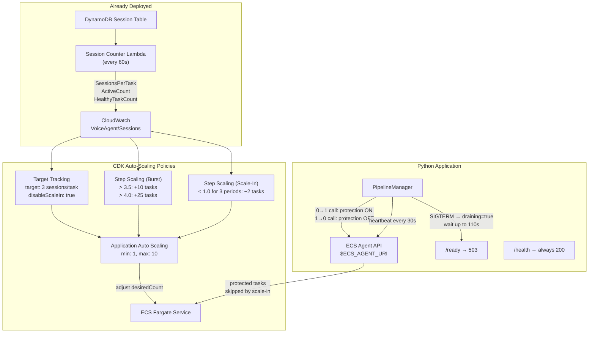
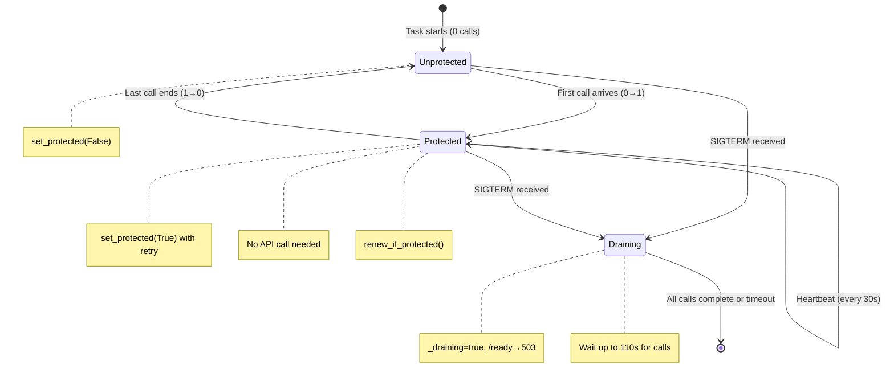
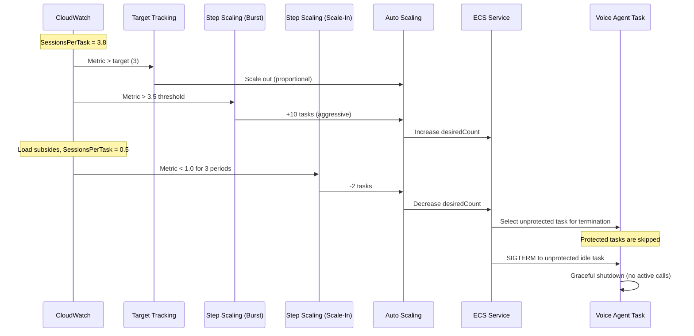

# Shipped: ECS Auto-Scaling for Voice Agent

## Summary

Implemented enterprise-grade auto-scaling for the ECS Fargate voice agent service using three complementary mechanisms: target tracking on `SessionsPerTask` for steady-state scaling, step scaling for burst protection, and ECS Task Scale-in Protection to guarantee zero dropped calls during scale-in events. The feature spans CDK infrastructure (scaling policies, IAM, NLB configuration), a Python task protection client with retry and heartbeat renewal, graceful SIGTERM drain logic, and new CloudWatch alarms and dashboard widgets.

## Architecture

## Key Changes

- **ScalableTarget**: min 1, max 10 (configurable via CDK context `minCapacity`, `maxCapacity`)
- **Target tracking policy**: `SessionsPerTask` target 3, `disableScaleIn: true` (scale-in delegated to step scaling + task protection)
- **Step scaling burst policy**: >3.5 sessions/task adds 10 tasks, >4.0 adds 25 tasks (1 evaluation period, 60s cooldown)
- **Step scaling scale-in policy**: <1.0 sessions/task for 3 consecutive periods removes 2 tasks (300s cooldown)
- **Task protection**: ECS Agent API client with retry (3 attempts, exponential backoff), session reuse, heartbeat renewal every 30s
- **Health/ready split**: `/health` always returns 200 (ECS liveness), `/ready` returns 503 when draining or at capacity (NLB routing)
- **Graceful SIGTERM drain**: sets `draining=true`, waits up to 110s for active calls, clears protection, then exits
- **Capacity gating**: rejects calls at `MAX_CONCURRENT_CALLS` (default 4)
- **NLB**: deregistration delay 300s, health check on `/ready`
- **Container**: stop timeout 120s (Fargate max)
- **Deployment**: `minHealthyPercent: 100`, `maxHealthyPercent: 200` for safe rolling deploys
- **Monitoring**: 3 new alarms, dashboard Row 8, saved query for scaling events

## Protection Lifecycle

## Scaling Flow

## Files Created

| File | Purpose |
|------|---------|
| `backend/voice-agent/app/task_protection.py` | ECS Task Scale-in Protection client (retry, session reuse, heartbeat renewal) |
| `backend/voice-agent/tests/test_task_protection.py` | Unit tests for TaskProtection (18 tests) |
| `backend/voice-agent/tests/test_auto_scaling_integration.py` | Integration tests for PipelineManager scaling behavior (18 tests) |

## Files Modified

| File | Changes |
|------|---------|
| `infrastructure/src/stacks/ecs-stack.ts` | ScalableTarget, target tracking policy, burst step scaling, scale-in step scaling, task protection IAM, NLB `/ready` health check, deregistration delay 300s, stop timeout 120s, deployment config, `MAX_CONCURRENT_CALLS` env var |
| `infrastructure/src/config.ts` | Added `minCapacity`, `maxCapacity`, `targetSessionsPerTask` with validation |
| `infrastructure/src/constructs/voice-agent-monitoring-construct.ts` | SessionsPerTaskHigh alarm, ProtectionFailure alarm (log-based metric filter), MetricStaleness alarm, Dashboard Row 8 (Running Task Count, Sessions Per Task, Active Sessions & Protection Failures), `scaling-events` saved query |
| `infrastructure/test/ecs.test.ts` | 11 new CDK tests across Auto-Scaling, Container Configuration, NLB Configuration, and Service Deployment Configuration describe blocks |
| `infrastructure/test/helpers.ts` | Added `targetSessionsPerTask` to test config defaults |
| `infrastructure/test/config.test.ts` | Validation test for `targetSessionsPerTask` |
| `backend/voice-agent/app/service_main.py` | TaskProtection integration in PipelineManager (0→1 enable, 1→0 disable), `/ready` endpoint, draining flag, capacity gating, heartbeat-piggybacked protection renewal, graceful SIGTERM drain handler |

## Testing

- **Unit Tests**: 18 tests for `TaskProtection` (availability, set/clear, idempotent, retry with backoff, renewal, session reuse, close)
- **Integration Tests**: 18 tests for scaling integration (draining, capacity gating, protection lifecycle, `/health` vs `/ready` behavior, status fields)
- **CDK Tests**: 11 tests for infrastructure (scalable target, target tracking, step scaling, IAM permissions, stop timeout, env vars, NLB health check path, deregistration delay, deployment config)

## CloudWatch Alarms (New)

| Alarm | Metric | Threshold | Purpose |
|-------|--------|-----------|---------|
| `SessionsPerTaskHigh` | `VoiceAgent/Sessions::SessionsPerTask` | > 4.0 for 2 consecutive periods | Approaching per-container capacity |
| `ProtectionFailure` | Log-based filter on `task_protection_all_retries_exhausted` | >= 1 in 5 minutes | Task protection API failure -- active calls may not be safe from scale-in |
| `MetricStaleness` | `VoiceAgent/Sessions::SessionsPerTask` | `INSUFFICIENT_DATA` for 5 periods (treat missing as BREACHING) | Session counter Lambda stopped emitting -- auto-scaling is blind |

## Dashboard (Row 8)

| Widget | Metrics | Annotations |
|--------|---------|-------------|
| Running Task Count | `AWS/ECS::RunningTaskCount`, `DesiredTaskCount` | -- |
| Sessions Per Task | `VoiceAgent/Sessions::SessionsPerTask` | Target tracking target (3, orange), Container capacity (4, red) |
| Active Sessions & Protection Failures | Left: `ActiveCount`, `HealthyTaskCount`; Right: `TaskProtectionFailures` | -- |

## Configuration

### CDK Context / Environment Variables

| Parameter | Default | Source | Description |
|-----------|---------|--------|-------------|
| `minCapacity` | `1` | CDK context or `MIN_CAPACITY` env | Minimum ECS tasks (always running) |
| `maxCapacity` | `10` | CDK context or `MAX_CAPACITY` env | Maximum ECS tasks |
| `targetSessionsPerTask` | `3` | CDK context or `TARGET_SESSIONS_PER_TASK` env | Target tracking metric target (validated 1-10) |

### Container Environment Variables

| Variable | Default | Description |
|----------|---------|-------------|
| `MAX_CONCURRENT_CALLS` | `4` | Maximum concurrent calls per container before `/ready` returns 503 |

### ECS Agent API (Runtime)

| Endpoint | Method | Purpose |
|----------|--------|---------|
| `$ECS_AGENT_URI/task-protection/v1/state` | PUT | Set/clear/renew task scale-in protection |

`$ECS_AGENT_URI` is auto-injected by the ECS container agent. Requires `ecs:GetTaskProtection` and `ecs:UpdateTaskProtection` IAM permissions on the task role.

## Key Design Decisions

| Decision | Choice | Rationale |
|----------|--------|-----------|
| Scaling metric | `SessionsPerTask` (custom) | Directly represents per-container load; CPU/memory are lagging indicators for voice workloads |
| Target tracking `disableScaleIn` | `true` | Prevents target tracking from conflicting with step scaling + task protection for scale-in |
| Protection lifecycle | Dict-boundary driven (0→1 ON, 1→0 OFF) | Only zero-crossing triggers API calls. Race-safe because `pop()` and `len()` are synchronous -- no `await` between them, so no asyncio interleaving |
| Protection expiry | 30 minutes (renewed every 30s) | Safety net for orphaned tasks. Heartbeat renewal ensures protection never lapses during normal operation |
| Health/ready split | `/health` (ECS liveness) vs `/ready` (NLB routing) | Prevents ECS from killing at-capacity containers. Only `/ready` returns 503 |
| SIGTERM drain timeout | 110 seconds | Leaves 10s buffer before Fargate force-kills at 120s stop timeout |
| Protection API failure on 0→1 | Accept call anyway (degraded mode) | Availability over safety -- log loudly, renew via heartbeat |
| aiohttp session | Single reusable `ClientSession` | Connection pooling to local ECS Agent API, no per-call session churn |

## Dependencies

- `dynamodb-session-tracking` (shipped) -- DynamoDB session table, heartbeats, session lifecycle
- `comprehensive-observability-metrics` (shipped) -- `SessionsPerTask` metric from session counter Lambda
- AWS ECS Task Scale-in Protection (GA since 2022)
- AWS Application Auto Scaling

## Notes

- Burst step scaling thresholds are derived from `targetSessionsPerTask`: burst at +0.5 and +1.0 above target
- Scale-in step scaling threshold is fixed at 1.0 sessions/task with 3 evaluation periods to avoid flapping
- The `scaling-events` saved query in CloudWatch Logs Insights covers: `task_protection_updated`, `task_protection_all_retries_exhausted`, `drain_started`, `drain_waiting`, `drain_complete`
