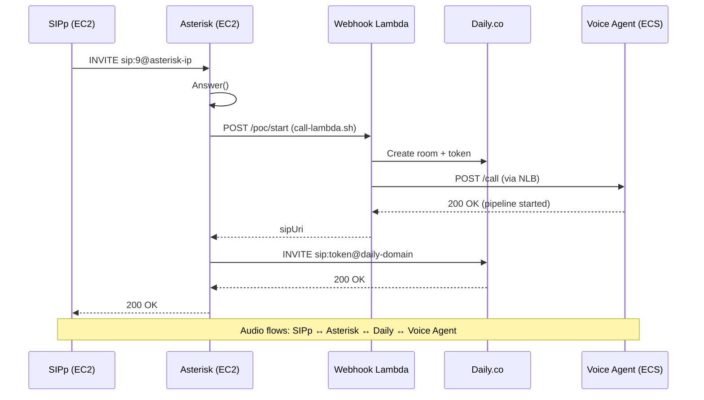

# SIPp-via-Asterisk Scaling Test Redesign

## Problem Statement

The current load test architecture has SIPp calling Daily SIP URIs directly.
This requires **batch pre-creation** of all Daily rooms via the webhook before
SIPp starts, because SIPp cannot call webhooks itself. This batch approach
creates an unrealistic test scenario:

1. All 10 webhook calls fire in ~20 seconds, before auto-scaling can react
2. The voice agent hits `MAX_CONCURRENT_CALLS=4` on the single task and
   rejects calls 5-10 with HTTP 400
3. The webhook Lambda returns HTTP 200 with a `sipUri` even when the voice
   agent rejected the call (bug: doesn't check `service_response["status"]`)
4. Rooms 5-10 exist but have no bot — SIPp connects to empty rooms
5. The session counter only sees 4 active sessions, so scaling never reaches
   the expected 3+ tasks

In the real world, calls arrive one at a time through an Asterisk PBX which
calls the webhook for each individual call. This natural pacing gives
auto-scaling time to react between the target threshold (3 sessions/task) and
the hard cap.

## Solution: SIPp → Asterisk → Webhook → Voice Agent

Put Asterisk in the call path, exactly like production. SIPp dials Asterisk
extension 9, which triggers the normal dialplan: call the webhook, create a
Daily room, start the bot, bridge the call.



Each SIPp call triggers room creation individually. With SIPp rate-pacing at
1 call per 5 seconds, the voice agent accumulates sessions gradually, giving
auto-scaling time to react.

## Current State (As Deployed)

### Voice Agent (`asset-pipecat-sagemaker`)

| Parameter | Current Value |
|-----------|---------------|
| ECS Task CPU | 4096 (4 vCPU) |
| ECS Task Memory | 8192 MiB |
| `MAX_CONCURRENT_CALLS` | 10 |
| `targetSessionsPerTask` | 3 |
| Scale-out metric | `SessionsPerTask` avg (target tracking, target=3) |
| Scale-in metric | `SessionsPerTask` avg (step scaling, -3 at threshold 0) |
| `minCapacity` | 1 |
| `maxCapacity` | 12 |
| Scale-out cooldown | 60s |
| Scale-in cooldown | 30s |
| NLB health check (`/ready`) | Returns 503 when sessions >= MAX_CONCURRENT_CALLS |
| `start_call()` at capacity | Returns HTTP 400 (should be 503) |
| Capacity rejection logging | Silent (no log output) |

**CPU observation**: At 4 concurrent calls on 1 vCPU, CPU hit 91% average.

### SIPp Server (`asset-scaling-load-test`)

| Parameter | Current Value |
|-----------|---------------|
| Instance | t3.medium, `i-02ac33123c3dabd11` |
| VPC | `vpc-0f271cfcd174e2981` (voice-agent VPC) |
| Private IP | 10.0.0.119 |
| Public IP | 44.215.103.154 |
| Security Group | `sg-09ab8a1f141f85213` (scaling-load-test-sipp-sg) |
| SIPp version | v3.7.3 with PCAP + SSL + rtpstream |
| Audio files | `/opt/sipp/audio/calls_pcmu/*.pcmu` (raw headerless PCMU 8kHz) |

### Asterisk Server (`asset-sip-server`)

| Parameter | Current Value |
|-----------|---------------|
| Instance | t3.medium, `i-0f8a39f2bf3a0c92b` |
| VPC | `vpc-061a362e6ad336a2f` (SIP-Testing-Environment VPC) |
| VPC CIDR | 10.0.0.0/16 |
| Subnets | Public only: 10.0.0.0/24 (us-east-1a), 10.0.1.0/24 (us-east-1b) |
| Internet Gateway | `igw-0ff8427f460e20d65` |
| Private IP | 10.0.0.245 |
| Public IP | 34.194.190.91 (Elastic IP) |
| Security Group | `sg-0acb253b522f287cc` (SIP-Testing-Environment-asterisk-sg) |
| SIP port 5060 | Restricted to 15.248.7.114/32 (manually tightened from CDK's 0.0.0.0/0) |
| RTP 10000-20000 | Open to 0.0.0.0/0 |
| Extension 9 | Calls webhook → creates Daily room → dials SIP URI |
| Webhook URL | `https://awpkqeqhxg.execute-api.us-east-1.amazonaws.com/poc/start` |
| Daily domain | `daily-9d372c3e49636682-app.dapp.signalwire.com` |

### Networking Problem

SIPp and Asterisk are in **different VPCs**. SIPp cannot reach Asterisk on its
private IP. The Asterisk SG has port 5060 locked to a single IP
(15.248.7.114/32).

## Changes Required

### Repo 1: `asset-sip-server` (Asterisk)

#### Change 1.1: Export VPC ID and Security Group ID to SSM

**File**: `infrastructure/cdk/src/stacks/sip-testing-stack.ts`

Add two new SSM parameters after the existing exports (line ~183):

```typescript
new ssm.StringParameter(this, 'SipServerVpcIdParam', {
  parameterName: '/voice-agent/sip-server/vpc-id',
  stringValue: network.vpc.vpcId,
  description: 'SIP server VPC ID for cross-project EC2 placement',
  tier: ssm.ParameterTier.STANDARD,
});

new ssm.StringParameter(this, 'SipServerSecurityGroupIdParam', {
  parameterName: '/voice-agent/sip-server/security-group-id',
  stringValue: security.asteriskSecurityGroup.securityGroupId,
  description: 'Asterisk security group ID for cross-project access',
  tier: ssm.ParameterTier.STANDARD,
});
```

These will need to be imported from the correct constructs. Check that
`network.vpc` and `security.asteriskSecurityGroup` are accessible at the stack
level — they should be, since the stack creates them.

#### Change 1.2: Add SIPp load-test endpoint to PJSIP config

**File**: `asterisk-config/templates/pjsip.conf.template`

Add a new endpoint that identifies SIPp by the entire VPC CIDR (`10.0.0.0/16`)
so it works regardless of which private IP SIPp gets assigned:

```ini
; ============================================
; SIPP LOAD TEST ENDPOINT
; ============================================
; Accepts SIP INVITEs from the SIPp load-test EC2 instance.
; Identified by VPC CIDR (10.0.0.0/16) — no auth required.
; Context: from-callers — allows dialing extension 9 (voice AI agent).

[sipp-loadtest]
type=endpoint
transport=transport-udp
context=from-callers
disallow=all
allow=ulaw,alaw
direct_media=no
rtp_symmetric=yes
force_rport=yes
rewrite_contact=yes

[sipp-loadtest-identify]
type=identify
endpoint=sipp-loadtest
match=10.0.0.0/16
```

**Note**: The `identify` match uses the entire VPC CIDR `10.0.0.0/16`. This is
acceptable because both Asterisk and SIPp are in the same VPC, and no other SIP
clients originate from this range. If the Asterisk VPC CIDR changes in the
future, this value must be updated.

After deploying the CDK changes, apply the new config to the running Asterisk
instance:

```bash
# From asset-sip-server directory
./scripts/upload-templates.sh
./scripts/apply-asterisk-config.sh
```

Or via SSM directly:

```bash
aws ssm send-command \
  --instance-ids i-0f8a39f2bf3a0c92b \
  --document-name AWS-RunShellScript \
  --parameters commands='["/opt/sip-testing-environment/scripts/configure-asterisk.sh"]' \
  --profile voice-agent --region us-east-1
```

#### Change 1.3: Instance sizing (if needed)

The t3.medium (2 vCPU, 4 GiB) should handle 24 concurrent G.711 calls with
Asterisk transcoding. Monitor CPU during the sustained-24 scenario; if it
exceeds 80%, upgrade to t3.large (2 vCPU, 8 GiB) or t3.xlarge (4 vCPU, 16
GiB). This is a context parameter change in the CDK stack, not a code change.

---

### Repo 2: `asset-scaling-load-test` (Harness + SIPp)

#### Change 2.1: CDK — Move SIPp into the Asterisk VPC

**File**: `infrastructure/cdk/src/constructs/sipp-instance.ts`

Change the VPC lookup to read from the SIP server's SSM parameter instead of
the voice agent's:

```typescript
// Before:
const vpcId =
  props?.vpcId ??
  ssm.StringParameter.valueFromLookup(this, SSM_PARAMS.VOICE_AGENT_VPC_ID);

// After:
const vpcId =
  props?.vpcId ??
  ssm.StringParameter.valueFromLookup(this, '/voice-agent/sip-server/vpc-id');
```

Also import the Asterisk security group and add it to the instance so SIPp can
reach Asterisk on port 5060 (the Asterisk SG allows self-referencing traffic
since both instances share it):

```typescript
// Import the Asterisk SG
const asteriskSgId = ssm.StringParameter.valueFromLookup(
  this,
  '/voice-agent/sip-server/security-group-id',
);
const asteriskSg = ec2.SecurityGroup.fromSecurityGroupId(
  this,
  'AsteriskSG',
  asteriskSgId,
);

// Attach to instance (in addition to SIPp's own SG)
this.instance = new ec2.Instance(this, 'SippInstance', {
  // ... existing props ...
  securityGroup: this.securityGroup,  // Keep SIPp's own SG as primary
});
this.instance.addSecurityGroup(asteriskSg);  // Add Asterisk SG
```

**File**: `infrastructure/cdk/src/config/constants.ts`

Add the new SSM parameter paths:

```typescript
export const SSM_PARAMS = {
  // ... existing ...
  SIP_SERVER_VPC_ID: '/voice-agent/sip-server/vpc-id',
  SIP_SERVER_SG_ID: '/voice-agent/sip-server/security-group-id',
  SIP_SERVER_IP: '/voice-agent/sip-server/ip',
  SIP_SERVER_PORT: '/voice-agent/sip-server/port',
};
```

**File**: `infrastructure/cdk/src/app.ts`

Update stack name or comments to reflect the new VPC placement.

**CDK Test Updates**: Update tests in
`infrastructure/cdk/src/constructs/__tests__/load-test-stack.test.ts` for the
new VPC lookup path and security group import.

#### Change 2.2: New SIPp XML — `uac_asterisk.xml`

**File**: `sipp/uac_asterisk.xml`

A much simpler scenario. SIPp dials extension 9 at Asterisk. No CSV with SIP
URIs needed — the INVITE goes to a fixed destination. The only CSV field is the
audio file path.

Key differences from current `uac_loadtest.xml`:
- INVITE Request-URI: `sip:9@[remote_ip]:[remote_port]` (fixed extension, not
  a per-call SIP URI)
- No `[field0]` SIP URI, no `[field1]` session ID, no `[field3]` public IP
- SDP uses `[local_ip]` (private IP) since Asterisk is in the same VPC
- CSV format: just `SEQUENTIAL` + `audio_file` per line (or no CSV at all,
  with audio path passed via `-set` parameter)
- Longer timeout on 200 OK (`60000ms`) since Asterisk needs ~3-5s to call the
  webhook, create the room, and start the bot before dialing Daily
- `rrs="true"` on 200 OK to capture Record-Route (Asterisk is a B2BUA so this
  may not be needed, but doesn't hurt)

```xml
<?xml version="1.0" encoding="UTF-8" ?>
<scenario name="UAC via Asterisk - Extension 9">

  <!-- INVITE to extension 9 at Asterisk -->
  <send retrans="500">
    <![CDATA[
      INVITE sip:9@[remote_ip]:[remote_port] SIP/2.0
      Via: SIP/2.0/[transport] [local_ip]:[local_port];branch=[branch]
      From: "Load Test [call_number]" <sip:loadtest-[call_number]@[local_ip]:[local_port]>;tag=[pid]SIPpTag[call_number]
      To: <sip:9@[remote_ip]:[remote_port]>
      Call-ID: [call_id]
      CSeq: 1 INVITE
      Contact: <sip:loadtest@[local_ip]:[local_port]>
      Max-Forwards: 70
      User-Agent: SIPp-LoadTest/1.0
      Content-Type: application/sdp
      Content-Length: [len]

      v=0
      o=sipp 1 1 IN IP4 [local_ip]
      s=Load Test Call
      c=IN IP4 [local_ip]
      t=0 0
      m=audio [auto_media_port] RTP/AVP 0 8
      a=rtpmap:0 PCMU/8000
      a=rtpmap:8 PCMA/8000
      a=ptime:20
      a=sendrecv
    ]]>
  </send>

  <!-- Provisional responses from Asterisk -->
  <recv response="100" optional="true" />
  <recv response="180" optional="true" />
  <recv response="183" optional="true" />

  <!-- 200 OK — Asterisk answered and bridged to Daily room -->
  <!-- Timeout 60s: webhook + room creation + bot join + Daily dial takes ~5-10s -->
  <recv response="200" rtd="true" rrs="true" timeout="60000" />

  <!-- ACK -->
  <send>
    <![CDATA[
      ACK [next_url] SIP/2.0
      Via: SIP/2.0/[transport] [local_ip]:[local_port];branch=[branch]
      From: "Load Test [call_number]" <sip:loadtest-[call_number]@[local_ip]:[local_port]>;tag=[pid]SIPpTag[call_number]
      To: <sip:9@[remote_ip]:[remote_port]>[peer_tag_param]
      Call-ID: [call_id]
      CSeq: 1 ACK
      [routes]
      Contact: <sip:loadtest@[local_ip]:[local_port]>
      Max-Forwards: 70
      Content-Length: 0

    ]]>
  </send>

  <!-- Start RTP audio stream -->
  <nop>
    <action>
      <exec rtp_stream="/opt/sipp/audio/calls_pcmu/call_simple_greeting_180s.pcmu" />
    </action>
  </nop>

  <!-- Hold for up to 900s (15 min). External kill (pkill sipp) ends calls. -->
  <!-- If remote sends BYE first, respond 200 OK. -->
  <recv request="BYE" timeout="900000" ontimeout="send_bye" />

  <!-- 200 OK to remote BYE -->
  <send>
    <![CDATA[
      SIP/2.0 200 OK
      [last_Via:]
      [last_From:]
      [last_To:]
      [last_Call-ID:]
      [last_CSeq:]
      Content-Length: 0

    ]]>
  </send>

  <nop>
    <action>
      <exec rtp_stream="pause" />
    </action>
  </nop>

  <label id="call_done" />

  <!-- ============================================================ -->
  <!-- Alternate path: WE send BYE when hold times out              -->
  <!-- ============================================================ -->
  <label id="send_bye" />

  <nop>
    <action>
      <exec rtp_stream="pause" />
    </action>
  </nop>

  <send retrans="500">
    <![CDATA[
      BYE [next_url] SIP/2.0
      Via: SIP/2.0/[transport] [local_ip]:[local_port];branch=[branch]
      From: "Load Test [call_number]" <sip:loadtest-[call_number]@[local_ip]:[local_port]>;tag=[pid]SIPpTag[call_number]
      To: <sip:9@[remote_ip]:[remote_port]>[peer_tag_param]
      Call-ID: [call_id]
      CSeq: 2 BYE
      [routes]
      Contact: <sip:loadtest@[local_ip]:[local_port]>
      Max-Forwards: 70
      Content-Length: 0

    ]]>
  </send>

  <recv response="200" optional="true" timeout="5000" />

</scenario>
```

This scenario requires **no CSV file at all**. The audio path is hardcoded. The
`-r` and `-m` flags control call rate and total count. SIPp command:

```bash
sipp 10.0.0.245:5060 \
  -sf /opt/sipp/scenarios/uac_asterisk.xml \
  -l 10 -m 10 -r 1 -rp 5000 \
  -i 10.0.0.X -mp 6000 \
  -rtp_payload 0 \
  -trace_err -trace_stat -bg
```

#### Change 2.3: Simplify `call_manager.py`

**File**: `src/load_test/call_manager.py`

The `CallManager` no longer calls the webhook. Remove:
- `_post_webhook()` method
- `place_calls()` webhook calling logic
- `generate_sipp_csv()` method
- All SIP URI tracking

The `CallManager` becomes a simple counter:
- `place_calls(count)` just records how many calls were requested
- Active call count comes from the metrics poller (`ActiveCount` from session
  counter Lambda)
- `mark_all_ended()` is still useful for bookkeeping

Alternatively, the `CallManager` class can be **removed entirely** from the
`place_calls` flow, with the orchestrator directly telling `SippController` to
start calls. The metrics poller already tracks actual active sessions from
CloudWatch.

#### Change 2.4: Simplify `orchestrator.py` `_handle_place_calls`

**File**: `src/load_test/orchestrator.py`

Replace the current 6-step flow with:

```python
def _handle_place_calls(self, step: ScenarioStep) -> None:
    count = step.count or 0
    rate = step.rate or self.config.pacing.calls_per_second
    rate_period_ms = step.rate_period_ms or 1000

    if count <= 0:
        return

    # Stop any existing SIPp process.
    self._stop_sipp_safely()

    # Start SIPp pointed at Asterisk.
    asterisk_ip = self.config.target.asterisk_ip  # new config field
    asterisk_port = self.config.target.asterisk_port  # new config field
    remote_host = f"{asterisk_ip}:{asterisk_port}"

    self.sipp_controller.start_sipp(
        scenario_file="/opt/sipp/scenarios/uac_asterisk.xml",
        max_concurrent=count,
        total_calls=count,
        remote_host=remote_host,
        rate=rate,
        rate_period_ms=rate_period_ms,
    )
```

No webhook calls. No CSV. No S3 upload. No SIP domain extraction.

Also remove:
- `_extract_sip_domain()` static method (no longer needed)
- CSV-related imports and constants

#### Change 2.5: Add Asterisk config to harness config

**File**: `config.yaml`

Add Asterisk connection info (read from SSM at runtime):

```yaml
target:
  aws_region: us-east-1
  ecs_cluster: ssm:///voice-agent/ecs/cluster-arn
  webhook_url: ssm:///voice-agent/botrunner/webhook-url  # keep for reference
  environment: "poc"
  asterisk_ip: ssm:///voice-agent/sip-server/ip       # NEW
  asterisk_port: "5060"                                 # NEW (or from SSM)
```

**File**: `src/load_test/models.py`

Add `asterisk_ip` and `asterisk_port` fields to `TargetConfig`.

**File**: `src/load_test/config.py`

Parse and resolve the new fields from YAML/SSM.

#### Change 2.6: Update `sipp_controller.py`

**File**: `src/load_test/sipp_controller.py`

Update `start_sipp()` to:
- Accept an optional `scenario_file` parameter (default:
  `/opt/sipp/scenarios/uac_asterisk.xml`)
- Remove `csv_file` as a required parameter (no CSV needed)
- Remove `upload_csv()` method (or keep as optional)

The SIPp command becomes:

```bash
sipp <asterisk_ip>:<asterisk_port> \
  -sf /opt/sipp/scenarios/uac_asterisk.xml \
  -l <max_concurrent> \
  -m <total_calls> \
  -r <rate> -rp <rate_period_ms> \
  -i <sipp_private_ip> \
  -mp 6000 \
  -rtp_payload 0 \
  -trace_err -trace_stat \
  -bg
```

Note: `-i` should use the **private IP** since Asterisk is in the same VPC. The
`get_instance_public_ip()` call should be replaced with
`get_instance_private_ip()` or the private IP from the instance metadata.

#### Change 2.7: Update scenario YAMLs

Simplify all scenarios. `hold_duration_seconds` is no longer passed to the
webhook (there is no webhook call). SIPp holds until killed. The key parameters
are `count`, `rate`, `rate_period_ms`.

Example `scenarios/steady_state.yaml`:

```yaml
name: steady-state
description: >
  10 calls at 1 per 5 seconds via Asterisk. Each call triggers room creation
  individually. Calls hold until end_all_calls. Validates scale-out from 1 to
  3+ tasks and scale-in back to 1.

steps:
  - action: place_calls
    count: 10
    rate: 1
    rate_period_ms: 5000

  # Wait for all calls to connect and scaling to happen.
  # At 1 call per 5s, 10 calls take 50s to place.
  # Scaling should trigger at ~15s (session 3 on task 1).
  # New task takes ~60-90s to come online.
  # Total: ~3 min for all calls to be active and distributed.
  - action: wait
    seconds: 300

  # Assert: should have scaled to at least 2 tasks
  - action: assert
    metric: running_task_count
    condition: ">="
    value: 2
    timeout_seconds: 60

  # Hold calls for another 2 minutes to observe steady state
  - action: wait
    seconds: 120

  # End all calls
  - action: end_all_calls

  # Wait for scale-in
  - action: wait
    seconds: 300

  # Assert: should have scaled back to 1 task
  - action: assert
    metric: running_task_count
    condition: "<="
    value: 1
    timeout_seconds: 180

assertions:
  max_dropped_calls: 0
```

#### Change 2.8: Update unit tests

All tests that reference webhook calls, CSV generation, SIP URI extraction, etc.
need to be updated or replaced. The test surface should shrink significantly.

#### Change 2.9: Upload new SIPp XML to EC2

After CDK deploys the SIPp instance in the new VPC, upload `uac_asterisk.xml`:

```bash
aws ssm send-command \
  --instance-ids <new-sipp-instance-id> \
  --document-name AWS-RunShellScript \
  --parameters commands='["cat > /opt/sipp/scenarios/uac_asterisk.xml << '\''XMLEOF'\''
<contents of uac_asterisk.xml>
XMLEOF"]' \
  --profile voice-agent --region us-east-1
```

Or use the harness to upload it via `sipp_controller.py`.

**Audio files**: The new SIPp instance will need audio files. Either:
- Include them in the user-data bootstrap script (download from S3)
- Upload them via SSM after deployment
- Generate audio files on the instance with `sox` or `ffmpeg`

The current SIPp instance has audio files at
`/opt/sipp/audio/calls_pcmu/*.pcmu`. These need to be available on the new
instance too. Consider adding an S3 download step to the CDK user-data script.

---

### Repo 3: `asset-pipecat-sagemaker` (Voice Agent)

#### Change 3.1: Increase `MAX_CONCURRENT_CALLS` from 4 to 10

**File**: `infrastructure/src/stacks/ecs-stack.ts` (line 456)

```typescript
// Before:
MAX_CONCURRENT_CALLS: '4',

// After:
MAX_CONCURRENT_CALLS: '10',
```

This gives substantial headroom between the scaling target (3 sessions/task) and
the hard cap (10 sessions/task). At target=3, scaling triggers when any task
reaches 3 sessions. The task can accept up to 10 before rejecting, giving ~90
seconds for new tasks to come online (7 calls of headroom × ~5s per call = 35s
of call arrivals, plus ~60s for ECS to provision).

#### Change 3.2: Increase task CPU to 4096 (4 vCPU) and memory to 8192 MiB

**File**: `infrastructure/src/stacks/ecs-stack.ts` (lines 411-412)

```typescript
// Before:
cpu: 1024, // 1 vCPU
memoryLimitMiB: 2048, // 2 GB

// After:
cpu: 4096, // 4 vCPU
memoryLimitMiB: 8192, // 8 GB (Fargate minimum for 4 vCPU)
```

**Rationale**: At 4 concurrent calls on 1 vCPU, CPU hit 91%. With
`MAX_CONCURRENT_CALLS=10`, a single task may hold 7+ calls before scaling
catches up. 4 vCPU provides ample headroom for pipecat frame processing, audio
encoding, and HTTP request handling.

Fargate pricing note: 4096 CPU = $0.04048/hour (4× the cost of 1024). With
`minCapacity=1`, the baseline cost goes from ~$0.01/hour to ~$0.04/hour. During
scale-out, each additional task costs ~$0.04/hour.

#### Change 3.3: Return HTTP 503 (not 400) for capacity rejections

**File**: `backend/voice-agent/app/service_main.py`

In `PipelineManager.start_call()` (around line 187-188):

```python
# Before:
if len(self.active_sessions) >= self._max_concurrent:
    return {"status": "error", "error": "At capacity, try another instance"}

# After:
if len(self.active_sessions) >= self._max_concurrent:
    logger.warning(
        "call_rejected_at_capacity",
        active_sessions=len(self.active_sessions),
        max_concurrent=self._max_concurrent,
    )
    return {
        "status": "rejected",
        "error": "At capacity, try another instance",
        "http_status": 503,
    }
```

In the `handle_call()` HTTP handler, check for `http_status` in the response:

```python
result = await pipeline_manager.start_call(...)
status_code = result.pop("http_status", 200 if result.get("status") == "started" else 400)
return web.json_response(result, status=status_code)
```

Also add logging for the draining rejection case (currently also silent).

#### Change 3.4: Fix webhook Lambda to check service response

**File**: `infrastructure/src/functions/bot-runner/handler.py`

In both `start_session()` and `_handle_sip_request()`, after calling
`service_client.start_call()`, check the response status:

```python
service_response = service_client.start_call(...)

# Check if voice agent accepted the call
if service_response.get("status") != "started":
    logger.error(
        f"[{request_id}] Voice agent rejected call: {service_response}"
    )
    return _error_response(
        503,
        f"Voice agent unavailable: {service_response.get('error', 'unknown')}",
    )
```

This ensures the webhook returns an error when the voice agent can't handle the
call, rather than returning 200 with a dead room.

#### Change 3.5: Update CDK tests

Tests that assert on CPU=1024, memory=2048, or MAX_CONCURRENT_CALLS=4 need
updating.

#### Change 3.6: Update AGENTS.md

Update the environment variables table to reflect:
- `MAX_CONCURRENT_CALLS` default: 10
- Task CPU: 4 vCPU
- Task Memory: 8 GB

---

## Deployment Order

The changes must be deployed in this order due to cross-project dependencies:

### Step 1: Deploy SIP server changes

```bash
# In asset-sip-server
cd infrastructure/cdk
npx cdk deploy --profile voice-agent
# Then apply Asterisk config:
cd ../..
./scripts/upload-templates.sh
./scripts/apply-asterisk-config.sh
```

This exports the VPC ID and SG ID to SSM, which the load-test CDK needs at
synth time. It also adds the SIPp endpoint to Asterisk's PJSIP config.

**Verify**: Check that SSM parameters exist:
```bash
aws ssm get-parameters --names \
  /voice-agent/sip-server/vpc-id \
  /voice-agent/sip-server/security-group-id \
  --profile voice-agent --region us-east-1
```

### Step 2: Deploy load-test CDK (moves SIPp into Asterisk VPC)

```bash
# In asset-scaling-load-test
cd infrastructure/cdk
npx cdk deploy --profile voice-agent
```

**WARNING**: This will **terminate the existing SIPp instance** (in the
voice-agent VPC) and create a new one (in the SIP-Testing-Environment VPC).
The new instance needs SIPp installed (via user-data) and audio files uploaded.

**Verify**:
1. New SIPp instance is running in the Asterisk VPC
2. SIPp can reach Asterisk: `sipp 10.0.0.245:5060 -sn uac -m 0`
3. Audio files are present

### Step 3: Upload new SIPp XML and audio files

Upload `uac_asterisk.xml` to the new SIPp instance. Ensure audio files are
present at `/opt/sipp/audio/calls_pcmu/`.

### Step 4: Deploy voice agent changes

```bash
# In asset-pipecat-sagemaker/infrastructure
CDK_DOCKER=finch AWS_PROFILE=voice-agent npx cdk deploy VoiceAgentEcs
```

This deploys: CPU=4096, memory=8192, MAX_CONCURRENT_CALLS=10, 503 status code,
webhook fix.

**Note**: This will trigger a rolling ECS deployment. The existing task will
drain (respecting task protection) and a new task with the updated task
definition will start. Allow ~5 minutes for the deployment to complete.

### Step 5: Smoke test

1. **Manual SIPp → Asterisk → Voice Agent** (1 call):
   ```bash
   sipp 10.0.0.245:5060 \
     -sf /opt/sipp/scenarios/uac_asterisk.xml \
     -l 1 -m 1 -r 1 -rp 1000 \
     -i <sipp-private-ip> -mp 6000 \
     -rtp_payload 0 -trace_err -trace_stat \
     -timeout 60 -timeout_error
   ```

2. **Harness smoke test** (1 call via scenario):
   ```bash
   uv run load-test run --scenario smoke-test --config config.yaml
   ```

3. **3-call test** — verify concurrent calls via Asterisk

### Step 6: Run scaling scenarios

```bash
uv run load-test run --scenario steady-state --config config.yaml
uv run load-test run --scenario burst --config config.yaml
uv run load-test run --scenario scale-in-protection --config config.yaml
uv run load-test run --scenario sustained-24 --config config.yaml
```

---

## Files Changed Summary

### `asset-sip-server` (2 files modified)

| File | Change |
|------|--------|
| `infrastructure/cdk/src/stacks/sip-testing-stack.ts` | Add VPC ID and SG ID SSM parameter exports |
| `asterisk-config/templates/pjsip.conf.template` | Add `sipp-loadtest` endpoint + identify (match 10.0.0.0/16) |

### `asset-scaling-load-test` (10+ files modified)

| File | Change |
|------|--------|
| `infrastructure/cdk/src/constructs/sipp-instance.ts` | Change VPC lookup to SIP server VPC; import Asterisk SG |
| `infrastructure/cdk/src/config/constants.ts` | Add SIP server SSM parameter paths |
| `sipp/uac_asterisk.xml` | **New** — simple SIPp scenario dialing Asterisk ext 9 |
| `sipp/uac_loadtest.xml` | **Remove** or archive (replaced by uac_asterisk.xml) |
| `src/load_test/call_manager.py` | Remove webhook calls, CSV generation; simplify to counter |
| `src/load_test/orchestrator.py` | Simplify `_handle_place_calls`; remove SIP domain extraction |
| `src/load_test/sipp_controller.py` | Remove `upload_csv`; update `start_sipp` (no CSV, scenario file param) |
| `src/load_test/models.py` | Add `asterisk_ip`/`asterisk_port` to TargetConfig; simplify CallRecord |
| `src/load_test/config.py` | Parse Asterisk config from YAML |
| `config.yaml` | Add `asterisk_ip`, `asterisk_port` |
| `scenarios/*.yaml` | Simplify all scenarios (remove hold_duration_seconds, webhook-specific config) |
| `tests/*.py` | Update/replace tests for new architecture |

### `asset-pipecat-sagemaker` (5+ files modified)

| File | Change |
|------|--------|
| `infrastructure/src/stacks/ecs-stack.ts` | CPU 1024→4096, memory 2048→8192, MAX_CONCURRENT_CALLS 4→10 |
| `backend/voice-agent/app/service_main.py` | 400→503 for capacity rejection; add rejection logging |
| `infrastructure/src/functions/bot-runner/handler.py` | Check `service_response["status"]` before returning 200 |
| `infrastructure/test/ecs.test.ts` | Update assertions for new CPU/memory/max values |
| `AGENTS.md` | Update environment variables table |

---

## Validation Criteria

- [ ] SIPp instance is in the Asterisk VPC and can reach Asterisk on private IP
- [ ] SIPp → Asterisk ext 9 → webhook → voice agent pipeline starts (1 call)
- [ ] 3 concurrent calls work through the full path
- [ ] 10 calls at 1/5s show gradual session accumulation, scaling triggers
- [ ] Running task count reaches 3+ for 10 concurrent calls
- [ ] Sessions are distributed across multiple tasks (not all on one)
- [ ] Zero dropped calls in steady-state scenario
- [ ] Scale-in completes after calls end
- [ ] Voice agent returns 503 (not 400) when at capacity
- [ ] Webhook returns error (not 200) when voice agent rejects
- [ ] CPU stays below 80% at peak load with 4 vCPU

## Risk Mitigations

| Risk | Impact | Mitigation |
|------|--------|------------|
| CDK deploy terminates existing SIPp instance | Lose current audio files/scenarios | Audio files can be re-uploaded; old XML is obsolete |
| Asterisk can't handle 24 concurrent calls | sustained-24 scenario fails | Monitor Asterisk CPU; upgrade instance type if needed |
| SIPp → Asterisk SIP signaling issues | Calls fail to connect | Test with `sipp -sn uac` first; check Asterisk CLI logs |
| Asterisk webhook calls take >30s (timeout) | Asterisk Dial() times out, sends error to SIPp | Webhook Lambda cold start + Daily API is ~3-5s; 60s timeout is generous |
| New VPC placement breaks SSM access for SIPp | Can't manage SIPp via SSM | Asterisk VPC has public subnets + IGW; SSM works via public internet |
| Fargate 4 vCPU task costs 4× more | Higher baseline cost | Acceptable for POC; can reduce after validation |
