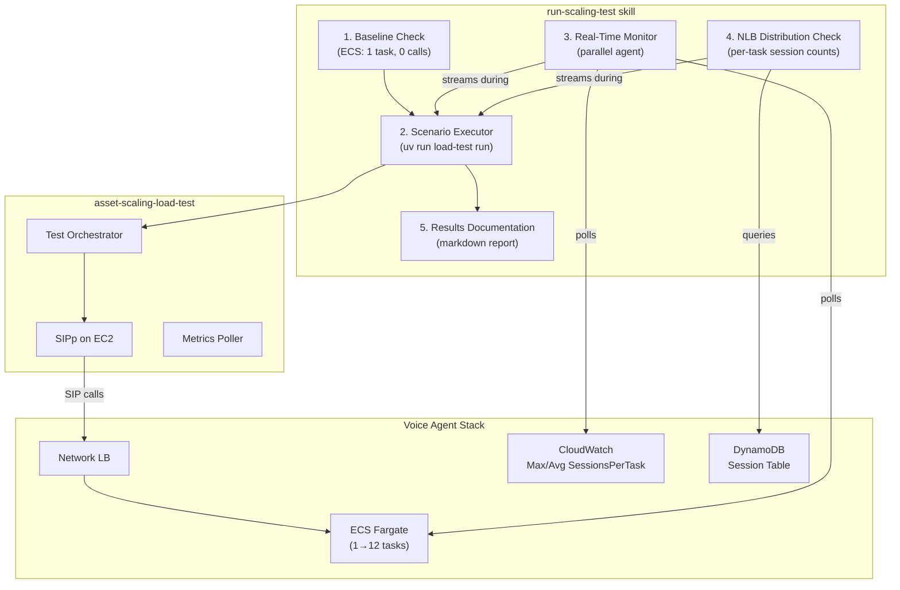

# ECS Scaling Validation Suite

## Problem Statement

We have a fully deployed ECS auto-scaling system (split Max/Avg metrics, +3/+5/+8 burst steps, -1 scale-in with task protection) and a complete SIPp-based load test harness at `../asset-scaling-load-test`. The scaling config is deployed but **has never been validated end-to-end under load**. We need to:

1. **Run each test scenario** against the live stack and capture results
2. **Monitor in real time** while tests execute -- CloudWatch metrics, ECS task counts, call health, and NLB distribution must be observed concurrently with call generation
3. **Start from a known baseline** every time (1 task, 0 active calls, clean metric history) so results are reproducible
4. **Verify NLB distribution** -- new tasks must receive calls from the load balancer, not just pile up on the original task
5. **Document results** with pass/fail outcomes, scaling timelines, and metric snapshots that we can refer back to

Today, running a test requires manually juggling multiple terminal sessions: one for the orchestrator, one for `poll_metrics.py --watch`, one for CloudWatch log tailing, and one for ECS task monitoring. There is no single workflow that orchestrates all of this together and produces a coherent result document.

## Vision

An OpenCode skill (`run-scaling-test`) that an operator invokes to:

1. Validate baseline state (1 task, 0 calls, healthy)
2. Launch the chosen scenario from `asset-scaling-load-test`
3. Run parallel monitoring agents that stream real-time observations
4. Collect and document results when the scenario completes

The skill should coordinate multiple concurrent activities:



## Current Scaling Configuration (Deployed)

| Parameter | Value | Metric |
|-----------|-------|--------|
| Target tracking target | 2 | `MaxSessionsPerTask` |
| Burst +3 | MaxSessionsPerTask 2.5-3.0 | `MaxSessionsPerTask` |
| Burst +5 | MaxSessionsPerTask 3.0-4.0 | `MaxSessionsPerTask` |
| Burst +8 | MaxSessionsPerTask > 4.0 | `MaxSessionsPerTask` |
| Scale-in step | -1 task | `SessionsPerTask` (avg) < 1.0 |
| Scale-in cooldown | 180s | |
| Scale-in eval periods | 3 consecutive | |
| Max capacity | 12 | |
| NLB health check | 10s interval, 2 healthy threshold | ~20s to routable |
| MAX_CONCURRENT_CALLS | 4 per container | |

## Test Scenarios (Already Defined)

Four YAML scenarios are ready in `asset-scaling-load-test/scenarios/`:

### 1. steady-state (~17 min)
- 4 calls, wait, assert >= 2 tasks, 4 more calls, assert >= 4 tasks, end all, verify scale-in to 1
- **Validates**: target tracking, proportional scale-out, gradual scale-in

### 2. burst (~28 min)
- 12 calls simultaneously onto 1 task (MaxSessionsPerTask = 12)
- **Validates**: burst step scaling (+8), rapid capacity addition, NLB routing to new tasks

### 3. scale-in-protection (~22 min)
- 6 calls, scale out, end 4, verify surviving 2 calls are not dropped
- **Validates**: ECS Task Scale-in Protection, idle task removal, active call survival

### 4. sustained-24 (~65 min)
- 24 calls ramped in batches of 6, hold 10 min, ramp down
- **Validates**: near-max capacity (12 tasks), sustained stability, orderly scale-in

## Implementation: OpenCode Skill

### Skill: `run-scaling-test`

**Trigger**: Operator invokes when ready to run a scaling validation test.

**Steps**:

#### Step 1: Validate Baseline
```bash
# Check ECS service state
aws ecs describe-services --cluster voice-agent-poc-poc-voice-agent \
  --services voice-agent-poc-poc-voice-agent --profile voice-agent \
  --query 'services[0].{running:runningCount,desired:desiredCount,pending:pendingCount}'

# Check no active calls
uv run python scripts/poll_metrics.py  # in asset-scaling-load-test
```

If not at baseline (1 task, 0 calls), wait or abort with instructions.

#### Step 2: Run Scenario (foreground)
```bash
cd ../asset-scaling-load-test
uv run load-test run --scenario <name>
```

#### Step 3: Parallel Monitoring (background agents)

Launch concurrent sub-agents:

**Agent A -- Metrics Watcher**: Polls CloudWatch every 30s, streams:
- `MaxSessionsPerTask`, `SessionsPerTask` (avg), `ActiveCount`, `HealthyTaskCount`
- ECS `RunningTaskCount`, `DesiredTaskCount`
- `E2ELatency` p50/p95/p99

**Agent B -- ECS Task Monitor**: Polls ECS describe-tasks, watches for:
- New task launches (IDs, launch timestamps)
- Task terminations (which tasks, was protection active?)
- Task protection state changes

**Agent C -- NLB Distribution Checker**: Queries DynamoDB session table:
- Per-task `active_session_count` from heartbeat records
- Verifies calls spread across multiple tasks (not all on one)
- Flags if any single task exceeds `MAX_CONCURRENT_CALLS`

**Agent D -- Log Tailer** (optional): Tails CloudWatch Logs for:
- `task_protection_updated` events
- `drain_started` / `drain_complete` events
- `pipeline_error` events
- `conversation_turn` events (confirms audio flowing)

#### Step 4: Collect and Document Results

After scenario completes, produce a results document:

```
docs/results/scaling-tests/<scenario>-<timestamp>.md
```

Contents:
- Scenario name, duration, pass/fail
- Scaling timeline (when tasks were added/removed)
- NLB distribution table (calls per task at peak)
- Metric summary (peak MaxSessionsPerTask, peak task count, min/max E2ELatency)
- Assertions: all pass/fail outcomes
- Dropped calls: count (should be 0)
- Notable log events (protection updates, drain events, errors)

## Baseline Management

Before each test run, verify:

| Check | Expected | How |
|-------|----------|-----|
| Running task count | 1 | `aws ecs describe-services` |
| Active sessions | 0 | `poll_metrics.py` or DynamoDB scan |
| Desired count | 1 | ECS service |
| No pending scaling activities | Clean | Check CloudWatch for recent scaling events |
| SIPp instance healthy | Running | `uv run python scripts/run_sipp.py status` |
| Audio files uploaded | Present | `uv run python scripts/ec2_shell.py "ls /opt/sipp/audio/calls_pcmu/"` |

If the system is not at baseline (e.g., previous test left tasks running), the skill should:
1. End any active SIPp processes
2. Wait for calls to drain
3. Wait for scale-in to complete (may take several minutes at -1/180s)
4. Re-check baseline

## NLB Distribution Validation

A key concern is whether the NLB actually spreads calls across new tasks or keeps sending them to the original. Verification approach:

1. **During test**: Query DynamoDB `TASK#*/HEARTBEAT` records every 30s
2. **Extract**: `active_session_count` per task ID
3. **Assert**: After scale-out stabilizes, no single task has > `targetSessionsPerTask + 1` sessions while other tasks have 0
4. **Report**: Table showing call distribution per task at peak load

The NLB health check uses `/ready` which returns 503 when `active_sessions >= MAX_CONCURRENT_CALLS`. With the 10s health check interval and 2 healthy threshold, a new task becomes routable in ~20s. After that, the NLB should route new connections to it.

## Run Order

Recommended execution sequence:

| # | Scenario | Duration | What It Proves |
|---|----------|----------|----------------|
| 1 | steady-state | ~17 min | Basic target tracking works |
| 2 | burst | ~28 min | Step scaling fires correctly |
| 3 | scale-in-protection | ~22 min | Active calls survive scale-in |
| 4 | sustained-24 | ~65 min | Near-max capacity soak test |

Total wall-clock time: ~2.5 hours (including baseline waits between tests).

Each test should start from a clean baseline. Between tests, wait for full scale-in to 1 task.

## CloudWatch Log Events to Monitor

| Event | When | What to Verify |
|-------|------|----------------|
| `task_protection_updated` | Call starts/ends | `protected: true` on first call, `false` on last |
| `task_protection_renewed` | Every 30s during calls | Renewal succeeds, `expires_at` advances |
| `drain_started` | SIGTERM received | Task enters drain mode |
| `drain_complete` | All calls ended after SIGTERM | Task exits cleanly |
| `session_health` | Every 30s | Correct `ActiveSessions` count per task |
| `heartbeat_sent` | Every 30s | Correct `active_count` reported to DynamoDB |
| `conversation_turn` | During calls | Audio is flowing, STT producing transcriptions |
| `pipeline_error` | Should not appear | Any error is a test failure signal |

## Success Criteria

- [ ] All 4 scenarios pass their inline assertions (task counts, active counts)
- [ ] Zero dropped calls across all scenarios
- [ ] NLB distributes calls across multiple tasks (no single-task hotspot after scale-out)
- [ ] E2E latency p95 < 3000ms under sustained load
- [ ] Scale-in removes only idle tasks; active calls survive
- [ ] Task protection events visible in logs for every call
- [ ] Results documented with scaling timelines and metric snapshots

## Dependencies

- `ecs-auto-scaling` (shipped) -- The scaling behavior being validated
- `scaling-load-test` (shipped) -- The SIPp harness at `../asset-scaling-load-test`
- Deployed voice agent stack with current scaling config
- SIPp EC2 instance with audio files uploaded
- AWS profile `voice-agent` configured

## Risks and Mitigations

| Risk | Impact | Mitigation |
|------|--------|------------|
| Scale-in takes too long between tests | Multi-hour total runtime | Can manually set desired count to 1 between tests if needed |
| SIPp EC2 instance resource limits | Can't generate enough calls | EC2 is t3.medium; 24 concurrent SIP+RTP streams is well within capacity |
| CloudWatch metric propagation delay | Assertions fail on timing | Scenarios have generous wait periods; metrics poller retries |
| Call audio not flowing (SIPp config issue) | Tests pass scaling but don't validate real conversations | Monitor `conversation_turn` events; abort if zero turns detected |
| Cost of running 12 Fargate tasks for 2+ hours | ~$2-5 in Fargate costs | Acceptable for validation; use poc account |
