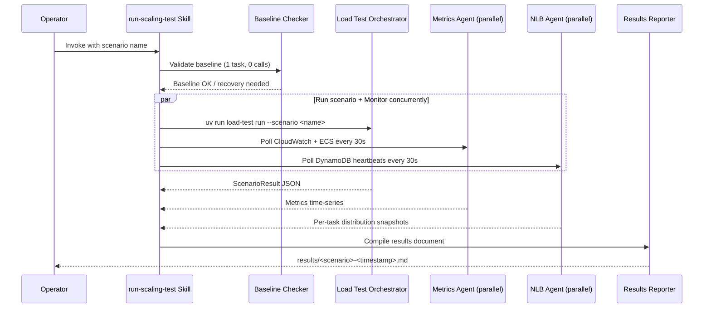

# Implementation Plan: ECS Scaling Validation Suite

## Overview

Build an OpenCode skill (`run-scaling-test`) that orchestrates end-to-end scaling validation by coordinating four concurrent activities: scenario execution via the SIPp load test harness, real-time metrics monitoring, NLB distribution verification, and automated result documentation. The skill ensures each test starts from a known baseline and produces a structured results report.

The load test harness (`../asset-scaling-load-test`) and four YAML scenarios are already built. The voice agent stack is deployed with the split Max/Avg metric scaling configuration. This feature wires them together into a repeatable, observable validation workflow.

## Architecture



## Architecture Decisions

| # | Decision | Choice | Rationale |
|---|----------|--------|-----------|
| 1 | **Skill location** | OpenCode skill in `.opencode/skills/run-scaling-test/` | Operator-invoked, not a code change. Skills are the project's established pattern for multi-step workflows. |
| 2 | **Parallel monitoring** | Task tool sub-agents running bash loops | OpenCode sub-agents can run long-lived bash commands in parallel while the main flow executes the scenario. Simpler than building a custom Python orchestrator. |
| 3 | **Baseline enforcement** | AWS CLI checks before each scenario | Must verify ECS state, DynamoDB state, and SIPp state. Recovery is automated (stop SIPp, wait for drain). |
| 4 | **NLB distribution check** | DynamoDB scan of TASK#*/HEARTBEAT records | Per-task `active_session_count` is already written every 30s by the voice agent heartbeat loop. No new instrumentation needed. |
| 5 | **Results format** | Markdown + JSON | Markdown for human review, JSON from the load test harness for programmatic analysis. Both stored under `docs/results/scaling-tests/`. |
| 6 | **Cross-project execution** | Skill runs `uv run` commands in the sibling project directory | The load test harness is a separate Python project with its own `pyproject.toml`. Using `uv run` with `workdir` keeps dependency isolation clean. |

## Implementation Steps

### Phase 1: Create the OpenCode Skill

**1.1 Create skill directory and SKILL.md**

File: `.opencode/skills/run-scaling-test/SKILL.md`

The skill file defines the workflow the agent follows when an operator invokes it. It must contain:

1. **Frontmatter**: name, description
2. **What I Do**: Summary of the skill's purpose
3. **When to Use Me**: Trigger conditions
4. **Steps**: Detailed, numbered workflow with exact commands

Key requirements for the skill:
- Accept a scenario name parameter (or `--all` for the full suite)
- Validate baseline before starting
- Launch parallel monitoring via Task tool sub-agents
- Execute the scenario via `uv run load-test run`
- Compile results into a markdown report after completion

**1.2 Skill Step 1: Validate Baseline**

The skill must verify all preconditions before starting a test:

```bash
# Check ECS service state
aws ecs describe-services \
  --cluster voice-agent-poc-poc-voice-agent \
  --services voice-agent-poc-poc-voice-agent \
  --profile voice-agent \
  --region us-east-1 \
  --query 'services[0].{running:runningCount,desired:desiredCount,pending:pendingCount}'
# Expected: {"running": 1, "desired": 1, "pending": 0}

# Check no active calls via DynamoDB
aws dynamodb scan \
  --table-name <session-table> \
  --filter-expression "begins_with(PK, :prefix) AND SK = :sk" \
  --expression-attribute-values '{":prefix":{"S":"TASK#"},":sk":{"S":"HEARTBEAT"}}' \
  --projection-expression "PK, active_session_count, updated_at" \
  --profile voice-agent --region us-east-1
# Expected: Either no items, or all active_session_count = 0

# Check SIPp instance is reachable
uv run python scripts/run_sipp.py status
# Expected: Instance accessible, no SIPp processes running

# Check audio files present
uv run python scripts/ec2_shell.py "ls /opt/sipp/audio/calls_pcmu/ | wc -l"
# Expected: > 0 files
```

If baseline is not met, the skill should attempt recovery:
1. Stop any running SIPp: `uv run python scripts/run_sipp.py stop`
2. Wait for calls to drain (poll DynamoDB every 30s until active_session_count = 0 on all tasks)
3. Wait for scale-in to complete (poll ECS until runningCount = 1)
4. Re-check baseline

**1.3 Skill Step 2: Launch Parallel Monitoring Agents**

Before starting the scenario, launch two parallel Task tool sub-agents:

**Agent A -- Metrics Watcher** (runs for the duration of the scenario):
```bash
# In workdir: ../asset-scaling-load-test
uv run python scripts/poll_metrics.py --watch --interval 30 --json
```
This streams JSON snapshots every 30s with:
- `ecs.running_count`, `ecs.desired_count`
- `sessions_per_task`, `active_count`, `healthy_tasks`

The sub-agent captures all output and returns it when the scenario completes.

**Agent B -- NLB Distribution Checker** (runs for the duration of the scenario):
```bash
# Poll DynamoDB TASK#*/HEARTBEAT records every 30s
while true; do
  aws dynamodb scan \
    --table-name <session-table> \
    --filter-expression "begins_with(PK, :prefix) AND SK = :sk" \
    --expression-attribute-values '{":prefix":{"S":"TASK#"},":sk":{"S":"HEARTBEAT"}}' \
    --projection-expression "PK, active_session_count, updated_at" \
    --profile voice-agent --region us-east-1 \
    --output json
  echo "---SNAPSHOT---"
  sleep 30
done
```

This produces periodic snapshots showing how many calls each task has, which validates NLB distribution.

**1.4 Skill Step 3: Execute the Scenario**

Run the scenario in the foreground:
```bash
# In workdir: ../asset-scaling-load-test
uv run load-test run --scenario <name> --config config.yaml
```

The orchestrator:
1. Resolves SSM parameters (webhook URL, ECS cluster, SIPp instance ID)
2. Starts the internal metrics poller (background thread, 30s interval)
3. Executes scenario steps sequentially (place_calls, wait, assert, end_calls, end_all_calls)
4. Runs scenario-level assertions (max_dropped_calls, max_e2e_latency_p95_ms)
5. Saves JSON results to `./results/<scenario>-<timestamp>.json`
6. Prints terminal summary with pass/fail assertions and metrics table

The exit code is 0 if all assertions passed, 1 if any failed.

**1.5 Skill Step 4: Stop Monitoring and Collect Results**

After the scenario completes:
1. Signal the monitoring agents to stop (they'll be killed when the Task completes)
2. Read the JSON results file from `../asset-scaling-load-test/results/`
3. Parse the metrics watcher output for the time-series data
4. Parse the NLB distribution snapshots

**1.6 Skill Step 5: Generate Results Document**

Create a structured markdown report at:
```
docs/results/scaling-tests/<scenario>-<YYYY-MM-DD-HHmmss>.md
```

The report template:

```markdown
# Scaling Test Results: <scenario-name>

**Date**: <timestamp>
**Duration**: <minutes>m <seconds>s
**Result**: PASSED / FAILED

## Configuration

| Parameter | Value |
|-----------|-------|
| Target tracking target | 2 (MaxSessionsPerTask) |
| Burst steps | +3 / +5 / +8 |
| Scale-in | -1 per 180s (AvgSessionsPerTask) |
| Max capacity | 12 |
| MAX_CONCURRENT_CALLS | 4 |

## Assertions

| # | Assertion | Expected | Actual | Result |
|---|-----------|----------|--------|--------|
| 1 | RunningTaskCount >= 2 | >= 2 | 3 | PASS |
| ... | ... | ... | ... | ... |

## Scaling Timeline

| Time | Event | Tasks (Running/Desired) | MaxSessionsPerTask | ActiveCount |
|------|-------|------------------------|---------------------|-------------|
| 0:00 | Scenario start | 1/1 | 0.0 | 0 |
| 0:15 | 4 calls placed | 1/1 | 4.0 | 4 |
| 1:30 | Scale-out triggered | 1/3 | 4.0 | 4 |
| 2:00 | New tasks routable | 3/3 | 1.3 | 4 |
| ... | ... | ... | ... | ... |

## NLB Distribution (at peak load)

| Task ID | Active Sessions | % of Total |
|---------|----------------|------------|
| ...abc123 | 2 | 25% |
| ...def456 | 3 | 37.5% |
| ...ghi789 | 3 | 37.5% |

## Metrics Summary

| Metric | Min | Avg | Max | Last |
|--------|-----|-----|-----|------|
| RunningTaskCount | 1 | 2.5 | 4 | 1 |
| SessionsPerTask (avg) | 0.0 | 1.2 | 4.0 | 0.0 |
| MaxSessionsPerTask | 0 | 2.1 | 4 | 0 |
| E2ELatency p95 (ms) | 800 | 1200 | 1800 | - |

## Call Summary

| Metric | Value |
|--------|-------|
| Total calls placed | 8 |
| Completed | 8 |
| Dropped | 0 |
| Failed | 0 |

## Log Events (Notable)

- task_protection_updated: 4 enable, 4 disable events
- drain_started / drain_complete: 2 task drain cycles observed
- pipeline_error: 0 errors
- conversation_turn: 16 turns across 8 calls (avg 2 turns/call)
```

### Phase 2: Create Results Directory

**2.1 Create the results directory structure**

```bash
mkdir -p docs/results/scaling-tests
```

Add a `.gitkeep` to track the empty directory in git. Result files will be committed after each test run as a historical record.

### Phase 3: Enhance Monitoring Scripts (Optional)

The existing `poll_metrics.py` in the load test project polls `SessionsPerTask` (avg) but does NOT currently poll `MaxSessionsPerTask`. This is a gap.

**3.1 Add MaxSessionsPerTask to metrics poller**

File: `../asset-scaling-load-test/src/load_test/metrics_poller.py`

Add a new CloudWatch query for `MaxSessionsPerTask` in the session metrics batch:

```python
# Add to the session metrics query list in _poll_cloudwatch()
{
    "Id": "max_sessions_per_task",
    "MetricStat": {
        "Metric": {
            "Namespace": self._target.cloudwatch_namespace_sessions,
            "MetricName": "MaxSessionsPerTask",
            "Dimensions": [{"Name": "Environment", "Value": "poc"}],
        },
        "Period": self._config.cloudwatch_period,
        "Stat": "Average",
    },
}
```

Also add the field to `MetricsSnapshot`:
```python
max_sessions_per_task: float = 0.0
```

And update `poll_metrics.py` standalone script to display it.

**3.2 Add MaxSessionsPerTask to models.py**

File: `../asset-scaling-load-test/src/load_test/models.py`

Add `max_sessions_per_task: float = 0.0` to the `MetricsSnapshot` dataclass.

**3.3 Update reporter to show MaxSessionsPerTask**

File: `../asset-scaling-load-test/src/load_test/reporter.py`

Add column to the metrics summary table.

**3.4 Update assertions to support MaxSessionsPerTask**

File: `../asset-scaling-load-test/src/load_test/orchestrator.py`

Add `MaxSessionsPerTask` to the metric name normalization map.

**3.5 Update tests**

Update existing tests to account for the new field.

### Phase 4: Run Validation Tests

Execute the test suite in order, documenting results after each:

**4.1 Test 1: steady-state (~17 min)**

```bash
# From: ../asset-scaling-load-test
uv run load-test run --scenario steady-state --config config.yaml
```

Validates:
- Target tracking adds tasks when MaxSessionsPerTask > 2.0
- Scale-out from 1 to 4 tasks for 8 calls
- Scale-in back to 1 task after calls end (-1 per 180s)
- Zero dropped calls

**4.2 Test 2: burst (~28 min)**

```bash
uv run load-test run --scenario burst --config config.yaml
```

Validates:
- 12 simultaneous calls trigger burst +8 step
- Rapid capacity addition (5+ tasks within 3 min)
- NLB routes to new tasks within ~20s of health check passing
- Zero dropped calls

**4.3 Test 3: scale-in-protection (~22 min)**

```bash
uv run load-test run --scenario scale-in-protection --config config.yaml
```

Validates:
- 6 calls scale out to 3+ tasks
- After ending 4 calls, the 2 surviving calls are NOT dropped
- ECS task protection prevents termination of tasks with active sessions
- Only idle (unprotected) tasks are removed during scale-in

**4.4 Test 4: sustained-24 (~65 min)**

```bash
uv run load-test run --scenario sustained-24 --config config.yaml
```

Validates:
- 24 calls ramped in batches of 6, scaling to 10-12 tasks
- Sustained stability at near-max capacity for 10 minutes
- Orderly ramp-down with batched call endings
- Full scale-in from 12 tasks to 1 at -1/180s

### Phase 5: Final Documentation

**5.1 Compile overall summary**

After all four scenarios complete, create a summary document:

```
docs/results/scaling-tests/summary-<date>.md
```

Contents:
- Overall pass/fail across all 4 scenarios
- Aggregate metrics (total calls placed, total dropped, worst-case latency)
- Key findings (NLB distribution quality, scaling response times, protection effectiveness)
- Recommendations for production tuning (if any)
- Links to individual scenario results

**5.2 Update feature status**

If all scenarios pass, the feature can be marked as shipped in the dashboard.

## Files Created/Modified

### New Files

| File | Description |
|------|-------------|
| `.opencode/skills/run-scaling-test/SKILL.md` | OpenCode skill for running scaling validation tests |
| `docs/results/scaling-tests/.gitkeep` | Results directory placeholder |
| `docs/results/scaling-tests/<scenario>-<ts>.md` | Per-scenario result documents (created during test runs) |

### Modified Files (in `../asset-scaling-load-test`)

| File | Change |
|------|--------|
| `src/load_test/models.py` | Add `max_sessions_per_task` field to `MetricsSnapshot` |
| `src/load_test/metrics_poller.py` | Add `MaxSessionsPerTask` to CloudWatch query |
| `src/load_test/reporter.py` | Add `MaxSessionsPerTask` column to metrics summary table |
| `src/load_test/orchestrator.py` | Add `MaxSessionsPerTask` to metric name normalization |
| `scripts/poll_metrics.py` | Add `MaxSessionsPerTask` to one-shot and watch output |

## Operational Commands Reference

### Baseline Check
```bash
# ECS state
aws ecs describe-services --cluster voice-agent-poc-poc-voice-agent \
  --services voice-agent-poc-poc-voice-agent --profile voice-agent \
  --query 'services[0].{running:runningCount,desired:desiredCount}'

# Active sessions
uv run python scripts/poll_metrics.py  # in asset-scaling-load-test

# SIPp status
uv run python scripts/run_sipp.py status

# Audio files
uv run python scripts/ec2_shell.py "ls /opt/sipp/audio/calls_pcmu/ | wc -l"
```

### Running a Test
```bash
# Dry run (no AWS calls)
uv run load-test run --scenario steady-state --dry-run

# Real run
uv run load-test run --scenario steady-state --config config.yaml

# All scenarios sequentially
uv run load-test run --all --config config.yaml
```

### Monitoring (parallel terminal)
```bash
# Continuous metrics
uv run python scripts/poll_metrics.py --watch --interval 15

# SIPp stats during test
uv run python scripts/run_sipp.py stats

# Arbitrary EC2 commands
uv run python scripts/ec2_shell.py "ps aux | grep sipp"
```

### Emergency Stop
```bash
# Kill SIPp immediately
uv run python scripts/run_sipp.py stop

# Force scale-in (if needed between tests)
aws ecs update-service --cluster voice-agent-poc-poc-voice-agent \
  --service voice-agent-poc-poc-voice-agent \
  --desired-count 1 --profile voice-agent
```

## CloudWatch Metrics to Watch

### VoiceAgent/Sessions (from Session Counter Lambda, every 60s)

| Metric | Stat | Used For |
|--------|------|----------|
| `MaxSessionsPerTask` | Average | Scale-out decisions, burst detection |
| `SessionsPerTask` | Average | Scale-in decisions (fleet-wide avg) |
| `ActiveCount` | Sum | Total active calls across fleet |
| `HealthyTaskCount` | Maximum | Number of tasks with recent heartbeats |

### VoiceAgent/Pipeline (from voice agent EMF, per-call)

| Metric | Stat | Used For |
|--------|------|----------|
| `E2ELatency` | p50/p95/p99 | Conversation quality validation |
| `ActiveSessions` | Max | Per-container session count |
| `ToolExecutionTime` | Avg/p95 | Tool performance under load |

### AWS/ECS (from Container Insights)

| Metric | Stat | Used For |
|--------|------|----------|
| `RunningTaskCount` | Average | Actual task count |
| `DesiredTaskCount` | Average | Scaling target |
| `CPUUtilization` | Average | Container resource usage |
| `MemoryUtilization` | Average | Container resource usage |

## CloudWatch Log Events to Monitor

| Event | Log Group | What to Verify |
|-------|-----------|----------------|
| `task_protection_updated` | `/ecs/voice-agent-poc-poc-voice-agent` | `protected: true` on first call, `false` on last |
| `task_protection_renewed` | `/ecs/voice-agent-poc-poc-voice-agent` | Every 30s during active calls |
| `drain_started` | `/ecs/voice-agent-poc-poc-voice-agent` | SIGTERM received during scale-in |
| `drain_complete` | `/ecs/voice-agent-poc-poc-voice-agent` | Task exits cleanly after drain |
| `session_health` | `/ecs/voice-agent-poc-poc-voice-agent` | Correct `ActiveSessions` per task |
| `heartbeat_sent` | `/ecs/voice-agent-poc-poc-voice-agent` | Correct `active_count` in DynamoDB |
| `conversation_turn` | `/ecs/voice-agent-poc-poc-voice-agent` | Audio flowing, STT producing transcriptions |
| `pipeline_error` | `/ecs/voice-agent-poc-poc-voice-agent` | Should NOT appear -- any error is a failure |
| `session_count_completed` | `/aws/lambda/session-counter` | Lambda emitting metrics correctly |

## DynamoDB Session Table Query Patterns

### Query active sessions (via GSI1)
```
KeyConditionExpression: GSI1PK = "STATUS#active"
Select: COUNT
```

### Scan task heartbeats (for NLB distribution check)
```
FilterExpression: begins_with(PK, "TASK#") AND SK = "HEARTBEAT" AND updated_at > :threshold
ProjectionExpression: PK, active_session_count, updated_at
```

Heartbeat staleness threshold: 90 seconds. Tasks without a heartbeat within this window are considered unhealthy by the session counter Lambda.

## Success Criteria

- [ ] All 4 scenarios pass their inline assertions (task counts, active counts)
- [ ] Zero dropped calls across all scenarios
- [ ] NLB distributes calls across multiple tasks after scale-out (no single-task hotspot)
- [ ] E2E latency p95 < 3000ms under sustained load
- [ ] Scale-in removes only idle tasks; active calls survive
- [ ] Task protection events visible in logs for every call
- [ ] Results documented with scaling timelines and metric snapshots
- [ ] OpenCode skill is operational and reproducible

## Estimated Effort

| Phase | Effort |
|-------|--------|
| Phase 1: Create OpenCode skill | 0.5 day |
| Phase 2: Results directory setup | < 1 hour |
| Phase 3: Enhance monitoring scripts (MaxSessionsPerTask) | 0.5 day |
| Phase 4: Run 4 validation tests + document results | 1 day (wall-clock: ~3 hours tests + analysis) |
| Phase 5: Final documentation | 0.5 day |
| **Total** | **~2.5 days** |

## Risk Mitigations

| Risk | Impact | Mitigation |
|------|--------|------------|
| Scale-in takes too long between tests (180s cooldown, -1 at a time) | Multi-hour total runtime | Can force `desired-count 1` via AWS CLI between tests if needed |
| SIPp EC2 instance not responding | Test blocked | Check `run_sipp.py status` in baseline; instance auto-recovers via SSM |
| CloudWatch metric propagation delay (60-90s) | Assertions fail on timing | Scenarios have generous wait periods (120-720s) |
| Audio not flowing (SIPp config issue) | Tests pass scaling but miss conversation validation | Monitor `conversation_turn` events; abort if zero turns after 60s |
| Sub-agent monitoring times out | Lose real-time observations | Results JSON from load test harness still captures full metrics history |
| Cost of 12 Fargate tasks for 3+ hours | ~$2-5 in Fargate costs | Acceptable for P0 validation; poc account only |

## Progress Log

| Date | Update |
|------|--------|
| 2026-02-26 | Plan created. Load test harness and 4 YAML scenarios ready. Scaling config deployed. |
