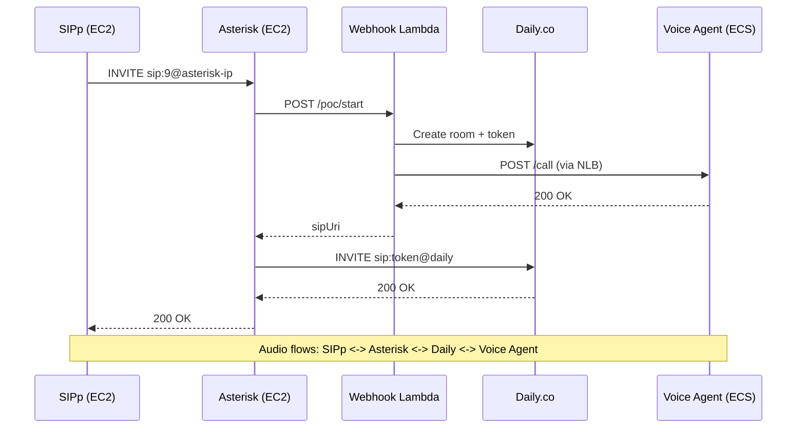

# Shipped: ECS Scaling Validation Suite

## Summary

End-to-end ECS auto-scaling deployed and validated with live SIPp load tests through the full production call path: SIPp -> Asterisk PBX -> Daily.co -> Voice Agent (ECS Fargate). Three critical scaling bugs were found and fixed during validation. All three phases of the scaling test passed.

## What Was Shipped

### 1. Auto-Scaling Infrastructure (CDK)

**Target tracking policy (scale-out):**
- Metric: `SessionsPerTask` average (not max -- avg prevents overshoot when new empty tasks come online)
- Target: 3 sessions per task
- `disableScaleIn: true` (scale-in handled separately by step policy)
- Cooldown: 60s

**Step scaling policy (scale-in):**
- Metric: `SessionsPerTask` average <= 0.0 (truly zero sessions fleet-wide)
- Action: Remove up to 3 tasks
- Cooldown: 30s, 2 evaluation periods

**Task scale-in protection:**
- Containers with active calls enable ECS Task Scale-in Protection via the local Agent API
- Protected tasks are never terminated during scale-in events
- Protection renewed every 30s to prevent expiry

### 2. Multi-Stage Docker Build

Converted the voice agent Dockerfile to a two-stage build (builder + runtime). PyTorch was removed as a dependency. Final compressed image size: 824 MB.

### 3. Task Sizing

- CPU: 4096 (4 vCPU) -- supports 10 concurrent calls per task
- Memory: 8192 MiB -- Fargate minimum for 4 vCPU
- `sessionCapacityPerTask`: 10 (drives `MAX_CONCURRENT_CALLS` env var and `/ready` 503 threshold)

### 4. NLB Health Check Tuning

- Interval: 10s (NLB minimum; 5s was rejected by NLB)
- Healthy threshold: 2
- Unhealthy threshold: 2
- New tasks become routable in ~20s after container init

### 5. SIPp-via-Asterisk Test Architecture

SIPp calls Asterisk extension 9, which triggers the webhook, creates a Daily room, starts the voice agent bot, and bridges the call. This matches the production call path exactly.



### 6. Conversation Audio Scripts

Four new conversation scripts for load testing with realistic speech patterns:
- `crm_account_lookup` -- Customer account lookup flow
- `kb_product_questions` -- Knowledge base product inquiries
- `crm_support_case` -- Support case creation
- `mixed_inquiry` -- Mixed CRM + KB conversation

### 7. OpenCode Skill

Created `.opencode/skills/run-scaling-test/SKILL.md` for reproducible scaling test execution with baseline validation, parallel monitoring, and structured result collection.

## Bugs Found and Fixed

### Bug 1: Scale-out overshoot (MaxSessionsPerTask metric)

**Problem:** Target tracking used `MaxSessionsPerTask` (hottest single task). Since sessions are sticky (existing calls stay on their original task), this metric never decreases when new empty tasks come online, causing persistent overshoot (7 tasks for 5 sessions).

**Fix:** Switched to `SessionsPerTask` average. When new tasks come online with 0 sessions, the fleet average naturally drops, stabilizing scaling.

### Bug 2: NLB health check interval

**Problem:** NLB was configured with a 5s health check interval, but the NLB minimum is 10s. CDK deployment succeeded but the NLB silently used the minimum.

**Fix:** Set interval to 10s explicitly. Also reduced ECS health check start period from 30s to 10s.

### Bug 3: Step scaling alarm always firing

**Problem:** The scale-in step scaling alarm had threshold `SessionsPerTask avg >= 0.0`, which is always true. The scale-in policy fired constantly, fighting the scale-out policy. New tasks were launched by target tracking and immediately terminated by step scaling.

**Fix:** Changed the CDK step scaling configuration so the alarm fires at `SessionsPerTask avg <= 0.0` (only when truly zero sessions fleet-wide). The fix required correcting the `scalingSteps` array:

```typescript
// Before (broken): alarm threshold >= 0.0, always fires
scalingSteps: [
  { upper: 0, change: 0 },
  { lower: 0, change: -3 },
]

// After (fixed): alarm threshold <= 0.0, fires only at zero sessions
scalingSteps: [
  { upper: 1, change: 0 },
  { upper: 0, change: -3 },
]
```

## Validation Results

Tested 2026-02-26 with live SIPp calls through the full call path.

### Phase 1: Scale-Out (6 calls)

| Metric | Value |
|--------|-------|
| Calls placed | 6 at 1/20s rate |
| Scale-out trigger | T+4min (target tracking alarm fires) |
| Desired tasks | 1 -> 2 |
| Running tasks | 2/2 at T+6min |
| Stability check | Desired holds at 2 for 2+ min (scale-in NOT fighting) |

### Phase 2: Additional Load (6 more calls, 11 peak)

| Metric | Value |
|--------|-------|
| Peak sessions | 11 (6 Phase 1 + 5 remaining Phase 2) |
| Desired tasks | 2 -> 4 (ceil(11/3) = 4) |
| Running tasks | 4/4 at T+6.5min |
| Scale-out alarm | Returns to OK (6/4 = 1.5 avg, below target 3) |

### Phase 3: Scale-In (all calls ended)

| Metric | Value |
|--------|-------|
| Sessions after kill | 0 (drained via Daily timeout ~5 min) |
| Scale-in alarm | Fires (SessionsPerTask avg <= 0.0) |
| Step adjustment | -3 tasks (4 -> 1, respecting minCapacity) |
| Final state | 1 desired / 1 running |

### Cold Start Timing (Measured)

| Phase | Duration | Cumulative |
|-------|----------|-----------|
| ENI attach + scheduling | ~14s | 14s |
| Image pull (824 MB) | ~37s | 51s |
| Container init | ~17s | 68s |
| NLB health check (2 x 10s) | ~20s | ~88s |
| + Scaling decision pipeline | 1-3 min | ~3-5 min total |

## Deployed Configuration

| Parameter | Value |
|-----------|-------|
| `minCapacity` | 1 |
| `maxCapacity` | 12 |
| `targetSessionsPerTask` | 3 |
| `sessionCapacityPerTask` | 10 |
| Task CPU | 4096 (4 vCPU) |
| Task Memory | 8192 MiB |
| Scale-out | Target tracking: SessionsPerTask avg, target=3, cooldown 60s |
| Scale-in | Step scaling: SessionsPerTask avg <= 0 -> -3 tasks, cooldown 30s |
| `disableScaleIn` on target tracking | true |
| NLB health check | `/ready` every 10s, 2 healthy/2 unhealthy |

## Files Changed

### `asset-pipecat-sagemaker`

| File | Change |
|------|--------|
| `infrastructure/src/stacks/ecs-stack.ts` | Target tracking uses SessionsPerTask avg; step scaling alarm fixed; NLB 10s interval |
| `infrastructure/test/ecs.test.ts` | Updated test for SessionsPerTask metric |
| `backend/voice-agent/Dockerfile` | Multi-stage Docker build, PyTorch removed |
| `backend/voice-agent/requirements.txt` | Cleaned stale PyTorch comments |
| `AGENTS.md` | Added cold start timing, updated scaling docs |
| `.opencode/skills/run-scaling-test/SKILL.md` | Updated with current config and test procedures |
| `docs/reference/scaling-analysis.md` | Updated section 4.4 from "planned" to "deployed and validated" |
| `docs/features/ecs-scaling-validation-suite/shipped.md` | This file |
| `ARCHITECTURE.md` | Updated auto-scaling section with actual config and test results |

### `asset-scaling-load-test`

| File | Change |
|------|--------|
| `audio/generate_audio.py` | New conversation scripts (crm_account_lookup, kb_product_questions, crm_support_case, mixed_inquiry) |
| `sipp/uac_asterisk.xml` | Audio file reference updated to 600s PCMU file |
| `scenarios/steady_state.yaml` | Phased ramp with 5-min cold start gaps |
| `.opencode/skills/run-scaling-test/SKILL.md` | New scaling test skill |

### `asset-sip-server`

| File | Change |
|------|--------|
| `infrastructure/cdk/src/constructs/asterisk-instance.ts` | Security group allows SIPp VPC CIDR for SIP/RTP |
| `scripts/deploy-web-client.sh` | Minor fix |

## Test Suites

| Suite | Result |
|-------|--------|
| CDK tests (pipecat-sagemaker) | 179/179 passing |
| Python tests (scaling-load-test) | 224/224 passing |
| CDK tests (sip-server) | 55/55 passing |

## Key Learnings

1. **Use average, not max, for target tracking metrics.** Max never decreases with sticky sessions, causing permanent overshoot.

2. **CDK step scaling `scalingSteps` are unintuitive.** The `upper` and `lower` bounds are relative to the alarm threshold, not absolute metric values. Getting this wrong creates alarms that are always in ALARM state, causing policies to fight each other.

3. **Cold start is irreducible at ~90s.** The image pull (824 MB) is the bottleneck. Multi-stage Docker builds saved only ~3% because the ML runtime dependencies (ONNX, ffmpeg, libsndfile) dominate image size, not PyTorch.

4. **NLB minimum health check interval is 10s**, not 5s. CDK doesn't validate this -- the NLB silently uses its minimum.

5. **Test through the real call path.** Direct SIPp-to-Daily testing missed the Asterisk-mediated call setup that production uses. The SIPp-via-Asterisk architecture matches production exactly and caught real scaling behavior.
