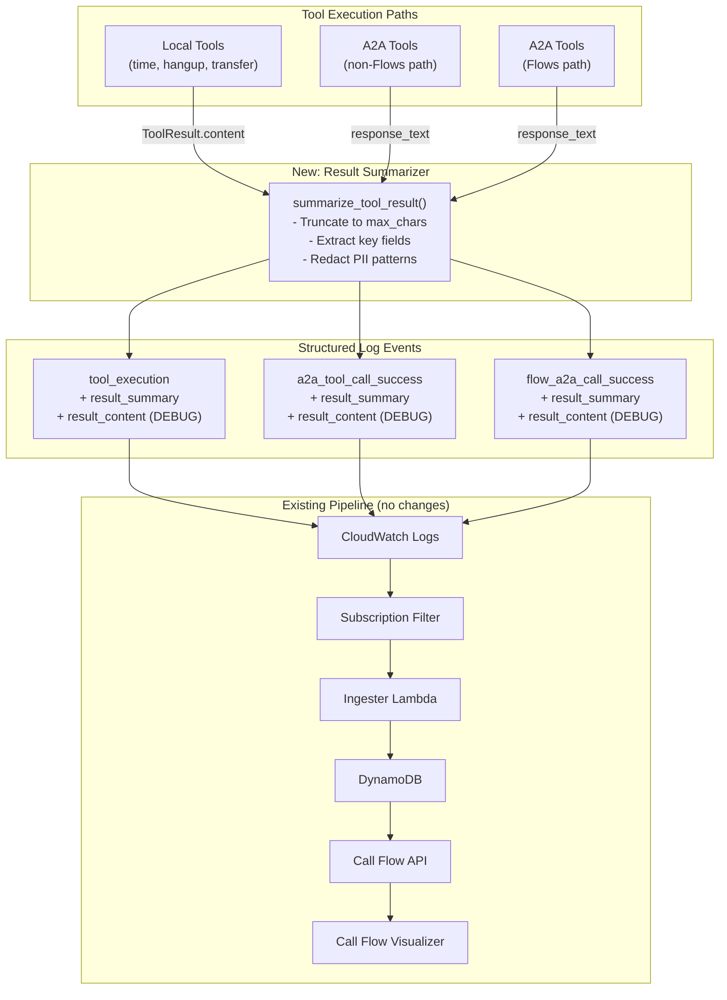

# Implementation Plan: Expanded Tool Result Logging

## Overview

Add structured tool result content to the voice agent's logging pipeline so that operators can see **what** tools returned, not just that they were called. Today, both local tools and A2A tool calls log execution time and status but discard result content. This makes it impossible to debug incorrect agent behavior, audit customer interactions, or understand why the LLM made a recommendation.

The enhancement adds a `result_summary` field (truncated, structured extract) to existing INFO-level log events and a `result_content` field with the full response at DEBUG level. Since the Call Flow Visualizer's expanded detail view already renders `JSON.stringify(event.data)`, new fields will surface automatically in the dashboard without frontend changes. A compact inline preview will be added to the timeline for quick scanning.

## Architecture

## Architecture Decisions

| # | Decision | Choice | Rationale |
|---|----------|--------|-----------|
| 1 | Where to add result logging | Existing log events (`tool_execution`, `a2a_tool_call_success`, `flow_a2a_call_success`) | Avoids new event types; subscription filter already captures these events; no infrastructure changes needed |
| 2 | Summary vs full content | Both: `result_summary` at INFO, `result_content` at DEBUG | INFO keeps logs readable and cost-effective; DEBUG available for deep investigation via CloudWatch Insights |
| 3 | Summary format | Truncated string (max 500 chars) with key-field extraction | Balances readability with cost; CloudWatch charges per byte ingested |
| 4 | PII handling | Regex-based pattern redaction for common patterns (email, phone, SSN, account numbers) | No existing PII framework; lightweight approach covers the highest-risk patterns without requiring a dependency |
| 5 | Feature gating | SSM parameter `/voice-agent/config/enable-tool-result-logging` (default: `false`) | Allows enabling per-environment; avoids PII risk in production until operator explicitly opts in |
| 6 | ConversationObserver integration | Not in initial scope | Tool results don't flow as pipeline frames; would require architectural changes; log-level approach achieves the goal more simply |
| 7 | Frontend inline preview | Add truncated result preview to `TimelineEvent.tsx` render functions | Expanded JSON detail already works; inline preview improves quick scanning without expanding each event |

## Implementation Steps

### Phase 1: Result Summarizer Utility

- [ ] Create `app/tools/result_summarizer.py` with:
  - `summarize_tool_result(content: dict | str, max_chars: int = 500) -> str` -- extracts key fields and truncates
  - `redact_pii(text: str) -> str` -- regex-based redaction of email, phone, SSN, account number patterns
  - Type-specific extractors for known tool results:
    - KB search: extract document titles, confidence scores, snippet previews
    - CRM lookup: extract customer name (redacted), ID, verification status
    - Appointment: extract date, time, type, appointment ID
    - Generic fallback: truncate JSON string representation
- [ ] Add SSM parameter lookup for feature gate in `app/config.py` or existing SSM config path
- [ ] Unit tests for `result_summarizer.py`:
  - Test truncation at boundary
  - Test PII redaction patterns (email, phone, SSN, account numbers)
  - Test each type-specific extractor
  - Test feature gate (enabled/disabled)

### Phase 2: Local Tool Result Logging

- [ ] Modify `app/tools/executor.py` `execute()` method:
  - After `tool_execution_complete` log (line ~126), add `result_summary` field from summarizer
  - Add separate DEBUG-level log with full `result.content` as `result_content`
- [ ] Modify `app/observability.py` `MetricsCollector.record_tool_execution()`:
  - Accept optional `result_summary: str | None` parameter
  - Include `result_summary` in the `tool_execution` structured log event
- [ ] Verify `ToolResult.content` is passed through the execution chain correctly

### Phase 3: A2A Tool Result Logging

- [ ] Modify `app/a2a/tool_adapter.py` non-Flows path (~line 136):
  - Add `result_summary=summarize_tool_result(response_text)` to `a2a_tool_call_success` log
  - Add DEBUG-level log with full `response_text` as `result_content`
- [ ] Modify `app/flows/flow_config.py` Flows path (~line 146):
  - Add `result_summary=summarize_tool_result(response_text)` to `flow_a2a_call_success` log
  - Add DEBUG-level log with full `response_text` as `result_content`

### Phase 4: Frontend Inline Preview

- [ ] Modify `frontend/call-flow-visualizer/src/components/TimelineEvent.tsx`:
  - For `tool_execution` events: show truncated `result_summary` after status/timing
  - For `a2a_tool_call_success` events: show truncated `result_summary` after timing/length
  - For `flow_a2a_call_success` events: same treatment
  - Style the preview with a `result-preview` CSS class (muted, smaller font)
- [ ] Add CSS for `.result-preview` in the component's stylesheet

### Phase 5: SSM Feature Gate & Configuration

- [ ] Add SSM parameter `/voice-agent/config/enable-tool-result-logging` (default `false`) to CDK stack
- [ ] Read the parameter at pipeline startup alongside existing SSM config
- [ ] When disabled, skip result summarization entirely (zero overhead)
- [ ] Add `TOOL_RESULT_LOG_MAX_CHARS` environment variable (default 500) for summary truncation length
- [ ] Document the new SSM parameter and env var in AGENTS.md

### Phase 6: Integration Testing

- [ ] Manual test with a live call using KB, CRM, and appointment tools:
  - Verify `result_summary` appears in CloudWatch Logs at INFO level
  - Verify `result_content` appears at DEBUG level only
  - Verify PII patterns are redacted in summaries
  - Verify Call Flow Visualizer shows result preview inline
  - Verify expanded detail view shows full `result_summary` field
- [ ] Verify feature gate: disable SSM parameter and confirm no result content in logs
- [ ] Verify CloudWatch Insights query can filter on `result_summary` field

## Testing Strategy

### Unit Tests

| Test | File | Description |
|------|------|-------------|
| Summarizer truncation | `tests/test_result_summarizer.py` | Verify output respects `max_chars` boundary |
| PII redaction - email | `tests/test_result_summarizer.py` | `user@example.com` -> `***@***.***` |
| PII redaction - phone | `tests/test_result_summarizer.py` | `555-123-4567` -> `***-***-****` |
| PII redaction - SSN | `tests/test_result_summarizer.py` | `123-45-6789` -> `***-**-****` |
| PII redaction - account | `tests/test_result_summarizer.py` | `ACCT-12345678` -> `ACCT-********` |
| KB extractor | `tests/test_result_summarizer.py` | Extracts document titles and confidence scores |
| CRM extractor | `tests/test_result_summarizer.py` | Extracts customer ID, redacts name |
| Appointment extractor | `tests/test_result_summarizer.py` | Extracts date, time, type, ID |
| Generic fallback | `tests/test_result_summarizer.py` | Truncates arbitrary dict to max_chars |
| Feature gate off | `tests/test_result_summarizer.py` | Returns `None` when disabled |

### Integration Tests

| Test | Description |
|------|-------------|
| Local tool with result logging | Execute `get_current_time`, verify `result_summary` in log output |
| A2A tool with result logging | Mock A2A response, verify `result_summary` in `a2a_tool_call_success` |
| Feature gate disabled | Verify no `result_summary` field when SSM param is `false` |

## Files Created/Modified

### New Files

| File | Purpose |
|------|---------|
| `backend/voice-agent/app/tools/result_summarizer.py` | Result summarization and PII redaction utility |
| `backend/voice-agent/tests/test_result_summarizer.py` | Unit tests for summarizer |

### Modified Files

| File | Change |
|------|--------|
| `backend/voice-agent/app/tools/executor.py` | Add `result_summary` to `tool_execution_complete` log |
| `backend/voice-agent/app/observability.py` | Add optional `result_summary` param to `record_tool_execution()` |
| `backend/voice-agent/app/a2a/tool_adapter.py` | Add `result_summary` to `a2a_tool_call_success` log |
| `backend/voice-agent/app/flows/flow_config.py` | Add `result_summary` to `flow_a2a_call_success` log |
| `frontend/call-flow-visualizer/src/components/TimelineEvent.tsx` | Add inline result preview for tool events |
| `infrastructure/src/voice-agent-ecs-construct.ts` | Add SSM parameter for feature gate |
| `AGENTS.md` | Document new SSM parameter and env var |

## Risks & Mitigations

| Risk | Severity | Mitigation |
|------|----------|------------|
| PII in tool results logged to CloudWatch | High | Feature gate defaults to `false`; PII regex redaction; CloudWatch log group encryption at rest |
| CloudWatch ingestion cost increase | Medium | Summary truncated to 500 chars; full content only at DEBUG level (typically disabled in production) |
| Regex PII redaction misses edge cases | Medium | Redaction is defense-in-depth, not primary control; feature gate is the primary control |
| DynamoDB item size exceeded with large results | Low | Summary field is capped at 500 chars; DynamoDB 400KB item limit is not at risk |
| Performance overhead from summarization | Low | Summarization runs after tool execution, not on the critical audio path; feature gate skips entirely when disabled |

## Dependencies

- No external dependencies required
- Uses existing structlog, SSM parameter infrastructure, and CloudWatch Logs pipeline
- Frontend changes use existing CSS patterns from `TimelineEvent.tsx`

## Configuration

### New SSM Parameters

| Parameter | Default | Description |
|-----------|---------|-------------|
| `/voice-agent/config/enable-tool-result-logging` | `false` | Enable tool result content in structured logs |

### New Environment Variables

| Variable | Default | Description |
|----------|---------|-------------|
| `TOOL_RESULT_LOG_MAX_CHARS` | `500` | Maximum characters for `result_summary` field |

## Estimated Effort

| Phase | Effort | Description |
|-------|--------|-------------|
| Phase 1: Result Summarizer | 3-4 hours | Core utility + PII redaction + unit tests |
| Phase 2: Local Tool Logging | 1-2 hours | Modify executor and metrics collector |
| Phase 3: A2A Tool Logging | 1-2 hours | Modify tool_adapter and flow_config |
| Phase 4: Frontend Preview | 1-2 hours | TimelineEvent inline preview + CSS |
| Phase 5: SSM Feature Gate | 1 hour | CDK parameter + config wiring |
| Phase 6: Integration Testing | 2-3 hours | Manual testing with live calls |
| **Total** | **9-14 hours** | |

## Progress Log

| Date | Update |
|------|--------|
| 2026-03-05 | Plan created from idea.md analysis and codebase investigation |
| 2026-03-05 | Implementation complete: all 6 phases done. 38 unit tests passing. result_summarizer.py created, executor/tool_adapter/flow_config/observability updated, frontend preview added, SSM feature gate wired, AGENTS.md documented. |
