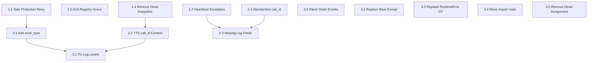

# Implementation Plan: Log Analysis

## Overview

A codebase-wide audit identified real bugs masked by noisy logs, missing context that makes logs useless for debugging, and inconsistent conventions that undermine the structured logging investment. This feature addresses all three categories across 3 independently shippable phases, touching ~12 files in the voice agent backend.

The work is split into:
- **Phase 1** (high priority): Fix 4 real bugs found during the audit -- silent protection lapses, agent discovery fragility, blind auto-scaling, and dead code
- **Phase 2** (medium priority): Standardize structured log context so every error/warning is actionable in CloudWatch Insights
- **Phase 3** (lower priority): Correct log levels, remove code smells, and eliminate silent exception swallowing

**Estimated total effort: 29-37 hours (~3-4 days)**

## Architecture

```mermaid
graph LR
    subgraph Phase1["Phase 1: Fix Real Bugs"]
        TP["task_protection.py\nAdd retry to renewal"]
        REG["registry.py\nGrace period on empty discovery"]
        HB["session_tracker.py\nHeartbeat escalation"]
        TTS["deepgram_sagemaker_tts.py\nRemove dead keepalive"]
    end

    subgraph Phase2["Phase 2: Standardize Context"]
        ET["Add error_type\nacross 5 files"]
        CID["Standardize call_id\nacross all components"]
        CTX["Add missing fields\nto 9 log sites"]
        DI["Parse dialin events\npipeline_ecs.py"]
    end

    subgraph Phase3["Phase 3: Cleanup"]
        LL["Fix log levels\n7 adjustments"]
        EX["Replace bare except\ntool_adapter.py"]
        CF["Replace RuntimeError\ncontrol flow"]
        IMP["Move import math\nobservability.py"]
    end

    Phase1 --> Phase2 --> Phase3
```



## Architecture Decisions

| # | Decision | Choice | Rationale |
|---|----------|--------|-----------|
| 1 | **Retry pattern for renewal** | Reuse `set_protected()` retry constants (3 attempts, exponential backoff) | Proven pattern already in the same file. Keeps behavior consistent. |
| 2 | **A2A grace period strategy** | Carry forward last-known-good for 3 consecutive empty polls (~90s) | Survives typical transient CloudMap failures without masking genuine agent removal. |
| 3 | **Heartbeat escalation threshold** | ERROR after 5+ consecutive failures (~2.5 min) | Aligns with the 5-minute TTL -- escalate before the session record expires, giving time for alerting. |
| 4 | **Canonical identifier name** | `call_id` (not `session_id`) | `call_id` is already used in observability.py, service_main.py contextvars binding, and AGENTS.md documentation. `session_id` in session_tracker.py maps to the same value. |
| 5 | **ConfigService control flow** | Add `ConfigService.is_configured()` class method | Explicit check is clearer than catching `RuntimeError`. A single method eliminates 7 bare `except RuntimeError` sites. |
| 6 | **Log convention for exceptions** | Require both `error=str(e)` and `error_type=type(e).__name__` | `error` gives the message, `error_type` enables CloudWatch Insights aggregation by exception class (e.g., `stats count(*) by error_type`). |

## Implementation Steps

### Phase 1: Fix Real Bugs (10-13 hours)

All 4 tasks in this phase are independent and can be worked in parallel.

---

#### Task 1.1: Add Retry Logic to Task Protection Renewal

**File:** `backend/voice-agent/app/task_protection.py`

**Problem:** `renew_if_protected()` makes a single API call with no retry. A transient failure starts a silent 30-minute countdown to protection lapse. `set_protected()` already has 3 retries with exponential backoff.

**Changes:**
1. Add retry loop to `renew_if_protected()` matching `set_protected()` pattern (3 attempts, exponential backoff using existing `MAX_RETRIES`, `RETRY_BASE_DELAY` constants)
2. Add `_consecutive_renewal_failures: int` instance variable (init to 0)
3. On successful renewal: reset counter to 0
4. On failed renewal: increment counter, log at WARNING for failures 1-2, escalate to ERROR after 3+ consecutive failures with event name `task_protection_renewal_persistent_failure`
5. Add `error_type=type(e).__name__` to exception logs

**Testing:**
- Unit test: mock ECS client to fail N times then succeed, verify retry behavior
- Unit test: verify consecutive failure counter increments and resets
- Unit test: verify log level escalation (WARNING -> ERROR at threshold)
- Integration: deploy and verify `task_protection_renewed` events in CloudWatch

**Acceptance Criteria:**
- [ ] `renew_if_protected()` retries up to 3 times with exponential backoff
- [ ] Consecutive failure counter tracks and resets correctly
- [ ] ERROR-level log emitted after 3+ consecutive failures (triggerable by CloudWatch alarm)
- [ ] Existing `set_protected()` behavior unchanged
- [ ] All existing tests pass

**Effort:** 3 hours

---

#### Task 1.2: Add Grace Period to A2A Registry Discovery

**File:** `backend/voice-agent/app/a2a/registry.py`

**Problem:** `refresh()` immediately clears the entire routing table if CloudMap returns zero endpoints. A single transient API failure removes all remote tools from the LLM context.

**Changes:**
1. Add `_consecutive_empty_polls: int` instance variable (init to 0)
2. Add `EMPTY_POLL_GRACE_COUNT = 3` class constant
3. In `refresh()`, when `discover_agents()` returns empty and a previous skill table exists:
   - Increment `_consecutive_empty_polls`
   - If below grace threshold: log WARNING `agent_registry_empty_discovery_grace`, carry forward existing `_skill_table` and `_agent_cache` unchanged
   - If at/above grace threshold: proceed with current behavior (clear tables), log ERROR `agent_registry_all_agents_gone_confirmed`
4. Reset `_consecutive_empty_polls` to 0 on any non-empty discovery
5. For individual card fetch failures on previously-known agents: carry forward the cached `AgentEntry` for the endpoint URL if it exists in the previous cache (keyed by service name, not URL, to survive IP rotation)

**Testing:**
- Unit test: mock CloudMap returning empty 1-2 times, verify routing table preserved
- Unit test: mock CloudMap returning empty 3+ times, verify routing table cleared
- Unit test: mock card fetch failure for known agent, verify cached entry carried forward
- Unit test: verify counter resets on successful non-empty discovery

**Acceptance Criteria:**
- [ ] 1-2 consecutive empty polls do not clear the routing table
- [ ] 3+ consecutive empty polls clear the table (genuine agent removal)
- [ ] Individual agent card failures carry forward cached entries
- [ ] Counter resets on any successful poll
- [ ] All existing registry tests pass

**Effort:** 3-4 hours

---

#### Task 1.3: Add Heartbeat Failure Escalation

**File:** `backend/voice-agent/app/session_tracker.py`

**Problem:** The heartbeat loop logs `heartbeat_failed` at WARNING on every failure with no consecutive failure counter and no escalation. The underlying DynamoDB call already retried 3x internally, so reaching this point means a sustained outage.

**Changes:**
1. Add `_consecutive_heartbeat_failures: int` variable in heartbeat loop scope (or instance variable)
2. Add `HEARTBEAT_ESCALATION_THRESHOLD = 5` constant (~2.5 minutes at 30s intervals)
3. On heartbeat failure:
   - Increment counter
   - Log WARNING for failures 1-4 with `consecutive_failures=N`
   - Log ERROR `heartbeat_persistent_failure` at 5+ with `consecutive_failures=N`, `blind_duration_seconds=N*30`
4. On heartbeat success: reset counter to 0
5. Add missing context fields to `heartbeat_failed`: `error_type`, `task_id`, `active_count`

**Testing:**
- Unit test: mock heartbeat to fail N times, verify counter and log escalation
- Unit test: verify counter resets on success after failures
- Unit test: verify ERROR log includes `consecutive_failures` and `blind_duration_seconds`

**Acceptance Criteria:**
- [ ] Consecutive failures tracked across heartbeat iterations
- [ ] WARNING for failures 1-4, ERROR for 5+
- [ ] `heartbeat_persistent_failure` event at ERROR enables CloudWatch alarm creation
- [ ] Counter resets on successful heartbeat
- [ ] Missing context fields (`error_type`, `task_id`, `active_count`) added

**Effort:** 2 hours

---

#### Task 1.4: Remove Dead TTS Keepalive Code

**File:** `backend/voice-agent/app/services/deepgram_sagemaker_tts.py`

**Problem:** `_keepalive_task` is initialized to `None`, referenced in `_disconnect()` cleanup, but never assigned. `_send_keepalive()` is defined but never called. Comment confirms Deepgram SageMaker shim doesn't support KeepAlive.

**Changes:**
1. Remove `self._keepalive_task = None` from `__init__()` (line ~105)
2. Remove keepalive task cancellation in `_disconnect()` (lines ~291-292)
3. Remove `_send_keepalive()` method definition (lines ~309-317)
4. Remove any related comments about keepalive not being supported

**Testing:**
- Run existing TTS tests to verify no regressions
- Verify `_disconnect()` still handles other cleanup correctly

**Acceptance Criteria:**
- [ ] No references to `_keepalive_task` or `_send_keepalive` remain in the file
- [ ] `_disconnect()` cleanup for other resources (WebSocket, response task) unchanged
- [ ] All existing tests pass

**Effort:** 1 hour

---

### Phase 2: Standardize Log Context (8-10 hours)

Phase 2 depends on Phase 1 being complete (Phase 1 modifies some of the same files).

---

#### Task 2.1: Add `error_type` to All Exception Logs

**Files:**
- `backend/voice-agent/app/secrets_loader.py` (3 sites)
- `backend/voice-agent/app/session_tracker.py` (3+ sites)
- `backend/voice-agent/app/services/deepgram_sagemaker_tts.py` (3 sites)
- `backend/voice-agent/app/services/bedrock_llm.py` (2 sites)
- `backend/voice-agent/app/service_main.py` (1 site)

**Problem:** Most error logs include `error=str(e)` but not `error_type=type(e).__name__`. Without the exception class, you cannot aggregate errors by type in CloudWatch Insights.

**Changes:**
For every `logger.error()` and `logger.warning()` that catches an exception, add `error_type=type(e).__name__` as a keyword argument. Approximately 12-15 sites across 5 files.

Convention to establish:
```python
except Exception as e:
    logger.error(
        "event_name",
        error=str(e),
        error_type=type(e).__name__,
        # ... other context fields
    )
```

In `bedrock_llm.py`, replace `exc_info=True` with `error_type=type(e).__name__` to align with structlog convention (structlog's JSON renderer does not serialize tracebacks cleanly from `exc_info`).

**Testing:**
- Grep for all `logger.error` and `logger.warning` calls that catch exceptions, verify each includes `error_type`
- Run existing tests to verify no regressions

**Acceptance Criteria:**
- [ ] Every `logger.error()` and `logger.warning()` catching an exception includes `error_type=type(e).__name__`
- [ ] `bedrock_llm.py` uses structured `error_type` instead of `exc_info=True`
- [ ] CloudWatch Insights query `stats count(*) by error_type` works on deployed logs

**Effort:** 2 hours

---

#### Task 2.2: Verify and Fix `call_id` Context Propagation in TTS

**File:** `backend/voice-agent/app/services/deepgram_sagemaker_tts.py`

**Problem:** TTS service logs have no `call_id` correlation. `service_main.py` binds `call_id` via `structlog.contextvars`, but the TTS background task (`_process_responses()`) created via Pipecat's `create_task()` may not inherit the contextvars context.

**Changes:**
1. Test whether `structlog.contextvars` propagation works for tasks created via `self.create_task()` in Pipecat
2. If it does: document this and verify with a test
3. If it does not: bind `call_id` explicitly in the TTS constructor or via a `set_call_context()` method that binds it to the logger instance
4. Add `call_id` explicitly to the 3 critical error log sites (lines ~205, 226, 390) as a safety measure regardless of contextvars behavior

**Testing:**
- Integration test: make a call, verify TTS error/warning logs in CloudWatch include `call_id`
- Unit test: mock the logger, verify `call_id` appears in structured output

**Acceptance Criteria:**
- [ ] All TTS error/warning logs include `call_id` in CloudWatch
- [ ] Works correctly in multi-call containers (different `call_id` per call)

**Effort:** 2-3 hours

---

#### Task 2.3: Add Missing Structured Fields to Under-Specified Logs

**Files:** Multiple (see table below)

**Problem:** 9 log sites lack the fields needed to be actionable.

| Log Event | File | Add Fields |
|-----------|------|------------|
| `tts_audio_receive_timeout` | `deepgram_sagemaker_tts.py:205` | `call_id`, `timeout_seconds`, `endpoint_name` |
| `tts_synthesis_error` | `deepgram_sagemaker_tts.py:226` | `call_id`, `error_type`, `text_length` |
| `tts_response_processor_error` | `deepgram_sagemaker_tts.py:390` | `call_id`, `error_type`, `endpoint_name` |
| `heartbeat_failed` | `session_tracker.py:340` | `task_id`, `active_count`, `consecutive_failures` (covered in Task 1.3) |
| `dynamodb_put_failed` | `session_tracker.py:384` | `table_name`, `pk`, `sk` |
| `dynamodb_update_failed` | `session_tracker.py:431` | `table_name`, `pk`, `sk` |
| `dialin_warning` / `dialin_error` | `pipeline_ecs.py:522,526` | Parsed SIP fields (covered in Task 2.5) |
| `secrets_fetch_failed` | `secrets_loader.py:63` | `secret_arn`, `region` |
| `session_end_failed` | `service_main.py:375` | `error_type`, `end_status`, `turn_count` |

**Changes:**
Add the specified fields to each log call. For DynamoDB operations, extract PK/SK from the item being written. For secrets_loader, pass the ARN and region through to the error handler.

**Testing:**
- Review each modified log call for correct field names and values
- Run existing tests to verify no regressions

**Acceptance Criteria:**
- [ ] All 9 log sites include the specified additional fields
- [ ] Field values are correct (not hardcoded placeholders)
- [ ] No new imports or dependencies required

**Effort:** 2 hours

---

#### Task 2.4: Standardize `call_id` / `session_id` Naming

**Files:**
- `backend/voice-agent/app/session_tracker.py` (uses `session_id`)
- `backend/voice-agent/app/pipeline_ecs.py` (line ~671: `call_id=session_id`)
- `backend/voice-agent/app/service_main.py` (uses both)

**Problem:** Some logs use `session_id` only, some use `call_id` only, some use both. They refer to the same value.

**Changes:**
1. Adopt `call_id` as the canonical identifier (already used in observability, contextvars binding, and AGENTS.md docs)
2. In `session_tracker.py`: rename `session_id` parameter/variable to `call_id` in log output (keep the DynamoDB field names unchanged to avoid data migration)
3. In `pipeline_ecs.py`: remove the confusing `call_id=session_id` alias
4. In `service_main.py`: ensure consistent `call_id` usage
5. Add a code comment at the top of `session_tracker.py` documenting that DynamoDB stores it as `session_id` but logs emit it as `call_id`

**Testing:**
- Grep for `session_id` in log calls across the codebase, verify each is changed to `call_id`
- Existing tests may need parameter name updates
- Verify DynamoDB schema is NOT changed (only log output naming)

**Acceptance Criteria:**
- [ ] All log output uses `call_id` consistently
- [ ] DynamoDB schema unchanged (no data migration needed)
- [ ] Code comment documents the mapping
- [ ] All existing tests pass (with parameter name updates if needed)

**Effort:** 1-2 hours

---

#### Task 2.5: Parse Dialin Event Data

**File:** `backend/voice-agent/app/pipeline_ecs.py`

**Problem:** Dialin event handlers log `data=str(data)[:200]` -- raw string truncation instead of structured fields.

**Changes:**
1. In `on_dialin_connected`, `on_dialin_warning`, `on_dialin_error`: parse the `data` dict and log specific fields:
   - `sip_call_id` (from SIP headers)
   - `sip_status_code` (for warnings/errors)
   - `reason` (for warnings/errors)
   - `from_uri`, `to_uri` (connection info)
2. Keep a fallback `raw_data=str(data)[:200]` for unexpected data formats
3. Wrap parsing in try/except to avoid breaking the pipeline on malformed data

**Testing:**
- Unit test: pass known dialin event structures, verify parsed fields in log output
- Unit test: pass malformed data, verify fallback logging works

**Acceptance Criteria:**
- [ ] Dialin events log structured SIP fields instead of raw truncated strings
- [ ] Unknown data formats fall back to truncated string safely
- [ ] No pipeline crashes on malformed dialin data

**Effort:** 1-2 hours

---

### Phase 3: Correct Log Levels and Clean Up (5-7 hours)

Phase 3 can begin after Phase 2 is complete, or tasks 3.1-3.5 can be worked independently.

---

#### Task 3.1: Fix Log Levels

**Files:** Multiple

**Changes:**

| Event | File | Current | Target | Change |
|-------|------|---------|--------|--------|
| `a2a_tool_call_timeout` | `a2a/tool_adapter.py` | ERROR | WARNING | Timeouts are expected operational events |
| `audio_clipping_detected` | `observability.py` | WARNING | INFO | Environmental condition, not an app error |
| `tts_close_message_failed` | `deepgram_sagemaker_tts.py` | WARNING | DEBUG | Expected during abrupt disconnects |
| `tts_clear_message_failed` | `deepgram_sagemaker_tts.py` | WARNING | DEBUG | Expected during barge-in |
| `Could not start ingestion` | KB Lambda | WARNING | INFO | Expected when S3 bucket is empty |

For escalation-based levels (heartbeat, task protection), the logic is implemented in Tasks 1.1 and 1.3.

**Testing:**
- Verify each log call uses the correct `logger.<level>()` method
- Run existing tests

**Acceptance Criteria:**
- [ ] Expected operational conditions logged at INFO or DEBUG
- [ ] Genuinely concerning conditions remain at WARNING or ERROR
- [ ] Timeout log levels are consistent across A2A and local tools

**Effort:** 1 hour

---

#### Task 3.2: Replace Bare `except Exception: pass` in Metrics Recording

**File:** `backend/voice-agent/app/a2a/tool_adapter.py`

**Problem:** 4 sites silently swallow metrics recording failures. The equivalent code in `app/tools/executor.py` correctly logs at WARNING.

**Changes:**
Replace all 4 bare `except Exception: pass` blocks (lines ~115, 157, 180, 220) with:
```python
except Exception as e:
    logger.debug(
        "a2a_metrics_recording_failed",
        error=str(e),
        error_type=type(e).__name__,
    )
```

Use `debug` (not `warning`) because metrics failures should not pollute operational logs, but should be visible when debugging a broken metrics pipeline.

**Testing:**
- Unit test: mock MetricsCollector to raise, verify debug log emitted (not silent)
- Verify tool execution still returns correct result when metrics fail

**Acceptance Criteria:**
- [ ] All 4 bare `except Exception: pass` blocks replaced with `logger.debug()`
- [ ] Metrics failures visible in DEBUG-level logs
- [ ] Tool execution unaffected by metrics failures

**Effort:** 1 hour

---

#### Task 3.3: Replace `except RuntimeError` Control Flow

**File:** `backend/voice-agent/app/pipeline_ecs.py`

**Problem:** 7 property accessors catch `RuntimeError` from `ConfigService._get_config()` as control flow. This risks catching unrelated `RuntimeError` exceptions.

**Changes:**
1. Add `ConfigService.is_configured() -> bool` class method that returns whether the config has been loaded
2. Replace each `try/except RuntimeError` block with:
   ```python
   if ConfigService.is_configured():
       return ConfigService.get_config().features.some_setting
   return <default_value>
   ```
3. File for `is_configured()`: `backend/voice-agent/app/config_service.py` (or wherever ConfigService is defined)

**Testing:**
- Unit test: verify `is_configured()` returns False before loading, True after
- Unit test: verify each property accessor returns default when not configured
- Unit test: verify each property accessor returns config value when configured

**Acceptance Criteria:**
- [ ] No `except RuntimeError` blocks remain in `pipeline_ecs.py` for config access
- [ ] `ConfigService.is_configured()` is a clean boolean check
- [ ] Behavior is identical to before (same defaults, same configured values)
- [ ] Unrelated `RuntimeError` exceptions are no longer silently caught

**Effort:** 2 hours

---

#### Task 3.4: Move `import math` to Module Level

**File:** `backend/voice-agent/app/observability.py`

**Problem:** `import math` appears twice inside `_process_audio_frame()`, which is called on every audio frame. While Python caches imports, it's unnecessary overhead and a code quality issue.

**Changes:**
1. Add `import math` at module level (near existing `import struct` on line ~37)
2. Remove both inline `import math` statements (lines ~416, 425)

**Testing:**
- Run existing observability tests
- Verify audio processing still calculates dB correctly

**Acceptance Criteria:**
- [ ] `import math` at module level only
- [ ] No inline imports in `_process_audio_frame()`
- [ ] Audio dB calculations produce identical results

**Effort:** 15 minutes

---

#### Task 3.5: Remove Dead Assignment in Observability

**File:** `backend/voice-agent/app/observability.py`

**Problem:** Line ~413 computes `rms_db = 20 * (rms / self.MAX_AMPLITUDE)` but this value is immediately overwritten by the correct `rms_db = 20 * math.log10(rms / self.MAX_AMPLITUDE)` on line ~418.

**Changes:**
1. Remove the dead assignment on line ~413
2. Verify the subsequent `log10` calculation is the intended formula

**Testing:**
- Run existing observability tests
- Verify RMS dB values are reasonable (should be negative values in dBFS)

**Acceptance Criteria:**
- [ ] Dead assignment removed
- [ ] RMS dB calculation uses `log10` formula only
- [ ] No change in output values

**Effort:** 15 minutes

---

## Files Modified Summary

| File | Phase | Changes |
|------|-------|---------|
| `app/task_protection.py` | 1 | Retry logic + consecutive failure tracking for renewal |
| `app/a2a/registry.py` | 1 | Grace period for empty discovery, carry-forward on card failures |
| `app/session_tracker.py` | 1, 2 | Heartbeat escalation, missing log context, call_id standardization |
| `app/services/deepgram_sagemaker_tts.py` | 1, 2, 3 | Remove dead keepalive, add call context, add error_type, fix log levels |
| `app/pipeline_ecs.py` | 2, 3 | Parse dialin events, replace RuntimeError control flow, standardize call_id |
| `app/a2a/tool_adapter.py` | 3 | Replace bare except with logger.debug(), fix timeout log level |
| `app/service_main.py` | 2 | Add missing context to session_end_failed |
| `app/secrets_loader.py` | 2 | Add secret_arn, region, error_type to error logs |
| `app/services/bedrock_llm.py` | 2 | Replace exc_info with error_type |
| `app/observability.py` | 3 | Move import math, remove dead assignment, adjust clipping log level |
| `app/config_service.py` (or equivalent) | 3 | Add `is_configured()` class method |

## Dependencies



**Key dependency notes:**
- Phase 1 tasks are fully independent of each other
- Phase 2 tasks should follow Phase 1 (shared files avoid merge conflicts)
- Task 2.4 (call_id standardization) should precede 2.3 (missing fields) to avoid rework
- Phase 3 tasks are independent of each other but follow Phase 2

## Risks and Mitigations

| Risk | Impact | Likelihood | Mitigation |
|------|--------|------------|------------|
| Task protection retry adds latency to the renewal loop | Protection renewal becomes slower than 30s interval | Low | Use same constants as set_protected() (3 retries, 100ms base). Worst case: ~700ms added to one renewal cycle |
| A2A grace period masks genuine agent removal | Stale tools remain visible to LLM for ~90s | Medium | 3-poll threshold (90s at 30s interval) is short enough that stale entries expire quickly. Log the grace period clearly for operators |
| call_id rename breaks CloudWatch Insights queries | Existing dashboards/queries that filter on session_id stop working | Medium | Document the change. Only affects log field names, not DynamoDB schema. Update any saved queries in team runbooks |
| ConfigService.is_configured() introduces a race | Config loaded between check and access | Very Low | Config loading is synchronous at startup, before pipelines run. No race window exists in practice |
| Modifying 12 files increases merge conflict risk | Parallel PRs conflict | Medium | Ship Phase 1 first as a standalone PR. Phases 2-3 can follow separately |

## Verification Criteria

### Phase 1 Complete When:
- [ ] Task protection renewal retries on transient failure (unit tests pass)
- [ ] A2A tools survive 1-2 empty CloudMap responses (unit tests pass)
- [ ] Heartbeat failures escalate WARNING -> ERROR after 5+ consecutive (unit tests pass)
- [ ] No dead keepalive code in TTS service
- [ ] All existing tests pass, no regressions

### Phase 2 Complete When:
- [ ] Every warning/error log catching an exception includes `error_type`
- [ ] TTS logs include `call_id` in a multi-call container
- [ ] All 9 under-specified log sites have the required context fields
- [ ] Consistent `call_id` naming across all components (zero `session_id` in log output)
- [ ] Dialin events log parsed SIP fields

### Phase 3 Complete When:
- [ ] Expected conditions (clipping, TTS close/clear, KB ingestion) at INFO/DEBUG
- [ ] No bare `except Exception: pass` in metrics recording paths
- [ ] No `except RuntimeError` control flow in pipeline_ecs.py
- [ ] `import math` at module level in observability.py
- [ ] Dead assignment removed from observability.py
- [ ] All existing tests pass

## Estimated Effort

| Phase | Tasks | Effort | Notes |
|-------|-------|--------|-------|
| Phase 1: Fix Real Bugs | 4 tasks | 10-13 hours | Priority. All tasks parallelizable. |
| Phase 2: Standardize Context | 5 tasks | 8-10 hours | Systematic but mechanical. |
| Phase 3: Cleanup | 5 tasks | 5-7 hours | Quick wins, low risk. |
| **Total** | **14 tasks** | **29-37 hours** | **~3-4 days** |

## Progress Log

| Date | Update |
|------|--------|
| 2026-02-26 | Plan created from idea.md audit findings. Code review confirmed all issues. |
| 2026-02-26 | Phase 1 complete: Task protection retry (1.1), A2A grace period (1.2), heartbeat escalation (1.3), dead keepalive removal (1.4). |
| 2026-02-26 | Phase 2 complete: error_type standardization (2.1), TTS call_id context (2.2), missing structured fields (2.3), call_id naming (2.4), dialin event parsing (2.5). |
| 2026-02-26 | Phase 3 complete: Log level fixes (3.1), bare except replacement (3.2), RuntimeError control flow removal (3.3), import math module-level (3.4), dead assignment removal (3.5). |
| 2026-02-26 | All 14 tasks complete. Tests: 437 passed, 2 pre-existing failures (unrelated to log-analysis). Ready for deploy + verification. |
| 2026-02-26 | Deployed to ECS (task definition v26→v27). SIPp test calls verified structured dialin events, heartbeat with task_id/active_count, task protection renewal, call_id on all events via contextvars. |
| 2026-02-26 | Bonus: suppressed aiohttp access logs (`access_log=None` on `web.AppRunner`) to eliminate ~8,640 ELB health check log lines/day. Deployed as v27. Verified: v27 task log stream has zero access log entries — only structured JSON events. |
