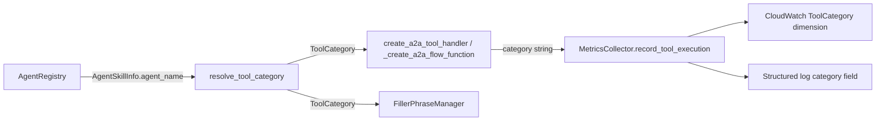

# Meaningful Tool Categories -- Implementation Plan

| Field    | Value                    |
|----------|--------------------------|
| Status   | In Progress              |
| Priority | P2                       |
| Effort   | Small                    |
| Type     | Tech Debt                |
| Started  | 2026-03-05               |

## Goal

Replace the hardcoded `category="a2a"` on all A2A tool executions with domain-relevant categories derived from agent metadata. After this change, CloudWatch metrics, structured logs, filler phrases, and dashboard widgets can distinguish KB operations from CRM operations from scheduling operations.

## Requirements

### Functional

1. **Category derivation from agent metadata** -- Each A2A tool execution must be tagged with a category that reflects the agent's functional domain (e.g., `knowledge_base`, `crm`, `customer_service`), not the transport protocol (`a2a`).
2. **Reuse existing `ToolCategory` enum** -- The enum in `app/tools/schema.py` already defines `KNOWLEDGE_BASE`, `CRM`, `CUSTOMER_SERVICE`, etc. A2A tools must map to these values rather than inventing new strings.
3. **Both code paths updated** -- The non-Flows adapter (`tool_adapter.py`) and the Flows adapter (`flow_config.py`) must both pass meaningful categories.
4. **Filler phrases become domain-aware** -- A2A tools mapped to real categories will trigger contextual filler phrases (e.g., "Let me search our knowledge base..." for KB tools).
5. **Fallback for unknown agents** -- If an agent name cannot be mapped to a known category, fall back to a sensible default (e.g., `ToolCategory.SYSTEM` or a new `ToolCategory.A2A` value) rather than silently dropping.

### Non-Functional

6. **No breaking changes to CloudWatch metrics** -- The `ToolCategory` dimension already exists; changing from `"a2a"` to domain strings does not break existing queries (no widget or alarm filters on `"a2a"` today).
7. **No changes to Agent Card schema** -- Category is derived server-side from agent metadata already available; capability agents do not need to be redeployed.
8. **Testable in isolation** -- The category mapping function must be a pure function that can be unit-tested without network calls.

## Design

### Category mapping strategy

Use the **CloudMap service name** (available on `AgentSkillInfo` via `agent_url` or on the registry's `AgentEntry`) to derive category. Service names are CDK-controlled constants and the most stable identifier:

```python
_AGENT_CATEGORY_MAP: dict[str, ToolCategory] = {
    "kb-agent": ToolCategory.KNOWLEDGE_BASE,
    "crm-agent": ToolCategory.CRM,
    "appointment-agent": ToolCategory.CUSTOMER_SERVICE,
}

def resolve_tool_category(agent_name: str) -> ToolCategory:
    """Map agent name/service name to a ToolCategory.

    Falls back to SYSTEM for unknown agents.
    """
    normalized = agent_name.lower().strip()
    for key, category in _AGENT_CATEGORY_MAP.items():
        if key in normalized:
            return category
    return ToolCategory.SYSTEM
```

The `agent_name` field on `AgentSkillInfo` contains the card's display name (e.g., `"Knowledge Base Agent"`, `"CRM Agent"`, `"Appointment Agent"`), which is also matchable. Using substring matching on the normalized name covers both the CloudMap service name and the card display name.

### Data flow



## Implementation Steps

### Step 1: Add category mapping utility

**File:** `backend/voice-agent/app/a2a/categories.py` (new)

- Define `_AGENT_CATEGORY_MAP` dict mapping known agent name substrings to `ToolCategory` values.
- Implement `resolve_tool_category(agent_name: str) -> ToolCategory` with substring matching and `SYSTEM` fallback.
- Keep it a pure function with no side effects.

### Step 2: Thread category into the non-Flows A2A tool adapter

**File:** `backend/voice-agent/app/a2a/tool_adapter.py`

- Add `category: str` parameter to `create_a2a_tool_handler()`.
- Replace all four `category="a2a"` occurrences (lines 105, 153, 182, 228) with the passed-in `category` value.
- At the call site (wherever `create_a2a_tool_handler` is invoked), call `resolve_tool_category(skill.agent_name).value` and pass the result.

### Step 3: Thread category into the Flows A2A adapter

**File:** `backend/voice-agent/app/flows/flow_config.py`

- Add `category: str` parameter to `_create_a2a_flow_function()`.
- Replace `category="a2a"` at line 157 with the passed-in `category` value.
- In `_build_a2a_flow_functions()` (line 42-89), call `resolve_tool_category(skill.agent_name).value` and pass it when creating each flow function.

### Step 4: Add filler phrase mappings for missing categories

**File:** `backend/voice-agent/app/filler_phrases.py`

- Verify `CUSTOMER_SERVICE` and `AUTHENTICATION` have filler phrase entries (they currently do not).
- Add contextual phrases for `CUSTOMER_SERVICE` (e.g., "Let me check on that appointment for you...").
- This is optional but completes the user-facing benefit.

### Step 5: Add unit tests

**File:** `backend/voice-agent/tests/test_a2a_categories.py` (new)

- Test `resolve_tool_category` with each known agent name variant (display name, service name, mixed case).
- Test fallback to `SYSTEM` for unknown agent names.
- Test that category strings match `ToolCategory` enum `.value` outputs.

### Step 6: Update existing tests

**Files:** `backend/voice-agent/tests/test_tool_adapter.py`, `backend/voice-agent/tests/test_flow_config.py`

- Update any mocks or assertions that expect `category="a2a"` to expect the new domain-specific category strings.
- Ensure no test regressions.

### Step 7 (optional): Add dashboard widget for category breakdown

**File:** `infrastructure/src/constructs/voice-agent-monitoring-construct.ts`

- Add a CloudWatch widget that uses the `ToolCategory` dimension to show tool invocations grouped by category.
- This is a nice-to-have that demonstrates the value of the change.

## Files Changed

| File | Change |
|------|--------|
| `backend/voice-agent/app/a2a/categories.py` | New -- category mapping utility |
| `backend/voice-agent/app/a2a/tool_adapter.py` | Accept + use `category` param instead of `"a2a"` |
| `backend/voice-agent/app/flows/flow_config.py` | Accept + use `category` param instead of `"a2a"` |
| `backend/voice-agent/app/filler_phrases.py` | Add phrases for `CUSTOMER_SERVICE` category |
| `backend/voice-agent/tests/test_a2a_categories.py` | New -- unit tests for category mapping |
| `backend/voice-agent/tests/test_tool_adapter.py` | Update expected category in assertions |
| `backend/voice-agent/tests/test_flow_config.py` | Update expected category in assertions |
| `infrastructure/src/constructs/voice-agent-monitoring-construct.ts` | Optional: add category breakdown widget |

## Risks & Mitigations

| Risk | Mitigation |
|------|-----------|
| New agents deployed with unmapped names get generic `system` category | Fallback is intentional; add to `_AGENT_CATEGORY_MAP` when deploying new agents. Log a warning on fallback so it is visible. |
| Existing CloudWatch dashboards break | No widget or alarm currently filters on `ToolCategory="a2a"`, so this is safe. Verified in investigation. |
| `ToolCategory` enum grows unbounded | Keep the enum focused on functional domains, not individual agents. Multiple agents can share a category. |

## Acceptance Criteria

- [ ] `search_knowledge_base` tool executions are recorded with `category="knowledge_base"`
- [ ] `lookup_customer`, `verify_account_number` tool executions are recorded with `category="crm"`
- [ ] `check_availability`, `book_appointment` tool executions are recorded with `category="customer_service"`
- [ ] Unknown agents fall back to `category="system"` with a warning log
- [ ] All existing tests pass with updated category expectations
- [ ] New unit tests cover the category mapping function
- [ ] Filler phrases are contextually appropriate for A2A tool categories
