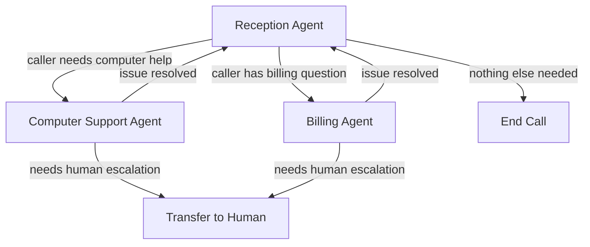

# Multi-Agent In-Process Handoff

## Problem Statement

Today every call is handled by a single agent persona with a single system prompt and a flat set of tools for the entire conversation. This creates a tension: either the agent's instructions are kept generic (poor specialist performance) or they are overloaded with domain-specific instructions and tools (confused behavior, slower responses, higher token cost).

Real customer interactions are multi-phase. A caller might start with account verification, move into computer troubleshooting, and finish with a billing question. Each phase benefits from a focused system prompt, a curated tool set, and a tailored conversation style. Stuffing all of that into one monolithic prompt degrades quality across all phases.

There is no mechanism to transition between specialist "agents" within a single call. The only mid-call change today is a cold SIP REFER transfer that disconnects the AI entirely -- producing audible silence and losing all conversation context.

## Vision

The caller dials in and is greeted by a **reception agent** -- a lightweight triage persona whose job is to identify intent and route the caller. When the caller says "my laptop won't connect to WiFi," the reception agent seamlessly transitions to a **computer support agent** with a focused system prompt, specialized tools (e.g., KB search for troubleshooting guides, diagnostic checklist functions), and a summarized handoff of what the caller said.

From the caller's perspective, nothing changed -- the voice is the same, there is no silence or delay, and the agent now speaks with deeper expertise. When the troubleshooting is resolved, the computer support agent hands back to the reception agent for wrap-up ("Is there anything else I can help with?").

This is **in-process context switching**, not multiple bots. A single Pipecat pipeline swaps its LLM context (system prompt + tools) to emulate distinct specialist agents. The swap happens in zero network time because it is a frame update within the running pipeline.

## Approach: Pipecat Flows

[Pipecat Flows](https://github.com/pipecat-ai/pipecat-flows) is a state-machine framework built on top of Pipecat that models conversations as a graph of **nodes**. Each node is an independent agent persona with its own:

- **`role_messages`** -- persistent system prompt (the agent's identity)
- **`task_messages`** -- phase-specific instructions (what to do in this node)
- **`functions`** -- tools available in this node only
- **`context_strategy`** -- how conversation history carries across transitions (`APPEND`, `RESET`, `RESET_WITH_SUMMARY`)
- **`pre_actions` / `post_actions`** -- TTS utterances on entry/exit ("Let me connect you with our specialist...")

Transitions happen when the LLM calls a **transition function** (e.g., `transfer_to_computer_support`). The function handler returns the next `NodeConfig`, and Flows swaps the context atomically. The next LLM turn uses the new persona.

### Why Not Multiple Bots in the Same Room?

We evaluated having multiple Pipecat bot processes join the same Daily room and mute/unmute to hand off. This was rejected because:

- **Join latency**: ~1-3 seconds for a new bot to join a Daily room, even with pre-warming
- **Coordination complexity**: Both bots receive all audio and run STT concurrently; an orchestrator must gate who responds
- **State transfer**: Conversation context must be serialized and passed out-of-band between processes
- **Cost**: Multiple pipelines running simultaneously per call
- **Risk**: Race conditions where both agents respond or neither does

In-process context switching has zero handoff latency, zero coordination overhead, and full context continuity.

## Example Flow



### Node Definitions (Conceptual)

**Reception Agent (initial node)**:
- System prompt: "You are a friendly receptionist. Identify the caller's intent and route them."
- Tools: `transfer_to_computer_support`, `transfer_to_billing`, `end_call`
- Context strategy: N/A (entry point)

**Computer Support Agent**:
- System prompt: "You are a computer support specialist. Help the caller troubleshoot their issue step by step."
- Tools: `search_knowledge_base` (via A2A), `transfer_back_to_reception`, `transfer_to_human`
- Context strategy: `RESET_WITH_SUMMARY` -- carry a summary of what the caller said, discard reception small talk

**Billing Agent**:
- System prompt: "You are a billing specialist. Help the caller with account and payment questions."
- Tools: `lookup_customer`, `create_support_case` (via A2A), `transfer_back_to_reception`, `transfer_to_human`
- Context strategy: `RESET_WITH_SUMMARY`

### Transition Example

```python
async def transfer_to_computer_support(args: FlowArgs) -> FlowResult:
    """Called by LLM when caller needs computer help."""
    return args.get("reason", ""), create_computer_support_node()

def create_computer_support_node() -> NodeConfig:
    return {
        "role_messages": [
            {"role": "system", "content": COMPUTER_SUPPORT_SYSTEM_PROMPT}
        ],
        "task_messages": [
            {"role": "system", "content": "The caller has been transferred to you for computer support."}
        ],
        "functions": [
            search_kb_function,
            transfer_back_function,
            transfer_to_human_function,
        ],
        "pre_actions": [
            {"type": "tts_say", "text": "Let me connect you with our computer support team."}
        ],
        "context_strategy": {
            "strategy": "reset_with_summary",
            "summary_prompt": "Summarize the caller's computer issue and any details they provided."
        },
    }
```

## Integration with Existing Architecture

### A2A Capability Agents

The existing A2A capability agents (KB, CRM) become **node-scoped tools**. Instead of registering all A2A tools globally, each Flow node declares which A2A tools it needs. The `AgentRegistry` still handles discovery and the `create_a2a_tool_handler()` adapter still bridges A2A to Pipecat -- the only change is _where_ tools are registered.

| Node | Local Tools | A2A Tools |
|------|------------|-----------|
| Reception | `end_call`, transition functions | None (or minimal) |
| Computer Support | transition functions | `search_knowledge_base` |
| Billing | transition functions | `lookup_customer`, `create_support_case`, `verify_account_number` |

### Local Tools

The existing capability-gated local tool system (`app/tools/builtin/catalog.py`) continues to work. Tools like `get_current_time` and `hangup_call` can be registered as **global functions** in Flows -- available in every node without redeclaring them.

### Pipeline Changes

The pipeline assembly in `pipeline_ecs.py` changes from:
1. Create a single `OpenAILLMContext` with one system prompt and all tools
2. Run the pipeline to completion

To:
1. Create a `FlowManager` with an initial node (reception)
2. Let Flows manage context swaps as the LLM triggers transitions
3. Pipeline structure (STT -> LLM -> TTS) is unchanged -- Flows operates _within_ the LLM context aggregator

### Observability

- **New metric**: `AgentTransitionCount` -- number of agent transitions per call
- **New metric dimension**: `agent_node` on `E2ELatency`, `ToolExecutionTime` -- which persona was active
- **Conversation logging**: Log node transitions as system events in the conversation transcript
- **CloudWatch dimension**: Add `agent_node` to existing metrics for per-agent performance analysis

## Verification Steps

### Phase 0: Bedrock Compatibility Validation

Before committing to Flows, verify that the primitives work with `AWSBedrockLLMService` at Pipecat v0.0.102:

1. Queue an `LLMMessagesUpdateFrame` with a new system prompt mid-conversation -- does the next LLM response reflect the new persona?
2. Queue an `LLMSetToolsFrame` with a different tool set -- does the LLM see only the new tools?
3. Test both frames together -- does a combined context + tools swap work atomically?

If these work, Pipecat Flows (which uses the same frames internally) will work. If `LLMSetToolsFrame` has issues with Bedrock (as reported for Gemini in pipecat-ai/pipecat#2280), a fallback approach using raw `LLMMessagesUpdateFrame` with tools embedded in the system prompt may be needed.

### Phase 1: Minimal Two-Node Prototype

1. Define two nodes: reception and one specialist
2. Implement a single transition function
3. Validate seamless handoff with a test call
4. Measure: is there any audible gap during the transition?

### Phase 2: Full Multi-Node Flow

1. Add remaining specialist nodes
2. Integrate A2A tools per-node
3. Add `RESET_WITH_SUMMARY` context strategy
4. Implement return-to-reception transitions

### Phase 3: Observability and Hardening

1. Add per-node metrics dimensions
2. Log transitions in conversation observer
3. Test edge cases: rapid back-and-forth transitions, transitions during tool execution, transitions during TTS playback
4. Load test: verify no memory leak from repeated context resets

## Affected Areas

- Modified: `backend/voice-agent/app/pipeline_ecs.py` -- replace static context with FlowManager
- Modified: `backend/voice-agent/app/service_main.py` -- pass node configuration to pipeline builder
- New: `backend/voice-agent/app/flows/` -- node definitions, transition handlers, flow configuration
- New: `backend/voice-agent/app/flows/nodes/` -- per-agent node configs (reception, computer support, billing)
- Modified: `backend/voice-agent/app/a2a/tool_adapter.py` -- support node-scoped tool registration
- Modified: `backend/voice-agent/app/tools/builtin/catalog.py` -- designate tools as global vs node-scoped
- Modified: `backend/voice-agent/requirements.txt` -- add `pipecat-ai-flows`
- Modified: Observability observers -- add `agent_node` dimension to metrics

## Dependencies

- `dynamic-capability-registry` (shipped) -- A2A tool registration infrastructure
- `transfer-capability` (shipped) -- local tool registration pattern
- `pipecat-ai-flows` package -- external dependency (~v0.3.x, requires pipecat >= 0.0.82)
- Bedrock compatibility verification (Phase 0 above) -- blocking prerequisite

## Risks and Mitigations

| Risk | Impact | Mitigation |
|------|--------|------------|
| `LLMSetToolsFrame` does not work with Bedrock | High | Phase 0 validation before implementation. Fallback: embed tools in system prompt via `LLMMessagesUpdateFrame` only |
| Pipecat Flows does not support Bedrock's `LLMContext` format | High | Phase 0 validation. Flows examples list Bedrock as supported but needs hands-on verification. Fallback: use raw frame updates without Flows |
| Context summary quality (RESET_WITH_SUMMARY) degrades handoff | Medium | Test with real conversations. Tune summary prompt. Fallback: use APPEND strategy (carry full context, accept higher token cost) |
| LLM ignores transition function calls or calls wrong one | Medium | Clear tool descriptions with explicit trigger conditions. Test with representative caller utterances |
| Rapid transitions cause pipeline instability | Low | Test rapid back-and-forth in Phase 3. Pipecat's frame queue serializes updates, so this should be safe |
| Voice continuity -- caller notices persona change | Low | Use same TTS voice for all agents. Transition phrases ("Let me connect you...") prime the caller to expect a shift |

## Success Criteria

- [ ] Bedrock compatibility verified for `LLMMessagesUpdateFrame` and `LLMSetToolsFrame`
- [ ] Reception agent correctly triages caller intent and transitions to specialist
- [ ] Specialist agent has access only to its declared tools (not all tools)
- [ ] Conversation context carries across transitions via summary
- [ ] Return-to-reception works after specialist completes
- [ ] Zero audible gap or silence during transitions
- [ ] Per-node metrics visible in CloudWatch dashboard
- [ ] No regression in E2E latency (transition adds < 100ms)
- [ ] Existing single-agent mode continues to work when Flows is not configured

## Open Questions

1. **Should Flows be the default or feature-flagged?** Recommendation: feature-flagged via SSM parameter (`/voice-agent/config/enable-flow-agents`) so single-agent mode remains the default.
2. **How many specialist nodes in the initial release?** Recommendation: start with reception + one specialist (computer support) to validate the pattern, then expand.
3. **Should different agents use different TTS voices?** Using the same voice is seamless; different voices are more "realistic" for distinct specialists but may feel jarring. Needs user testing.
4. **How does this interact with the warm handoff feature?** A specialist node could trigger a warm handoff to a human agent as one of its transition functions. These features are complementary.
