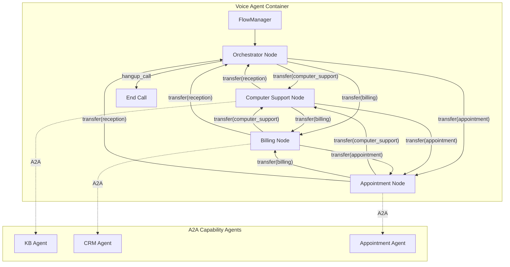
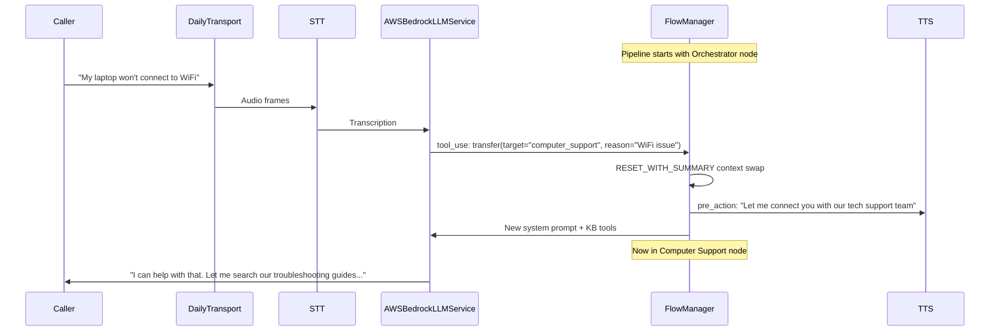
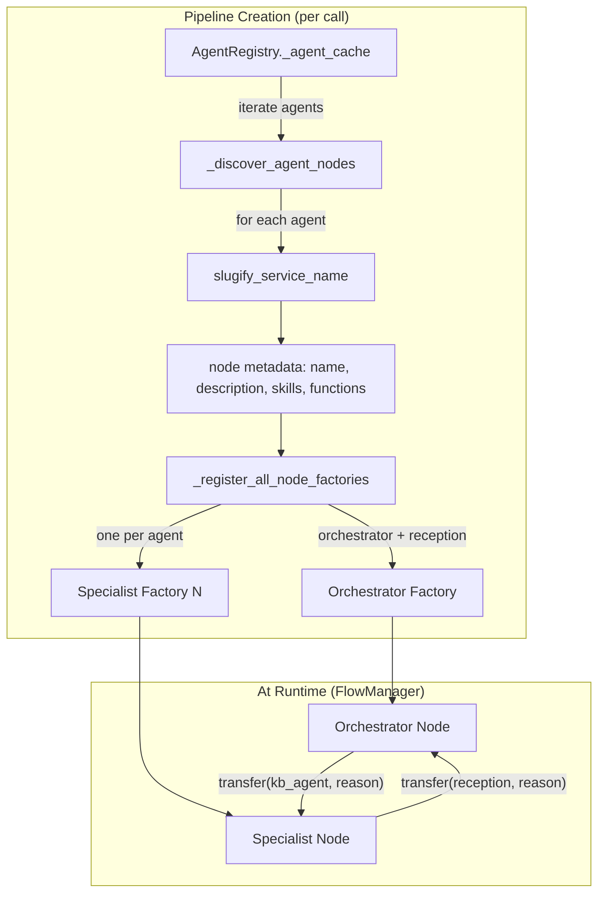

# Implementation Plan: Multi-Agent In-Process Handoff

## Overview

Replace the single-agent-per-call model with a **Pipecat Flows**-based multi-agent system that swaps LLM context (system prompt + tools) mid-call to emulate specialist agents. A caller dials in and is greeted by an **orchestrator agent** that triages intent, then seamlessly transitions to a **specialist agent** with a focused system prompt, scoped tools, and a summarized conversation handoff. From the caller's perspective, the voice is the same, there is no silence, and the agent now speaks with domain expertise.

The system is a fully connected graph of four agent nodes:

| Node | Role | A2A Tools | Local Tools |
|------|------|-----------|-------------|
| **Orchestrator** | Triage intent, route caller | None (sees summaries from Agent Cards) | `transfer` (generic), globals |
| **Computer Support** | Troubleshoot technical issues | `search_knowledge_base` (KB agent) | `transfer`, globals |
| **Billing** | Account and payment questions | `lookup_customer`, `create_support_case`, `add_case_note`, `verify_account_number`, `verify_recent_transaction` (CRM agent) | `transfer`, globals |
| **Appointment Scheduling** | Book/manage technician visits | `check_availability`, `book_appointment`, `cancel_appointment`, `reschedule_appointment`, `list_appointments` (new Appointment agent) | `transfer`, globals |

**Global tools** (available in every node): `get_current_time`, `hangup_call`, `transfer_to_agent` (SIP REFER).

### Key Design Decisions Made During Planning

- **Pipecat Flows** is the framework; no custom fallback implementation. If Bedrock compatibility breaks, we wait for upstream fix.
- **Direct functions** (schema auto-extracted from docstrings) for transition handlers.
- **`global_functions`** parameter in `FlowManager` for tools that should be available in every node.
- **Generic `transfer` function** with a `target` parameter -- one function handles all transitions (specialist-to-specialist and specialist-to-orchestrator).
- **RESET_WITH_SUMMARY** context strategy -- conversation history is summarized on transition to keep token costs low.
- **Agent Card-derived routing** -- the orchestrator's transfer function descriptions are derived from live A2A Agent Card skill summaries.
- **Feature-flagged** via SSM parameter `/voice-agent/config/enable-flow-agents` (default: `false`).
- **Same TTS voice** for all agents -- transition phrases bridge persona changes.
- **New Appointment Scheduling A2A agent** with DynamoDB-backed API Gateway + Lambda backend.

## Architecture



### Pipeline Integration



## Architecture Decisions

| # | Decision | Choice | Rationale |
|---|----------|--------|-----------|
| 1 | Flow framework | Pipecat Flows v0.0.23 | Official Bedrock support since v0.0.17. `global_functions` added in v0.0.22. Active development with AWS blog endorsement. |
| 2 | Function style | Direct functions | Less boilerplate than `FlowsFunctionSchema`. Schema auto-extracted from type hints and docstrings. Supported since Flows v0.0.18. |
| 3 | Transition design | Single generic `transfer(target, reason)` | Keeps tool count per node low (1 transfer function vs N explicit functions). LLM decides target from available specialist descriptions. Scales to new specialists without adding functions. |
| 4 | Context strategy | `RESET_WITH_SUMMARY` | Balances token cost (full APPEND grows unbounded) with information continuity. Flows v0.0.22 falls back to APPEND if summary generation fails. |
| 5 | Agent Card routing | Orchestrator transition descriptions derived from A2A Agent Card skill summaries | Dynamic -- new capability agents automatically become routable without code changes. |
| 6 | Appointment backend | API Gateway + Lambda + DynamoDB | Matches existing CRM system pattern. Consistent infra, tested CDK constructs, realistic latency profile. |
| 7 | Graph topology | Fully connected | Any specialist can transition to any other specialist directly. Maximizes flexibility and stress-tests the Flows framework. |
| 8 | Feature flag | SSM `/voice-agent/config/enable-flow-agents` | Single-agent mode remains default. Zero risk to existing deployments. |

## Implementation Steps

### Phase 0: Bedrock Compatibility Validation (Smoke Test)

Verify that Pipecat Flows works with `AWSBedrockLLMService` at pipecat v0.0.102. This is a blocking prerequisite for all subsequent phases.

**0.1 Add `pipecat-ai-flows` to requirements.txt**

File: `backend/voice-agent/requirements.txt`

```
pipecat-ai-flows>=0.0.23
```

**0.2 Create a minimal two-node validation script**

File: `backend/voice-agent/tests/integration/test_flows_bedrock_smoke.py`

- Create a `FlowManager` with `AWSBedrockLLMService`
- Define two nodes: `greeting` and `farewell`
- Define one direct function transition between them
- Verify that:
  - `FlowManager` initializes without error
  - Node transition updates `LLMContext` messages (system prompt changes)
  - Node transition updates available tools (tool set changes)
  - `RESET_WITH_SUMMARY` produces a summary message in the new context
  - `global_functions` are present in both nodes

**0.3 Run validation against live Bedrock endpoint**

- Deploy to a dev environment or run locally with Bedrock credentials
- Make a test call through Daily
- Confirm: LLM responds with the greeting node persona, transitions to farewell node on trigger, farewell node persona is reflected in response

**Exit criteria**: FlowManager + AWSBedrockLLMService + 2 nodes + RESET_WITH_SUMMARY + global_functions all work. If any fail, file upstream issue and pause.

---

### Phase 1: Flows Integration and Two-Node Prototype

Integrate Pipecat Flows into the voice agent pipeline with orchestrator + one specialist (Computer Support). Feature-flagged behind SSM parameter.

**1.1 Create the flows module structure**

```
backend/voice-agent/app/flows/
    __init__.py
    flow_config.py          # FlowManager factory, node creation
    nodes/
        __init__.py
        orchestrator.py     # Orchestrator node definition
        computer_support.py # Computer Support node definition
    transitions.py          # Generic transfer function + return function
    context.py              # Summary prompt templates, context helpers
```

**1.2 Implement the orchestrator node**

File: `backend/voice-agent/app/flows/nodes/orchestrator.py`

- Define `create_orchestrator_node() -> NodeConfig`
- `role_messages`: friendly receptionist persona
- `task_messages`: identify intent, route caller
- `functions`: `transfer` direct function (with dynamic specialist descriptions from Agent Cards)
- `pre_actions`: greeting TTS on first entry, "Is there anything else?" on re-entry

**1.3 Implement the Computer Support node**

File: `backend/voice-agent/app/flows/nodes/computer_support.py`

- Define `create_computer_support_node() -> NodeConfig`
- `role_messages`: technical support specialist persona
- `task_messages`: troubleshoot step-by-step, use KB when needed
- `functions`: `transfer` (to other specialists or back to reception), plus `search_knowledge_base` A2A tool
- `context_strategy`: `RESET_WITH_SUMMARY` with a prompt tuned for technical issues
- `pre_actions`: `{"type": "tts_say", "text": "Let me connect you with our technical support team."}`

**1.4 Implement the generic transfer function**

File: `backend/voice-agent/app/flows/transitions.py`

```python
async def transfer(flow_manager: FlowManager, target: str, reason: str) -> tuple[FlowResult, NodeConfig]:
    """Transfer the caller to a different specialist or back to reception.

    Args:
        target: The specialist to transfer to. One of: computer_support,
                billing, appointment, reception.
        reason: Brief explanation of why the transfer is needed.
    """
    node_factory = get_node_factory(target)
    result = {"transferred_to": target, "reason": reason}
    return result, node_factory()
```

The `get_node_factory()` function maps target names to node creation functions. It is populated dynamically based on available A2A Agent Card data.

**1.5 Integrate FlowManager into pipeline_ecs.py**

File: `backend/voice-agent/app/pipeline_ecs.py`

- Add a new code path gated by `config.enable_flow_agents`
- When enabled:
  - Skip static tool registration (`_register_tools` / `_register_capabilities`)
  - Create `FlowManager(task=task, llm=llm, context_aggregator=context_aggregator)`
  - Pass `global_functions=[hangup_call, get_current_time, transfer_to_agent]` (existing local tools that should be in every node)
  - Call `flow_manager.initialize(create_orchestrator_node())` on `on_first_participant_joined`
- When disabled: existing single-agent behavior is unchanged

**1.6 Add SSM parameter and config support**

File: `backend/voice-agent/app/services/config_service.py`

- Add `enable_flow_agents: bool` to `AppConfig` (default: `false`)
- Read from SSM: `/voice-agent/config/enable-flow-agents`

File: `infra/lib/voice-agent-ecs-stack.ts` (or equivalent CDK)

- Create the SSM parameter with default value `"false"`

**1.7 Implement A2A tool scoping for nodes**

File: `backend/voice-agent/app/a2a/tool_adapter.py`

- Add a `create_a2a_flow_function(skill_id, agent, timeout, collector)` that returns a Pipecat Flows-compatible function (either a `FlowsFunctionSchema` or a direct function wrapper)
- The existing `create_a2a_tool_handler()` continues to work for non-Flows mode
- Each node's `functions` list includes only the A2A functions relevant to that specialist

File: `backend/voice-agent/app/flows/flow_config.py`

- `build_node_tools(node_name, a2a_registry)` -- queries the registry for skills and maps them to nodes based on a configuration table:
  ```python
  NODE_TOOL_MAPPING = {
      "orchestrator": [],  # No A2A tools, only transfer
      "computer_support": ["search_knowledge_base"],
      "billing": ["lookup_customer", "create_support_case", "add_case_note",
                   "verify_account_number", "verify_recent_transaction"],
      "appointment": ["check_availability", "book_appointment",
                       "cancel_appointment", "reschedule_appointment",
                       "list_appointments"],
  }
  ```

**1.8 Write unit and integration tests**

- Unit tests for node creation functions (correct messages, functions, context strategy)
- Unit tests for `transfer` function (correct node returned for each target)
- Unit tests for `build_node_tools` (correct A2A tools per node)
- Integration test: FlowManager with mocked LLM transitions through orchestrator -> computer_support -> orchestrator

**Exit criteria**: Feature-flagged Flows integration works with orchestrator + Computer Support. Existing single-agent mode unaffected. Test call demonstrates seamless handoff with KB tool scoped to Computer Support only.

---

### Phase 2: Appointment Scheduling Agent and Full Flow Graph

Build the new Appointment Scheduling A2A capability agent and expand the flow graph to all four nodes.

**2.1 Create appointment scheduling backend (API Gateway + Lambda + DynamoDB)**

```
infra/lib/appointment-api-stack.ts     # CDK stack
backend/appointment-api/
    handler.py                          # Lambda handler
    models.py                           # Appointment data models
    requirements.txt
```

DynamoDB schema:
- Table: `VoiceAgentAppointments`
- PK: `CUSTOMER#{customer_id}`, SK: `APPT#{appointment_id}`
- GSI1: `DATE#{date}` / `TIME#{time}` -- for availability queries
- GSI2: `STATUS#{status}` / `DATE#{date}` -- for listing by status

API endpoints:
- `GET /appointments/availability?date={date}&service_type={type}` -- check available slots
- `POST /appointments` -- book appointment
- `DELETE /appointments/{id}` -- cancel appointment
- `PUT /appointments/{id}` -- reschedule appointment
- `GET /appointments?customer_id={id}` -- list customer appointments

Seed data: pre-populate with realistic appointment slots for the next 14 days across service types (on-site repair, network setup, hardware upgrade).

**2.2 Create Appointment Scheduling A2A agent**

```
backend/agents/appointment-agent/
    main.py                # A2A server with DirectToolExecutor
    appointment_client.py  # REST client for appointment API
    Dockerfile
    requirements.txt
```

Follow the KB agent pattern with `DirectToolExecutor` for each of the 5 tools:
- `check_availability(date, service_type)` -- returns available time slots
- `book_appointment(customer_id, date, time, service_type, notes)` -- creates appointment
- `cancel_appointment(appointment_id, reason)` -- cancels appointment
- `reschedule_appointment(appointment_id, new_date, new_time)` -- reschedules
- `list_appointments(customer_id)` -- lists upcoming appointments

Agent Card description: "Appointment scheduling: check technician availability, book/cancel/reschedule service appointments, and list upcoming appointments."

Note: Since this agent has 5 tools but `DirectToolExecutor` handles only a single tool, implement a `MultiToolDirectExecutor` that parses the A2A query to determine which tool to invoke. Alternatively, consider using the Strands `StrandsA2AExecutor` for this agent since tool routing is needed (like the CRM agent pattern).

**2.3 Create CDK stack for the appointment agent**

File: `infra/lib/appointment-agent-stack.ts`

- ECS Fargate service (following CRM agent pattern)
- CloudMap service registration for discovery
- IAM roles for DynamoDB access
- Environment variables: `APPOINTMENT_API_URL`, `AWS_REGION`, `PORT`

**2.4 Implement Billing and Appointment Scheduling nodes**

File: `backend/voice-agent/app/flows/nodes/billing.py`

- `create_billing_node() -> NodeConfig`
- Billing specialist persona
- CRM A2A tools scoped to this node
- `RESET_WITH_SUMMARY` with billing-focused summary prompt

File: `backend/voice-agent/app/flows/nodes/appointment.py`

- `create_appointment_node() -> NodeConfig`
- Appointment scheduling persona
- Appointment A2A tools scoped to this node
- `RESET_WITH_SUMMARY` with appointment-focused summary prompt

**2.5 Update the transfer function for full graph**

File: `backend/voice-agent/app/flows/transitions.py`

- Expand `get_node_factory()` to include all four targets: `computer_support`, `billing`, `appointment`, `reception`
- Validate target parameter against available nodes (return error result for unknown targets)
- Derive available target descriptions from A2A Agent Cards for the transfer function docstring/description

**2.6 Implement Agent Card-derived routing descriptions**

File: `backend/voice-agent/app/flows/flow_config.py`

- `build_transfer_description(a2a_registry) -> str` -- queries Agent Cards and builds a dynamic description string for the `transfer` function that lists available specialists and their capabilities
- This description is injected into the `transfer` function's context so the LLM knows what each specialist can do
- Example: "Available specialists: computer_support (searches troubleshooting guides and knowledge base), billing (customer lookup, support cases, account verification), appointment (schedule/cancel/reschedule technician visits)"

**2.7 Write tests for full flow graph**

- Unit tests for Billing and Appointment node creation
- Unit tests for `transfer` function with all 4 targets
- Integration test: orchestrator -> computer_support -> appointment -> orchestrator (the natural chain)
- Integration test: orchestrator -> billing -> orchestrator
- Integration test: computer_support -> billing (cross-specialist transition)
- Test: invalid target name returns error result

**Exit criteria**: All four nodes functional. Appointment agent deployed and discoverable via CloudMap. Full flow graph navigable. Natural call scenario works: triage -> troubleshoot -> schedule appointment -> wrap up.

---

### Phase 3: A2A Scoping, Agent Card Integration, and Context Quality

Refine the A2A tool scoping, Agent Card-derived routing, and RESET_WITH_SUMMARY quality.

**3.1 Implement dynamic node registration based on discovered agents**

File: `backend/voice-agent/app/flows/flow_config.py`

- When Flows mode is enabled, the flow graph is built dynamically based on which A2A agents are discovered
- If the appointment agent is not deployed, the appointment node and its transitions are omitted
- If no A2A agents are discovered, fall back to orchestrator-only mode (effectively single-agent)
- This makes the system resilient to partial deployments

**3.2 Tune RESET_WITH_SUMMARY prompts per node**

File: `backend/voice-agent/app/flows/context.py`

Define per-node summary prompts:

```python
SUMMARY_PROMPTS = {
    "computer_support": (
        "Summarize the caller's technical issue, any troubleshooting steps "
        "already attempted, and the current status. Be concise."
    ),
    "billing": (
        "Summarize the caller's account or billing concern, any customer "
        "information already verified, and the current status. Be concise."
    ),
    "appointment": (
        "Summarize what service the caller needs, any scheduling preferences "
        "mentioned, and relevant context from prior troubleshooting. Be concise."
    ),
    "reception": (
        "Summarize what the caller needed help with, what was accomplished, "
        "and any outstanding items. Be concise."
    ),
}
```

**3.3 Test summary quality with representative scenarios**

- Scenario 1: WiFi troubleshooting -> appointment booking. Verify the appointment node receives a clear summary of the technical issue.
- Scenario 2: Billing inquiry -> computer support. Verify the computer support node receives relevant account context.
- Scenario 3: Rapid back-and-forth (orchestrator -> CS -> orchestrator -> billing). Verify summaries remain coherent across multiple transitions.
- If summary quality is insufficient, document the failure modes and tune prompts. If RESET_WITH_SUMMARY fundamentally fails, switch to APPEND for affected transitions.

**3.4 Handle edge cases in transfer function**

- Caller asks to transfer to the agent they're already talking to -> return informative error, stay in current node
- Caller asks for a specialist that doesn't exist -> return error listing available options
- Transfer requested during active tool execution -> queue the transition after tool completes (Flows v0.0.23 handles this with `cancel_on_interruption=False`)
- Transfer requested during TTS playback -> Flows handles this via interruption

**3.5 Tests for Phase 3**

- Unit tests for dynamic node registration with varying agent discovery results
- Unit tests for summary prompt selection per node
- Integration tests for edge cases (self-transfer, unknown specialist, mid-tool transfer)

**Exit criteria**: Flow graph adapts to available agents. Summary quality validated across scenarios. Edge cases handled gracefully.

---

### Phase 4: Observability and Hardening

Add per-node metrics, transition logging, alarms, and dashboard updates.

**4.1 Add `agent_node` dimension to existing metrics**

File: `backend/voice-agent/app/observability.py`

- Thread the current node name through to `MetricsCollector`
- Add `agent_node` dimension to:
  - `E2ELatency` -- which agent persona was active for this turn
  - `ToolExecutionTime` -- which node triggered the tool call
  - `ToolInvocationCount` -- per-node tool usage
  - `InterruptionCount` -- per-node interruption tracking

**4.2 Add new metrics**

| Metric | Type | Unit | Description |
|--------|------|------|-------------|
| `AgentTransitionCount` | Counter | Count | Number of agent transitions per call |
| `AgentTransitionLatency` | Timer | Milliseconds | Time from transfer function call to first LLM response in new node |
| `ContextSummaryLatency` | Timer | Milliseconds | Time to generate RESET_WITH_SUMMARY |
| `ContextSummaryTokens` | Gauge | Count | Token count of generated summaries |

**4.3 Log node transitions in ConversationObserver**

File: `backend/voice-agent/app/observability.py`

- Add a new event type `agent_transition` to the conversation log
- Log: `from_node`, `to_node`, `reason`, `summary_length`, `transition_latency_ms`
- These appear in the conversation transcript alongside user/assistant turns

**4.4 Add CloudWatch alarms**

| Alarm | Threshold | Description |
|-------|-----------|-------------|
| Agent Transition Latency High | Avg > 500ms for 3 periods | Context swap is taking too long |
| Summary Generation Failed | > 3 failures in 5 minutes | RESET_WITH_SUMMARY is failing (falls back to APPEND) |
| Transition Loop Detected | > 10 transitions per call | LLM may be stuck in a routing loop |

**4.5 Update CloudWatch dashboard**

File: `infra/lib/voice-agent-ecs-stack.ts` (dashboard section)

- Add a "Multi-Agent Flows" section to the existing dashboard:
  - Agent transitions per call (time series)
  - Transition latency distribution
  - Per-node E2E latency comparison
  - Per-node tool invocation breakdown
  - Summary generation success rate

**4.6 Add transition loop protection**

File: `backend/voice-agent/app/flows/transitions.py`

- Track transition count per call in FlowManager state
- If transitions exceed a configurable threshold (default: 10), force return to orchestrator with a message: "I apologize, let me help you directly."
- Log a warning metric for investigation

**4.7 Memory and performance hardening**

- Test repeated `RESET_WITH_SUMMARY` transitions (20+ per call) -- verify no memory leak from context objects
- Measure baseline E2E latency without Flows vs. with Flows -- transition overhead should be < 100ms
- Test concurrent calls with different flow paths -- verify no cross-call state contamination
- Test: pipeline with Flows enabled processes the same call volume as without Flows (no throughput regression)

**4.8 Hardening tests**

- Load test: 10 concurrent calls, each with 3+ transitions
- Stress test: rapid back-and-forth transitions (orchestrator -> CS -> orchestrator -> CS...) x20
- Failure test: A2A agent goes down mid-call -- verify graceful degradation (node tools fail, but transition back to orchestrator works)
- Failure test: summary generation times out -- verify APPEND fallback works

**Exit criteria**: Full observability in CloudWatch. No latency regression. Loop protection active. Memory stable under sustained transitions.

---

### Phase 5: Documentation and Rollout

**5.1 Update system prompt and flow node documentation**

- Document each agent persona's system prompt and tool set
- Document the flow graph and transition rules
- Add troubleshooting guide for common issues (LLM not routing correctly, summary quality)

**5.2 Update deployment guides**

- Add Appointment agent to the deployment guide
- Document the SSM feature flag and how to enable Flows
- Add CDK context variables for flow configuration

**5.3 Update AGENTS.md**

- Document the `/voice-agent/config/enable-flow-agents` parameter
- Document per-node metrics dimensions
- Document the appointment agent environment variables

**5.4 Create example call scripts**

- Document 3 representative call scenarios for testing:
  1. WiFi troubleshooting -> appointment scheduling -> wrap-up
  2. Billing inquiry with account verification -> support case creation
  3. Direct appointment booking -> reschedule -> cancellation

## File Structure

```
backend/voice-agent/
    app/
        flows/
            __init__.py
            flow_config.py              # FlowManager factory, node-tool mapping
            transitions.py              # Generic transfer function, loop protection
            context.py                  # Summary prompts, context helpers
            nodes/
                __init__.py
                orchestrator.py         # Orchestrator node definition
                computer_support.py     # Computer Support node definition
                billing.py              # Billing node definition
                appointment.py          # Appointment Scheduling node definition
        a2a/
            tool_adapter.py             # Modified: add create_a2a_flow_function()
        tools/
            builtin/
                catalog.py              # Modified: mark tools as global-eligible
        pipeline_ecs.py                 # Modified: FlowManager integration path
        services/
            config_service.py           # Modified: enable_flow_agents config
        observability.py                # Modified: agent_node dimension, new metrics
    requirements.txt                    # Modified: add pipecat-ai-flows
    tests/
        integration/
            test_flows_bedrock_smoke.py
        unit/
            test_flow_nodes.py
            test_flow_transitions.py
            test_flow_tool_scoping.py

backend/agents/appointment-agent/
    main.py                             # A2A server
    appointment_client.py               # REST client for appointment API
    Dockerfile
    requirements.txt

backend/appointment-api/
    handler.py                          # Lambda handler
    models.py                           # Appointment data models
    requirements.txt

infra/lib/
    appointment-api-stack.ts            # New: API GW + Lambda + DynamoDB
    appointment-agent-stack.ts          # New: ECS Fargate for appointment agent
    voice-agent-ecs-stack.ts            # Modified: SSM param, dashboard updates
```

## Configuration

### New Configuration

| Parameter | Type | Default | Source | Description |
|-----------|------|---------|--------|-------------|
| `enable_flow_agents` | bool | `false` | SSM `/voice-agent/config/enable-flow-agents` | Enable multi-agent Flows mode |
| `flow_max_transitions` | int | `10` | SSM `/voice-agent/config/flow-max-transitions` | Max agent transitions per call before loop protection activates |
| `APPOINTMENT_API_URL` | string | *required* | Env var (appointment agent) | Base URL for appointment REST API |

### Existing Configuration (Unchanged)

| Parameter | Description | Relevance |
|-----------|-------------|-----------|
| `enable_capability_registry` | Enable A2A agent discovery | Must be `true` for A2A tools in Flows nodes |
| `ENABLE_TOOL_CALLING` | Enable tool calling | Must be `true` for Flows to work |
| `ENABLE_FILLER_PHRASES` | Enable filler during tool calls | Works within Flows nodes |
| `disabled-tools` | SSM comma-separated disabled tools | Applies to global tools in Flows mode |
| `LLM_MODEL_ID` | Bedrock model ID | Used by FlowManager's LLM |

## Testing Strategy

| Layer | Tool | Coverage Target |
|-------|------|-----------------|
| Unit | pytest | Node creation, transfer routing, tool scoping, summary prompts, loop protection |
| Integration | pytest + mocked LLM | Flow graph navigation, context strategy, A2A tool scoping, edge cases |
| Smoke (Phase 0) | Live Bedrock | FlowManager + AWSBedrockLLMService compatibility |
| System | Live deployment + test calls | End-to-end call scenarios, latency measurement, observability verification |
| Load | Concurrent test calls | Memory stability, throughput regression, cross-call isolation |

## Risks & Mitigations

| Risk | Impact | Mitigation |
|------|--------|------------|
| Pipecat Flows Bedrock adapter breaks in future pipecat version | High | Pin `pipecat-ai-flows>=0.0.23`. Phase 0 smoke test catches issues early. Feature flag allows instant rollback. |
| `RESET_WITH_SUMMARY` produces poor summaries | Medium | Per-node tuned summary prompts. APPEND fallback if summary fails. Manual testing with representative scenarios. |
| LLM misroutes callers (calls wrong specialist) | Medium | Clear transfer function description derived from Agent Cards. Transition logging for post-call analysis. Human-in-the-loop review of transcripts. |
| Transition loop (LLM bounces between agents) | Medium | Loop protection at 10 transitions. Alarm + metric for detection. Forced return to orchestrator. |
| Generic `transfer` function confuses LLM (too many options) | Medium | Dynamic description based on available agents. If problematic, fall back to explicit named functions per node. |
| Appointment agent adds cold start latency | Low | Same mitigation as existing agents: pre-warming, CloudMap health checks. |
| Fully connected graph is hard to test exhaustively | Medium | Focus integration tests on the natural call flows. Edge transitions tested individually. |
| Context summary adds latency to transitions | Low | Measure with `ContextSummaryLatency` metric. Alarm at > 500ms. Summary is an LLM call (~200-500ms expected). |

## Dependencies

### Internal (Features)

| Feature | Status | Dependency Type |
|---------|--------|-----------------|
| `dynamic-capability-registry` | Shipped | A2A agent discovery for node tools |
| `transfer-capability` | Shipped | SIP REFER as global tool |
| `tool-calling-framework` | Shipped | Capability-based tool registration |
| `knowledge-base-capability-agent` | Shipped | KB A2A tools for Computer Support |
| `crm-capability-agent` | Shipped | CRM A2A tools for Billing |

### External

| Dependency | Version | Notes |
|------------|---------|-------|
| `pipecat-ai-flows` | >= 0.0.23 | Bedrock adapter, global_functions, cancel_on_interruption fix |
| `pipecat-ai` | 0.0.102 | Current pinned version; Flows v0.0.23 requires >= 0.0.67 |
| `strands-agents[a2a]` | >= 1.27.0 | A2A protocol for appointment agent |

## Success Criteria

| Criteria | Target | Measurement |
|----------|--------|-------------|
| Bedrock + Flows compatibility | Works without workarounds | Phase 0 smoke test passes |
| Orchestrator routes correctly | > 90% correct routing in test scenarios | Manual testing with 20+ representative utterances |
| Specialist tool scoping | Each node sees only its declared tools | Unit test assertion on node function lists |
| RESET_WITH_SUMMARY quality | Summary retains key caller context across transitions | Manual review of 10 transition summaries |
| Zero audible gap during transition | < 100ms added latency | `AgentTransitionLatency` metric |
| Return-to-orchestrator works | Orchestrator resumes with "anything else?" | Test call with specialist -> orchestrator flow |
| Cross-specialist transition works | Specialist -> specialist without intermediate orchestrator | Test call: CS -> Appointment |
| Existing single-agent mode unaffected | No regression when feature flag is off | Full test suite passes with flag disabled |
| Per-node metrics in CloudWatch | All new metrics and dimensions visible | Dashboard visual inspection |
| No memory leak under transitions | Stable RSS after 20+ transitions | Load test monitoring |
| Appointment agent functional | 5 tools respond correctly | A2A integration tests |

## Dynamic Design Addendum

> **This section supersedes the static node definitions, `NODE_TOOL_MAPPING`, and per-node file structure described in Phases 1-3 above.** The plan above is preserved for historical context but the implementation uses the dynamic design described here.

### What Changed and Why

The original plan defined hard-coded specialist nodes (`computer_support.py`, `billing.py`, `appointment.py`) with a static `NODE_TOOL_MAPPING` that mapped node names to A2A skill IDs. This had several problems:

1. **Adding a new capability agent required voice-agent code changes** -- a new node file, new mapping entry, and new summary prompt.
2. **Node names and personas were defined in the voice agent**, not derived from the agents themselves.
3. **The system couldn't adapt to partial deployments** -- if the CRM agent wasn't deployed, the billing node would still be registered with broken tools.

### Dynamic Design

The refactored design derives everything from Agent Card metadata at pipeline creation time:



**Key properties:**

| Aspect | Static (Original) | Dynamic (Current) |
|--------|-------------------|-------------------|
| Node definitions | One file per specialist | Generic `specialist.py` template |
| Tool scoping | `NODE_TOOL_MAPPING` dict | Each agent's card skills → its node's functions |
| Node names | Hard-coded strings | Slugified CloudMap service names |
| Node personas | Hand-written per specialist | Template + Agent Card description |
| Summary prompts | Per-node dict (`SUMMARY_PROMPTS`) | Generic + orchestrator (2 prompts total) |
| Adding a new agent | New node file + mapping + prompt | Deploy agent to CloudMap; zero voice-agent changes |
| Partial deployments | Broken references | Only discovered agents get nodes |

### Current Module Structure

```
backend/voice-agent/app/flows/
    __init__.py                 # Exports create_flow_manager, create_initial_node
    flow_config.py              # FlowManager factory, _discover_agent_nodes,
                                # _register_all_node_factories, _build_a2a_flow_functions,
                                # _build_global_functions, _create_a2a_flow_function,
                                # _create_local_tool_flow_function
    transitions.py              # Generic transfer(target, reason), node factory registry,
                                # loop protection, self-transfer, unknown target handling
    context.py                  # GENERIC_SUMMARY_PROMPT, ORCHESTRATOR_SUMMARY_PROMPT,
                                # get_summary_prompt()
    nodes/
        __init__.py             # Exports create_orchestrator_node, create_specialist_node,
                                # slugify_service_name
        orchestrator.py         # Orchestrator node: dynamic agent_descriptions in task message,
                                # greeting/return TTS, RESET_WITH_SUMMARY on return
        specialist.py           # Generic specialist: template role from agent_description,
                                # generic task message, transfer + A2A functions,
                                # RESET_WITH_SUMMARY, transition TTS
```

### Impact on Remaining Phases

- **Phase 2 (Appointment Agent)**: Still needed as a new A2A capability agent, but it will be auto-discovered -- no voice-agent node code needed. The `_discover_agent_nodes()` function will find it via CloudMap and create a specialist node automatically.
- **Phase 3 (Context Quality)**: Generic summary prompts may need tuning per-domain. If so, the `get_summary_prompt()` function can accept metadata from the Agent Card to customize prompts without hard-coding node names. The dynamic node registration and edge case handling (self-transfer, unknown target, loop protection) are already implemented.
- **Phase 4 (Observability)**: The `agent_node` dimension should use the dynamic node name from `flow_manager.current_node`. No changes needed to the observability plan.
- **Phase 5 (Documentation)**: Needs to document the dynamic design, not the static one.

## Estimated Effort

| Phase | Description | Effort |
|-------|-------------|--------|
| Phase 0 | Bedrock smoke test | 1 day |
| Phase 1 | Flows integration + 2-node prototype | 4-5 days |
| Phase 2 | Appointment agent + full flow graph | 5-6 days |
| Phase 3 | A2A scoping + context quality | 3-4 days |
| Phase 4 | Observability + hardening | 3-4 days |
| Phase 5 | Documentation + rollout | 1-2 days |
| **Total** | | **17-22 days** |

## Progress Log

| Date | Update |
|------|--------|
| 2026-03-03 | Plan created after interactive requirements gathering. Decisions: Pipecat Flows v0.0.23, 4 agents (orchestrator + 3 specialists), fully connected graph, generic transfer function, RESET_WITH_SUMMARY, new Appointment Scheduling A2A agent with DynamoDB backend, feature-flagged via SSM, full observability. |
| 2026-03-03 | **Phase 0 complete.** Added `pipecat-ai-flows>=0.0.23` to requirements. Created 17 unit smoke tests and 9 live Bedrock integration tests -- all pass. Confirmed FlowManager + AWSBedrockLLMService + RESET_WITH_SUMMARY + global_functions all work. |
| 2026-03-03 | **Phase 1 complete (initial static design).** Created flows module structure, integrated FlowManager into pipeline_ecs.py (feature-flagged), added SSM parameters, built global/A2A function wrappers, implemented generic transfer with loop protection. |
| 2026-03-04 | **CRITICAL DESIGN CHANGE: Static → Dynamic node design.** The original plan had hard-coded `NODE_TOOL_MAPPING`, static specialist nodes (`computer_support.py`, `billing.py`, `appointment.py`), and per-node summary prompts. This was refactored to a fully dynamic design where specialist nodes are created automatically from Agent Card metadata. See "Dynamic Design Addendum" section below. |
| 2026-03-04 | **Dynamic refactor complete.** Deleted `computer_support.py`, created generic `specialist.py`, updated orchestrator to accept dynamic `agent_descriptions`, removed `NODE_TOOL_MAPPING`, implemented `_discover_agent_nodes()` and `_register_all_node_factories()`, replaced per-node summary prompts with generic/orchestrator prompts. All 83 flows tests + 494 total tests pass. Fixed pre-existing test isolation issue in `test_a2a_pipeline_integration.py` (missing `_get_enable_flow_agents` mock). |
| 2026-03-04 | **Phase 2 complete.** Created Appointment API Lambda handler (871 lines, 5 endpoints, DynamoDB backend with seed data, business hours, double-booking prevention) + 36 tests. Created Appointment A2A agent (StrandsA2AExecutor pattern, 5 tools) + 29 tests. Created CDK stacks (Phase 12: appointment-stack, Phase 13: appointment-agent-stack) + 22 CDK tests. All 470 voice-agent tests + 65 CDK tests pass. |
| 2026-03-04 | **Phase 3 complete (context quality & edge cases).** Implemented `cancel_on_interruption=False` for all flow functions (A2A, local tools, transfer) by setting `_flows_cancel_on_interruption` attribute — prevents barge-in from cancelling in-flight tool calls. Added domain-aware summary prompts: `get_summary_prompt()` now accepts `agent_description` from Agent Card metadata, producing specialist-tailored summaries instead of generic ones. Updated `create_specialist_node()` to pass description through. Added 19 new tests (6 cancel_on_interruption + 13 domain-aware summary). All 489 voice-agent tests pass. |
| 2026-03-04 | **Phase 4 complete (observability & hardening).** Python observability (4.1-4.5): Added `agent_node` dimension to `TurnMetrics`/`MetricsCollector` for per-node metric breakdowns. Added `AgentTransitionCount`, `AgentTransitionLatency`, `ContextSummaryLatency`, `TransitionLoopProtection` EMF metrics with `[Environment, FromNode]`, `[Environment, ToNode]` dimensions. Added `record_agent_transition()` to MetricsCollector with structured `agent_transition` log event (serves as conversation-interleaved transition record). Wired collector into `flow_manager.state` so `transfer()` emits metrics — sets `agent_node` dimension on each transition and times the node factory creation. CDK infrastructure (4.6-4.8): Added "Multi-Agent Flows" dashboard row (3 widgets: transitions/loop protection dual-axis, transition latency P50/P95/P99, context summary latency). Added 2 new alarms (transition latency >500ms, loop protection activation). Added 2 new CloudWatch Logs Insights saved queries (agent-transitions, flow-conversation-trace). Hardening (4.9): 5 stress tests covering 20 rapid transitions, cross-call state isolation, post-loop-protection recovery, all error paths, and history accumulation. **Test counts: 506 voice-agent tests pass, 222 CDK tests pass (all green).** |
| 2026-03-05 | **Phase 5 complete (documentation & rollout).** Updated `AGENTS.md` with Multi-Agent Flows configuration section (SSM params, Appointment agent env vars, new metrics, new alarms). Updated `infrastructure/DEPLOYMENT.md` with Appointment agent deployment, appointment data seeding, and "Enable Multi-Agent Flows" section. Created `docs/guides/multi-agent-flows.md` — comprehensive operator guide covering architecture, configuration, dependency gating, observability, troubleshooting, and rollback. Created `docs/reference/call-scenarios.md` — 3 representative test call scripts (printer troubleshooting with dependency gating, billing inquiry, appointment management). Updated `docs/patterns/capability-agent-pattern.md` with dependency gating tags section (tag format, usage examples, current dependency map). |
