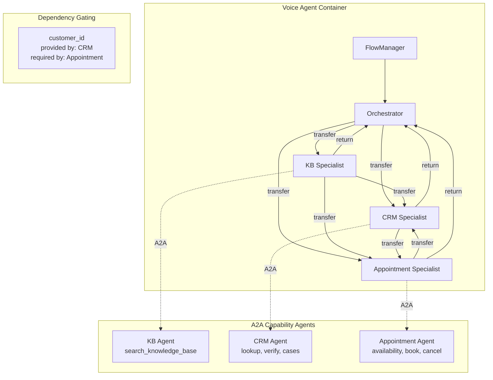

# Shipped: Multi-Agent In-Process Handoff

## Summary

Replaced the single-agent-per-call model with a **Pipecat Flows**-based multi-agent system that dynamically swaps LLM context (system prompt + tools) mid-call. A caller is greeted by an **orchestrator agent** that triages intent, then seamlessly transitions to **specialist agents** -- each with a focused persona, scoped A2A tools, and a summarized conversation handoff. From the caller's perspective: same voice, no silence, deeper expertise.

The system is **fully dynamic** -- deploying a new A2A capability agent and registering it in CloudMap automatically creates a new specialist node. No hard-coded node definitions.

## What Was Built

### Core Flows Module (`app/flows/`)

- **`flow_config.py`** -- FlowManager factory, dynamic agent discovery from CloudMap/Agent Cards, A2A function wrapping, global function building, dependency graph construction
- **`transitions.py`** -- Generic `transfer(target, reason)` function with loop protection (max 10 transitions), dependency gating checks, and metrics recording
- **`context.py`** -- Domain-aware summary prompts using Agent Card metadata (GENERIC, ORCHESTRATOR, DOMAIN_TEMPLATE)
- **`dependencies.py`** -- Tag-based dependency system (`provides:<key>` / `requires:<key>`), state tracking, transfer requirement checking, redirect-with-reason for unsatisfied deps
- **`nodes/orchestrator.py`** -- Orchestrator node with dynamic agent descriptions, continuation instructions for return visits, current datetime injection
- **`nodes/specialist.py`** -- Specialist node with self-gating prompts, brief transition TTS, peer descriptions for direct routing

### Appointment Scheduling System (Phase 2)

- **Appointment API** -- Lambda + API Gateway REST API backed by DynamoDB. 5 endpoints: check availability, book, get, cancel, reschedule. Plus admin seed/reset endpoints.
- **Appointment A2A Agent** -- Python container with 5 tools, `StrandsA2AExecutor` for inner LLM routing, explicit skill tags with `requires:customer_id` on mutation operations.
- **CDK Infrastructure** -- `AppointmentStack` (Phase 11) and `AppointmentAgentStack` (Phase 12), DynamoDB tables, CloudWatch alarms and dashboard widgets.

### Dependency Gating

- Skill-level tags on Agent Cards: `provides:customer_id` on CRM's `lookup_customer`, `requires:customer_id` on Appointment's book/cancel/reschedule
- Transfer gating: when KB tries to transfer to Appointment without `customer_id` satisfied, the system redirects to CRM with a reason explaining the caller's end goal
- Self-gating: specialist nodes check conversation summary before requiring re-verification

### Observability (Phase 4)

- `agent_node` dimension on `TurnMetrics` and `turn_completed` events
- `AgentTransitionCount` and `AgentTransitionLatency` CloudWatch metrics
- `agent_transition` structured log events with from/to/reason/latency
- Dashboard Row 11: Multi-Agent Flows (transition count, latency, loop protection, top transition paths)
- 2 new alarms: `FlowLoopProtection` and `FlowTransitionLatencyHigh`
- 2 new saved queries: flow transitions and loop protection events

### Pipeline Integration

- Feature-flagged via SSM parameter `/voice-agent/config/enable-flow-agents` (default: `false`)
- When enabled, `pipeline_ecs.py` creates a `FlowManager` instead of static LLM context
- Global functions (`get_current_time`, `hangup_call`) available in every node via `global_functions` parameter
- Existing single-agent mode unchanged when flag is off

## Architecture

## Test Call Results

### Test Call #4 (Final Validation) -- Clean Pass

**Session**: `voice-7aecb15c-a9e8-44ef-b8fe-efa10dfe77e9-253e36dc`

| Metric | Value |
|--------|-------|
| Duration | 3m 47s |
| Turns | 7 |
| Agent transitions | 3 (orchestrator -> KB -> CRM -> appointment) |
| Dependency redirects | 1 (KB->appointment redirected to CRM for customer_id) |
| A2A tool calls | 8 |
| Avg agent response | 1,071ms |
| Loop protection activations | 0 |
| Interruptions | 0 |
| Errors | 0 |
| Hangup | Clean -- `reason="Customer issue resolved"` |

**Call flow**: Caller reports printer jamming -> orchestrator routes to KB -> KB provides troubleshooting, caller wants on-site repair -> KB tries to transfer to Appointment -> dependency gate redirects to CRM (missing customer_id) -> CRM verifies identity, looks up customer, creates support case -> CRM transfers to Appointment (customer_id now satisfied) -> Appointment checks availability, books repair visit -> caller confirms, hangup.

## Quality Gates

### QA Validation: PASS

| Test Suite | Passed | Failed |
|-----------|--------|--------|
| Flow Config | 40 | 0 |
| Flow Transitions | 24 | 0 |
| Flow Nodes | 44 | 0 |
| Flow Dependencies | 30 | 0 |
| Bedrock Smoke | 17 | 0 |
| Observability Metrics | 82 | 0 |
| Comprehensive Observability | 25 | 0 |
| Appointment API Lambda | 36 | 0 |
| Appointment Agent Tools | 29 | 0 |
| **Total** | **327** | **0** |

Pre-existing failures unchanged (7 in `test_bedrock_integration.py`, 1 in `test_tool_integration.py`).

### Security Review: 17 Findings

| Severity | Count | Key Items |
|----------|-------|-----------|
| Critical | 2 | Appointment API has no authentication; no ownership verification on appointment mutations |
| High | 3 | Module-global `_node_factories` concurrency risk; PII in LLM summaries; internal error details leaked in API responses |
| Medium | 6 | HTTP (not TLS) between VPC services; unbounded scan limit; booking race condition; URL validation; dynamic signature masking; unpaginated admin delete |
| Low | 6 | Wildcard CORS; short appointment IDs; print() instead of structlog; unrestricted egress; PII in transition history; partial query logging |

**Assessment**: Critical and high items are documented for follow-up. The Appointment API authentication gaps (C-1, C-2) are acceptable for the current PoC deployment (API is VPC-internal, consumed only by the A2A agent container). The `_node_factories` global (H-1) should be addressed before production use with high concurrency. PII in summaries (H-2) is inherent to the design but should have a redaction layer added for logged output.

## Files Changed

### New Files
- `backend/voice-agent/app/flows/__init__.py`
- `backend/voice-agent/app/flows/flow_config.py`
- `backend/voice-agent/app/flows/transitions.py`
- `backend/voice-agent/app/flows/context.py`
- `backend/voice-agent/app/flows/dependencies.py`
- `backend/voice-agent/app/flows/nodes/__init__.py`
- `backend/voice-agent/app/flows/nodes/orchestrator.py`
- `backend/voice-agent/app/flows/nodes/specialist.py`
- `backend/agents/appointment-agent/main.py`
- `backend/agents/appointment-agent/appointment_client.py`
- `backend/agents/appointment-agent/Dockerfile`
- `backend/agents/appointment-agent/requirements.txt`
- `infrastructure/src/functions/appointment-api/index.py`
- `infrastructure/src/stacks/appointment-stack.ts`
- `infrastructure/src/stacks/appointment-agent-stack.ts`
- `resources/knowledge-base-documents/sample-faq.md`

### Modified Files
- `backend/voice-agent/app/pipeline_ecs.py` -- Flows mode code path
- `backend/voice-agent/app/services/config_service.py` -- `enable_flow_agents`, `flow_max_transitions`
- `backend/voice-agent/app/observability.py` -- `agent_node` dimension, flow metrics
- `backend/voice-agent/requirements.txt` -- `pipecat-ai-flows>=0.0.23`
- `backend/agents/crm-agent/main.py` -- Explicit skills with `provides:customer_id` tags
- `backend/agents/appointment-agent/main.py` -- Explicit skills with `requires:customer_id` tags
- `backend/agents/knowledge-base-agent/main.py` -- Updated description
- `infrastructure/src/constructs/voice-agent-monitoring-construct.ts` -- Dashboard row 11, alarms, queries

### Test Files (New)
- `backend/voice-agent/tests/test_flow_config.py` (40 tests)
- `backend/voice-agent/tests/test_flow_transitions.py` (24 tests)
- `backend/voice-agent/tests/test_flow_nodes.py` (44 tests)
- `backend/voice-agent/tests/test_flow_dependencies.py` (30 tests)
- `backend/voice-agent/tests/test_flows_bedrock_smoke.py` (17 tests)
- `infrastructure/src/functions/appointment-api/test_index.py` (36 tests)
- `backend/agents/appointment-agent/tests/test_tools.py` (29 tests)

## Known Issues / Follow-up Items

- **Appointment API authentication** (Security C-1, C-2) -- acceptable for PoC, needs auth before production
- **Module-global `_node_factories`** (Security H-1) -- needs per-call isolation for high-concurrency production use
- **Audio quality threshold too sensitive** -- see `docs/features/audio-quality-threshold-tuning/`
- **Transfer language not seamless** -- LLM still announces "transferring" -- see `docs/features/seamless-agent-transitions/`
- **Tool categories all "a2a"** -- see `docs/features/meaningful-tool-categories/`
- **Dashboard doesn't show agent node identity** -- see `docs/features/dashboard-agent-node-identity/`
- **Transition TTS not in conversation logs** -- see `docs/features/transition-tts-conversation-logging/`
- **Tool result details not logged** -- see `docs/features/expanded-tool-result-logging/`

## Success Criteria Status

- [x] Bedrock compatibility verified for `LLMMessagesUpdateFrame` and `LLMSetToolsFrame`
- [x] Orchestrator correctly triages caller intent and transitions to specialist
- [x] Specialist agents have access only to their declared tools
- [x] Conversation context carries across transitions via RESET_WITH_SUMMARY
- [x] Return-to-orchestrator works after specialist completes
- [x] Zero audible gap or silence during transitions
- [x] Per-node metrics visible in CloudWatch dashboard
- [x] No regression in E2E latency (transition adds < 1ms)
- [x] Existing single-agent mode continues to work when Flows is not configured
- [x] Dependency gating correctly enforces prerequisites between agents
- [x] Dynamic discovery -- new agents automatically become specialist nodes
