# Reduce Task Startup Time

## Problem Statement

Voice agent ECS tasks currently take **~3 minutes** from launch to receiving traffic. This directly undermines auto-scaling effectiveness: when a traffic spike triggers scale-out, new capacity doesn't come online for several minutes. During that window, existing tasks are overloaded and call quality degrades or calls are rejected.

## Measured Startup Timeline (2026-02-26)

From production logs of task `3b2a3f7d50ee449fbbcabf2eda53e7e7`:

| Phase | Timestamp | Duration | Notes |
|-------|-----------|----------|-------|
| Task created | 19:10:28 | -- | ECS scheduling begins |
| Image pull started | 19:10:42 | +14s | ENI attach + Fargate scheduling |
| Image pull completed | 19:11:19 | **37s pull** | 824 MB compressed image from ECR |
| Container started | 19:11:26 | +7s | Container init |
| Python imports complete | 19:11:30 | +4s | PyTorch-free: pipecat + deps |
| `service_ready` logged | 19:11:30.624 | +0.5s | SSM (270ms) + Secrets (70ms) + server bind |
| First NLB health check passes | 19:11:33 | +3s | `/ready` returns 200 |
| 2nd health check passes | 19:11:37 | +4s | NLB threshold met (interval=10s, but staggered AZ checks) |
| NLB target reported "healthy" | 19:13:33 | **+120s** | NLB internal registration delay |
| **Total: task created -> traffic** | -- | **~3 minutes** | |
| **Total: task created -> container running** | -- | **~68s** | |

### Key Finding: Application Init Is Not the Bottleneck

The app initializes in **~4.5 seconds** (19:11:26 -> 19:11:30.624):

```
19:11:26.413 | entrypoint.sh starts
19:11:27.351 | Pipecat 0.0.102 imported (0.9s Python imports)
19:11:30.151 | service_starting (3.7s total imports)
19:11:30.257 | loading_config_from_ssm
19:11:30.527 | config_loaded (270ms SSM fetch)
19:11:30.529 | session_tracker_initialized
19:11:30.547 | a2a_registry_initialized
19:11:30.621 | secrets_loaded (70ms Secrets Manager)
19:11:30.624 | service_ready (HTTP server bound)
```

### Key Finding: NLB Has a ~2 Minute Registration Delay

Health checks pass consistently at 200 from 19:11:33 onward (every ~3s from two AZ health checkers). Yet the NLB didn't mark the target as healthy until 19:13:33. This **~120 second gap** between "health checks passing" and "target healthy" is an NLB-internal registration/propagation delay. This is documented AWS behavior: _"It can take a few minutes for the registration process to complete and health checks to start."_

This means NLB health check tuning (interval, threshold) cannot reduce time-to-traffic below this ~2 minute floor.

## Bottleneck Analysis

```mermaid
gantt
    title Task Startup Timeline (Measured)
    dateFormat HH:mm:ss
    axisFormat %H:%M:%S

    section Fargate
    ENI + scheduling           :a1, 19:10:28, 14s
    Image pull (37s)           :a2, 19:10:42, 37s
    Container init (7s)        :a3, 19:11:19, 7s

    section Application
    Python imports (4s)        :b1, 19:11:26, 4s
    SSM + Secrets (0.5s)       :b2, 19:11:30, 1s
    service_ready              :milestone, 19:11:31, 0s

    section NLB
    Health checks passing      :c1, 19:11:33, 120s
    NLB registration delay     :crit, c2, 19:11:33, 120s
    Target healthy             :milestone, 19:13:33, 0s
```



| Phase | Duration | % of Total | Controllable? |
|-------|----------|-----------|--------------|
| ENI + scheduling | 14s | 8% | No |
| **Image pull** | **37s** | **21%** | **Yes (SOCI)** |
| Container init | 7s | 4% | Minimal |
| App init | 4.5s | 3% | Already fast |
| **NLB registration** | **~120s** | **65%** | **Architecture change** |

The two dominant bottlenecks are:
1. **NLB registration delay (~120s)** -- AWS internal, not directly configurable
2. **Image pull (37s)** -- addressable with SOCI lazy loading

## Changes Implemented (Phase 1)

### Multi-stage Docker build + PyTorch removal
- **Removed dead `torch`/`torchaudio` dependency** -- pipecat v0.0.102 uses ONNX Runtime for Silero VAD, not PyTorch
- **Removed `torch.hub.load` pre-download** -- downloaded a model pipecat never loaded
- **Multi-stage build** -- gcc/python3-dev in build stage only, not shipped in final image
- **Result:** Image 851 MB -> 824 MB compressed (3% reduction). Disappointing -- runtime deps dominate.

### NLB health check interval reduced
- Interval: 10s -> 5s (checks pass faster once app is ready)
- `healthyThresholdCount` stays at 2 (AWS enforces minimum of 2 for NLB target groups)
- ECS health check `startPeriod`: 30s -> 10s (faster failure detection)
- **Result:** ~10s faster health check convergence, but dwarfed by NLB registration delay.

## Next Steps: SOCI (Seekable OCI) Lazy Loading

SOCI is the most promising remaining optimization for image pull time. It enables Fargate to start the container **before the full image is downloaded**, lazily loading files on demand.

### How it works
- A SOCI index is generated for the container image and pushed to ECR alongside it
- Fargate automatically detects SOCI indexes on platform version 1.4.0
- Container starts after downloading only the files needed for startup
- Remaining layers stream in the background during execution

### Expected impact for our ~824 MB image
- AWS benchmarks show **75% speedup for ~1 GB images** (37s pull -> ~10s)
- App start begins while image is still streaming
- Combined with fast app init (4.5s), total task created -> container running could drop from 68s to ~25-30s

### Implementation path
1. **cfn-ecr-aws-soci-index-builder** -- CloudFormation solution that auto-generates SOCI indexes via EventBridge + Lambda when images are pushed to ECR
2. **deploy-time-build CDK construct** -- Third-party CDK L3 construct that builds SOCI indexes during `cdk deploy`
3. **Manual CI/CD integration** -- Run `soci` CLI in build pipeline after `docker push`

### Caveats
- SOCI v2 is now required for new accounts (v1 no longer supported)
- Small images (<100 MB) may see no benefit or slight regression
- SOCI index generation adds ~30s to deploy pipeline (one-time per image)
- Need to verify Fargate platform version 1.4.0 is in use

## Addressing the NLB Registration Delay

The ~120s NLB registration delay is the largest bottleneck (65% of time-to-traffic). Options:

### Option A: Accept the delay, mitigate with pre-warming
Keep `minCapacity >= 2` during business hours. New tasks are a backup, not the primary scaling response. Cost: ~$X/month for an extra idle task.

### Option B: Bypass NLB for initial routing
Use ECS Service Connect or direct CloudMap discovery so the bot-runner Lambda can route calls to tasks as soon as they're registered in CloudMap (which happens much faster than NLB target registration).

### Option C: Pre-registered warm pool
Maintain standby tasks already registered in the NLB but marked as "not ready" via `/ready` returning 503. On demand, flip them to 200. This skips the NLB registration delay entirely since the target is already registered.

## Affected Areas

### Infrastructure (CDK)
- `infrastructure/src/stacks/ecs-stack.ts` -- NLB health check tuning, ECS health check start period (done)
- SOCI index builder integration (next)

### Application (Python)
- `backend/voice-agent/Dockerfile` -- Multi-stage build, PyTorch removal (done)
- `backend/voice-agent/requirements.txt` -- Stale PyTorch comments removed (done)

## Success Criteria

- [x] Multi-stage Docker build with PyTorch removed
- [x] NLB health check interval reduced to 5s
- [x] ECS health check startPeriod reduced to 10s
- [x] App init confirmed fast (~4.5s) from production logs
- [ ] SOCI index generated and verified for voice agent image
- [ ] Measure image pull time with SOCI (target: <15s)
- [ ] Evaluate NLB registration delay bypass (Option B or C)
- [ ] Docker image size reduced meaningfully (SOCI makes this less critical)

## Dependencies

- `ecs-auto-scaling` (shipped) -- Current scaling infra this improves upon
- `dynamodb-session-tracking` (shipped) -- Session tracking unaffected
- Fargate platform version 1.4.0+ (required for SOCI)
- `cfn-ecr-aws-soci-index-builder` or equivalent for SOCI index generation

## Risks and Mitigations

| Risk | Impact | Mitigation |
|------|--------|------------|
| SOCI not working (wrong platform version, v1 vs v2) | No image pull improvement | Check task metadata for `Snapshotter: soci`; fall back to full pull |
| NLB registration delay is unavoidable | 2 min minimum time-to-traffic | Pre-warming or architectural bypass (CloudMap direct routing) |
| SOCI adds deploy pipeline complexity | Slower deploys | EventBridge-triggered Lambda builds index async; CDK dependency ensures readiness |
| Reduced ECS startPeriod kills slow-starting tasks | Container restarts | 10s is 2x typical init time; monitored in production |
