# Shipped: Reduce Task Startup Time

## Summary

Analyzed and optimized ECS Fargate task startup time for the voice agent service. Instrumented the full startup timeline from production logs, identified the two dominant bottlenecks (NLB registration delay at 65% and image pull at 21%), and shipped Phase 1 optimizations: multi-stage Docker build with PyTorch removal and NLB/ECS health check tuning. Documented the remaining optimization path (SOCI lazy loading, NLB bypass) for future phases.

## What Shipped

### Multi-Stage Docker Build + PyTorch Removal
- Removed dead `torch`/`torchaudio` dependency -- pipecat v0.0.102 uses ONNX Runtime for Silero VAD, not PyTorch
- Removed `torch.hub.load` pre-download that downloaded a model pipecat never loaded
- Multi-stage build: gcc/python3-dev in build stage only, not shipped in final image
- Result: Image 851 MB -> 824 MB compressed (3% reduction)

### NLB Health Check Interval Reduced
- Health check interval: 10s -> 5s (checks pass faster once app is ready)
- `healthyThresholdCount` stays at 2 (AWS enforces minimum of 2 for NLB target groups)
- ECS health check `startPeriod`: 30s -> 10s (faster failure detection)
- Result: ~10s faster health check convergence

### Startup Timeline Analysis
Produced a detailed, production-measured startup timeline from task `3b2a3f7d50ee449fbbcabf2eda53e7e7`:

| Phase | Duration | % of Total | Controllable? |
|-------|----------|-----------|--------------|
| ENI + scheduling | 14s | 8% | No |
| Image pull | 37s | 21% | Yes (SOCI) |
| Container init | 7s | 4% | Minimal |
| App init | 4.5s | 3% | Already fast |
| NLB registration | ~120s | 65% | Architecture change |

Key finding: Application init is **not** the bottleneck -- it completes in ~4.5s. The NLB internal registration delay (~120s) is the dominant factor and cannot be reduced via health check tuning.

## Architecture

```mermaid
gantt
    title Task Startup Timeline (Measured)
    dateFormat HH:mm:ss
    axisFormat %H:%M:%S

    section Fargate
    ENI + scheduling           :a1, 19:10:28, 14s
    Image pull (37s)           :a2, 19:10:42, 37s
    Container init (7s)        :a3, 19:11:19, 7s

    section Application
    Python imports (4s)        :b1, 19:11:26, 4s
    SSM + Secrets (0.5s)       :b2, 19:11:30, 1s
    service_ready              :milestone, 19:11:31, 0s

    section NLB
    Health checks passing      :c1, 19:11:33, 120s
    NLB registration delay     :crit, c2, 19:11:33, 120s
    Target healthy             :milestone, 19:13:33, 0s
```

## Files Changed

### Infrastructure (CDK)
| File | Changes |
|------|---------|
| `infrastructure/src/stacks/ecs-stack.ts` | NLB health check interval 10s -> 5s, ECS health check `startPeriod` 30s -> 10s |

### Application (Docker)
| File | Changes |
|------|---------|
| `backend/voice-agent/Dockerfile` | Multi-stage build, removed PyTorch/torchaudio deps, removed `torch.hub.load` pre-download |
| `backend/voice-agent/requirements.txt` | Removed stale PyTorch comments |

## Success Criteria

- [x] Multi-stage Docker build with PyTorch removed
- [x] NLB health check interval reduced to 5s
- [x] ECS health check startPeriod reduced to 10s
- [x] App init confirmed fast (~4.5s) from production logs
- [x] Full startup timeline measured and documented

## Deferred to Future Phases

| # | Item | Rationale |
|---|------|-----------|
| 1 | SOCI (Seekable OCI) lazy loading | Most promising image pull optimization (37s -> ~10s estimated). Requires SOCI index builder integration and Fargate platform version 1.4.0 verification. |
| 2 | NLB registration delay bypass | ~120s NLB-internal delay is the largest bottleneck. Options: CloudMap direct routing, pre-registered warm pool, or pre-warming with higher `minCapacity`. Requires architectural evaluation. |
| 3 | Further Docker image size reduction | SOCI makes this less critical since container starts before full download. |

## Dependencies

- `ecs-auto-scaling` (shipped) -- scaling infra this improves upon
- `dynamodb-session-tracking` (shipped) -- session tracking unaffected
- Fargate platform version 1.4.0+ (required for future SOCI work)

## Key Design Decisions

| Decision | Choice | Rationale |
|----------|--------|-----------|
| Ship Phase 1 separately | Incremental delivery | Phase 1 (build + health check tuning) is low-risk and delivers immediate value. SOCI and NLB bypass are higher-effort and can iterate independently. |
| Keep `minCapacity >= 1` | Accept cold start delay | Pre-warming (higher minCapacity) is a cost tradeoff. Documented as Option A for teams to evaluate per-environment. |
| Remove PyTorch despite small image reduction | Correctness over size | Dead dependency removal is correct regardless of size impact. Eliminates unused code paths and reduces attack surface. |
| 10s ECS startPeriod | 2x typical init time | 4.5s observed init leaves comfortable margin. Monitored in production for false restarts. |
