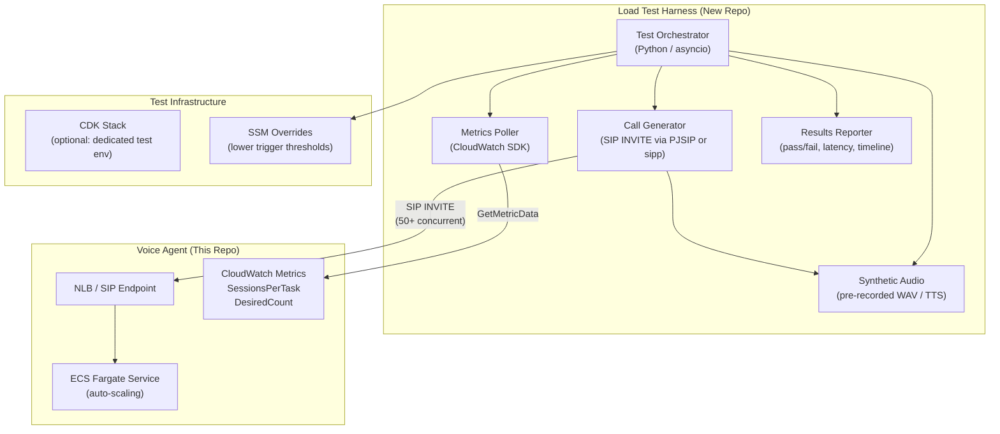

# Auto-Scaling Load Test Harness

## Problem Statement

The `ecs-auto-scaling` feature introduces target tracking (3 sessions/task), step scaling for bursts, and ECS Task Scale-in Protection. Before shipping these to production we need a repeatable, automated way to:

1. **Prove scale-out works** -- place enough concurrent calls to push `SessionsPerTask` above the target and verify new ECS tasks launch.
2. **Prove scale-in is safe** -- end calls and verify that only unprotected (idle) tasks are terminated, with zero dropped calls.
3. **Validate burst handling** -- ramp call volume rapidly and confirm the step scaling policy fires correctly.
4. **Measure capacity limits** -- determine the actual per-container breaking point (CPU, memory, latency) under sustained load.
5. **Regression-test scaling** -- run the harness after any infra or application change that touches scaling paths.

Today there is no tooling for any of this. Manual testing is limited to 1-2 calls.

## Vision

A standalone load-test tool that can:

- Place and sustain **50+ concurrent SIP/WebRTC calls** against the voice agent
- Use **synthetic audio** (pre-recorded prompts or TTS-generated speech) to drive realistic conversations
- **Ramp up and down** on a configurable schedule to exercise both scale-out and scale-in
- **Assert scaling behavior** by polling CloudWatch metrics (`SessionsPerTask`, `ActiveCount`, `HealthyTaskCount`, ECS `DesiredCount`/`RunningCount`)
- **Detect dropped calls** -- verify every placed call completes successfully (no server-side hangup during scale-in)
- **Report results** with pass/fail criteria, latency percentiles, and scaling timeline

## Test Scenarios

### Scenario 1: Steady-State Scale-Out

| Step | Action | Expected |
|------|--------|----------|
| 1 | Start with `minCapacity: 1`, `targetSessionsPerTask: 2` (lowered for testing) | 1 task running |
| 2 | Place 4 concurrent calls (2 per task target) | Scale-out to 2 tasks |
| 3 | Place 4 more calls (8 total) | Scale-out to 4 tasks |
| 4 | Hold calls for 3 minutes | Stable at 4 tasks, `SessionsPerTask` ~2 |
| 5 | End all calls | Scale-in to 1 task (over ~5 min cooldown) |
| 6 | **Assert**: zero calls dropped during scale-in | |

### Scenario 2: Burst Scale-Out

| Step | Action | Expected |
|------|--------|----------|
| 1 | Start with 1 task | 1 task running |
| 2 | Place 20 calls simultaneously | Step scaling fires: +10 or +25 tasks |
| 3 | Hold for 2 minutes | Tasks stabilize, sessions distributed |
| 4 | End all calls | Scale-in back to `minCapacity` |
| 5 | **Assert**: no calls rejected or dropped | |

### Scenario 3: Scale-In Protection Validation

| Step | Action | Expected |
|------|--------|----------|
| 1 | Place calls on 3+ tasks | Multiple protected tasks |
| 2 | End calls on 2 tasks (leave 1 task active) | 2 tasks become unprotected |
| 3 | Wait for scale-in | Only unprotected tasks terminated |
| 4 | **Assert**: active task survives, its calls complete normally | |

### Scenario 4: Sustained Load (50+ calls)

| Step | Action | Expected |
|------|--------|----------|
| 1 | Ramp to 50 concurrent calls over 5 minutes | Progressive scale-out |
| 2 | Hold 50 calls for 10 minutes | Stable task count, per-task metrics within thresholds |
| 3 | Ramp down to 0 over 5 minutes | Progressive scale-in |
| 4 | **Assert**: E2E latency p95 < 3000ms throughout, zero dropped calls | |

## Architecture

## Test Configuration

The harness must support lowered thresholds so scaling behavior is observable with fewer calls:

| Parameter | Production Value | Test Value | How to Override |
|-----------|-----------------|------------|-----------------|
| `targetSessionsPerTask` | 3 | 1-2 | CDK context / stack prop |
| `minCapacity` | 1 | 1 | CDK context / stack prop |
| `maxCapacity` | 50 | 10-20 | CDK context / stack prop |
| Step scaling lower bound | 3.5 | 1.5-2.5 | CDK context / stack prop |
| Scale-in cooldown | 300s | 60-120s | CDK context / stack prop |

## Implementation Approach

### Call Generation Options

| Option | Pros | Cons |
|--------|------|------|
| **sipp** (SIPp load tester) | Purpose-built for SIP load testing, well-known, scriptable scenarios | XML scenario files are verbose, limited audio flexibility |
| **PJSIP (Python)** | Full programmatic control, can integrate with test assertions directly | More code to write, need to manage SIP stack |
| **Asterisk + ARI** | Can leverage existing SIP server infra, originate calls via REST | Adds dependency on Asterisk deployment |
| **Daily REST API** | Works if using Daily as transport, easy to script | Bypasses SIP path, may not test NLB routing |

Recommended: **sipp** for raw SIP load generation (proven at scale, low resource footprint), with a **Python orchestrator** for test scenarios, metric polling, and assertions.

### Repo Location

This tool lives in a **sibling repo** (e.g., `../asset-scaling-load-test` or within `../asset-sip-server`) because:

- It deploys its own infrastructure (call generators, possibly an Asterisk instance for SIP origination)
- It has different dependencies (sipp, PJSIP, etc.) than the voice agent
- It needs to target different environments (dev, staging, prod) independently
- It should be runnable by CI/CD without deploying the voice agent stack

### Key Components to Build

1. **Test Orchestrator** -- Python CLI that runs test scenarios, manages call lifecycle, polls metrics, and produces reports
2. **Call Generator** -- sipp wrapper or PJSIP client that can place N concurrent SIP calls with synthetic audio
3. **Synthetic Audio** -- Pre-recorded WAV files with realistic prompts (or silence + occasional speech to trigger conversation turns)
4. **Metrics Poller** -- CloudWatch client that fetches `SessionsPerTask`, `DesiredCount`, `RunningCount`, `E2ELatency` during the test
5. **Assertion Engine** -- Validates scaling behavior against expected outcomes (task count changes, zero dropped calls, latency within bounds)
6. **CDK Stack (optional)** -- Deploys a dedicated test environment with lowered thresholds, or provides SSM parameter overrides for an existing environment
7. **Reporting** -- Terminal output with pass/fail per scenario, plus optional JSON/HTML report

## Success Criteria

- [ ] Place and sustain 50 concurrent calls for 10+ minutes without dropped calls
- [ ] Verify ECS scales from 1 to N tasks when call volume exceeds target
- [ ] Verify ECS scales back to `minCapacity` after all calls end
- [ ] Verify zero calls dropped during scale-in (task protection working)
- [ ] Verify burst scenario triggers step scaling policy
- [ ] E2E latency p95 remains under 3000ms at 50 calls
- [ ] Test harness runs end-to-end in < 30 minutes (including ramp and cooldown)
- [ ] Results report clearly shows scaling timeline with pass/fail

## Dependencies

- `ecs-auto-scaling` (backlog) -- The scaling behavior being tested
- `comprehensive-observability-metrics` (shipped) -- CloudWatch metrics to poll
- `dynamodb-session-tracking` (shipped) -- Session lifecycle data
- `sip-testing-environment` (shipped) -- Existing SIP test infra as reference
- SIP endpoint accessible from the test harness (NLB with SIP listeners)

## Risks and Mitigations

| Risk | Impact | Mitigation |
|------|--------|------------|
| Cost of 50+ concurrent Fargate tasks during tests | High AWS bill | Use short test durations, low-resource task size, run in dev account only |
| SIP call generation at scale requires significant bandwidth | Test infra becomes bottleneck | Run call generators on EC2 or Fargate in same VPC |
| Synthetic audio doesn't trigger realistic conversation flow | Tests don't exercise real latency paths | Include varied prompts that trigger LLM/TTS/STT pipeline |
| CloudWatch metric propagation delay | Assertions fail due to stale metrics | Add configurable wait/retry with backoff in metrics poller |
| Test interferes with other environments | Unintended scaling in production | Dedicated test environment with separate ECS cluster and scaling config |

## Notes

- Consider making the harness reusable for other load test scenarios (e.g., latency benchmarking, failover testing)
- The portable design doc (`docs/scaling-load-test-spec.md`) is intended to be imported into the sibling repo as the implementation plan
- Start with Scenario 1 (steady-state) and build up to Scenario 4 (sustained 50+ calls)
