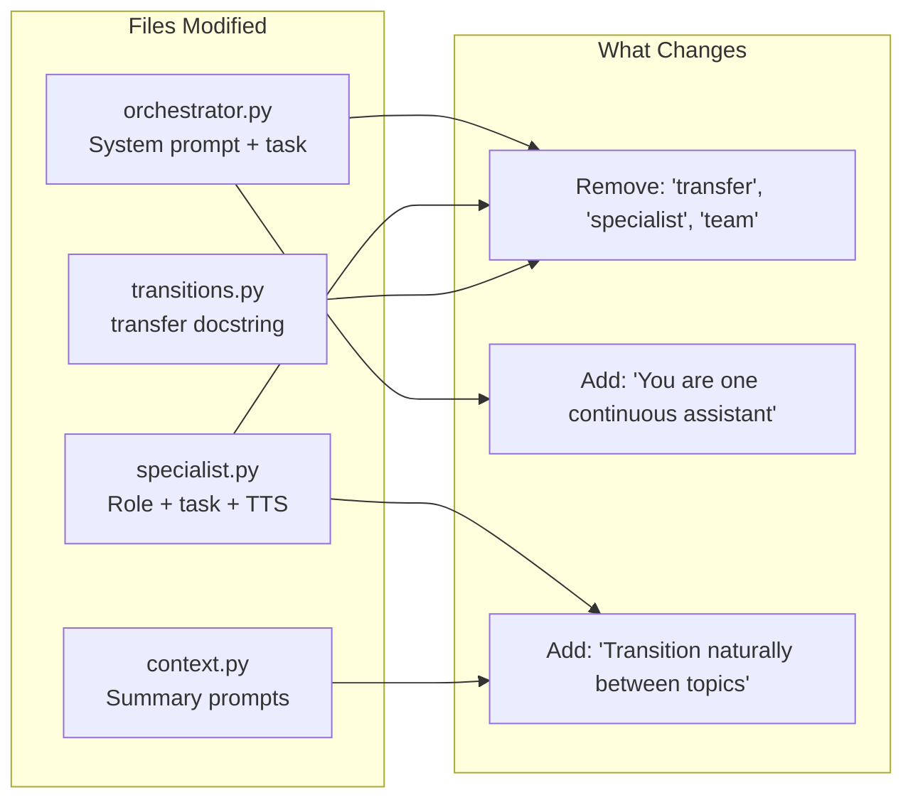

# Implementation Plan: Seamless Agent Transitions (Remove Transfer Language)

## Overview

Remove all explicit "transfer", "connect you with", "specialist", and "team" language from the multi-agent flow system. The caller should perceive a single continuous conversation with one assistant named Alex, not a series of handoffs between departments. Topic shifts should feel natural ("I can help with that -- let me look up your account first.") rather than transactional ("Let me transfer you to our billing specialist.").

This is a prompt-engineering change across four files. No new modules, no infrastructure changes, no new dependencies.

## Architecture

No architectural changes. The existing Pipecat Flows system, `RESET_WITH_SUMMARY` context strategy, and `transfer()` function all remain unchanged. The changes are confined to the text content of system prompts, task messages, transition TTS, summary prompts, and the `transfer()` function docstring (which the LLM sees as the tool description).



## Architecture Decisions

| # | Decision | Choice | Rationale |
|---|----------|--------|-----------|
| 1 | Approach | Prompt engineering only | The idea.md identifies this as a Small effort with High impact. The underlying Flows machinery works correctly -- the problem is purely in the language the LLM is instructed to use. |
| 2 | Transfer function docstring | Reword to avoid "specialist" | The LLM sees the function docstring as the tool description. Changing "Transfer the caller to a different specialist" to "Switch to a different topic area" removes the framing that triggers transfer announcements. |
| 3 | Orchestrator task wording | Replace "route to specialist" with "help directly" framing | The orchestrator should see itself as one agent that can "bring up different expertise" rather than "routing to teams". |
| 4 | Specialist role template | Remove "You are a specialist agent" | Replace with "You are continuing the conversation with the caller." to reinforce continuity. |
| 5 | Transition TTS | Keep "One moment please." | The idea.md explicitly states this is acceptable as a brief pause. No change needed. |
| 6 | Summary prompts | Replace "hand the conversation to a specialist" | Reframe as internal context preparation rather than handoff language. |
| 7 | Explicit anti-pattern list | Add "Never mention..." instruction | Explicit negative instructions ("Never say transfer, specialist, team, department, connect you with") are effective guardrails for LLMs that tend to revert to transfer language. |

## Implementation Steps

### Phase 1: Orchestrator Prompt Changes

Update the orchestrator system prompt and task message to remove transfer/specialist framing.

**1.1 Update orchestrator task template**

File: `backend/voice-agent/app/flows/nodes/orchestrator.py`

Current `_ORCHESTRATOR_TASK_TEMPLATE` (lines 48-64):
```python
"Your job is to greet callers, understand what they need, and route them "
"to the right specialist. Listen carefully to the caller's request and "
"use the transfer function to connect them with the appropriate team.\n\n"
"Do NOT attempt to solve technical problems, answer domain-specific questions, "
"or perform actions yourself. Instead, transfer the caller to the "
"relevant specialist as soon as you understand their intent.\n\n"
...
```

Replace with:
```python
"Your job is to greet callers, understand what they need, and help them "
"directly. Listen carefully to the caller's request and use the transfer "
"function to bring up the right expertise.\n\n"
"Do NOT attempt to solve technical problems, answer domain-specific questions, "
"or perform actions yourself. Instead, use the transfer function as soon as "
"you understand their intent -- but NEVER announce that you are transferring, "
"connecting, or routing the caller. Simply acknowledge their request and "
"proceed naturally.\n\n"
...
"NEVER mention transfers, specialists, teams, departments, or agents. "
"You are one continuous assistant named Alex. When switching topics, "
"transition naturally -- for example: 'Sure, I can help with that. "
"Let me look into it for you.'"
```

**1.2 Update specialist descriptions header**

File: `backend/voice-agent/app/flows/nodes/orchestrator.py`

Current `_build_specialist_descriptions()` (line 93):
```python
lines = ["Available specialists you can transfer to:"]
```

Replace with:
```python
lines = ["Available expertise areas (use the transfer function to switch):"]
```

Current footer (lines 99-102):
```python
lines.append(
    "\nUse the transfer function with the specialist's name as the target. "
    "You can also transfer to 'reception' to return the caller here."
)
```

Replace with:
```python
lines.append(
    "\nUse the transfer function with the area name as the target. "
    "You can also use 'reception' to return here."
)
```

---

### Phase 2: Specialist Prompt Changes

Update the specialist role and task templates to reinforce continuity rather than handoff.

**2.1 Update specialist role template**

File: `backend/voice-agent/app/flows/nodes/specialist.py`

Current `_SPECIALIST_ROLE_TEMPLATE` (lines 38-45):
```python
"You are a specialist agent. {agent_description} "
"Your name is Alex (same voice throughout the call -- the caller "
"should not notice any change). ..."
```

Replace with:
```python
"You are Alex, a friendly and professional virtual assistant for a "
"technology services company. {agent_description} "
"You are continuing an ongoing phone conversation with the caller. "
"Maintain the same warm, conversational tone throughout. "
"Keep responses concise -- 1-3 sentences per turn. "
"Never use special characters, URLs, or formatting. "
"The current date and time is {current_datetime}."
```

This removes "specialist agent" and "should not notice any change" (which implies there IS a change to notice) and replaces it with positive framing of continuity.

**2.2 Update specialist task template**

File: `backend/voice-agent/app/flows/nodes/specialist.py`

Current `_SPECIALIST_TASK_TEMPLATE` (lines 49-59):
```python
"Help the caller with their request using your available tools. "
"Ask clarifying questions when needed before taking action. "
"When you first greet the caller, keep it brief -- do NOT repeat "
"information they already know or re-explain why they were transferred. "
"Just confirm what you're going to help with and get started. "
"If the caller's issue is resolved, ask if they need help with anything "
"else. If they have a different type of question outside your expertise, "
"use the transfer function to route them to the appropriate specialist "
"or back to reception.\n\n"
```

Replace with:
```python
"Help the caller with their request using your available tools. "
"Ask clarifying questions when needed before taking action. "
"Continue the conversation naturally -- do NOT re-introduce yourself, "
"do NOT repeat information the caller already shared, and do NOT "
"mention any transition or handoff. Simply confirm what you're going "
"to help with and get started.\n\n"
"If the caller's issue is resolved, ask if they need help with anything "
"else. If they have a different type of question outside your current "
"tools, use the transfer function to switch focus -- but NEVER tell the "
"caller you are transferring them or connecting them to anyone.\n\n"
"NEVER mention transfers, specialists, teams, departments, or agents. "
"You are one continuous assistant named Alex throughout the entire call.\n\n"
```

**2.3 Update peer descriptions framing**

File: `backend/voice-agent/app/flows/nodes/specialist.py`

Current peer section (line 122):
```python
lines = ["You can transfer the caller directly to these other specialists:"]
```

Replace with:
```python
lines = ["You can switch to these other expertise areas using the transfer function:"]
```

Current peer footer (lines 127-129):
```python
lines.append("- reception: Return to the main receptionist")
lines.append(
    "\nTransfer directly to the most appropriate specialist "
    "rather than sending the caller back to reception when possible."
)
```

Replace with:
```python
lines.append("- reception: Return to general assistance")
lines.append(
    "\nSwitch directly to the most appropriate area "
    "rather than going back to reception when possible."
)
```

---

### Phase 3: Summary Prompt Changes

Update context summary prompts to remove handoff framing.

**3.1 Update domain-aware summary template**

File: `backend/voice-agent/app/flows/context.py`

Current `_DOMAIN_SUMMARY_TEMPLATE` (lines 28-35):
```python
"You are about to hand the conversation to a specialist: {agent_description}\n\n"
"Summarize the conversation so far, focusing on information relevant to "
"this specialist's domain. ..."
```

Replace with:
```python
"The conversation is shifting focus to: {agent_description}\n\n"
"Summarize the conversation so far, focusing on information relevant to "
"this area. Include: the caller's request, any key details "
"or identifiers gathered (names, account numbers, dates, etc.), actions "
"already taken, and what the caller still needs. "
"Be concise -- 2-3 sentences maximum."
```

This changes the framing from "handing off to a specialist" to "shifting focus", which is an internal context instruction -- the caller never sees it, but it sets the right mental model for the LLM generating the summary.

---

### Phase 4: Transfer Function Docstring

Update the transfer function's docstring (which the LLM sees as the tool description).

**4.1 Update transfer docstring**

File: `backend/voice-agent/app/flows/transitions.py`

Current docstring (lines 86-98):
```python
"""Transfer the caller to a different specialist or back to the main reception.

Use this function to route the caller to the most appropriate specialist
for their needs. The available specialists are listed in your system
instructions. You can also transfer to 'reception' to return the caller
to the main reception desk.

Args:
    target: The name of the specialist to transfer to, or 'reception'
        to return to the main desk.
    reason: Brief explanation of why the transfer is needed, including
        key context for the next specialist.
"""
```

Replace with:
```python
"""Switch your focus to a different expertise area to help the caller.

Use this function when the caller's request requires a different set of
tools or knowledge. The available areas are listed in your system
instructions. Use 'reception' to return to general assistance.

IMPORTANT: Do NOT announce this action to the caller. Do NOT say you are
transferring, connecting, or routing them. Simply use the function silently
and continue the conversation naturally.

Args:
    target: The expertise area to switch to, or 'reception' for general
        assistance.
    reason: Internal note about why the switch is needed and key context
        to carry forward. The caller does not see this.
"""
```

The `reason` parameter description now explicitly states it's internal, reducing the chance the LLM echoes it to the caller.

---

### Phase 5: Testing and Validation

**5.1 Update existing unit tests**

Files in `backend/voice-agent/tests/`:

- Tests that assert on specific prompt text (e.g., checking for "specialist" in node messages) must be updated to match the new wording.
- Tests that verify node structure (functions, context strategy, pre_actions) should remain unchanged.

Search for test assertions containing:
- `"specialist"` in prompt content checks
- `"transfer the caller"` in docstring checks
- `"hand the conversation"` in summary prompt checks

**5.2 Manual call testing**

Run 3 test call scenarios to verify the LLM no longer uses transfer language:

1. **Triage to single specialist**: Call in with a billing question. Verify the orchestrator does NOT say "Let me transfer you to billing" but instead responds naturally (e.g., "Sure, let me pull up your account information.").

2. **Cross-specialist transition**: Start with a KB question, then ask about appointments. Verify the transition is seamless -- no mention of "connecting you with our appointment specialist."

3. **Return to orchestrator**: After resolving a specialist task, verify the orchestrator says "Is there anything else I can help you with?" without referencing "back from the billing team" or similar.

**5.3 Regression check**

- Verify the `transfer()` function still works correctly (target resolution, loop protection, dependency gating all unchanged)
- Verify `RESET_WITH_SUMMARY` still generates coherent summaries with the new prompt framing
- Verify transition TTS ("One moment please.") still plays

## Files Modified

| File | Change |
|------|--------|
| `backend/voice-agent/app/flows/nodes/orchestrator.py` | Reword task template, specialist descriptions header/footer |
| `backend/voice-agent/app/flows/nodes/specialist.py` | Reword role template, task template, peer descriptions |
| `backend/voice-agent/app/flows/context.py` | Reword domain-aware summary template |
| `backend/voice-agent/app/flows/transitions.py` | Reword transfer function docstring |
| `backend/voice-agent/tests/unit/test_flow_nodes.py` | Update prompt content assertions |
| `backend/voice-agent/tests/unit/test_flow_transitions.py` | Update docstring assertions if any |
| `backend/voice-agent/tests/unit/test_flow_context.py` | Update summary prompt assertions if any |

## Configuration

No new configuration. No new environment variables, SSM parameters, or CDK changes.

## Risks & Mitigations

| # | Risk | Severity | Mitigation |
|---|------|----------|------------|
| 1 | LLM still uses transfer language despite prompt changes | Medium | Add explicit negative instructions ("NEVER mention transfers...") which are more effective than positive-only framing. Test with multiple call scenarios. Iterate on prompt wording if needed. |
| 2 | Summary prompt reframing produces lower-quality summaries | Low | The change is minimal ("shifting focus to" vs "hand the conversation to"). The summary content instructions are unchanged. Validate with manual testing. |
| 3 | Transfer function docstring change confuses the LLM about when to use the function | Low | The function parameters and behavior are identical. Only the framing changes. The task messages still clearly instruct when to use the function. |
| 4 | Existing tests break due to prompt text changes | Low | Identify and update all affected assertions in Phase 5.1. Test structure (functions, context strategy, pre_actions) is unaffected. |
| 5 | Model-dependent behavior -- different LLM models may respond differently to the prompt changes | Medium | Test with the configured `LLM_MODEL_ID` (currently Claude Haiku). If model is changed, re-validate transition language. |

## Dependencies

### Internal

| Feature | Status | Dependency Type |
|---------|--------|-----------------|
| `multi-agent-handoff` | Completed | This feature modifies the prompts created by the multi-agent handoff system |

### External

None. No new packages or version changes.

## Estimated Effort

| Phase | Description | Effort |
|-------|-------------|--------|
| Phase 1 | Orchestrator prompt changes | 0.5 hours |
| Phase 2 | Specialist prompt changes | 0.5 hours |
| Phase 3 | Summary prompt changes | 0.25 hours |
| Phase 4 | Transfer function docstring | 0.25 hours |
| Phase 5 | Test updates + manual validation | 1-2 hours |
| **Total** | | **2.5-3.5 hours** |

## Success Criteria

| Criteria | Measurement |
|----------|-------------|
| No "transfer" language in orchestrator responses | Manual test call: orchestrator acknowledges request naturally |
| No "specialist/team/department" in any agent response | 3 test call scenarios with transcript review |
| Consistent persona -- no re-introductions | Specialist nodes do not announce their name or role |
| Context flows naturally across transitions | Summary-based continuity preserved; caller's details carry through |
| Existing functionality unaffected | All unit tests pass, transfer routing works, loop protection works |
| Transition TTS still plays | "One moment please." heard during topic switches |

## Progress Log

| Date | Update |
|------|--------|
| 2026-03-05 | Plan created. Identified 4 files requiring prompt text changes across orchestrator, specialist, context, and transitions modules. Classified as Small effort (prompt engineering only, no architectural changes). |
