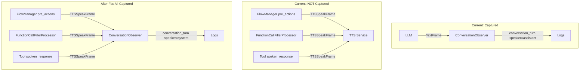

# Implementation Plan: Transition TTS Conversation Logging

## Overview

The `ConversationObserver` captures LLM-generated bot speech by watching `TextFrame` within `LLMFullResponseStartFrame`/`LLMFullResponseEndFrame` boundaries, but transition TTS phrases injected via pipecat-flows `pre_actions` (`{"type": "tts_say", ...}`) bypass the LLM pipeline entirely. The `FlowManager` pushes a `TTSSpeakFrame` directly into the pipeline, which the TTS service synthesizes and plays to the caller -- but no `conversation_turn` log event is emitted. This creates gaps in conversation transcripts.

The fix is to observe `TTSSpeakFrame` in the `ConversationObserver`. When a `TTSSpeakFrame` arrives from a non-LLM source, log it as `speaker: "system"` to distinguish flow-injected speech from LLM-generated responses. This also captures filler phrases from `FunctionCallFillerProcessor` and deterministic `spoken_response` TTS from tool results.

## Architecture

## Implementation Steps

- [x] Step 1: Add `TTSSpeakFrame` handling to `ConversationObserver`
  - Import `TTSSpeakFrame` in `observability.py` (add to the existing pipecat frames import block at line 39)
  - Add a new `elif isinstance(frame, TTSSpeakFrame)` branch in `on_push_frame()` (after the `TextFrame` handling at line 216)
  - Skip frames where source is `LLMService` (those are already captured via the `TextFrame` accumulation path)
  - Apply dedup via `_is_new_frame()` to avoid double-logging from multiple pipeline hops
  - Extract `frame.text`, strip whitespace, skip if empty
  - Call `_log_conversation_turn(speaker="system", content=text)`

- [x] Step 2: Write unit tests
  - Test that `TTSSpeakFrame` from a non-LLM source logs `speaker="system"` with correct content
  - Test that `TTSSpeakFrame` from `LLMService` is NOT logged (avoids double-counting)
  - Test dedup: same `TTSSpeakFrame` pushed twice only logs once
  - Test empty/whitespace-only `TTSSpeakFrame.text` is skipped
  - Test that existing `TextFrame` -> `speaker="assistant"` path still works unchanged
  - 5 tests added in `tests/test_observability_metrics.py`, all passing

- [x] Step 3: Verify filler phrases and spoken_response TTS are also captured
  - Confirm `FunctionCallFillerProcessor` filler phrases (e.g., "Let me check on that") appear as `speaker="system"` in logs
  - Confirm tool `spoken_response` TTS (from `pipeline_ecs.py:870`) appears as `speaker="system"`
  - No code changes needed for this -- both inject `TTSSpeakFrame` which the new handler captures

- [x] Step 4: Update documentation
  - Update the log schema in `docs/features/observability-conversation-logging/plan.md` to document `speaker: "system"` as a valid value
  - Add a note in `AGENTS.md` environment variable table under `ENABLE_CONVERSATION_LOGGING` mentioning system TTS capture

## Technical Decisions

### Observer Pattern (Not FrameProcessor)
The fix stays within the existing `ConversationObserver` pattern. Observers are non-blocking and run in separate async tasks. No new processors or pipeline changes needed.

### `speaker: "system"` (Not `speaker: "assistant"`)
Transition TTS, filler phrases, and deterministic tool responses are not LLM-generated. Using `speaker: "system"` keeps the existing `"user"` / `"assistant"` semantics intact and lets downstream consumers (dashboards, analytics) distinguish between LLM responses and system-injected speech.

### Source Filtering to Avoid Double-Logging
`TTSSpeakFrame` may also appear from LLM-triggered paths in some edge cases. We filter by source to ensure only non-LLM `TTSSpeakFrame` instances are logged as `"system"` -- LLM output is already captured by the `TextFrame` accumulation path.

### No Turn Number Increment
System TTS (transition phrases, fillers) are not conversational turns in the traditional sense. They use the current `turn_number` from `MetricsCollector` without incrementing it, maintaining accurate turn counts for user/assistant exchanges.

## Files to Modify

| File | Change |
|------|--------|
| `backend/voice-agent/app/observability.py` | Import `TTSSpeakFrame`, add handler in `on_push_frame()` |
| `backend/voice-agent/tests/test_observability_metrics.py` | Add ~5 tests for TTSSpeakFrame handling |

## Testing Strategy

- **Unit tests**: Mock `TTSSpeakFrame` events from various sources, verify log output includes `speaker="system"` and correct content. Verify dedup and source filtering.
- **Manual verification**: Deploy with `ENABLE_CONVERSATION_LOGGING=true`, make a call that triggers a node transition, confirm "One moment please." appears in CloudWatch logs as a `conversation_turn` event with `speaker: "system"`.
- **Regression**: Run full test suite to confirm no existing observer behavior is broken.

## Risks & Mitigations

| Risk | Mitigation |
|------|------------|
| `TTSSpeakFrame` pushed from unexpected sources causes spam | Source filtering skips LLM-origin frames; dedup prevents multi-hop duplicates |
| Filler phrases add noise to transcript logs | `speaker: "system"` lets consumers filter them out if desired |
| pipecat-flows library changes `pre_actions` frame type | Low risk; `tts_say` action type is stable in pipecat-flows |

## Acceptance Criteria

- [x] Transition TTS phrases ("One moment please.", "Hello! Thank you for calling...") appear in `conversation_turn` logs with `speaker: "system"`
- [x] Filler phrases appear in `conversation_turn` logs with `speaker: "system"`
- [x] Tool `spoken_response` TTS appears in `conversation_turn` logs with `speaker: "system"`
- [x] LLM-generated responses still log as `speaker: "assistant"` (no double-logging)
- [ ] Dashboard transcript shows complete caller experience with no gaps
- [x] Unit tests pass covering all TTSSpeakFrame handling paths
- [x] Existing ConversationObserver tests continue to pass

## Out of Scope

- Differentiating between transition TTS, filler phrases, and spoken_response TTS (all use `speaker: "system"`)
- Adding a sub-type field to the log event (e.g., `tts_source: "transition" | "filler" | "tool"`)
- Dashboard UI changes to render `speaker: "system"` entries differently
- Capturing TTS that originates from custom frame processors outside the known injection points
