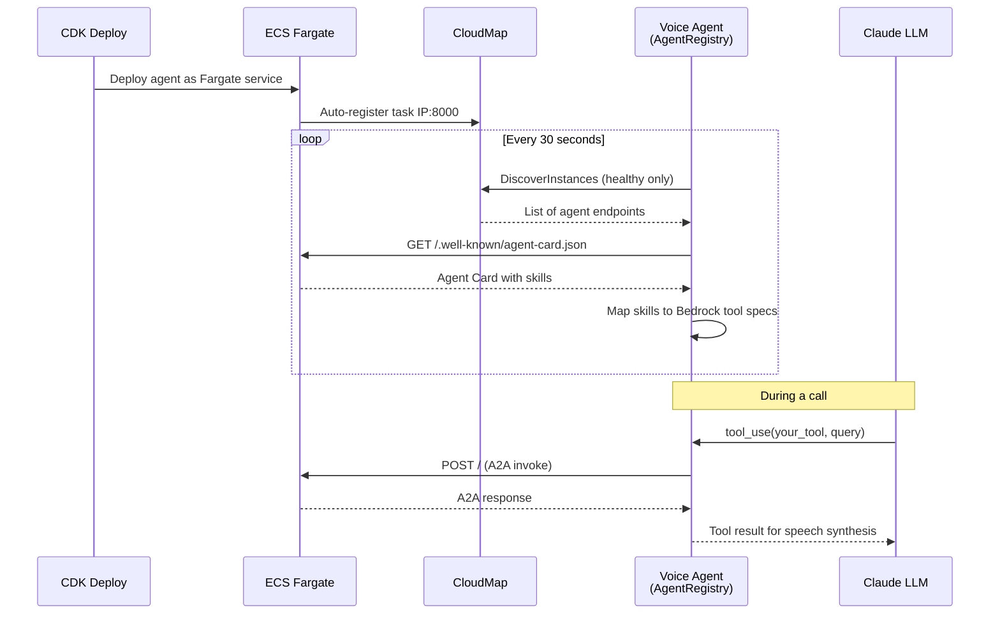
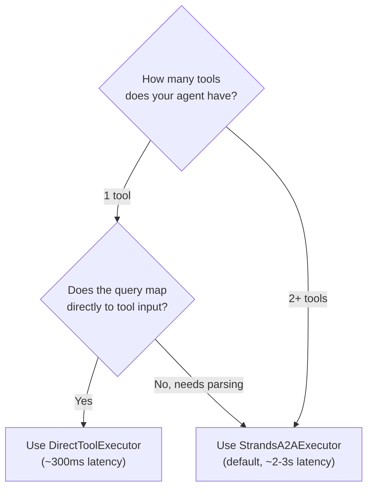

# Adding a Capability Agent

Step-by-step guide for building and deploying a new A2A capability agent in the voice agent platform.

> **Prerequisites:** ECS stack deployed (Phase 6), `enable-capability-registry` SSM flag set to `true`, Python 3.12+, Docker, CDK.
>
> **Architecture reference:** See [Capability Agent Pattern](../patterns/capability-agent-pattern.md) for the hub-and-spoke architecture and execution pattern decision matrix.

## Why ECS Fargate?

Capability agents run as ECS Fargate services rather than Lambda functions or standalone containers. This is a deliberate architectural choice:

| Concern | ECS Fargate | Lambda | Why ECS Wins |
|---------|-------------|--------|-------------|
| **Cold start** | None -- always running | 1-10s cold start per invocation | Voice calls need sub-second tool response. A cold start during a conversation is unacceptable. |
| **CloudMap integration** | Built-in. ECS auto-registers/deregisters task IPs in CloudMap on deploy, scale, and rollback. | Manual. Requires custom registration code in Lambda handler. | Zero-code service discovery. Deploy and the voice agent finds it within 30 seconds. |
| **Long-running connections** | Unlimited. Supports persistent HTTP/2, WebSocket, and keep-alive connections. | 15-minute max execution, no persistent connections. | A2A protocol uses HTTP POST per invocation, but connection pooling and warm clients reduce latency. |
| **Resource control** | Configurable CPU/memory per agent (256 CPU / 512 MB typical). | Fixed memory tiers, unpredictable CPU allocation. | Predictable performance for latency-sensitive tool calls. |
| **Strands SDK compatibility** | Strands `A2AServer` runs as a long-lived HTTP server (uvicorn). | Would require wrapping in a Lambda adapter, losing Agent Card auto-generation and health checks. | Native fit. `A2AServer` starts once, serves indefinitely, and auto-generates the Agent Card at `/.well-known/agent-card.json`. |
| **Cost at low scale** | ~$10-15/month per agent (256 CPU / 512 MB, always on). | Pay-per-invocation, cheaper at very low call volumes. | Acceptable for a production voice platform. The always-on cost is offset by consistent latency. |

**When Lambda might be better:** If you have a capability that is called very infrequently (less than a few times per day) and latency is not critical, Lambda could be cheaper. However, the current architecture does not support Lambda-based agents -- CloudMap discovery expects always-available HTTP endpoints.

## How Auto-Discovery Works

When you deploy a new capability agent, the voice agent discovers it automatically -- no code changes required in the voice agent.



**Key design points:**

- **Local tools take precedence:** If a local tool name conflicts with an A2A skill ID, the local tool wins and the A2A skill is skipped (logged as "shadowed").
- **Single `query` parameter:** All A2A tool specs use `query: str` because Agent Card skills don't include input schemas. The remote agent handles parameter extraction internally.
- **Response caching:** Successful A2A responses are cached per tool handler (TTL: `A2A_CACHE_TTL_SECONDS`, default 60s).

## Choose Your Execution Pattern

Before writing code, decide which execution pattern fits your agent:

| Criteria | DirectToolExecutor | StrandsA2AExecutor (default) |
|----------|-------------------|------------------------------|
| Number of tools | Exactly 1 | 2 or more |
| Needs LLM reasoning to route between tools | No | Yes |
| Typical latency | ~323ms | ~2,742ms |
| Example | KB agent (`search_knowledge_base`) | CRM agent (5 tools) |



**DirectToolExecutor** bypasses the inner Strands LLM call entirely, achieving an 88% latency reduction. Use this when the voice agent's LLM already made the tool selection and your agent just needs to execute.

**StrandsA2AExecutor** (the default) uses the Strands LLM inside the agent to reason about which tool to call. Required when the agent needs to chain tools or interpret complex queries.

## Step 1: Create the Agent Directory

```bash
mkdir -p backend/agents/my-agent/
```

Your agent needs these files:

```
backend/agents/my-agent/
  main.py               # Agent application
  requirements.txt      # Python dependencies
  requirements-test.txt # Test dependencies
  Dockerfile            # Container image
  tests/
    __init__.py
    test_my_agent.py    # Unit tests
```

## Step 2: Write the Agent Application

The template below is derived from the shipped KB and CRM agents. Every section marked `# REQUIRED` must be included.

```python
#!/usr/bin/env python3
"""My Capability Agent.

A standalone A2A-compliant agent that provides [describe capability]
via the A2A protocol. Deployed as an independent ECS Fargate service,
discovered by the voice agent via CloudMap.

Environment variables:
    MY_CONFIG_VAR: Description (required/optional)
    AWS_REGION: AWS region (default: us-east-1)
    LLM_MODEL_ID: Bedrock model for Strands Agent
    PORT: Server port (default: 8000)
"""

import logging
import os
import time

import requests  # REQUIRED: for _get_task_private_ip()
from strands import Agent, tool
from strands.models import BedrockModel
from strands.multiagent.a2a import A2AServer

# REQUIRED: logging setup
logging.basicConfig(
    level=logging.INFO,
    format="%(asctime)s %(name)s %(levelname)s %(message)s",
)
logger = logging.getLogger("my-agent")

# Configuration from environment
AWS_REGION = os.getenv("AWS_REGION", "us-east-1")
LLM_MODEL_ID = os.getenv(
    "LLM_MODEL_ID", "us.anthropic.claude-haiku-4-5-20251001-v1:0"
)
PORT = int(os.getenv("PORT", "8000"))


# REQUIRED: ECS task IP resolution for Agent Card
def _get_task_private_ip() -> str | None:
    """Get this ECS task's private IPv4 address from the metadata endpoint.

    The Agent Card must advertise a reachable IP, not 0.0.0.0.
    Without this, other services in the VPC cannot reach the agent.
    """
    metadata_uri = os.getenv("ECS_CONTAINER_METADATA_URI_V4")
    if not metadata_uri:
        return None
    try:
        resp = requests.get(f"{metadata_uri}/task", timeout=2)
        resp.raise_for_status()
        task_meta = resp.json()
        containers = task_meta.get("Containers", [])
        for container in containers:
            networks = container.get("Networks", [])
            for network in networks:
                addrs = network.get("IPv4Addresses", [])
                if addrs:
                    return addrs[0]
    except Exception as e:
        logger.warning("Failed to get task IP from metadata: %s", e)
    return None


# --- Define your tools ---------------------------------------------------
# Each @tool function becomes a skill in the Agent Card.
# The docstring is CRITICAL -- the voice agent's LLM reads it to decide
# when to call this tool. See "Tool Description Best Practices" below.

@tool
def my_tool(query: str) -> dict:
    """[Write a clear, specific description of what this tool does and
    WHEN the LLM should use it. This docstring becomes the tool
    description in the Agent Card and directly affects tool selection
    accuracy.]

    Args:
        query: Natural language query describing what to look up/do.

    Returns:
        Dictionary with results.
    """
    logger.info("Processing query: %s", query[:100])
    start = time.monotonic()

    # ... your implementation here ...
    result = {"status": "ok", "data": "..."}

    elapsed_ms = (time.monotonic() - start) * 1000
    logger.info("Tool completed: %.1fms", elapsed_ms)
    return result


# --- Agent setup and server -----------------------------------------------

def main():
    """Start the A2A agent server."""
    # Warm-up: pre-initialize any clients to avoid first-call cold start
    # (see KB agent main.py:338-347 for example)

    model = BedrockModel(
        model_id=LLM_MODEL_ID,
        region_name=AWS_REGION,
    )

    agent = Agent(
        name="My Agent",
        description=(
            "Brief description of the agent's overall purpose. "
            "This appears in the Agent Card but is NOT used for "
            "tool selection -- only @tool docstrings matter."
        ),
        model=model,
        tools=[my_tool],  # List all @tool functions here
        callback_handler=None,
    )

    # REQUIRED: resolve reachable URL for Agent Card
    task_ip = _get_task_private_ip()
    http_url = f"http://{task_ip}:{PORT}/" if task_ip else None

    server = A2AServer(
        agent=agent,
        host="0.0.0.0",  # REQUIRED: bind all interfaces in ECS
        port=PORT,
        http_url=http_url,
        version="0.1.0",
    )

    logger.info("Starting My Agent on port %d", PORT)
    logger.info("Agent Card URL: %s", http_url or f"http://0.0.0.0:{PORT}/")
    server.serve()


if __name__ == "__main__":
    main()
```

### Single-Tool Optimization: DirectToolExecutor

If your agent has exactly **one tool**, add the `DirectToolExecutor` to bypass the inner LLM for ~88% latency reduction. This requires additional imports from the `a2a` package:

```python
import asyncio
import json

from a2a.server.agent_execution import AgentExecutor, RequestContext
from a2a.server.events import EventQueue
from a2a.server.tasks import TaskUpdater
from a2a.types import Part, TaskState, TextPart


class DirectToolExecutor(AgentExecutor):
    """Bypasses the Strands LLM, calling the tool function directly."""

    def __init__(self, tool_func):
        self._tool_func = tool_func

    async def execute(self, context: RequestContext, event_queue: EventQueue):
        updater = TaskUpdater(event_queue, context.task_id, context.context_id)
        await updater.update_status(TaskState.working)

        try:
            query = context.get_user_input()
            if not query or not query.strip():
                msg = updater.new_agent_message(
                    [Part(root=TextPart(text='{"error": "Empty query"}'))]
                )
                await updater.complete(message=msg)
                return

            result = await asyncio.to_thread(self._tool_func, query=query)
            result_text = json.dumps(result, default=str)
            msg = updater.new_agent_message([Part(root=TextPart(text=result_text))])
            await updater.complete(message=msg)

        except Exception as e:
            logger.exception("Direct tool execution failed: %s", e)
            error_text = json.dumps({"error": f"Tool execution failed: {str(e)}"})
            msg = updater.new_agent_message([Part(root=TextPart(text=error_text))])
            await updater.failed(message=msg)

    async def cancel(self, context: RequestContext, event_queue: EventQueue):
        updater = TaskUpdater(event_queue, context.task_id, context.context_id)
        await updater.cancel()
```

Wire it up after creating the `A2AServer`:

```python
server = A2AServer(agent=agent, host="0.0.0.0", port=PORT, ...)

# Swap the executor: bypass the Strands LLM reasoning loop
server.request_handler.agent_executor = DirectToolExecutor(my_tool)
```

The Strands `Agent` is still needed for Agent Card auto-generation -- only the executor is replaced.

**Multi-tool agents** (like the CRM agent with 5 tools) should **not** use `DirectToolExecutor` -- they need the Strands LLM to reason about which tool to call.

## Step 3: Create requirements.txt

```
# Strands SDK with A2A protocol support (REQUIRED)
strands-agents[a2a]>=1.27.0

# HTTP client for ECS metadata endpoint (REQUIRED for _get_task_private_ip)
requests>=2.31.0

# AWS SDK (if your agent calls AWS services)
boto3>=1.34.0

# Add your agent-specific dependencies here
```

The `[a2a]` extra is required -- it pulls in the A2A SDK and `A2AServer`.

## Step 4: Create the Dockerfile

```dockerfile
FROM python:3.12-slim

ENV PYTHONDONTWRITEBYTECODE=1 \
    PYTHONUNBUFFERED=1 \
    PIP_NO_CACHE_DIR=1 \
    PIP_DISABLE_PIP_VERSION_CHECK=1

# curl is REQUIRED for the health check
RUN apt-get update && apt-get install -y --no-install-recommends \
    curl \
    && rm -rf /var/lib/apt/lists/*

# Non-root user (security best practice)
RUN useradd --create-home --shell /bin/bash appuser

WORKDIR /app

COPY requirements.txt .
RUN pip install --no-cache-dir -r requirements.txt

COPY . .

RUN chown -R appuser:appuser /app
USER appuser

EXPOSE 8000

# Health check hits the Agent Card endpoint.
# Strands A2AServer does NOT expose a /health route.
# CloudMap uses this to determine instance health.
HEALTHCHECK --interval=30s --timeout=5s --start-period=30s --retries=3 \
    CMD curl -f http://localhost:8000/.well-known/agent-card.json || exit 1

CMD ["python", "main.py"]
```

**Critical:** The `HEALTHCHECK` must target `/.well-known/agent-card.json` because:
1. Strands `A2AServer` does not expose a `/health` route.
2. This endpoint validates that the A2A protocol layer is fully initialized.
3. CloudMap marks the instance as unhealthy (and the voice agent skips it) if this fails.

## Step 5: Create the CDK Stack

Create `infrastructure/src/stacks/my-agent-stack.ts`. This follows the exact pattern used by both the KB and CRM agent stacks:

```typescript
import * as cdk from 'aws-cdk-lib';
import * as ecs from 'aws-cdk-lib/aws-ecs';
import * as iam from 'aws-cdk-lib/aws-iam';
import * as ec2 from 'aws-cdk-lib/aws-ec2';
import * as ssm from 'aws-cdk-lib/aws-ssm';
import * as ecr_assets from 'aws-cdk-lib/aws-ecr-assets';
import * as servicediscovery from 'aws-cdk-lib/aws-servicediscovery';
import * as path from 'path';
import { Construct } from 'constructs';
import { VoiceAgentConfig } from '../config';
import { SSM_PARAMS } from '../ssm-parameters';
import { CapabilityAgentConstruct } from '../constructs';

export interface MyAgentStackProps extends cdk.StackProps {
  readonly config: VoiceAgentConfig;
}

export class MyAgentStack extends cdk.Stack {
  constructor(scope: Construct, id: string, props: MyAgentStackProps) {
    super(scope, id, props);

    const { config } = props;
    const resourcePrefix = `${config.projectName}-${config.environment}`;

    // ── Import cross-stack dependencies from SSM ──────────────────
    //
    // VPC uses valueFromLookup (synth-time) for Vpc.fromLookup().
    // Everything else uses valueForStringParameter (deploy-time)
    // to avoid stale values when the producing stack replaces resources.
    const vpcId = ssm.StringParameter.valueFromLookup(
      this, SSM_PARAMS.VPC_ID
    );
    const voiceAgentSgId = ssm.StringParameter.valueForStringParameter(
      this, SSM_PARAMS.ECS_TASK_SG_ID
    );
    const namespaceId = ssm.StringParameter.valueForStringParameter(
      this, SSM_PARAMS.A2A_NAMESPACE_ID
    );
    const namespaceName = ssm.StringParameter.valueForStringParameter(
      this, SSM_PARAMS.A2A_NAMESPACE_NAME
    );
    const ecsClusterArn = ssm.StringParameter.valueForStringParameter(
      this, SSM_PARAMS.ECS_CLUSTER_ARN
    );

    // ── Import resources ──────────────────────────────────────────
    const vpc = ec2.Vpc.fromLookup(this, 'ImportedVpc', { vpcId });

    const voiceAgentSg = ec2.SecurityGroup.fromSecurityGroupId(
      this, 'VoiceAgentSG', voiceAgentSgId
    );

    const namespace = servicediscovery.HttpNamespace
      .fromHttpNamespaceAttributes(this, 'ImportedNamespace', {
        namespaceId,
        namespaceName,
        namespaceArn: `arn:aws:servicediscovery:${this.region}:${this.account}:namespace/${namespaceId}`,
      });

    const cluster = ecs.Cluster.fromClusterAttributes(
      this, 'ImportedCluster', {
        clusterName: `${resourcePrefix}-voice-agent`,
        clusterArn: ecsClusterArn,
        vpc,
        securityGroups: [],
      }
    );

    // ── Build Docker image ────────────────────────────────────────
    const containerImage = new ecr_assets.DockerImageAsset(
      this, 'MyAgentImage', {
        directory: path.join(
          __dirname, '..', '..', '..', 'backend', 'agents', 'my-agent'
        ),
        platform: ecr_assets.Platform.LINUX_AMD64,
      }
    );

    // ── Deploy with CapabilityAgentConstruct ──────────────────────
    const myAgent = new CapabilityAgentConstruct(this, 'MyAgent', {
      agentName: 'my-agent',           // CloudMap service name
      environment: config.environment,
      projectName: config.projectName,
      cluster,
      vpc,
      namespace,
      voiceAgentSecurityGroup: voiceAgentSg,
      containerImage: ecs.ContainerImage.fromDockerImageAsset(containerImage),
      cpu: 256,                        // 0.25 vCPU (sufficient for most agents)
      memoryLimitMiB: 512,             // 512 MB
      containerPort: 8000,
      enableBedrockAccess: true,       // Set false if agent doesn't call Bedrock
      environment_vars: {
        // Agent-specific config -- add your env vars here
        MY_CONFIG_VAR: 'value',
      },
      additionalPolicies: [
        // Add IAM policies for any AWS services your agent calls.
        // Example: DynamoDB access
        // new iam.PolicyStatement({
        //   actions: ['dynamodb:GetItem', 'dynamodb:Query'],
        //   resources: ['arn:aws:dynamodb:...'],
        // }),
      ],
    });

    // REQUIRED: Grant ECR pull to the execution role
    containerImage.repository.grantPull(
      myAgent.taskDefinition.executionRole!
    );
  }
}
```

### What CapabilityAgentConstruct Creates

The construct (`infrastructure/src/constructs/capability-agent-construct.ts`) handles all boilerplate:

| Resource | Details |
|----------|---------|
| **Security group** | Allows inbound TCP 8000 from voice agent SG only |
| **CloudWatch log group** | `/ecs/{prefix}-{agentName}-agent`, 2-week retention |
| **IAM task role** | Bedrock model invocation (if enabled) + your additional policies |
| **IAM execution role** | ECR pull + CloudWatch Logs |
| **Fargate task definition** | x86_64 Linux, configurable CPU/memory |
| **CloudMap service** | Registered in the shared HTTP namespace |
| **ECS Fargate service** | Private subnets, circuit breaker with rollback, no public IP |

### Available SSM Parameters

Agent stacks import cross-stack dependencies via SSM. These are the parameters available for agent stacks:

| SSM Parameter | SSM Path | Used For |
|---------------|----------|----------|
| `VPC_ID` | `/voice-agent/network/vpc-id` | VPC lookup (`valueFromLookup`) |
| `ECS_TASK_SG_ID` | `/voice-agent/ecs/task-sg-id` | Voice agent security group (for ingress rules) |
| `A2A_NAMESPACE_ID` | `/voice-agent/a2a/namespace-id` | CloudMap HTTP namespace |
| `A2A_NAMESPACE_NAME` | `/voice-agent/a2a/namespace-name` | CloudMap HTTP namespace |
| `ECS_CLUSTER_ARN` | `/voice-agent/ecs/cluster-arn` | Shared ECS cluster |
| `KNOWLEDGE_BASE_ID` | `/voice-agent/knowledge-base/id` | Bedrock KB ID (KB agent only) |
| `CRM_API_URL` | `/voice-agent/crm/api-url` | CRM REST API URL (CRM agent only) |

## Step 6: Register the Stack

**6a.** Export from `infrastructure/src/stacks/index.ts`:

```typescript
export { MyAgentStack, MyAgentStackProps } from './my-agent-stack';
```

**6b.** Import and instantiate in `infrastructure/src/main.ts`:

```typescript
import { MyAgentStack } from './stacks';

// Phase 11: My Agent Stack
const myAgentStack = new MyAgentStack(app, 'VoiceAgentMyAgent', {
  env,
  config,
  description: 'Voice Agent POC - My Capability Agent',
  tags: {
    Project: config.projectName,
    Environment: config.environment,
    Phase: '11',
  },
});
myAgentStack.addDependency(ecsStack);  // Always depends on ECS stack
// Add other dependencies as needed:
// myAgentStack.addDependency(someBackendStack);
```

Current phase numbering: KB agent is Phase 9, CRM agent is Phase 10. Use the next available phase number.

## Step 7: Write Tests

Create `backend/agents/my-agent/requirements-test.txt`:

```
-r requirements.txt
pytest>=8.0.0
pytest-asyncio>=0.23.0  # if using DirectToolExecutor or async tests
requests-mock>=1.11.0   # if the agent makes HTTP calls to external APIs
```

Create `backend/agents/my-agent/tests/__init__.py` (empty) and `backend/agents/my-agent/tests/test_my_agent.py`.

Follow the patterns established by the existing agent tests:

| Test File | What it Tests | Key Techniques |
|-----------|--------------|----------------|
| `crm-agent/tests/test_crm_client.py` | `CRMClient` HTTP interactions | `requests-mock` for HTTP stubbing, error code assertions |
| `crm-agent/tests/test_tools.py` | `@tool` functions in isolation | Patch `_crm_client` global, mock `CRMClient` spec |
| `knowledge-base-agent/tests/test_knowledge_base.py` | `search_knowledge_base` + `DirectToolExecutor` | Patch `_bedrock_client`, `pytest-asyncio` for executor |

Key patterns:
- **Patch env vars before importing `main.py`** -- it reads env vars at module level
- **Mock external service clients** (boto3, HTTP) -- never call real services in unit tests
- **Test input validation** -- empty/whitespace inputs, invalid enum values
- **Test error handling** -- service errors, network errors, unconfigured state
- **Test happy path** with realistic mocked responses
- For `DirectToolExecutor` tests, use `@pytest.mark.asyncio`

Run tests:

```bash
cd backend/agents/my-agent && pip install -r requirements-test.txt && pytest tests/ -v
```

## Step 8: Deploy

```bash
# Ensure the capability registry feature flag is enabled
aws ssm put-parameter \
  --name "/voice-agent/config/enable-capability-registry" \
  --value "true" \
  --type String \
  --overwrite \
  --profile voice-agent

# Deploy your agent stack
npx cdk deploy VoiceAgentMyAgent --profile voice-agent
```

## Step 9: Verify

After deployment, the voice agent discovers your agent within 30 seconds (the default polling interval). Check the voice agent logs for:

```
agent_registry_agent_discovered  agent_name=My Agent  url=http://10.0.x.x:8000/  skills=['my_tool']
agent_registry_skills_added  skills=['my_tool']
```

Verify the Agent Card directly (from within the VPC, e.g., via ECS exec):

```bash
curl http://<agent-task-ip>:8000/.well-known/agent-card.json | jq .
```

Verify in CloudMap:

```bash
aws servicediscovery list-instances \
  --service-id $(aws servicediscovery list-services \
    --filters Name=NAMESPACE_ID,Values=<namespace-id> \
    --query 'Services[?Name==`my-agent`].Id' --output text) \
  --query 'Instances[*].Attributes' \
  --profile voice-agent
```

## Compatibility Checklist

Verify all items before deploying:

- [ ] **Port 8000**: Agent listens on port 8000 (or matches `containerPort` in CDK)
- [ ] **`/.well-known/agent-card.json`**: Responds to GET requests (automatic with `A2AServer`)
- [ ] **`POST /`**: Accepts A2A task requests (automatic with `A2AServer`)
- [ ] **`_get_task_private_ip()`**: Agent Card advertises ECS task's private IP, not `0.0.0.0`
- [ ] **`@tool` docstrings**: Every tool has a clear, detailed docstring (the LLM reads these)
- [ ] **Tool names are unique**: No collision with existing tools (see list below)
- [ ] **Tools return `dict`**: JSON-serializable return values
- [ ] **Dockerfile health check**: `curl -f http://localhost:8000/.well-known/agent-card.json`
- [ ] **Dockerfile includes `curl`**: Required for the health check
- [ ] **Non-root user**: Container runs as `appuser`
- [ ] **`requests` in requirements**: Required for `_get_task_private_ip()`
- [ ] **`strands-agents[a2a]>=1.27.0`**: The `[a2a]` extra is required for `A2AServer`
- [ ] **CDK grants ECR pull**: `containerImage.repository.grantPull(agent.taskDefinition.executionRole!)`
- [ ] **CDK stack depends on `ecsStack`**: CloudMap namespace and ECS cluster must exist first

### Existing Tool Names (avoid conflicts)

These tool names are already registered. Using the same name will cause your A2A skill to be shadowed by the local tool:

| Tool | Agent | Type | Requires |
|------|-------|------|----------|
| `search_knowledge_base` | KB Agent | A2A | — |
| `lookup_customer` | CRM Agent | A2A | — |
| `create_support_case` | CRM Agent | A2A | — |
| `add_case_note` | CRM Agent | A2A | — |
| `verify_account_number` | CRM Agent | A2A | — |
| `verify_recent_transaction` | CRM Agent | A2A | — |
| `transfer_to_agent` | Voice Agent | Local | `TRANSPORT`, `SIP_SESSION`, `TRANSFER_DESTINATION` |
| `get_current_time` | Voice Agent | Local | `BASIC` |

> **Note:** Local tools are defined in `app/tools/builtin/catalog.py` and declare their pipeline capability requirements via a `requires` field. The pipeline only registers local tools whose requirements are satisfied by the detected capabilities. See [AGENTS.md](../../AGENTS.md) for the full capability list and tool catalog details.

## Tool Description Best Practices

The `@tool` docstring is the **only** information the voice agent's LLM has about your tool. The agent-level `description` in the `Agent()` constructor is NOT used for tool selection.

### Good docstring

```python
@tool
def search_knowledge_base(query: str, max_results: int = 3) -> dict:
    """Search the knowledge base for information about products, policies,
    procedures, or other documentation. Use this when the user asks questions
    that might be answered by company documentation, FAQs, or reference
    materials. Always cite the source when presenting information.

    Args:
        query: Natural language search query. Be specific for better results.
        max_results: Maximum results to return (1-5, default 3).
    """
```

Why it works:
- States **what** the tool does ("Search the knowledge base for information about...")
- States **when** to use it ("Use this when the user asks questions that might be answered by...")
- States **what domains** it covers ("products, policies, procedures, or other documentation")
- Gives the LLM an instruction ("Always cite the source")

### Bad docstring

```python
@tool
def search_kb(q: str) -> dict:
    """Search KB."""
```

Why it fails:
- Too vague -- the LLM can't distinguish this from other search tools
- No guidance on when to use it
- Unclear parameter name (`q` vs. `query`)

## Troubleshooting

| Symptom | Cause | Fix |
|---------|-------|-----|
| Agent not discovered | Feature flag disabled | Set `/voice-agent/config/enable-capability-registry` to `true` in SSM |
| Agent not discovered | Health check failing | Check container logs; ensure `curl` is installed and port 8000 is serving |
| Agent Card fetch fails | Wrong IP in Agent Card | Verify `_get_task_private_ip()` is implemented and `ECS_CONTAINER_METADATA_URI_V4` is available |
| Tool not appearing | Skill name conflicts with local tool | Rename your `@tool` function -- local tools shadow A2A tools with the same name |
| Tool calls timeout | Agent takes >30s to respond | Optimize your tool; check `/voice-agent/a2a/tool-timeout-seconds` SSM param |
| "Connection refused" | Security group misconfigured | Verify `CapabilityAgentConstruct` has the correct `voiceAgentSecurityGroup` reference |
| Multiple agents, same skill | Duplicate skill IDs across agents | Use unique function names for `@tool` decorators; duplicates are logged as warnings |
| First call is slow | Cold start (boto3, Strands LLM init) | Add warm-up in `main()` -- pre-init clients, optionally probe agent (see KB agent `main.py:338-347`) |

## Reference Implementations

| Agent | Pattern | Tools | Source | Tests |
|-------|---------|-------|--------|-------|
| Knowledge Base | DirectToolExecutor (single-tool, ~323ms) | `search_knowledge_base` | `backend/agents/knowledge-base-agent/main.py` | `tests/test_knowledge_base.py` |
| CRM | StrandsA2AExecutor (multi-tool, ~2,742ms) | 5 tools | `backend/agents/crm-agent/main.py` | `tests/test_crm_client.py`, `tests/test_tools.py` |

## Related Documentation

- [Capability Agent Pattern](../patterns/capability-agent-pattern.md) -- Architecture decisions, execution patterns, latency optimization
- [AGENTS.md](../../AGENTS.md) -- Environment variables, CloudWatch metrics, SSM configuration
