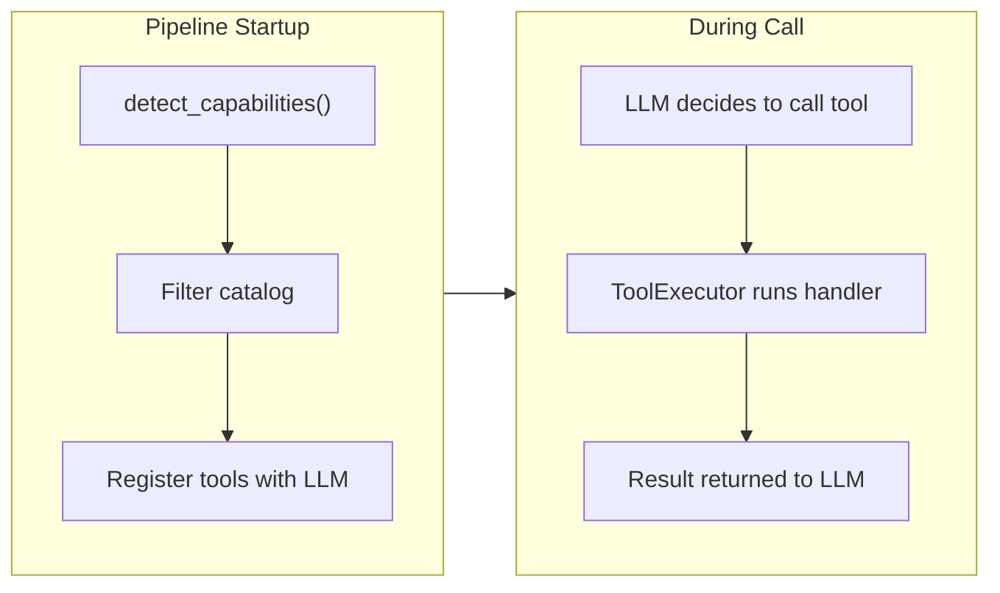

# Adding a Local Tool

This guide walks through adding a new local tool to the voice agent pipeline. Local tools run **inside the voice agent container** and may access pipeline internals (transport, SIP session, etc.). For remote tools that run as separate services, see [Adding a Capability Agent](./adding-a-capability-agent.md).

## How It Works



At pipeline startup:

1. `detect_capabilities()` probes the runtime environment (transport, SIP session, env vars)
2. `_register_tools()` iterates `ALL_LOCAL_TOOLS` from `catalog.py`
3. For each tool, it checks `tool.requires <= available_capabilities`
4. Only tools whose requirements are satisfied get registered with the LLM
5. The SSM parameter `/voice-agent/config/disabled-tools` can explicitly exclude tools

During a call, the LLM sees only the registered tools and can invoke them as function calls.

## When to Use a Local Tool vs. Capability Agent

| Criteria | Local Tool | Capability Agent (A2A) |
|----------|-----------|----------------------|
| Needs transport/SIP access | Yes | No |
| Latency requirement | <10ms | ~300-3000ms |
| Scales independently | No | Yes |
| Has its own dependencies | No | Yes |
| Example | `get_current_time`, `transfer_to_agent` | `search_knowledge_base`, `lookup_customer` |

**Rule of thumb:** If the tool needs pipeline internals (transport, SIP, DTMF), make it local. If it just calls backend services (databases, APIs, Bedrock), make it a capability agent.

## Step-by-Step

### Step 1: Create the Tool File

Create a new file at `backend/voice-agent/app/tools/builtin/<name>_tool.py`.

Every tool file needs:
- An async executor function
- A `ToolDefinition` instance with `requires` capabilities

Here's a minimal example:

```python
"""Description of what this tool does.

Capability requirements:
    - BASIC: No special requirements (runs in any pipeline)
"""

from typing import Any, Dict

from ..capabilities import PipelineCapability
from ..context import ToolContext
from ..result import ToolResult, success_result, error_result
from ..schema import ToolCategory, ToolDefinition, ToolParameter


async def my_tool_executor(
    arguments: Dict[str, Any],
    context: ToolContext,
) -> ToolResult:
    """Execute the tool logic.

    Args:
        arguments: Dict of validated parameters from the LLM
        context: ToolContext with call_id, session_id, transport, etc.

    Returns:
        ToolResult via success_result() or error_result()
    """
    name = arguments.get("name", "world")

    return success_result(
        {
            "greeting": f"Hello, {name}!",
        }
    )


my_tool = ToolDefinition(
    name="my_tool_name",           # Unique, snake_case -- the LLM sees this
    description=(
        "One-sentence description of what this tool does and when to use it. "
        "Be specific -- the LLM uses this to decide when to call the tool."
    ),
    category=ToolCategory.SYSTEM,  # See ToolCategory enum for options
    parameters=[
        ToolParameter(
            name="name",
            type="string",
            description="The name to greet",
            required=False,
        ),
    ],
    executor=my_tool_executor,
    timeout_seconds=5.0,
    requires=frozenset({PipelineCapability.BASIC}),
)
```

### Step 2: Choose the Right Capabilities

Declare the minimum set of capabilities your tool needs in the `requires` field:

| Capability | When to Use | Detected When |
|------------|------------|---------------|
| `BASIC` | Tool has no special requirements | Always available |
| `TRANSPORT` | Tool needs the DailyTransport object | Transport is present |
| `SIP_SESSION` | Tool needs a SIP dial-in connection | SIP tracker is present |
| `DTMF_COLLECTION` | Tool collects DTMF tone input | Transport has `collect_dtmf` |
| `RECORDING_CONTROL` | Tool pauses/resumes recording | Transport has `pause_recording` |
| `TRANSFER_DESTINATION` | Tool transfers calls via SIP REFER | `TRANSFER_DESTINATION` env var set |

Examples:
- `get_current_time`: `requires=frozenset({PipelineCapability.BASIC})`
- `hangup_call`: `requires=frozenset({PipelineCapability.TRANSPORT})`
- `transfer_to_agent`: `requires=frozenset({PipelineCapability.TRANSPORT, PipelineCapability.SIP_SESSION, PipelineCapability.TRANSFER_DESTINATION})`

If your tool needs a capability not yet in `PipelineCapability`, add a new enum member in `app/tools/capabilities.py` and update `detect_capabilities()` to probe for it.

### Step 3: Add to the Catalog

Import your tool and add it to `ALL_LOCAL_TOOLS` in `backend/voice-agent/app/tools/builtin/catalog.py`:

```python
from .my_tool import my_tool

ALL_LOCAL_TOOLS: List[ToolDefinition] = [
    time_tool,
    transfer_tool,
    hangup_tool,
    my_tool,       # <-- add here
]
```

That's it. No pipeline code changes needed. The capability system handles registration automatically.

### Step 4: Write Tests

Create `backend/voice-agent/tests/test_my_tool.py`:

```python
"""Tests for my_tool."""

import pytest
from app.tools.builtin.my_tool import my_tool, my_tool_executor
from app.tools.capabilities import PipelineCapability
from app.tools.context import ToolContext
from app.tools.result import ToolResult


class TestMyToolDefinition:
    """Test tool definition and capabilities."""

    def test_tool_name(self):
        assert my_tool.name == "my_tool_name"

    def test_requires_basic(self):
        assert my_tool.requires == frozenset({PipelineCapability.BASIC})

    def test_registered_in_catalog(self):
        from app.tools.builtin.catalog import ALL_LOCAL_TOOLS
        assert my_tool in ALL_LOCAL_TOOLS


class TestMyToolExecutor:
    """Test tool execution logic."""

    @pytest.fixture
    def context(self):
        return ToolContext(
            call_id="test-call",
            session_id="test-session",
        )

    @pytest.mark.asyncio
    async def test_basic_execution(self, context):
        result = await my_tool_executor({"name": "Alice"}, context)
        assert result.success is True
        assert result.data["greeting"] == "Hello, Alice!"

    @pytest.mark.asyncio
    async def test_default_parameter(self, context):
        result = await my_tool_executor({}, context)
        assert result.success is True
        assert result.data["greeting"] == "Hello, world!"
```

Run tests:
```bash
cd backend/voice-agent && .venv/bin/python -m pytest tests/test_my_tool.py -v
```

### Step 5: Deploy

No CDK changes needed for local tools. Just redeploy the voice agent:

```bash
cd infrastructure && bash deploy.sh deploy-stack VoiceAgentEcs
```

### Step 6: Verify in CloudWatch

After making a test call, check the logs for:

```json
{"capabilities": ["basic", "..."], "event": "pipeline_capabilities_detected"}
{"tool_name": "my_tool_name", "event": "tool_registered_with_llm"}
{"tool_count": 3, "tools": ["get_current_time", "transfer_to_agent", "my_tool_name"], "event": "tools_registration_complete"}
```

## Key Files Reference

| File | Purpose |
|------|---------|
| `app/tools/builtin/catalog.py` | Single source of truth -- `ALL_LOCAL_TOOLS` list |
| `app/tools/capabilities.py` | `PipelineCapability` enum and `detect_capabilities()` |
| `app/tools/schema.py` | `ToolDefinition`, `ToolParameter`, `ToolCategory` |
| `app/tools/context.py` | `ToolContext` -- execution context with call_id, transport, queue_frame, etc. |
| `app/tools/result.py` | `ToolResult`, `success_result()`, `error_result()` |
| `app/pipeline_ecs.py` | `_register_tools()` -- the registration logic |

## Existing Tool Names

These names are already taken. Your tool name must not conflict:

| Name | Source | Requires |
|------|--------|----------|
| `get_current_time` | Local | `{BASIC}` |
| `hangup_call` | Local | `{TRANSPORT}` |
| `transfer_to_agent` | Local | `{TRANSPORT, SIP_SESSION, TRANSFER_DESTINATION}` |
| `search_knowledge_base` | A2A (KB agent) | -- |
| `lookup_customer` | A2A (CRM agent) | -- |
| `create_support_case` | A2A (CRM agent) | -- |
| `add_case_note` | A2A (CRM agent) | -- |
| `verify_account_number` | A2A (CRM agent) | -- |
| `verify_recent_transaction` | A2A (CRM agent) | -- |

## Disabling Tools

To disable a tool without removing it from the catalog, add its name to the SSM parameter:

```bash
aws ssm put-parameter \
  --name "/voice-agent/config/disabled-tools" \
  --value "my_tool_name,transfer_to_agent" \
  --type String --overwrite
```

The tool will be skipped during registration and logged as `tool_skipped_disabled`.

## Real-World Examples

### Simple tool (no special requirements)

See `app/tools/builtin/time_tool.py` -- 68 lines, requires only `BASIC`.

### Pipeline-control tool (transport + queue_frame)

See `app/tools/builtin/hangup_tool.py` -- requires `TRANSPORT`. Demonstrates:
- Using `context.queue_frame(EndFrame())` to end a call
- Graceful error handling when `queue_frame` is not wired
- Careful LLM-facing description to prevent premature hangups

### Complex tool (multiple capabilities)

See `app/tools/builtin/transfer_tool.py` -- 217 lines, requires `TRANSPORT + SIP_SESSION + TRANSFER_DESTINATION`. Demonstrates:
- Accessing `context.transport` for SIP REFER
- Accessing `context.sip_session_id` for session tracking
- Reading `TRANSFER_DESTINATION` env var (guaranteed present by capabilities)
- Error handling with `error_result()`
- Conversation summary extraction from `context.conversation_history`
