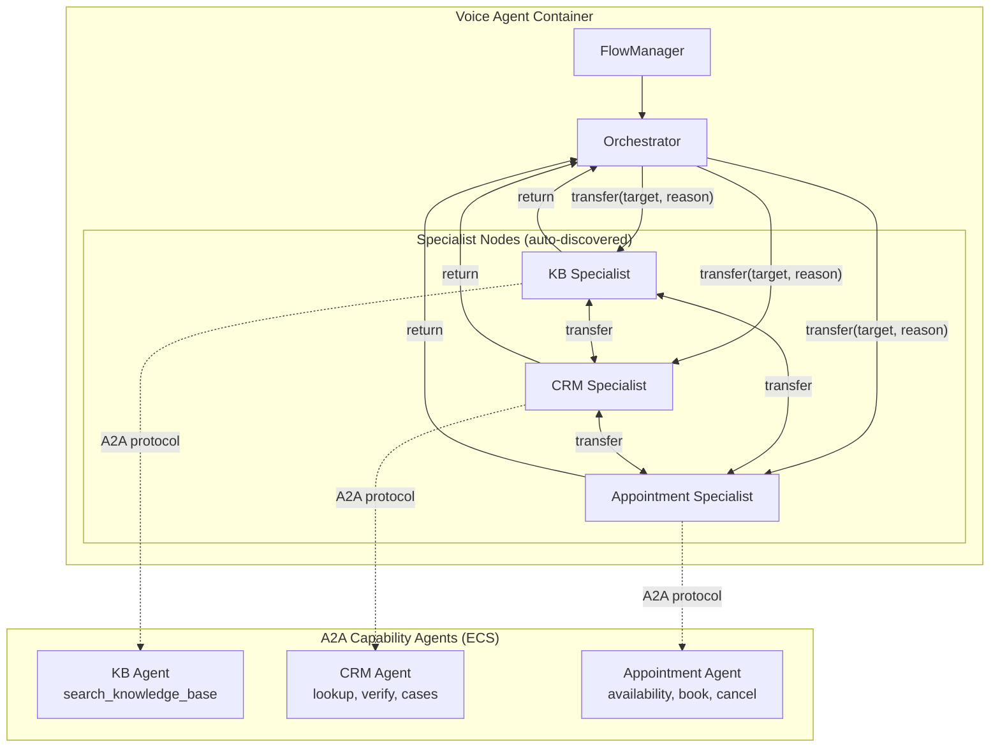
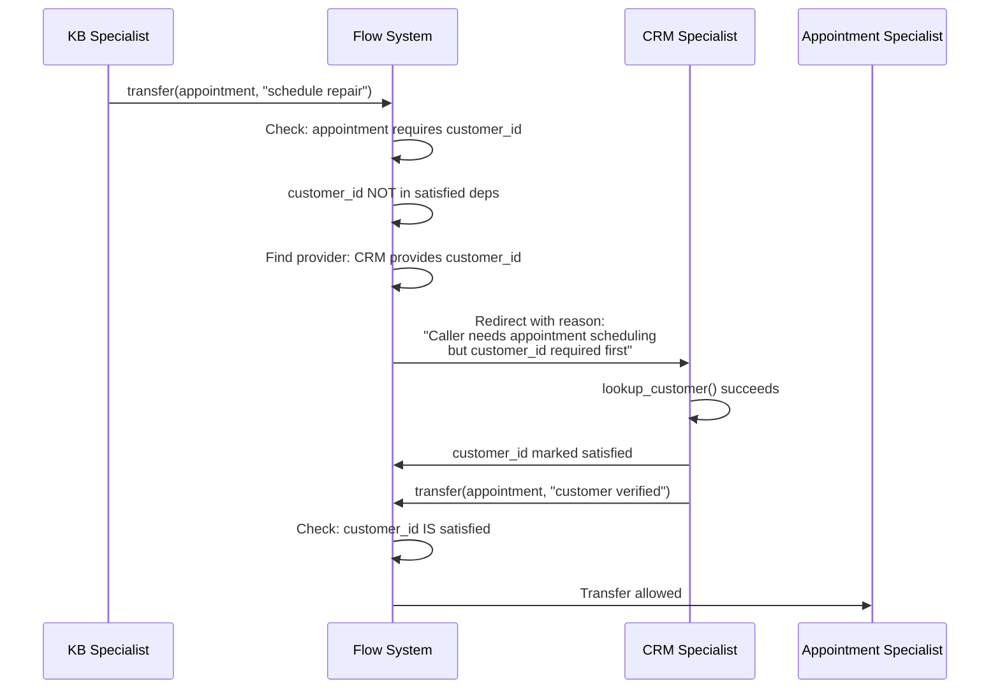

# Multi-Agent Flows Guide

Operator guide for the multi-agent in-process handoff system. This guide covers how the system works, how to enable it, how to add new agents, troubleshooting, and rollback.

> **Looking for deployment steps only?** See the [Deployment Guide](../../infrastructure/DEPLOYMENT.md#enable-multi-agent-flows) for the quick-start commands.

## Overview

When **Flows mode** is enabled, the voice agent uses [Pipecat Flows](https://github.com/pipecat-ai/pipecat-flows) to dynamically swap LLM context (system prompt + tools) mid-call. Instead of a single agent handling every topic, callers are routed between specialist agents -- each with a focused persona, scoped A2A tools, and a summarized conversation handoff. From the caller's perspective: same voice, no silence, deeper expertise.

The system is **fully dynamic**. Deploying a new A2A capability agent to CloudMap automatically creates a new specialist node in the flow graph. No voice agent code changes required.

## Architecture



### How It Works

1. **Pipeline creation** (per call): The voice agent queries CloudMap for registered agents, fetches their Agent Cards, and builds a fully connected flow graph.
2. **Orchestrator node**: Greets the caller, identifies intent, routes to the appropriate specialist via `transfer(target, reason)`.
3. **Specialist nodes**: Each has the agent's card description as persona, the agent's skills as scoped A2A tools, and a generic `transfer()` function for routing to other specialists or back to the orchestrator.
4. **Context strategy**: `RESET_WITH_SUMMARY` -- on each transition, the conversation history is summarized by the LLM and injected into the new node's context. This keeps token costs bounded while preserving continuity.
5. **Return flow**: Specialists can transfer back to the orchestrator ("reception") which asks "Is there anything else I can help with?"

### Node Discovery

At pipeline startup, the flow system:

1. Iterates agents in the `AgentRegistry` cache
2. For each agent, reads the Agent Card (name, description, skills)
3. Slugifies the CloudMap service name (e.g., `knowledge-base-agent` becomes `kb-agent`)
4. Creates a specialist node with:
   - **Persona** from the card description
   - **Tools** from the card skills (wrapped as Flows-compatible functions)
   - **Peer descriptions** of other specialists (for direct specialist-to-specialist routing)
5. Registers a node factory for the `transfer()` function to look up

If no agents are discovered, the flow system falls back to the orchestrator-only mode.

## Prerequisites

| Requirement | How to Check |
|-------------|-------------|
| At least one A2A capability agent deployed | `aws servicediscovery list-services --filters Name=NAMESPACE_ID,Values=<ns-id>` |
| Capability registry enabled | `aws ssm get-parameter --name /voice-agent/config/enable-capability-registry` should be `true` |
| Tool calling enabled | `ENABLE_TOOL_CALLING` env var (default: `true`) |

## Configuration

### SSM Parameters

| Parameter | Default | Description |
|-----------|---------|-------------|
| `/voice-agent/config/enable-flow-agents` | `false` | Master switch for Flows mode |
| `/voice-agent/config/flow-max-transitions` | `10` | Loop protection threshold per call |
| `/voice-agent/config/enable-capability-registry` | `false` | Must be `true` for Flows to work |
| `/voice-agent/config/disabled-tools` | *(empty)* | Comma-separated tool names to disable globally |

### Enabling Flows

```bash
# 1. Ensure capability registry is on
aws ssm put-parameter \
  --name "/voice-agent/config/enable-capability-registry" \
  --value "true" --type String --overwrite

# 2. Enable Flows mode
aws ssm put-parameter \
  --name "/voice-agent/config/enable-flow-agents" \
  --value "true" --type String --overwrite
```

Changes take effect on the **next incoming call** -- no container restart required. Config is read from SSM at pipeline creation time.

### Disabling Flows (Rollback)

```bash
aws ssm put-parameter \
  --name "/voice-agent/config/enable-flow-agents" \
  --value "false" --type String --overwrite
```

The next call reverts to single-agent mode. In-progress Flows calls continue unaffected until they end naturally.

## Dependency Gating

Agents can declare cross-agent dependencies using skill-level tags on their Agent Cards. This prevents callers from being routed to a specialist that can't help without prerequisite data.

### Tag Format

Tags are added to `AgentSkill` definitions in each agent's `main.py`:

| Tag | Meaning | Example |
|-----|---------|---------|
| `provides:<key>` | This skill satisfies the named dependency when called successfully | `provides:customer_id` on CRM `lookup_customer` |
| `requires:<key>` | This skill needs the dependency to be satisfied before it can run | `requires:customer_id` on Appointment `book_appointment` |

### How It Works



### State Tracking

- Dependencies are tracked in `flow_manager.state["_satisfied_dependencies"]` (a `set`)
- When an A2A tool with `provides:<key>` tags completes successfully, the key is added to the set
- The set persists across transitions within the same call
- Self-gating: specialist nodes with `requires` dependencies also check conversation context as a fallback -- if the summary mentions the required data, the specialist proceeds

### Adding Dependencies to a New Agent

1. Edit the agent's `main.py` to pass explicit `skills` to `A2AServer`:

```python
from a2a.types import AgentSkill

skills = [
    AgentSkill(
        id="my_tool",
        name="My Tool",
        description="Does something useful",
        tags=["requires:customer_id"],  # Add dependency tags here
    ),
]

server = A2AServer(agent=agent, skills=skills, host="0.0.0.0", port=port, http_url=http_url)
```

2. Redeploy the agent container. The voice agent picks up the new tags on the next CloudMap poll.

## Global Functions

These tools are available in **every** node (orchestrator and all specialists):

| Function | Description |
|----------|-------------|
| `get_current_time` | Returns the current date and time |
| `hangup_call` | Ends the call with a reason |
| `transfer_to_agent` | SIP REFER transfer to a human agent (only when `TRANSFER_DESTINATION` is set) |

Global functions are passed via the `global_functions` parameter on `FlowManager` and do not count toward per-node tool limits.

## Observability

### Metrics

When Flows mode is active, these additional CloudWatch metrics are emitted to the `VoiceAgent/Pipeline` namespace:

| Metric | Unit | Dimensions | Description |
|--------|------|------------|-------------|
| `AgentTransitionCount` | Count | `Environment`, `FromNode` | Transitions initiated from each node |
| `AgentTransitionLatency` | Milliseconds | `Environment`, `ToNode` | Time to create the target node |
| `ContextSummaryLatency` | Milliseconds | `Environment`, `FromNode` | Time for RESET_WITH_SUMMARY generation |
| `TransitionLoopProtection` | Count | `Environment` | Loop protection activations |

All existing metrics (`E2ELatency`, `ToolExecutionTime`, `ToolInvocationCount`) gain an `agent_node` dimension when Flows is enabled, allowing per-specialist breakdowns.

### Structured Logs

Each transition emits an `agent_transition` structured log event:

```json
{
  "event": "agent_transition",
  "from_node": "kb-agent",
  "to_node": "crm-agent",
  "reason": "Customer needs account verification",
  "transition_count": 2,
  "latency_ms": 1.2,
  "session_id": "voice-abc123"
}
```

### CloudWatch Dashboard

Dashboard Row 11 ("Multi-Agent Flows") shows:
- Agent transition count and loop protection activations (dual-axis)
- Transition latency P50/P95/P99
- Context summary latency

### Alarms

| Alarm | Threshold | What to Do |
|-------|-----------|------------|
| Flow Transition Latency High | Avg > 500ms for 3 periods | Check LLM summary generation time. May indicate model throttling or large contexts. |
| Flow Loop Protection | >= 1 activation in 5 min | LLM is stuck in a routing loop. Review call transcripts for confused intent classification. Check if specialist personas overlap. |

### Saved Queries

Two CloudWatch Logs Insights queries are saved:
- **Agent Transitions**: Shows all transitions with from/to/reason/latency
- **Flow Conversation Trace**: Shows full call flow including turns and transitions

## Adding a New Specialist

Deploying a new A2A capability agent automatically creates a specialist node. No voice agent code changes needed.

1. Follow the [Adding a Capability Agent](adding-a-capability-agent.md) guide to create and deploy the agent
2. Ensure the capability registry is enabled
3. The voice agent discovers the new agent on its next CloudMap poll (default: 30 seconds)
4. The new agent appears as a specialist node in the flow graph

The specialist node automatically gets:
- A persona derived from the Agent Card description
- Scoped tools from the Agent Card skills
- A `transfer()` function for routing to other specialists or the orchestrator
- Descriptions of peer specialists for direct routing
- `RESET_WITH_SUMMARY` context strategy with a domain-aware prompt

## Troubleshooting

### Flows enabled but calls use single-agent mode

**Check prerequisites:**
```bash
# Both must be "true"
aws ssm get-parameter --name "/voice-agent/config/enable-capability-registry" \
  --query 'Parameter.Value' --output text
aws ssm get-parameter --name "/voice-agent/config/enable-flow-agents" \
  --query 'Parameter.Value' --output text
```

**Check agent discovery in logs:**
```bash
aws logs filter-log-events \
  --log-group-name /ecs/voice-agent-poc-poc-voice-agent \
  --filter-pattern "flow_agents_enabled"
```

If `flow_agents_enabled` is `false` in the log, the SSM parameter hasn't propagated yet. It takes effect on the next call.

### LLM routes to wrong specialist

- Review the Agent Card descriptions -- the LLM uses these to decide routing. Ensure descriptions are distinct and unambiguous.
- Check the orchestrator's task message in logs -- it includes dynamic `agent_descriptions` from discovered agents.
- Consider adjusting the agent's card description to be more specific about its domain.

### Transitions feel slow

- Check `AgentTransitionLatency` in CloudWatch. The metric measures node factory creation time, which should be < 5ms.
- Check `ContextSummaryLatency` -- this is the dominant cost. Summary generation is an LLM call (~200-500ms). If consistently > 500ms, check for model throttling or very long conversations.
- The TTS phrase "One moment please." plays during the transition to mask latency.

### Loop protection activates frequently

- Default threshold is 10 transitions per call, configurable via `/voice-agent/config/flow-max-transitions`
- If the LLM is genuinely routing callers through many agents, increase the threshold
- If the LLM is stuck bouncing between two agents, check for overlapping tool descriptions or ambiguous agent personas
- Review call transcripts with the "Flow Conversation Trace" saved query

### Dependency gating redirects unexpectedly

- Verify which skills have `provides:` and `requires:` tags: check each agent's `main.py`
- Check `flow_manager.state["_satisfied_dependencies"]` -- the `agent_transition` log shows which deps are satisfied
- If a specialist should be self-sufficient, remove the `requires:` tags from its skills

## Context Strategy Details

### RESET_WITH_SUMMARY

On each transition, the conversation history is replaced with a one-paragraph summary. This:
- Keeps token costs bounded (no unbounded context growth)
- Provides enough context for the new specialist to continue naturally
- Falls back to `APPEND` (full history carry-over) if summary generation fails

### Domain-Aware Summary Prompts

Summary prompts are tailored to the **destination** agent. When transitioning from KB to Appointment, the prompt says:

> "You are about to hand the conversation to a specialist: [Appointment agent description]. Summarize what was discussed, including key identifiers, decisions made, and any relevant context for the destination agent."

This ensures the summary includes data relevant to the next agent (e.g., customer IDs for the appointment scheduler).

### Orchestrator Continuation

When returning to the orchestrator from a specialist, the context includes a continuation instruction so the orchestrator doesn't re-greet the caller. Instead it picks up with "Is there anything else I can help with?"

## Related Documentation

- [Deployment Guide](../../infrastructure/DEPLOYMENT.md) -- Deployment steps for all components
- [Adding a Capability Agent](adding-a-capability-agent.md) -- Step-by-step guide for creating new agents
- [Capability Agent Pattern](../patterns/capability-agent-pattern.md) -- Architecture reference for execution patterns
- [Call Scenarios](../reference/call-scenarios.md) -- Representative test call scripts
- [AGENTS.md](../../AGENTS.md) -- Environment variables, metrics, and alarms reference
