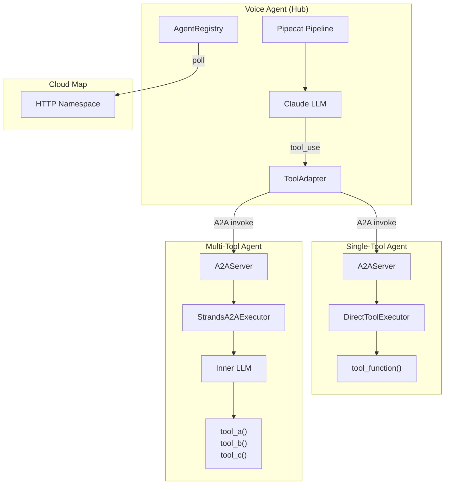
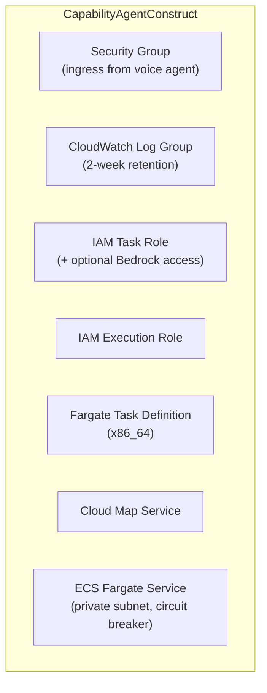

# Capability Agent Pattern

Architecture reference for A2A capability agents in the voice agent system.

> **Looking for a step-by-step walkthrough?** See [Adding a Capability Agent](../guides/adding-a-capability-agent.md) for the complete guide with code templates, Dockerfile, and CDK stack.

## Overview

The voice agent uses a **hub-and-spoke** architecture where the voice agent (hub) discovers capability agents (spokes) via AWS Cloud Map and invokes their skills as LLM tools using the [A2A (Agent-to-Agent) protocol](https://google.github.io/A2A/).



## Two Execution Patterns

Choose the right pattern based on your agent's complexity:

### Pattern 1: DirectToolExecutor (Single-Tool Agent)

**Use when:** Your agent has exactly one tool and the incoming query maps directly to the tool's input parameter.

**Example:** Knowledge Base agent -- receives a search query, calls `search_knowledge_base(query)`, returns results.

**Latency:** ~300ms (no inner LLM invocation)

```python
from a2a.server.agent_execution import AgentExecutor, RequestContext
from a2a.server.events import EventQueue
from a2a.server.tasks import TaskUpdater
from a2a.types import Part, TaskState, TextPart
import asyncio
import json

class DirectToolExecutor(AgentExecutor):
    """Bypasses the Strands LLM, calling the tool function directly."""

    def __init__(self, tool_func):
        self._tool_func = tool_func

    async def execute(self, context: RequestContext, event_queue: EventQueue) -> None:
        updater = TaskUpdater(event_queue, context.task_id, context.context_id)
        await updater.update_status(TaskState.working)

        try:
            query = context.get_user_input()
            result = await asyncio.to_thread(self._tool_func, query=query)
            result_text = json.dumps(result, default=str)
            msg = updater.new_agent_message([Part(root=TextPart(text=result_text))])
            await updater.complete(message=msg)

        except Exception as e:
            error_text = json.dumps({"error": f"Tool execution failed: {str(e)}"})
            msg = updater.new_agent_message([Part(root=TextPart(text=error_text))])
            await updater.failed(message=msg)

    async def cancel(self, context: RequestContext, event_queue: EventQueue) -> None:
        updater = TaskUpdater(event_queue, context.task_id, context.context_id)
        await updater.cancel()
```

**Wire it up:**

```python
from strands import Agent, tool
from strands.models import BedrockModel
from strands.multiagent.a2a import A2AServer

@tool
def search_knowledge_base(query: str) -> dict:
    """Search the knowledge base for relevant information."""
    # ... tool implementation ...

# Create Strands Agent (needed for Agent Card auto-generation)
agent = Agent(model=BedrockModel(...), tools=[search_knowledge_base])

# Create A2A server
server = A2AServer(agent=agent, host="0.0.0.0", port=8000)

# Swap executor: bypass LLM, call tool directly
server.request_handler.agent_executor = DirectToolExecutor(search_knowledge_base)

server.serve()
```

### Pattern 2: StrandsA2AExecutor (Multi-Tool Agent)

**Use when:** Your agent has multiple tools and needs LLM reasoning to select among them.

**Example:** CRM agent -- receives a query like "look up customer John Smith and create a support case", needs LLM to decide to call `lookup_customer` then `create_support_case`.

**Latency:** ~2-3s (includes inner LLM invocation)

```python
from strands import Agent, tool
from strands.models import BedrockModel
from strands.multiagent.a2a import A2AServer

@tool
def lookup_customer(phone_number: str) -> dict:
    """Look up customer by phone number."""
    ...

@tool
def create_support_case(customer_id: str, description: str) -> dict:
    """Create a support case for a customer."""
    ...

# Create agent with multiple tools (LLM reasoning needed)
agent = Agent(
    model=BedrockModel(
        model_id="us.anthropic.claude-haiku-4-5-20251001-v1:0",
        region_name="us-east-1",
    ),
    tools=[lookup_customer, create_support_case],
)

# Standard A2A server (uses StrandsA2AExecutor by default)
server = A2AServer(agent=agent, host="0.0.0.0", port=8000)
server.serve()
```

### Pattern 3: Local Tools (No A2A)

**Use when:** The tool needs access to the Pipecat pipeline internals (e.g., `DailyTransport` for SIP REFER) or has negligible latency.

**Examples:** `transfer_to_agent` (needs SIP transport), `get_current_time` (trivial computation).

Local tools are defined in `app/tools/builtin/catalog.py` and declare the pipeline capabilities they require via a `requires` field on `ToolDefinition`. At pipeline startup, `detect_capabilities()` probes the runtime environment (transport, SIP session, env vars) and only tools whose `requires` are satisfied get registered with the LLM. New local tools only need to be added to the catalog with appropriate `requires` -- no pipeline code changes needed.

**Decision framework:** Does your tool need `DailyTransport` or other pipeline internals? -> Local tool with capabilities. Pure backend API or business logic? -> A2A capability agent.

## Decision Matrix

| Criteria | DirectToolExecutor | StrandsA2AExecutor | Local Tool |
|----------|-------------------|-------------------|------------|
| Number of tools | 1 | 2+ | 1+ |
| Needs LLM reasoning | No | Yes | No |
| Needs pipeline access | No | No | Yes |
| Typical latency | ~300ms | ~2-3s | <10ms |
| Deployed as | Separate ECS service | Separate ECS service | In voice agent |
| Discovery | Cloud Map (A2A) | Cloud Map (A2A) | Capability-filtered catalog |
| `requires` field | — | — | e.g., `{TRANSPORT, SIP_SESSION}` |

## Step-by-Step: Adding a New Capability Agent

### 1. Create the Agent Code

```bash
mkdir -p backend/agents/my-new-agent
```

Create `backend/agents/my-new-agent/main.py`:

```python
import os
import logging
from strands import Agent, tool
from strands.models import BedrockModel
from strands.multiagent.a2a import A2AServer
import requests

logger = logging.getLogger(__name__)

def _get_task_private_ip() -> str | None:
    """Get ECS task private IP for Agent Card URL."""
    metadata_uri = os.getenv("ECS_CONTAINER_METADATA_URI_V4")
    if not metadata_uri:
        return None
    try:
        resp = requests.get(f"{metadata_uri}/task", timeout=2)
        resp.raise_for_status()
        for c in resp.json().get("Containers", []):
            for n in c.get("Networks", []):
                if n.get("IPv4Addresses"):
                    return n["IPv4Addresses"][0]
    except Exception:
        pass
    return None

@tool
def my_tool(query: str) -> dict:
    """Description of what this tool does (used by the LLM for tool selection)."""
    # Your tool logic here
    return {"result": "..."}

def main():
    model = BedrockModel(
        model_id="us.anthropic.claude-haiku-4-5-20251001-v1:0",
        region_name=os.environ.get("AWS_REGION", "us-east-1"),
    )

    agent = Agent(model=model, tools=[my_tool])

    task_ip = _get_task_private_ip()
    port = int(os.environ.get("PORT", "8000"))
    http_url = f"http://{task_ip}:{port}/" if task_ip else None

    server = A2AServer(agent=agent, host="0.0.0.0", port=port, http_url=http_url)

    # For single-tool agents, swap to DirectToolExecutor:
    # from my_executor import DirectToolExecutor
    # server.request_handler.agent_executor = DirectToolExecutor(my_tool)

    logger.info(f"Starting my-new-agent on port {port}")
    server.serve()

if __name__ == "__main__":
    main()
```

Create `backend/agents/my-new-agent/requirements.txt`:

```
strands-agents[a2a]>=1.27.0
boto3>=1.34.0
requests>=2.31.0
```

Create `backend/agents/my-new-agent/Dockerfile`:

```dockerfile
FROM python:3.12-slim

ENV PYTHONDONTWRITEBYTECODE=1 \
    PYTHONUNBUFFERED=1 \
    PIP_NO_CACHE_DIR=1 \
    PIP_DISABLE_PIP_VERSION_CHECK=1

RUN apt-get update && apt-get install -y --no-install-recommends \
    curl \
    && rm -rf /var/lib/apt/lists/*

RUN useradd --create-home --shell /bin/bash appuser

WORKDIR /app
COPY requirements.txt .
RUN pip install --no-cache-dir -r requirements.txt
COPY . .
RUN chown -R appuser:appuser /app
USER appuser
EXPOSE 8000

HEALTHCHECK --interval=30s --timeout=5s --start-period=30s --retries=3 \
    CMD curl -f http://localhost:8000/.well-known/agent-card.json || exit 1

CMD ["python", "main.py"]
```

### 2. Create the CDK Stack

Create `infrastructure/src/stacks/my-agent-stack.ts`:

```typescript
import * as cdk from "aws-cdk-lib";
import * as ecs from "aws-cdk-lib/aws-ecs";
import * as ec2 from "aws-cdk-lib/aws-ec2";
import * as ssm from "aws-cdk-lib/aws-ssm";
import * as ecr_assets from "aws-cdk-lib/aws-ecr-assets";
import * as servicediscovery from "aws-cdk-lib/aws-servicediscovery";
import * as path from "path";
import { Construct } from "constructs";
import { VoiceAgentConfig } from "../config";
import { SSM_PARAMS } from "../ssm-parameters";
import { CapabilityAgentConstruct } from "../constructs";

export interface MyAgentStackProps extends cdk.StackProps {
  readonly config: VoiceAgentConfig;
}

export class MyAgentStack extends cdk.Stack {
  constructor(scope: Construct, id: string, props: MyAgentStackProps) {
    super(scope, id, props);

    const { config } = props;
    const resourcePrefix = `${config.projectName}-${config.environment}`;

    // Import cross-stack deps from SSM
    const vpcId = ssm.StringParameter.valueFromLookup(this, SSM_PARAMS.VPC_ID);
    const voiceAgentSgId = ssm.StringParameter.valueForStringParameter(this, SSM_PARAMS.ECS_TASK_SG_ID);
    const namespaceId = ssm.StringParameter.valueForStringParameter(this, SSM_PARAMS.A2A_NAMESPACE_ID);
    const namespaceName = ssm.StringParameter.valueForStringParameter(this, SSM_PARAMS.A2A_NAMESPACE_NAME);
    const ecsClusterArn = ssm.StringParameter.valueForStringParameter(this, SSM_PARAMS.ECS_CLUSTER_ARN);

    const vpc = ec2.Vpc.fromLookup(this, "ImportedVpc", { vpcId });
    const voiceAgentSg = ec2.SecurityGroup.fromSecurityGroupId(this, "VoiceAgentSG", voiceAgentSgId);
    const namespace = servicediscovery.HttpNamespace.fromHttpNamespaceAttributes(this, "ImportedNamespace", {
      namespaceId, namespaceName,
      namespaceArn: `arn:aws:servicediscovery:${this.region}:${this.account}:namespace/${namespaceId}`,
    });
    const cluster = ecs.Cluster.fromClusterAttributes(this, "ImportedCluster", {
      clusterName: `${resourcePrefix}-voice-agent`, clusterArn: ecsClusterArn, vpc, securityGroups: [],
    });

    const containerImage = new ecr_assets.DockerImageAsset(this, "MyAgentImage", {
      directory: path.join(__dirname, "../../../backend/agents/my-new-agent"),
      platform: ecr_assets.Platform.LINUX_AMD64,
    });

    const myAgent = new CapabilityAgentConstruct(this, "MyAgent", {
      agentName: "my-new-agent",
      environment: config.environment,
      projectName: config.projectName,
      cluster, vpc, namespace,
      voiceAgentSecurityGroup: voiceAgentSg,
      containerImage: ecs.ContainerImage.fromDockerImageAsset(containerImage),
      cpu: 256,
      memoryLimitMiB: 512,
      enableBedrockAccess: true,
      environment_vars: {
        // Add your agent-specific env vars
      },
    });

    containerImage.repository.grantPull(myAgent.taskDefinition.executionRole!);
  }
}
```

For the full CDK template with comments, see [Adding a Capability Agent](../guides/adding-a-capability-agent.md#step-5-create-the-cdk-stack).

### 3. Register in main.ts

Add the stack to `infrastructure/src/main.ts`:

```typescript
import { MyAgentStack } from "./stacks/my-agent-stack";

// Phase N: My new capability agent
const myAgentStack = new MyAgentStack(app, "VoiceAgentMyAgent", { env });
myAgentStack.addDependency(ecsStack); // Needs cluster + namespace
```

### 4. Deploy

```bash
cd infrastructure
npx cdk deploy VoiceAgentMyAgent
```

The agent will automatically:
- Register with Cloud Map
- Be discovered by the voice agent on next poll cycle (30s)
- Have its skills registered as LLM tools

### 5. Test

```bash
# Check the agent is registered in Cloud Map
aws servicediscovery list-instances \
  --service-id $(aws servicediscovery list-services \
    --filters Name=NAMESPACE_ID,Values=<namespace-id> \
    --query 'Services[?Name==`my-new-agent`].Id' --output text) \
  --query 'Instances[*].Attributes'

# Check the Agent Card is accessible (from within VPC)
curl http://<agent-ip>:8000/.well-known/agent-card.json

# Check voice agent discovered it
# Look for "Discovered N agents" in voice agent logs
aws logs filter-log-events \
  --log-group-name /ecs/voice-agent-poc-poc-voice-agent \
  --filter-pattern "Discovered"
```

## CDK Construct: CapabilityAgentConstruct

The `CapabilityAgentConstruct` (`infrastructure/src/constructs/capability-agent-construct.ts`) is a reusable CDK construct that provisions everything needed for a capability agent:

### What It Creates



### Key Props

| Prop | Required | Default | Description |
|------|----------|---------|-------------|
| `agentName` | Yes | - | Resource naming + Cloud Map service name |
| `cluster` | Yes | - | Shared ECS cluster (from EcsStack) |
| `vpc` | Yes | - | VPC for Fargate tasks |
| `namespace` | Yes | - | Cloud Map HTTP namespace for registration |
| `voiceAgentSecurityGroup` | Yes | - | For ingress rules (voice agent -> agent) |
| `containerImage` | Yes | - | Docker image (usually `ContainerImage.fromAsset()`) |
| `cpu` | No | 256 | 0.25 vCPU |
| `memoryLimitMiB` | No | 512 | Memory limit |
| `containerPort` | No | 8000 | Agent listen port |
| `healthCheckPath` | No | `/.well-known/agent-card.json` | Health check endpoint |
| `enableBedrockAccess` | No | true | Grant Bedrock model invocation IAM |
| `additionalPolicies` | No | [] | Extra IAM policy statements |
| `environment_vars` | No | {} | Extra container env vars |

## Latency Optimization

For single-tool agents, the `DirectToolExecutor` pattern provides an 88% latency reduction:

| Metric | StrandsA2AExecutor | DirectToolExecutor | Improvement |
|--------|-------------------|-------------------|-------------|
| ToolExecutionTime | 2,742ms | 323ms | 88% |
| AgentResponseLatency | 1,598ms | 918ms | 43% |

The improvement comes from eliminating the inner Strands LLM call (~2s) that was redundant for single-tool agents -- the voice agent's LLM already decided which tool to call.

Additional optimizations applied:
- **TTL response caching** (60s) at both the agent and adapter layers
- **Connection pooling** for HTTP clients
- **boto3 client warm-up** on container startup
- **Agent registry warm-up** on voice agent startup

## Related Documentation

- [Adding a Capability Agent](../guides/adding-a-capability-agent.md) -- Step-by-step walkthrough with complete code templates
- [AGENTS.md](../../AGENTS.md) -- Environment variables, CloudWatch metrics, SSM configuration
