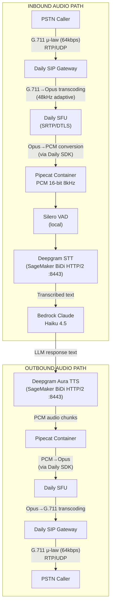
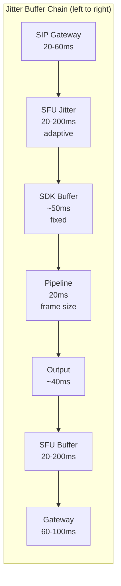
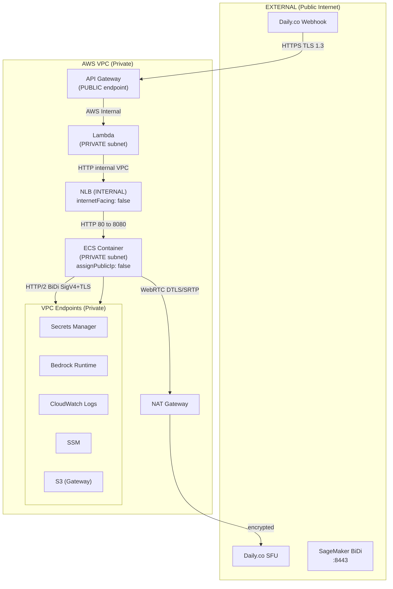
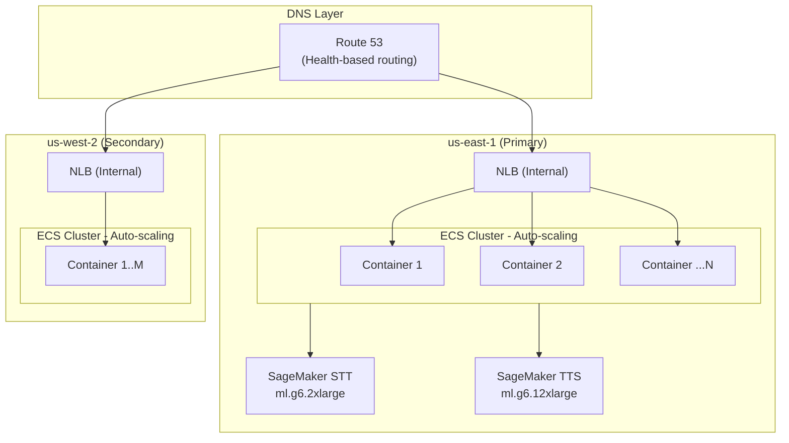
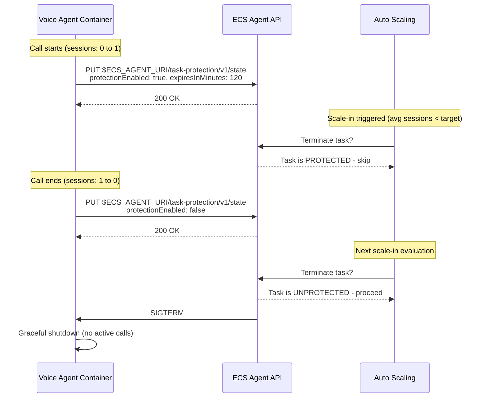
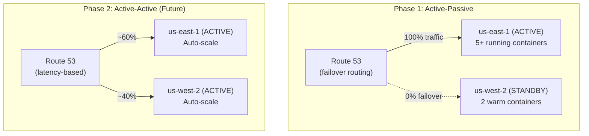
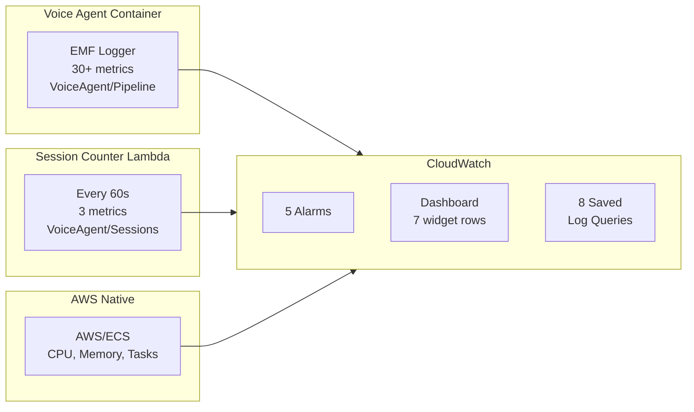
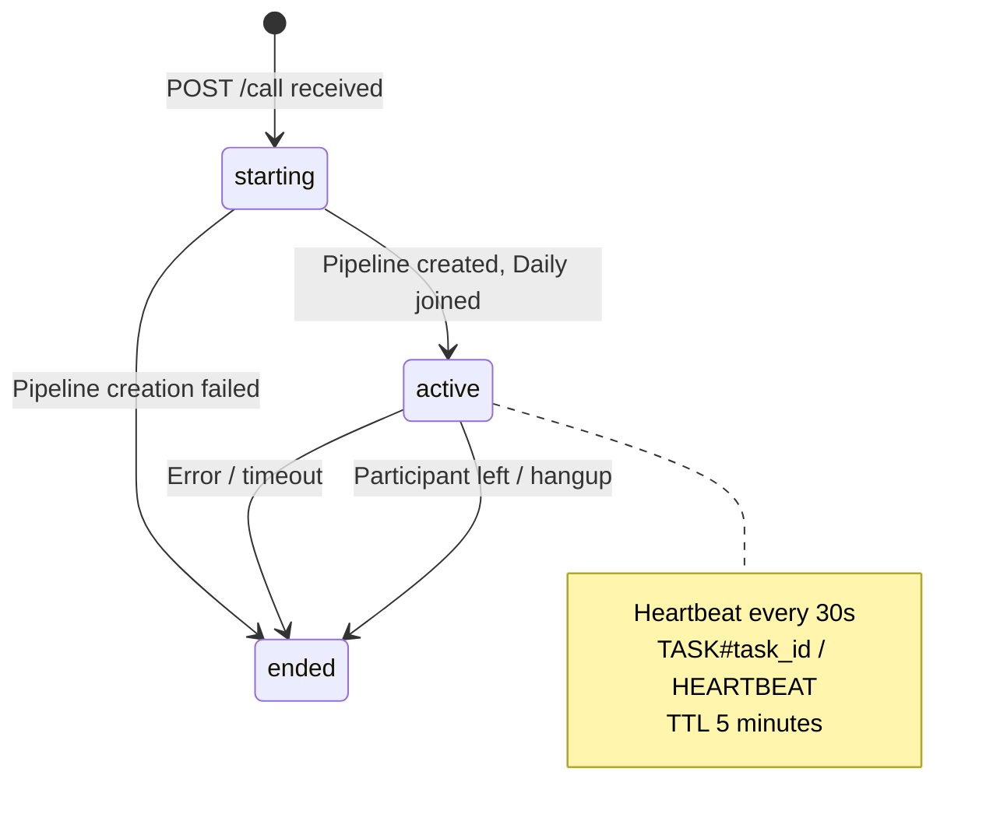
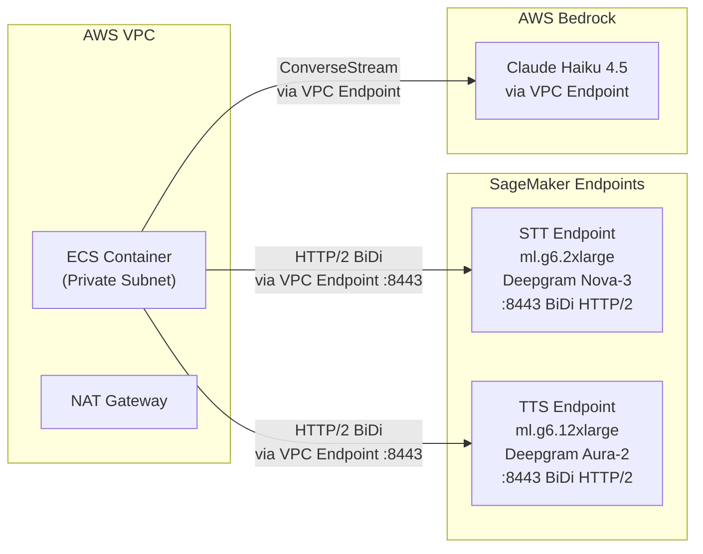

# Enterprise Scaling & Audio Path Analysis

## Executive Summary

**Current State**: Production voice AI pipeline supporting concurrent calls using ECS Fargate with Daily.co WebRTC, Deepgram Nova-3 STT on SageMaker, Claude Haiku 4.5 on Bedrock, and Deepgram Aura-2 TTS on SageMaker. Comprehensive observability (30+ CloudWatch metrics), DynamoDB session tracking, and A2A capability agents (KB, CRM) are deployed.

**Target State**: Enterprise-grade architecture supporting 1000 concurrent calls with auto-scaling, <500ms voice response latency, and multi-region failover.

**Key Findings**:
- WebRTC via Daily.co **is suitable** for enterprise telephony with proper architecture
- Current end-to-end latency: 875-1430ms (target: <500ms achievable with optimization)
- Scaling to 1000 calls requires ~250 ECS containers with auto-scaling
- Critical dependency on Daily.co requires enterprise SLA; STT/TTS are self-hosted on SageMaker
- Session tracking infrastructure, custom CloudWatch metrics, and monitoring dashboard are already deployed -- ready for auto-scaling policy wiring

**Infrastructure Already Built for Scaling**:
- DynamoDB session table with heartbeats and lifecycle tracking
- Session counter Lambda emitting `SessionsPerTask` to CloudWatch every 60s
- Per-task `ActiveSessions` metric via EMF
- 5 CloudWatch alarms + monitoring dashboard with 7 widget rows
- 8 saved Logs Insights queries for operational investigation

---

## 1. WebRTC for Enterprise Telephony

### 1.1 WebRTC vs Traditional SIP/RTP Assessment

| Criteria | WebRTC | Traditional SIP/RTP |
|----------|--------|---------------------|
| **Encryption** | Mandatory SRTP/DTLS | Optional (often unencrypted) |
| **NAT Traversal** | Built-in ICE/STUN/TURN | Requires Session Border Controller |
| **Codec Flexibility** | Opus (adaptive bitrate) | G.711/G.729 (fixed) |
| **Scalability** | Session-based, cloud-native | Mature patterns, PBX-centric |
| **Browser Support** | Native | Requires plugins/softphones |
| **Firewall Friendly** | Yes (UDP/TCP fallback) | Often blocked |
| **Quality Monitoring** | RTCP feedback, getStats() | CDR-based |

### 1.2 Enterprise Suitability Assessment

**Reliability**
- Automatic codec selection based on network conditions
- Bandwidth adaptation (Opus: 6-510 kbps)
- Packet loss concealment built into Opus codec
- ICE restart capability for network transitions

**Quality of Service**
- SRTP encryption (AES-128-CTR) mandatory
- RTCP feedback for quality metrics
- Forward Error Correction (FEC) support
- Adaptive jitter buffering

**Regulatory Compliance**

| Regulation | WebRTC Capability | Notes |
|------------|-------------------|-------|
| E911 | Supported via SIP gateway | Daily.co handles compliance |
| CALEA | Wiretap capability via gateway | Carrier responsibility |
| HIPAA | Encrypted by default | BAA with Daily.co required |
| PCI-DSS | End-to-end encryption | No cardholder data in audio path |

**Verdict**: WebRTC via Daily.co IS suitable for enterprise telephony when:
- Enterprise SLAs are in place with Daily.co
- Proper monitoring and alerting is implemented
- Fallback mechanisms exist for service degradation
- Compliance requirements are documented and verified

### 1.3 Known Limitations

| Limitation | Impact | Mitigation |
|------------|--------|------------|
| ICE negotiation latency | 200-700ms first connection | Pre-warm connections, persistent rooms |
| Browser-centric design | SDK complexity | Daily SDK abstracts this |
| Jitter buffer variability | Latency unpredictability | Configure fixed buffers where possible |
| SRTP overhead | ~10% bandwidth increase | Negligible with modern networks |
| TURN relay fallback | Increased latency | Enterprise TURN infrastructure |

---

## 2. Complete Audio Path Analysis

### 2.1 End-to-End Audio Flow



### 2.2 Protocol Stack by Segment

| Segment | Layer 7 | Layer 4 | Security | Notes |
|---------|---------|---------|----------|-------|
| PSTN → SIP Gateway | SIP/SDP, RTP | UDP/TCP | TLS (signaling) | Carrier-dependent |
| SIP Gateway → SFU | WebRTC | UDP (SCTP) | DTLS-SRTP | Daily internal |
| SFU → Pipecat | Daily SDK | WebSocket | TLS 1.3 | Opus frames |
| Pipecat → SageMaker STT | HTTP/2 BiDi | TCP | TLS 1.3 (SigV4) | Port 8443, via VPC endpoint |
| Pipecat → Bedrock | HTTPS | TCP | TLS 1.3 (SigV4) | Via VPC endpoint |
| Pipecat → SageMaker TTS | HTTP/2 BiDi | TCP | TLS 1.3 (SigV4) | Port 8443, via VPC endpoint |

**Note on SageMaker BiDi Networking**: The SageMaker bidirectional streaming API uses HTTP/2 on port 8443. The `sagemaker.runtime` VPC interface endpoint supports both standard `InvokeEndpoint` (port 443) and BiDi streaming (port 8443). With `privateDnsEnabled: true`, DNS resolves to the VPC endpoint ENI, keeping all SageMaker traffic within the VPC via PrivateLink.

### 2.3 Codec Conversions

| Stage | Codec | Sample Rate | Bit Depth | Bitrate | Quality Impact |
|-------|-------|-------------|-----------|---------|----------------|
| PSTN Ingress | G.711 μ-law | 8 kHz | 8-bit (companded) | 64 kbps | Baseline telephony |
| Daily SIP Gateway | Opus | 48 kHz (adaptive) | 16-bit | 24-128 kbps | Enhanced quality |
| WebRTC Transport | Opus | 48 kHz | 16-bit | 24-128 kbps | No change |
| Pipecat Pipeline | Linear PCM | 8 kHz | 16-bit | 128 kbps | Lossless local |
| SageMaker STT | Linear PCM | 8 kHz | 16-bit | 128 kbps | Optimal for ASR |
| SageMaker TTS | Linear PCM | 8 kHz | 16-bit | 128 kbps | Matched to PSTN |
| Outbound WebRTC | Opus | 48 kHz | 16-bit | 24-128 kbps | Upsampled |
| PSTN Egress | G.711 μ-law | 8 kHz | 8-bit | 64 kbps | Back to telephony |

**Quality Considerations**:
- G.711 <-> Opus conversion introduces minimal quality loss
- Opus at 48 kHz captures full frequency range even when source is 8 kHz
- SageMaker TTS outputs at 8 kHz (matched to PSTN), avoiding unnecessary upsampling
- Multiple transcoding stages are unavoidable but well-optimized
- Net effect: Caller hears telephone-quality audio (appropriate for voice)

### 2.4 Jitter Buffer Analysis



| Scenario | Total Buffering Latency |
|----------|------------------------|
| Typical | 180-350ms |
| Worst case | 400-650ms |

### 2.5 Network Path & Security Analysis

#### Traffic Flow with Encryption



#### Exposure Analysis

| Component | Exposure | Access Control | Notes |
|-----------|----------|----------------|-------|
| **API Gateway** | PUBLIC | None (currently) | Only `/start` endpoint exposed |
| **Lambda** | PRIVATE | API Gateway trigger only | Runs in private subnet |
| **NLB** | PRIVATE | `internetFacing: false` | Only accessible within VPC |
| **ECS Tasks** | PRIVATE | `assignPublicIp: false` | Private subnet, no direct internet access |
| **VPC Endpoints** | PRIVATE | Security group restricted | For AWS service access |

#### VPC Endpoints Configured

| Endpoint | Type | Purpose |
|----------|------|---------|
| S3 | Gateway | ECR image layers, CloudWatch logs |
| Secrets Manager | Interface | API key retrieval |
| Bedrock Runtime | Interface | LLM inference (Claude) |
| CloudWatch Logs | Interface | Container/Lambda logging |
| SSM | Interface | Parameter Store lookups |
| SageMaker Runtime | Interface | STT/TTS BiDi streaming (port 8443) and standard invoke (port 443) |

#### Security Gaps Identified

| Gap | Current State | Risk | Recommendation |
|-----|---------------|------|----------------|
| **No webhook auth** | API Gateway accepts any POST | Medium | Validate Daily.co request signatures |
| **No rate limiting** | API Gateway has no throttling | Medium | Add throttling policy (100 req/s) |
| **Lambda to NLB HTTP** | Unencrypted internal traffic | Low (private VPC) | Consider TLS if compliance requires |
| **SageMaker BiDi via VPC endpoint** | Traffic stays within VPC | Resolved | `privateDnsEnabled: true`, validated 2026-02-24 |

#### Security Controls Summary

| Layer | Controls |
|-------|----------|
| **Network Isolation** | Private subnets for all compute, no public IPs, internal NLB |
| **Encryption** | TLS 1.3 at API Gateway, DTLS/SRTP for WebRTC, SigV4+TLS to SageMaker, TLS to VPC endpoints |
| **Access Control** | IAM task roles (least privilege), security groups, VPC endpoint policies |
| **Secrets Management** | Secrets Manager for API keys (KMS-encrypted), SSM for configuration |

---

## 3. End-to-End Latency Budget

### 3.1 Detailed Latency Breakdown

```mermaid
gantt
    title Latency Waterfall (User speaks to AI responds)
    dateFormat X
    axisFormat %L ms

    section Inbound
    PSTN to Daily SIP (40ms)          :0, 40
    SIP to WebRTC transcoding (15ms)  :40, 55
    WebRTC to Pipecat + jitter (30ms) :55, 85
    Silero VAD per frame (7ms)        :85, 92

    section VAD Wait
    End-of-speech detection (300ms)   :92, 392

    section Processing
    SageMaker STT BiDi (150ms)        :392, 542
    Bedrock Claude TTFT (300ms)       :542, 842
    Token streaming (75ms)            :842, 917

    section TTS + Outbound
    SageMaker TTS BiDi (150ms)        :917, 1067
    Pipecat to WebRTC (30ms)          :1067, 1097
    WebRTC to PSTN (55ms)             :1097, 1152
```



**VAD end-of-speech (300ms) is the dominant latency contributor.**

### 3.2 Component-by-Component Analysis

| Component | Min (ms) | Typical (ms) | Max (ms) | Controllable? |
|-----------|----------|--------------|----------|---------------|
| **Inbound Path** |||||
| PSTN to Daily SIP Gateway | 20 | 40 | 80 | No (carrier) |
| SIP to WebRTC (Daily SBC) | 5 | 15 | 30 | No (Daily) |
| WebRTC to Pipecat (incl. jitter) | 15 | 30 | 60 | Partial |
| Silero VAD (per frame) | 3 | 7 | 15 | No |
| **VAD end-of-speech detection** | **200** | **300** | **500** | **Yes** |
| **Processing** |||||
| SageMaker STT (BiDi HTTP/2) | 80 | 150 | 250 | Partial |
| Bedrock Claude Haiku 4.5 TTFT | 150 | 300 | 500 | Partial |
| Bedrock token streaming | 30 | 75 | 150 | No |
| **TTS** |||||
| SageMaker TTS (BiDi HTTP/2) | 80 | 150 | 250 | Partial |
| **Outbound Path** |||||
| Pipecat to WebRTC | 15 | 30 | 50 | Partial |
| WebRTC to PSTN | 30 | 55 | 100 | No |
| **TOTAL** | **628** | **1,152** | **1,985** | |

### 3.3 Bottleneck Identification (Ranked by Impact)

| Component | Typical Latency | % of Total |
|-----------|----------------|------------|
| VAD end-of-speech | 300ms | 26% |
| Bedrock LLM TTFT* | 300ms | 26% |
| SageMaker STT | 150ms | 13% |
| SageMaker TTS | 150ms | 13% |
| Network transport (combined) | 170ms | 15% |
| Processing overhead (VAD, encoding) | 82ms | 7% |

*TTFT = Time to First Token

### 3.4 Optimization Opportunities

| Optimization | Latency Savings | Effort | Risk |
|--------------|-----------------|--------|------|
| **VAD: Reduce stop_secs from 0.3 to 0.2** | 100ms | Low | Medium (false triggers) |
| **VAD: Reduce to 0.15s** | 150ms | Low | High (frequent interrupts) |
| Pre-warm WebRTC connections | 50-100ms first call | Medium | Low |
| Bedrock response caching | 50-200ms for common queries | Medium | Low |
| Provisioned throughput (Bedrock) | 50-150ms TTFT reduction | Medium | Low |
| SageMaker endpoint optimization | 20-50ms | Medium | Low |
| **Semantic VAD (future)** | 100-200ms | High | Medium |

**Target Latency Budget (Optimized)**:
- Current typical: 1,152ms
- With VAD optimization (0.2s): 1,052ms
- With Bedrock provisioned: 952ms
- With pre-warming: 902ms
- **Achievable target: ~900ms** (vs current ~1,150ms)

---

## 4. Scaling to 1000 Concurrent Calls

### 4.1 Current Resource Profile

| Metric | Current Configuration | Observed Usage (per call) |
|--------|----------------------|---------------------------|
| Container vCPU | 1.0 vCPU | ~200 CPU units (0.2 vCPU) |
| Container Memory | 2 GB | ~300-400 MB |
| Network bandwidth | Burstable | ~150 kbps (Opus bidirectional) |
| Concurrent calls | 1-5 tested | 3-4 comfortable |

**The 4 calls/container estimate is THEORETICAL and requires load testing validation.**

#### Memory Breakdown Per Call (Estimated)

| Component | Memory Usage | Notes |
|-----------|-------------|-------|
| Daily WebRTC transport | 80-120 MB | WebSocket, media buffers |
| Silero VAD model | 40-60 MB | **Shared across calls** |
| SageMaker STT BiDi session | 20-40 MB | HTTP/2 streaming connection |
| SageMaker TTS BiDi session | 20-40 MB | HTTP/2 streaming connection |
| Pipecat pipeline | 40-60 MB | Frame buffers, queues |
| Bedrock client | 30-50 MB | HTTP client, context |
| **Total per call** | **~300-400 MB** | Excludes shared VAD |

#### Theoretical vs Validated Capacity

| Scenario | Calls/Container | Basis |
|----------|-----------------|-------|
| Theoretical (memory) | 4-5 | 2GB / 400MB = 5 |
| Theoretical (CPU) | 5 | 1.0 vCPU / 0.2 vCPU = 5 |
| **Conservative estimate** | **4** | Used for scaling calculations |
| **Validated capacity** | **TBD** | Requires load testing |

**Limiting Factors**:
- Memory is the primary constraint (WebRTC + ML models)
- CPU utilization peaks during VAD/STT processing
- Each call maintains persistent HTTP/2 connections to SageMaker (STT + TTS)

### 4.2 Horizontal Scaling Architecture



**Auto-scaling Target:**
- Min: 1 (always-on for latency)
- Max: 312 (1000 calls + 25% buffer)
- Target: 3 sessions per container (75% of capacity)

### 4.3 Scaling Calculations

| Metric | Formula | Value |
|--------|---------|-------|
| Calls per container | Memory-bound estimate | 4 (conservative) |
| Containers for 1000 calls | 1000 / 4 | **250 containers** |
| Buffer for burst (25%) | 250 x 1.25 | **312 containers max** |
| Total vCPUs | 250 x 1 | **250 vCPUs** |
| Total memory | 250 x 2 GB | **500 GB** |
| Network bandwidth | 1000 x 150 kbps | **150 Mbps** |

### 4.4 Auto-Scaling Strategy

**Current State**: Auto-scaling is **deployed and validated** with live SIPp load tests through the full SIPp → Asterisk → Daily → Voice Agent call path.

**Scaling Infrastructure (All Deployed)**:

| Component | Status | CloudWatch Metric |
|-----------|--------|-------------------|
| DynamoDB session table | Deployed | N/A (data store) |
| Session counter Lambda (every 60s) | Deployed | `VoiceAgent/Sessions :: SessionsPerTask` |
| Per-task heartbeat (every 30s) | Deployed | `VoiceAgent/Sessions :: HealthyTaskCount` |
| Per-task EMF metric | Deployed | `VoiceAgent/Pipeline :: ActiveSessions` |
| Global active session count | Deployed | `VoiceAgent/Sessions :: ActiveCount` |
| Target tracking policy (scale-out) | Deployed | SessionsPerTask avg, target=3 |
| Step scaling policy (scale-in) | Deployed | SessionsPerTask avg <= 0 → -3 tasks |
| Task scale-in protection | Deployed | Via ECS Agent API |

**Deployed Auto-Scaling Configuration**:

| Parameter | Value | Notes |
|-----------|-------|-------|
| `minCapacity` | 1 | Always-on baseline |
| `maxCapacity` | 12 | POC limit (increase for production) |
| `targetSessionsPerTask` | 3 | Target tracking target value |
| `sessionCapacityPerTask` | 10 | `/ready` returns 503 at this limit |
| Task CPU | 4096 (4 vCPU) | Supports 10 concurrent calls per task |
| Task Memory | 8192 MiB | Fargate minimum for 4 vCPU |
| Scale-out cooldown | 60s | AWS-managed for target tracking |
| Scale-in cooldown | 30s | Step scaling policy |
| Scale-in evaluation periods | 2 | Must be low for 2 consecutive periods |
| `disableScaleIn` on target tracking | true | Scale-in only via step policy |

**Design Decisions**:

1. **Target tracking for scale-out only**: Uses `SessionsPerTask` average (not max). When new tasks come online with 0 sessions, the fleet average naturally drops, preventing overshoot. Scale-in is disabled on the target tracking policy to avoid thrashing.

2. **Step scaling for scale-in**: A separate step scaling policy fires only when `SessionsPerTask avg <= 0.0` (truly zero sessions fleet-wide), removing up to 3 tasks at once. This conservative approach avoids premature scale-in during call traffic.

3. **Task protection as safety net**: Active containers enable ECS Task Scale-in Protection, so even if the step policy fires, containers with live calls are never terminated.

**Validated Scaling Behavior** (measured 2026-02-26):

| Phase | Action | Observed Result |
|-------|--------|-----------------|
| Baseline | 0 sessions, 1 task | Stable, no alarms firing |
| Scale-out trigger | 6 calls placed | Target tracking alarm fires at T+4min, desired → 2 |
| Scale-out complete | New task running | 2/2 tasks at T+6min, alarm returns to OK |
| Stability check | 6 sessions on 2 tasks | Desired stays at 2 (scale-in does NOT fight) |
| Additional load | 6 more calls (11 total) | Desired → 4 (ceil(11/3) = 4 tasks) |
| Scale-in trigger | All calls ended | SessionsPerTask → 0, alarm fires |
| Scale-in complete | 4 → 1 task | Step policy removes 3 tasks, back to minCapacity |

**Cold Start Timing** (measured):

| Phase | Duration | Cumulative |
|-------|----------|-----------|
| ENI attach + scheduling | ~14s | 14s |
| Image pull (824 MB compressed) | ~37s | 51s |
| Container init | ~17s | 68s |
| NLB health check (2 x 10s) | ~20s | ~88s |
| + Scaling decision pipeline | 1-3 min | **~3-5 min total** |

### 4.5 Scale-In Protection for Active Calls

When scaling down, ECS may terminate containers with active voice calls. AWS provides **ECS Task Scale-in Protection** specifically for this use case.



**Key Mechanism**: The application calls the ECS Agent API from within the container:
- **On first call start**: Set `protectionEnabled: true` (task cannot be terminated by scale-in)
- **On last call end**: Set `protectionEnabled: false` (task eligible for termination)
- ECS auto-scaler will **never terminate a protected task**
- Protection expires after 120 minutes (configurable) as a safety net

**Complementary: Graceful Shutdown (SIGTERM)**

Even with scale-in protection, the SIGTERM handler provides defense-in-depth:
1. Set `draining = True` (health check returns 503, NLB stops routing new calls)
2. Wait for `active_sessions == 0` (up to 120s, Fargate max)
3. Clean up and exit

**Implementation Status**: Deployed and validated. See `docs/features/ecs-scaling-validation-suite/shipped.md` for full test results.

### 4.6 External Service Capacity Limits

| Service | Current Config | Scaling Model | Required for 1000 Calls |
|---------|---------------|---------------|------------------------|
| **Daily.co** | Standard plan | Per-room, no sharing | Enterprise SLA, dedicated SIP trunk |
| **SageMaker STT** | 1x ml.g6.2xlarge | Instance-based scaling | ~10-20 instances (endpoint auto-scaling) |
| **SageMaker TTS** | 1x ml.g6.12xlarge | Instance-based scaling | ~5-10 instances (endpoint auto-scaling) |
| **Bedrock Claude** | On-demand throughput | 400K tokens/min default | Service quota increase to 2M+ tokens/min |
| **AWS NAT Gateway** | 1 (single AZ) | 55K connections | Multi-AZ NAT (redundancy) |
| **ECS Fargate** | 500 tasks/region default | Service quota | Increase to 500+ tasks |

**Note**: STT and TTS are self-hosted on SageMaker, eliminating external API rate limits. Capacity is determined by instance count, which is fully under our control. SageMaker endpoint auto-scaling should be implemented alongside ECS auto-scaling.

### 4.7 SageMaker Endpoint Details

| Endpoint | Instance Type | GPU | Current Count | Production Recommendation |
|----------|--------------|-----|---------------|--------------------------|
| STT (Nova-3) | ml.g6.2xlarge | 1x NVIDIA L4 | 1 (non-prod) / 2 (prod) | Auto-scaling based on invocation load |
| TTS (Aura-2) | ml.g6.12xlarge | 4x NVIDIA L4 | 1 (non-prod) / 2 (prod) | Auto-scaling based on invocation load |

**SageMaker CloudWatch Alarms (Deployed)**:

| Alarm | Metric | Threshold | Evaluation |
|-------|--------|-----------|------------|
| STT Latency | ModelLatency P95 | > 300ms | 3x 1min |
| STT Error Rate | Invocation5XXErrors | > 5% | 2x 5min |
| TTS Latency | ModelLatency P95 | > 500ms | 3x 1min |
| TTS Error Rate | Invocation5XXErrors | > 5% | 2x 5min |

---

## 5. Reliability and Failover

### 5.1 Single Points of Failure Analysis

| Component | Risk Level | Impact if Failed | Mitigation |
|-----------|-----------|-----------------|------------|
| **Daily.co (SIP/WebRTC)** | HIGH | Complete outage -- no calls possible | Enterprise SLA + monitoring. No practical fallback. |
| **SageMaker STT endpoint** | MEDIUM | No speech recognition | Fallback to Deepgram cloud WebSocket (`STT_PROVIDER=deepgram`) |
| **SageMaker TTS endpoint** | MEDIUM | No voice synthesis | Fallback to Cartesia cloud HTTP (`TTS_PROVIDER=cartesia`) |
| **Bedrock Claude** | LOW-MEDIUM | Slower responses | Cross-region inference profile, provisioned throughput |
| **ECS Container** | LOW | Single call affected | Auto-recovery via NLB health checks, multi-AZ |
| **NAT Gateway** | LOW | Region degradation | Multi-AZ NAT Gateways |
| **AWS Region** | VERY LOW | Complete outage | Multi-region deployment, Route 53 health checks |

### 5.2 Fallback Service Configuration

The system supports provider-level fallback via environment variables:

| Provider | Primary (Production) | Fallback (Cloud API) | Switch Mechanism |
|----------|---------------------|---------------------|-----------------|
| **STT** | Deepgram Nova-3 on SageMaker | Deepgram Cloud WebSocket | `STT_PROVIDER=deepgram` |
| **TTS** | Deepgram Aura-2 on SageMaker | Cartesia Cloud HTTP | `TTS_PROVIDER=cartesia` |
| **LLM** | Claude Haiku 4.5 (inference profile) | Same (cross-region) | Inference profile handles failover |

**Future Work**: Circuit breakers for automatic fallback on consecutive failures.

```python
# Recommended circuit breaker settings (future implementation)
circuit_breaker:
    failure_threshold: 5
    recovery_timeout: 30s
    half_open_requests: 3
```

### 5.3 Multi-Region Architecture



| Phase | Failover Time | Data Sync | Cost Overhead |
|-------|--------------|-----------|---------------|
| Active-Passive | ~60s (DNS TTL + health check) | None (stateless calls) | ~20% (warm standby) |
| Active-Active | N/A (automatic) | None (stateless calls) | ~10% (shared load) |

### 5.4 Graceful Degradation Strategy

| Scenario | Detection | Response | User Experience |
|----------|-----------|----------|-----------------|
| High call volume | Queue depth > 50 | Reject new calls | "All agents busy" message |
| STT degradation | SageMaker latency > 300ms P95 | Switch to Deepgram cloud | Slightly slower responses |
| TTS degradation | SageMaker latency > 500ms P95 | Switch to Cartesia cloud | Different voice quality |
| LLM degradation | TTFT > 2s | Reduce max_tokens, simplify prompt | Shorter responses |
| Complete outage | Health check fail | Route 53 failover | 60s interruption |

---

## 6. Monitoring and Observability (Current State)

### 6.1 CloudWatch Metrics Architecture

Three metric sources feed the monitoring system:



### 6.2 Metrics Catalog

#### VoiceAgent/Pipeline (EMF from container)

**Per-Turn Metrics** (emitted at each conversation turn):

| Metric | Unit | Description |
|--------|------|-------------|
| `STTLatency` | ms | STT processing time |
| `LLMTimeToFirstByte` | ms | LLM time to first token |
| `LLMTotalResponseTime` | ms | LLM total response time |
| `TTSTimeToFirstByte` | ms | TTS time to first byte |
| `AgentResponseLatency` | ms | VAD stop to first audio (E2E) |
| `AudioRMS` | dBFS | Average audio RMS level |
| `AudioPeak` | dBFS | Average audio peak level |
| `SilenceDuration` | ms | Silence before speech |
| `STTConfidenceAvg` | 0-1 | Average STT confidence |
| `STTConfidenceMin` | 0-1 | Minimum STT confidence |
| `STTWordCount` | Count | Words in transcription |
| `LLMOutputTokens` | Count | Estimated output tokens |
| `LLMTokensPerSecond` | Count/s | Token generation speed |
| `WebRTCRTT` | ms | WebRTC round-trip time |
| `WebRTCJitter` | ms | WebRTC jitter |
| `WebRTCPacketLoss` | % | Packet loss percentage |
| `TurnGap` | ms | Time between bot stop and user start |
| `ResponseDelay` | ms | Time from user stop to bot start |
| `QualityScore` | 0-1 | Composite quality score |

**Per-Call Summary** (emitted at call end):

| Metric | Unit |
|--------|------|
| `CallDuration` | Seconds |
| `TurnCount` | Count |
| `InterruptionCount` | Count |
| `AvgSTTLatency` / `AvgLLMLatency` / `AvgTTSLatency` | ms |
| `AvgAgentResponseLatency` | ms |
| `AvgAudioRMS` / `AvgAudioPeak` | dBFS |
| `PoorAudioTurns` | Count |

**Session Health** (on session start/end):

| Metric | Unit | Dimensions |
|--------|------|-----------|
| `ActiveSessions` | Count | Environment, TaskId |
| `ErrorCount` | Count | Environment, ErrorCategory |

**Tool Execution** (when tool calling enabled):

| Metric | Unit | Dimensions |
|--------|------|-----------|
| `ToolExecutionTime` | ms | Environment, ToolName, ToolCategory, ToolStatus |
| `ToolInvocationCount` | Count | Environment, ToolName, ToolCategory, ToolStatus |

#### VoiceAgent/Sessions (from session counter Lambda)

| Metric | Unit | Description |
|--------|------|-------------|
| `ActiveCount` | Count | Total active sessions across all tasks |
| `HealthyTaskCount` | Count | Tasks with heartbeat within 90s |
| `SessionsPerTask` | Count | Average sessions per healthy task |

### 6.3 CloudWatch Alarms (Deployed)

| Alarm | Metric | Threshold | Evaluation | Description |
|-------|--------|-----------|------------|-------------|
| E2E Latency High | `AgentResponseLatency` Avg | > 2000ms | 3/3 x 1min | Voice response feels sluggish |
| Error Rate High | Math on `CallDuration` by CompletionStatus | > 5% | 2/2 x 5min | Service degradation detected |
| CPU Utilization High | `AWS/ECS :: CPUUtilization` Avg | > 80% | 2/3 x 5min | Consider scaling |
| Memory Utilization High | `AWS/ECS :: MemoryUtilization` Avg | > 85% | 2/3 x 5min | Consider scaling |
| Container Restarts | Math on `RunningTaskCount` | >= 2 per hour | 2/12 x 5min | Crash loop detected |

### 6.4 CloudWatch Dashboard

Dashboard name: `{projectName}-monitoring-{environment}`

| Row | Widgets | Key Metrics |
|-----|---------|-------------|
| 1 | Service Health, Call Count, Avg Duration | Alarm status, hourly calls, average call length |
| 2 | Agent Response Latency (P50/P95/P99), Component Latencies | E2E latency with alarm threshold annotation |
| 3 | Error Rate (%), Calls by Completion Status | Error rate with 5% threshold, stacked by status |
| 4 | CPU Utilization, Memory Utilization | Resource usage with alarm threshold annotations |
| 5 | Turns per Call, Interruptions, Audio Quality | Conversation quality metrics |
| 6 | STT Confidence, LLM Token Speed, LLM Output Tokens | Model performance |
| 7 | Conversation Flow Timing, Composite Quality Score | Turn gaps, quality score with grade annotations |

### 6.5 Saved CloudWatch Logs Insights Queries

| Query | Purpose |
|-------|---------|
| Recent Errors | Last 20 calls with `completion_status = "error"` |
| High Latency Calls | Calls with `AvgAgentResponseLatency > 2000ms` |
| Tool Usage | Tool invocation frequency and average duration |
| Conversation Flow | Turn-by-turn transcript for a specific call |
| Audio Quality Issues | Turns with audio RMS below -55 dBFS |
| Interruption Analysis | Calls with barge-in events |
| Call Summary | Last 100 calls with duration, turns, status |
| Trace Call | Full event log for a specific call ID |

### 6.6 Alerting Thresholds (Recommended for Scale)

| Metric | Warning | Critical | Action |
|--------|---------|----------|--------|
| Active calls | >800 | >950 | Scale out, reject new calls |
| E2E latency p99 | >2s | >3s | Investigate, consider fallbacks |
| Container CPU | >70% | >85% | Scale out |
| Container memory | >80% | >90% | Scale out, investigate leaks |
| SageMaker STT P95 latency | >300ms | >500ms | Check endpoint, consider cloud fallback |
| SageMaker TTS P95 latency | >500ms | >800ms | Check endpoint, consider cloud fallback |
| LLM TTFT p99 | >1s | >2s | Alert, consider provisioned throughput |
| Health check failures | 1 | 3 consecutive | Auto-restart, page on-call |

---

## 7. Session Tracking Infrastructure (Current State)

### 7.1 DynamoDB Session Table

**Table Name**: `voice-agent-sessions-{environment}`

| Key | Pattern | Description |
|-----|---------|-------------|
| PK | `SESSION#{session_id}` or `TASK#{task_id}` | Partition key |
| SK | `METADATA` or `HEARTBEAT` | Sort key |
| TTL | Epoch seconds | Auto-expiry (24h active, 1h ended, 5min heartbeat) |

**GSIs**:

| Index | Partition Key | Sort Key | Purpose |
|-------|--------------|----------|---------|
| GSI1 | `STATUS#{status}` | `{timestamp}#{session_id}` | Query active session count |
| GSI2 | `TASK#{task_id}` | `{timestamp}#{session_id}` | Query sessions per task |

### 7.2 Session Lifecycle



### 7.3 Session Counter Lambda

- **Schedule**: Every 60 seconds (EventBridge rule)
- **Queries DynamoDB**: Active sessions (GSI1), healthy tasks (heartbeat freshness < 90s)
- **Emits to CloudWatch**: `ActiveCount`, `HealthyTaskCount`, `SessionsPerTask`
- **Purpose**: Provides the scaling signal (`SessionsPerTask`) for ECS auto-scaling

---

## 8. SageMaker Architecture (Current State)

### 8.1 Deployed Configuration

STT and TTS are self-hosted on SageMaker using Deepgram's Nova-3 (STT) and Aura-2 (TTS) models via bidirectional HTTP/2 streaming.



### 8.2 STT Endpoint

| Property | Value |
|----------|-------|
| Model | Deepgram Nova-3 |
| Instance | ml.g6.2xlarge (1x NVIDIA L4 GPU) |
| Count | 1 (non-prod) / 2 (prod) |
| Protocol | HTTP/2 BiDi streaming, `v1/listen` path, port 8443 |
| Sample Rate | 8000 Hz, linear16 encoding |
| Features | Interim results, punctuation, streaming |
| Network Isolation | Enabled |

### 8.3 TTS Endpoint

| Property | Value |
|----------|-------|
| Model | Deepgram Aura-2 |
| Instance | ml.g6.12xlarge (4x NVIDIA L4 GPUs) |
| Count | 1 (non-prod) / 2 (prod) |
| Protocol | HTTP/2 BiDi streaming, `v1/speak` path, port 8443 |
| Default Voice | `aura-2-thalia-en` |
| Sample Rate | 8000 Hz, linear16 encoding |
| Message Types | Speak, Flush, Clear, Close |
| Network Isolation | Enabled |

### 8.4 Credential Handling

Pipecat's `SageMakerBidiClient` uses `EnvironmentCredentialsResolver` by default, which doesn't work on ECS Fargate (where credentials come from the task role via `ContainerCredentialsResolver`). A monkey-patch in `sagemaker_credentials.py` adds a `ChainedIdentityResolver` that tries both resolvers.

### 8.5 Cloud API Fallback Mode

The system supports cloud APIs for development/testing:

| Mode | STT | TTS | Configuration |
|------|-----|-----|---------------|
| **SageMaker (production)** | Deepgram Nova-3 on SageMaker | Deepgram Aura-2 on SageMaker | `STT_PROVIDER=sagemaker`, `TTS_PROVIDER=sagemaker` |
| **Cloud API (development)** | Deepgram Cloud WebSocket | Cartesia Cloud HTTP | `STT_PROVIDER=deepgram`, `TTS_PROVIDER=cartesia` |

When `USE_CLOUD_APIS=true` is set during CDK deployment, the `SageMakerStubStack` creates placeholder SSM parameters instead of deploying SageMaker endpoints.

### 8.6 SageMaker Endpoint Scaling (Future Work)

SageMaker endpoints currently use fixed instance counts. For 1000 concurrent calls, endpoint auto-scaling is required:

| Endpoint | Current | Estimated at 1000 Calls | Scaling Metric |
|----------|---------|------------------------|----------------|
| STT | 1 instance | 10-20 instances | `InvocationsPerInstance` |
| TTS | 1 instance | 5-10 instances | `InvocationsPerInstance` |

This should be planned alongside ECS auto-scaling. See cost analysis backlog item.

---

## 9. A2A Capability Agents

### 9.1 Architecture

The voice agent uses a hub-and-spoke pattern via the A2A protocol to integrate with capability agents. These are independently deployed ECS Fargate services discovered via AWS Cloud Map.

| Agent | Purpose | Resources | Execution Pattern |
|-------|---------|-----------|-------------------|
| **KB Agent** | Knowledge base search (RAG) | 256 CPU / 512 MB | `DirectToolExecutor` (bypasses inner LLM, ~323ms) |
| **CRM Agent** | Customer lookup, case management | 256 CPU / 512 MB | `StrandsA2AExecutor` (LLM reasoning, ~2-3s) |

### 9.2 Scaling Considerations

- Capability agents are lightweight (256 CPU / 512 MB each)
- They are called only during tool invocations, not for every audio frame
- Scale independently from the voice agent
- At 1000 concurrent calls with ~20% tool usage, expect ~200 concurrent A2A requests
- CloudMap provides automatic discovery; new agents appear within 30-60s

### 9.3 Feature Flag

Enabled via SSM parameter `/voice-agent/config/enable-capability-registry` (default: `false`). When disabled, the voice agent uses only local tool implementations.

---

## 10. Implementation Roadmap

### What's Already Done

| Component | Status |
|-----------|--------|
| DynamoDB session tracking (table, GSIs, lifecycle) | Deployed |
| Session counter Lambda (custom CloudWatch metrics) | Deployed |
| Per-task heartbeat mechanism | Deployed |
| `SessionsPerTask` CloudWatch metric | Deployed |
| CloudWatch monitoring dashboard (7 widget rows) | Deployed |
| 5 CloudWatch alarms (latency, errors, CPU, memory, restarts) | Deployed |
| 30+ EMF metrics from container | Deployed |
| SageMaker STT/TTS endpoints | Deployed |
| A2A capability agents (KB, CRM) | Deployed |
| Cloud API fallback mode | Available |

### Remaining Work (Prioritized)

#### Phase 1: ECS Auto-Scaling (see `docs/features/ecs-auto-scaling/`)

| Task | Priority | Deliverable |
|------|----------|-------------|
| ECS Service Auto Scaling policy (CDK) | P0 | Target tracking on `SessionsPerTask` |
| Step scaling policy for burst | P0 | Rapid scale-out near capacity |
| Task scale-in protection (Python) | P0 | Protect tasks with active calls |
| Graceful shutdown enhancement | P0 | Drain before exit |
| Health check draining support | P0 | Return 503 when draining |
| NLB deregistration delay + stop timeout | P0 | CDK configuration |
| Load testing (1, 5, 10 concurrent) | P0 | Validate calls/container estimate |

#### Phase 2: Reliability Enhancements

| Task | Priority | Deliverable |
|------|----------|-------------|
| Circuit breakers for SageMaker endpoints | P1 | Auto-fallback to cloud APIs |
| SageMaker endpoint auto-scaling | P1 | Scale STT/TTS with demand |
| Multi-AZ NAT Gateways | P1 | HA network egress |
| Enterprise vendor agreements (Daily.co) | P0 | SLA + dedicated SIP trunk |
| Service quota increases (Bedrock, ECS, Fargate) | P1 | Headroom for scaling |

#### Phase 3: Scale Validation & Optimization

| Task | Priority | Deliverable |
|------|----------|-------------|
| Load testing (50, 100, 500 calls) | P0 | Scaling validation |
| Load testing (1000 calls) | P0 | Full capacity validation |
| Bedrock provisioned throughput | P1 | Lower LLM TTFT |
| VAD optimization (stop_secs tuning) | P1 | 100ms latency reduction |
| Secondary region deployment | P1 | us-west-2 standby |
| Route 53 failover configuration | P2 | DNS failover |
| Active-active multi-region | P2 | Geographic redundancy |

### Success Criteria

| Metric | Target | Measurement |
|--------|--------|-------------|
| Concurrent call capacity | 1000 | Load test peak |
| E2E latency p99 | <1.5s | CloudWatch `AgentResponseLatency` |
| Call success rate | >99.5% | CloudWatch error rate alarm |
| MTTR (container failure) | <60s | NLB health check + auto-restart |
| MTTR (region failure) | <5min | Failover testing |

---

## Appendix A: Configuration Reference

### VAD Settings Impact

```python
# Current configuration
VAD_STOP_SECS = 0.3  # 300ms pause triggers end-of-speech

# Aggressive (lower latency, more false triggers)
VAD_STOP_SECS = 0.15  # 150ms - saves 150ms but may interrupt user

# Conservative (higher latency, fewer false triggers)
VAD_STOP_SECS = 0.5  # 500ms - adds 200ms but smoother experience

# Recommended for production
VAD_STOP_SECS = 0.25  # Balance of latency and accuracy
```

### ECS Task Definition (Current)

```yaml
Family: voice-agent-{environment}-voice-agent
CPU: 1024 (1 vCPU)
Memory: 2048 MB
Platform: Linux/AMD64
Container:
  Name: voice-agent
  Port: 8080
  HealthCheck:
    Command: curl -f http://localhost:8080/health || exit 1
    Interval: 30s
    Timeout: 5s
    Retries: 3
    StartPeriod: 60s
  Environment:
    SERVICE_MODE: "true"
    SERVICE_PORT: "8080"
    STT_PROVIDER: "sagemaker"
    TTS_PROVIDER: "sagemaker"
    ENABLE_TOOL_CALLING: "true"
    ENVIRONMENT: "{environment}"
```

### DynamoDB Session Table

```yaml
Table: voice-agent-sessions-{environment}
Billing: PAY_PER_REQUEST (on-demand)
Keys:
  PK: String (SESSION#id or TASK#id)
  SK: String (METADATA or HEARTBEAT)
TTL: ttl_timestamp
GSI1: STATUS#status / timestamp#session_id
GSI2: TASK#task_id / timestamp#session_id
```

---

## Appendix B: Glossary

| Term | Definition |
|------|------------|
| **A2A** | Agent-to-Agent protocol -- JSON-RPC 2.0 over HTTP for inter-agent communication |
| **BiDi** | Bidirectional streaming -- HTTP/2 protocol for real-time STT/TTS |
| **DTLS** | Datagram Transport Layer Security -- encryption for UDP |
| **EMF** | Embedded Metric Format -- structured CloudWatch metric publishing |
| **ICE** | Interactive Connectivity Establishment -- NAT traversal |
| **SFU** | Selective Forwarding Unit -- WebRTC media server |
| **SRTP** | Secure Real-time Transport Protocol |
| **STUN** | Session Traversal Utilities for NAT |
| **TTFT** | Time to First Token -- LLM response latency |
| **TURN** | Traversal Using Relays around NAT |
| **VAD** | Voice Activity Detection |

---

*Document generated: January 2025*
*Last updated: February 2026 -- Comprehensive rewrite reflecting SageMaker STT/TTS deployment, Claude Haiku 4.5, A2A capability agents, DynamoDB session tracking, full observability layer, and ECS auto-scaling design*
*Author: Architecture team*
