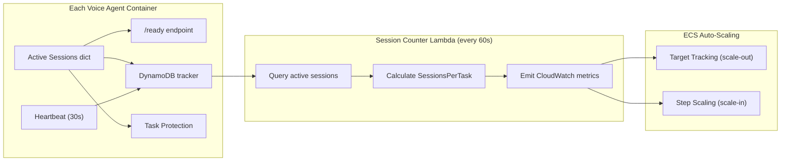
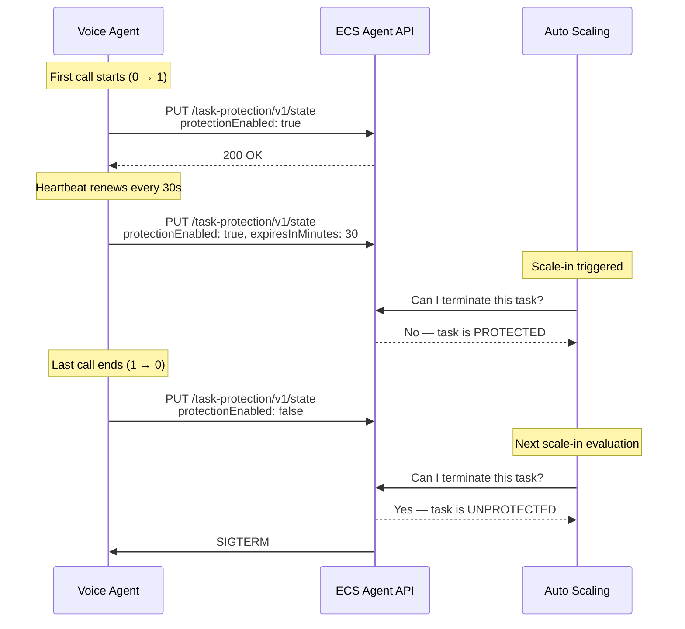

# Scaling

How the voice agent scales to handle concurrent calls. Covers session tracking, auto-scaling policies, task protection, health checks, and graceful shutdown.

## Overview

The voice agent runs on ECS Fargate. Each container (task) handles multiple concurrent voice calls. Scaling is driven by a custom CloudWatch metric — `SessionsPerTask` — that measures the average number of active calls per container across the fleet.

## Session Tracking

### In-Memory (Per Container)

Each container maintains a dict of active sessions in `PipelineManager.active_sessions`. This is the source of truth for:

- **`/ready` endpoint** — returns 503 when `len(active_sessions) >= MAX_CONCURRENT_CALLS`, which stops the NLB from routing new calls to this container
- **Task protection** — enabled when sessions go from 0 to 1, disabled when sessions go from 1 to 0

### DynamoDB (Fleet-Wide)

Every session is also tracked in a DynamoDB table (`{projectName}-{environment}-sessions`) for fleet-wide visibility. The session counter Lambda queries this table to calculate scaling metrics.

**Session items** store:

| Field | Description |
|-------|-------------|
| `PK` | `SESSION#{session_id}` |
| `SK` | `METADATA` |
| `status` | `starting` → `active` → `ended` |
| `task_id` | Which ECS task hosts this session |
| `call_id` | Correlation ID |
| `TTL` | 24h for active, 1h for ended |

**Heartbeat items** — each container writes a heartbeat every 30 seconds:

| Field | Description |
|-------|-------------|
| `PK` | `TASK#{task_id}` |
| `SK` | `HEARTBEAT` |
| `active_session_count` | Current count from that container |
| `TTL` | 5 minutes (auto-expires if container dies) |

Two GSIs enable efficient queries:

| GSI | Key | Purpose |
|-----|-----|---------|
| GSI1 | `STATUS#{status}` / `{timestamp}#{session_id}` | Count all active sessions |
| GSI2 | `TASK#{task_id}` / `{timestamp}#{session_id}` | Get sessions for a specific task |

## The Scaling Signal: SessionsPerTask

A Lambda function runs every 60 seconds and emits the metrics that drive auto-scaling:

1. **Query GSI1** for all `STATUS#active` sessions
2. **Scan heartbeat items** where `updated_at` is within 90 seconds (healthy tasks)
3. **Reap orphaned sessions** — if a session is active but its task has no recent heartbeat, mark it as `ended` with `end_status=orphaned`
4. **Calculate and emit**:

| Metric | Namespace | Description |
|--------|-----------|-------------|
| `SessionsPerTask` | `VoiceAgent/Sessions` | Active sessions / healthy tasks (fleet average) |
| `ActiveCount` | `VoiceAgent/Sessions` | Total active sessions across all tasks |
| `HealthyTaskCount` | `VoiceAgent/Sessions` | Tasks with heartbeat within 90 seconds |
| `MaxSessionsPerTask` | `VoiceAgent/Sessions` | Highest session count on any single task |

`SessionsPerTask` is the metric that auto-scaling policies watch.

## Auto-Scaling Policies

### Configuration

| Parameter | Default | CDK Context | Description |
|-----------|---------|-------------|-------------|
| `minCapacity` | 1 | `-c voice-agent:minCapacity=2` | Minimum tasks (always running) |
| `maxCapacity` | 12 | `-c voice-agent:maxCapacity=20` | Maximum tasks |
| `targetSessionsPerTask` | 3 | `-c voice-agent:targetSessionsPerTask=2` | Target for scale-out policy |
| `sessionCapacityPerTask` | 10 | `-c voice-agent:sessionCapacityPerTask=8` | Hard cap per task (`/ready` returns 503) |

### Scale-Out: Target Tracking

The primary scale-out policy uses CloudWatch target tracking on `SessionsPerTask` average:

- **Metric**: `SessionsPerTask` (1-minute average)
- **Target**: `targetSessionsPerTask` (default 3)
- **Cooldown**: 60 seconds
- **Scale-in disabled**: Yes (handled separately)

When the fleet average exceeds the target, ECS adds tasks. The formula is roughly `ceil(total_sessions / target)`. Because `SessionsPerTask` is a fleet **average**, it naturally drops when new tasks come online with 0 sessions — this prevents overshoot.

### Scale-In: Step Scaling

A separate step scaling policy handles scale-in conservatively:

- **Trigger**: `SessionsPerTask` average < 1.0 for 2 consecutive 1-minute periods
- **Action**: Remove up to 3 tasks
- **Cooldown**: 30 seconds

Scale-in only fires when the fleet is nearly idle. This is safe because ECS Task Scale-in Protection prevents termination of any task with active calls (see below).

### Why Two Separate Policies?

Target tracking is aggressive at scaling out (reacts quickly to load) but too aggressive at scaling in (would remove tasks while calls are still active). Disabling scale-in on target tracking and using a conservative step policy avoids premature termination.

## Task Scale-in Protection

When ECS decides to remove a task during scale-in, it could terminate a container with active voice calls. Task Scale-in Protection prevents this.

Key behaviors:

- **Enable** on first call (sessions: 0 → 1) — task cannot be terminated
- **Renew** every 30 seconds during heartbeat — resets the expiry timer
- **Disable** when last call ends (sessions: 1 → 0) — task eligible for termination
- **Safety expiry**: 30 minutes. If renewal fails, protection eventually expires
- **Failure tolerance**: If protection fails to enable, the call proceeds anyway (logged as warning, triggers CloudWatch alarm)

## Health Checks

The container exposes two endpoints that serve different purposes:

| Endpoint | Used By | Returns 503 When | Purpose |
|----------|---------|-------------------|---------|
| `/health` | ECS container health check | Never (always 200) | Keep container alive even when busy |
| `/ready` | NLB target group health check | Initializing, draining, or at capacity | Control call routing |

This separation is critical:

- **`/health` always returning 200** prevents ECS from killing containers that are at capacity or draining. A container with 10 active calls is healthy — it's just full.
- **`/ready` returning 503 at capacity** tells the NLB to stop sending new calls to this container. Existing calls continue unaffected.

NLB health check configuration:
- Interval: 10 seconds
- Healthy/unhealthy threshold: 2 checks each
- Time to receive traffic after `/ready` returns 200: ~20 seconds

## Graceful Shutdown

When ECS sends SIGTERM (during scale-in, deployment, or manual stop):

1. **Set draining** — `/ready` immediately returns 503 (NLB stops routing new calls), `start_call()` rejects new calls
2. **Wait for active sessions** — polls every 5 seconds for up to 110 seconds
3. **Clear task protection** — disables scale-in protection so future scale-in events aren't blocked
4. **Exit** — if sessions remain after 110s, Fargate force-kills at 120s

The NLB deregistration delay is set to 300 seconds, giving in-flight calls time to complete before the target is fully removed.

## Cold Start Timing

New ECS tasks take approximately 90 seconds from creation to receiving traffic:

| Phase | Duration | Cumulative |
|-------|----------|-----------|
| ENI attach + scheduling | ~14s | 14s |
| Image pull (824 MB compressed) | ~37s | 51s |
| Container init | ~17s | 68s |
| NLB health check (2 x 10s) | ~20s | ~88s |

The image pull is the bottleneck — the container requires ffmpeg, libsndfile, pipecat, and ONNX Runtime.

Total time from overload detection to new capacity serving calls: **~3-5 minutes** (includes CloudWatch alarm evaluation + scaling action + task startup).

## Scaling Example

A walkthrough of what happens under load:

| Time | Event | Fleet State |
|------|-------|-------------|
| T+0 | 1 task running, 0 sessions | `SessionsPerTask = 0`, min capacity |
| T+1min | 6 calls arrive | `SessionsPerTask = 6.0` (6/1), exceeds target of 3 |
| T+2min | Target tracking alarm fires | Desired count → 2 (`ceil(6/3)`) |
| T+3.5min | New task passes NLB health check | 2 tasks running, NLB routes new calls to both |
| T+4min | Lambda emits metric | `SessionsPerTask = 3.0` (6/2), alarm returns to OK |
| T+10min | 5 more calls arrive (11 total) | `SessionsPerTask = 5.5` (11/2), alarm fires again |
| T+11min | Desired count → 4 | `ceil(11/3) = 4` tasks |
| T+20min | All calls end | `SessionsPerTask = 0.0` for 2 consecutive periods |
| T+22min | Step scaling removes 3 tasks | 4 → 1 task (back to min capacity) |

Tasks with active calls are never terminated — they remain protected until their last call ends, then get removed on the next scale-in evaluation.
