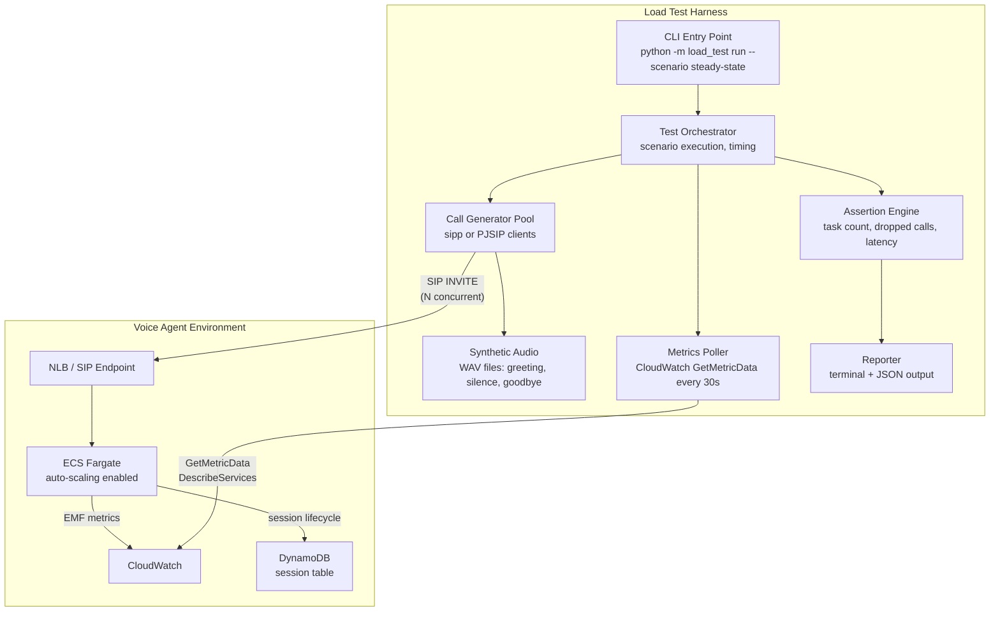

# Auto-Scaling Load Test Harness -- Implementation Spec

> **Origin**: `asset-pipecat-sagemaker/docs/features/scaling-load-test/idea.md`
> **Target repo**: This document is designed to be imported into a sibling repo (e.g., `asset-scaling-load-test`) as the primary implementation plan.
> **Date**: 2026-02-25

---

## 1. Purpose

Validate the voice agent's ECS auto-scaling behavior by placing and sustaining 50+ concurrent SIP calls, then verifying that:

- Scale-out is triggered by rising `SessionsPerTask`
- Scale-in only terminates idle (unprotected) tasks -- zero dropped calls
- Burst scenarios trigger step scaling
- End-to-end latency stays within bounds under load

## 2. Voice Agent Scaling Behavior (Reference)

The voice agent (deployed from `asset-pipecat-sagemaker`) implements three complementary scaling mechanisms. The load test harness must exercise and validate all three.

### 2.1 Target Tracking Policy

| Parameter | Production | Test Override |
|-----------|-----------|---------------|
| Metric | `VoiceAgent/Sessions :: SessionsPerTask` | same |
| Target value | 3 sessions/task | 1-2 |
| Scale-out cooldown | 60s | 60s |
| Scale-in cooldown | 300s | 60-120s |
| Min capacity | 1 | 1 |
| Max capacity | 50 | 10-20 |

### 2.2 Step Scaling Policy (Burst Protection)

| Threshold | Action |
|-----------|--------|
| `SessionsPerTask` > 3.5 (test: > 1.5) | Add 10 tasks |
| `SessionsPerTask` > 4.0 (test: > 2.5) | Add 25 tasks |

### 2.3 ECS Task Scale-in Protection

- Voice agent container calls `$ECS_AGENT_URI/task-protection/v1/state` to protect itself when `active_sessions > 0`
- Clears protection when `active_sessions == 0`
- Protection expires after 120 minutes (safety net)
- **Critical assertion**: during scale-in, only unprotected tasks are terminated

### 2.4 Health Check Draining

- `/health` returns `200` when healthy, `503` when `draining=True` or at max capacity
- On `SIGTERM`, the container sets `draining=True`, stops accepting calls, waits up to 110s for active calls to complete
- NLB deregistration delay: 300s

### 2.5 Key CloudWatch Metrics to Poll

| Metric | Namespace | What it tells us |
|--------|-----------|-----------------|
| `SessionsPerTask` | `VoiceAgent/Sessions` | Primary scaling signal |
| `ActiveCount` | `VoiceAgent/Sessions` | Total active sessions across all tasks |
| `HealthyTaskCount` | `VoiceAgent/Sessions` | Number of ECS tasks running |
| `E2ELatency` | `VoiceAgent/Pipeline` | End-to-end voice latency (ms) |
| `DesiredCount` | `AWS/ECS` | ECS target task count |
| `RunningTaskCount` | `AWS/ECS` | ECS actual running tasks |

## 3. Test Scenarios

### Scenario 1: Steady-State Scale-Out / Scale-In

```
Timeline:
  t=0     Place 4 calls (target=2 --> 2 tasks needed)
  t=2min  Assert: 2+ tasks running
  t=2min  Place 4 more calls (8 total --> 4 tasks needed)
  t=4min  Assert: 4+ tasks running, SessionsPerTask ~2
  t=5min  End all calls
  t=10min Assert: scaled in to minCapacity (1)
  PASS:   Zero calls dropped throughout
```

### Scenario 2: Burst Scale-Out

```
Timeline:
  t=0     Place 20 calls simultaneously
  t=1min  Assert: step scaling fired, 10+ tasks launching
  t=3min  Assert: all calls connected, sessions distributed
  t=3min  End all calls
  t=8min  Assert: scaled in to minCapacity
  PASS:   Zero calls rejected or dropped
```

### Scenario 3: Scale-In Protection Validation

```
Timeline:
  t=0     Place 6 calls across 3 tasks (2 per task)
  t=2min  End calls on 2 tasks (4 calls), keep 2 calls on task-3
  t=2min  Assert: task-3 has protection enabled
  t=5min  Assert: idle tasks terminated, task-3 still running
  t=5min  End remaining 2 calls
  t=8min  Assert: task-3 protection cleared, scaled in to minCapacity
  PASS:   task-3 calls completed without interruption
```

### Scenario 4: Sustained Load (50+ Calls)

```
Timeline:
  t=0      Ramp: 10 calls/min for 5 min (50 total)
  t=5min   Assert: stable task count, SessionsPerTask ~target
  t=5-15   Hold 50 calls, poll latency metrics every 30s
  t=15min  Ramp down: end 10 calls/min for 5 min
  t=20min  Assert: scaling in, no dropped calls
  t=25min  Assert: back to minCapacity
  PASS:    E2E latency p95 < 3000ms, zero dropped calls
```

## 4. Architecture



## 5. Components

### 5.1 Test Orchestrator (`orchestrator.py`)

- Loads scenario definitions (YAML or Python dataclass)
- Executes steps on a timeline (place N calls, wait, assert, end calls)
- Coordinates call generator and metrics poller
- Collects assertion results and passes to reporter

### 5.2 Call Generator (`call_generator.py`)

- Wraps **sipp** (recommended) or PJSIP for SIP call placement
- Manages a pool of concurrent calls with unique Call-IDs
- Tracks per-call state: `placing`, `connected`, `ended`, `dropped`
- Plays synthetic audio (WAV) during the call
- Detects server-side hangup (BYE from UAS) vs. client-initiated hangup

### 5.3 Synthetic Audio (`audio/`)

Pre-recorded WAV files:

| File | Content | Purpose |
|------|---------|---------|
| `greeting.wav` | "Hello, I'd like to check my account balance" | Triggers agent greeting + LLM response |
| `silence_30s.wav` | 30s silence | Holds call without triggering VAD |
| `followup.wav` | "Can you also check my recent orders?" | Triggers second conversation turn |
| `goodbye.wav` | "Thank you, goodbye" | Triggers natural call end |

### 5.4 Metrics Poller (`metrics_poller.py`)

- Polls CloudWatch via `get_metric_data()` every 30s during test execution
- Also calls `ecs.describe_services()` for `desiredCount` / `runningCount`
- Stores time-series data for assertions and reporting
- Captures:
  - `SessionsPerTask` (avg, max)
  - `ActiveCount`
  - `HealthyTaskCount`
  - `E2ELatency` (p50, p95, p99)
  - ECS `DesiredCount`, `RunningCount`

### 5.5 Assertion Engine (`assertions.py`)

Example assertions:

```python
# Scale-out happened
assert_metric_reached("RunningTaskCount", min_value=4, within_seconds=180)

# Scale-in completed
assert_metric_reached("RunningTaskCount", max_value=1, within_seconds=600)

# Zero dropped calls
assert_no_dropped_calls(call_pool)

# Latency within bounds
assert_metric_percentile("E2ELatency", p95_max=3000, during_window=(t_start, t_end))
```

### 5.6 Reporter (`reporter.py`)

Terminal output:

```
=== Scenario: steady-state-scale-out ===

  [PASS] Scale-out: 1 -> 4 tasks in 147s (threshold: 180s)
  [PASS] SessionsPerTask stabilized at 2.1 (target: 2.0)
  [PASS] Scale-in: 4 -> 1 tasks in 312s (threshold: 600s)
  [PASS] Zero dropped calls (8/8 completed successfully)
  [PASS] E2E latency p95: 1847ms (threshold: 3000ms)

  Result: PASSED (5/5 assertions)
  Duration: 11m 42s
```

JSON report for CI integration: `results/scenario-name-YYYY-MM-DD.json`

## 6. Configuration

### 6.1 Harness Config (`config.yaml`)

```yaml
target:
  sip_endpoint: "sip:voice-agent@<nlb-dns>:5060"
  aws_region: "us-east-1"
  ecs_cluster: "voice-agent-cluster"
  ecs_service: "voice-agent-service"
  cloudwatch_namespace: "VoiceAgent/Sessions"
  environment: "dev"

scaling_overrides:
  target_sessions_per_task: 2
  min_capacity: 1
  max_capacity: 10
  scale_in_cooldown_seconds: 120

scenarios:
  - name: steady-state
    calls: [4, 8]
    hold_duration_seconds: 180
    assertions:
      max_scale_out_time: 180
      max_scale_in_time: 600
      max_e2e_latency_p95: 3000
      dropped_calls: 0
```

### 6.2 Environment Prep

Before running load tests, the voice agent environment needs lowered thresholds:

```bash
# Option A: Deploy with CDK context overrides
cdk deploy VoiceAgentEcs \
  -c targetSessionsPerTask=2 \
  -c maxCapacity=10 \
  -c scaleInCooldown=120

# Option B: SSM parameter overrides (if supported)
aws ssm put-parameter --name /voice-agent/scaling/target-sessions-per-task --value 2
aws ssm put-parameter --name /voice-agent/scaling/max-capacity --value 10
```

## 7. Repo Structure

```
asset-scaling-load-test/
  README.md
  Makefile
  pyproject.toml
  config.yaml
  src/
    load_test/
      __init__.py
      __main__.py          # CLI entry point
      orchestrator.py       # Scenario runner
      call_generator.py     # sipp/PJSIP wrapper
      metrics_poller.py     # CloudWatch polling
      assertions.py         # Pass/fail checks
      reporter.py           # Output formatting
      models.py             # Scenario/config dataclasses
  audio/
    greeting.wav
    silence_30s.wav
    followup.wav
    goodbye.wav
  scenarios/
    steady_state.yaml
    burst.yaml
    scale_in_protection.yaml
    sustained_50.yaml
  infrastructure/            # Optional CDK stack
    src/
      load-test-stack.ts    # EC2/Fargate for call generators
  results/                   # Test output (gitignored)
  docs/
    scaling-load-test-spec.md  # This document
```

## 8. Prerequisites

- **sipp** installed (or PJSIP Python bindings)
- AWS credentials with access to: ECS, CloudWatch, DynamoDB, SSM
- Voice agent deployed with auto-scaling enabled (`ecs-auto-scaling` feature)
- SIP endpoint accessible from the test runner (same VPC or public NLB)
- Python 3.11+, `boto3`, `pyyaml`, `rich` (for terminal output)

## 9. Running

```bash
# Install
pip install -e .

# Run a single scenario
python -m load_test run --scenario steady-state --config config.yaml

# Run all scenarios
python -m load_test run --all --config config.yaml

# Dry run (no calls, just validate config and print plan)
python -m load_test run --scenario sustained-50 --dry-run
```

## 10. Success Criteria

| # | Criterion | Threshold |
|---|-----------|-----------|
| 1 | Concurrent calls sustained | >= 50 |
| 2 | Scale-out time (1 -> N tasks) | < 3 minutes |
| 3 | Scale-in time (N -> 1 task) | < 10 minutes |
| 4 | Dropped calls during scale-in | 0 |
| 5 | E2E latency p95 under load | < 3000ms |
| 6 | Total harness runtime | < 30 minutes |
| 7 | Burst response (step scaling) | Fires within 2 minutes |

## 11. Risks

| Risk | Mitigation |
|------|------------|
| AWS cost from 50+ Fargate tasks | Short test windows, dev account, aggressive `maxCapacity` cap |
| sipp not available on macOS | Run call generators on Linux (EC2 or container) |
| CloudWatch metric delay | Assertions use retry with backoff, 30s poll interval |
| SIP endpoint not reachable from test runner | Deploy in same VPC, or use public NLB with security group rules |
| Synthetic audio doesn't exercise full pipeline | Include prompts that trigger LLM, not just silence |
